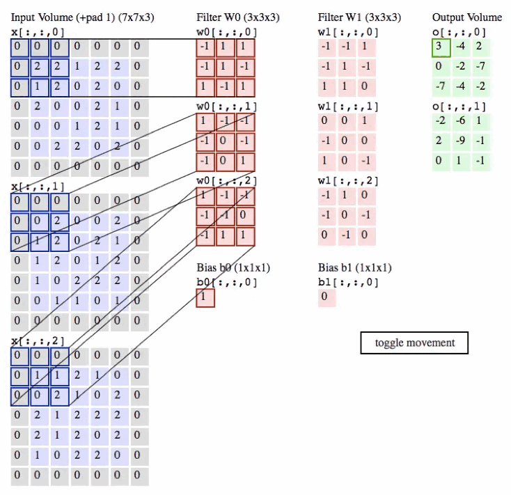

# 第2章 CNN基础

>本教程将以CNN网络为基础点，带领大家领略模型压缩的魅力。有一些基础的同学应该都了解过CNN，那么能分清通道（Channel）、卷积核（Kernel）、滤波器（Filter）、特征图（Feature Map）、层（Layer）等这些术语的区别吗？如果分不清，请带着疑问阅读本教程。

## 2.1 CNN介绍

&emsp;&emsp;CNN网络，即卷积神经网络(Convolutional Neural Network)，是一类特别为处理具有类似网格结构的数据设计的深度学习网络，比如图像（2D网格）和声音信号（1D网格）。CNN在图像和视频识别、图像分类、医学图像分析等领域取得了显著的成功。

### 2.1.1 核心组成
&emsp;&emsp;CNN的核心思想是利用卷积层来自动并有效地提取输入数据的特征，无需手动特征提取。这些特征通过网络的多个层次被逐渐抽象和组合，用以执行分类、检测或分割等任务。CNN通常包含以下类型的层：

1. **卷积层（Convolutional Layers）**：
   这些层通过卷积运算提取输入数据的局部特征，每个卷积层有多个卷积核（Kernel），能够产生不同的特征图（Feature Maps）。

2. **激活层（Activation Layers）**：
   通常跟在卷积层后面，引入非线性，使得网络可以学习更加复杂的特征。最常用的激活函数是ReLU（Rectified Linear Unit）。

3. **池化层（Pooling Layers）**：
   这些层用于降低特征图的空间尺寸，减少后续层的参数数量和计算量，同时使特征检测变得更加稳定。

4. **全连接层（Fully Connected Layers）**：
   通常位于CNN的末端，将卷积层或池化层输出的高维特征向量转换为最终的输出，如分类标签。

### 2.1.2 优点
&emsp;&emsp;CNN通过层的叠加和组合，能够自动并有效地从原始数据中学习到有用的特征表示，避免了传统机器学习方法中手工特征提取的繁琐过程。具有如下优点：
1. 参数共享：通过卷积层中的卷积核重复使用同一组参数，CNN能够以较少的参数量处理大规模输入数据。
2. 局部连接：卷积层中的神经元仅与输入数据的一个局部区域相连接，这使得网络专注于局部特征，并增强了模型的空间利用率。
3. 平移不变性：通过池化层，CNN能够对输入数据的小范围平移保持不变性，这对于识别图像中的对象特别重要。

&emsp;&emsp;下图是一个可视化示例，具体可参考[cnn-explainer](https://poloclub.github.io/cnn-explainer)

## 2.2 相关术语解读

- 通道（Channel）：通常指数据的深度维度。例如，彩色图像有三个颜色通道：红、绿、蓝（RGB）。在CNN中，输入层的Channel数对应于图像的颜色通道数，而隐藏层的Channel数则对应于该层Filter的数量，即每个Filter产生的特征图数量。
- 卷积核（Kernel）：卷积层中用于特征提取的小矩阵。在进行卷积操作时，卷积核滑过输入数据的每个区域，与其对应的局部区域进行元素乘法操作，然后求和，最终形成卷积输出的一个元素。卷积核能够捕捉到数据的局部特征，如边缘、纹理等。
- 滤波器（Filter）：由多个卷积核组成，其数量等于输入数据的通道数。例如，对于一个有RGB三个颜色通道的彩色图像，一个Filter将包含三个卷积核，每个用于一个颜色通道。整个Filter作用于输入数据时，会产生一个二维的特征图（Feature Map）。Filter能够检测特定类型的特征，不同的Filter可以捕捉到不同的特征。
- 特征图（Feature Map）：指的是从输入数据（如图像）中通过特定的卷积滤波器（Filter）提取出的特征表示。当输入数据通过一个卷积层时，这个层的每一个滤波器都会独立地应用于输入数据，产生一个新的二维数组，这个数组就是特征图。
- 层（Layer）：CNN由多个层组成，每个层可以是卷积层、池化层、全连接层等。每个卷积层由多个Filter组成，每个Filter通过卷积操作生成一个特征图，所有特征图堆叠在一起形成该层的输出。

**联系与区别:**

- Kernel是构成Filter的基本单元。在对多通道输入进行卷积时，每个Channel都有其对应的Kernel，它们的集合构成了一个Filter。
- Filter是一组Kernel的集合，用于从输入数据中提取特定的特征集。
- Channel是指数据的深度维度，其中输入数据的Channel通常对应于自然图像的颜色通道，而卷积层输出的Channel数由该层的Filter数决定。
- Layer是CNN中的组成单元，根据其功能不同有各种类型的层。卷积层是其中一种，使用Filter进行特征提取。
- Kernel/Filter关注的是局部特征的提取，Channel关注的是特征的多样性和表示，而Layer则是网络结构的组成部分。

下图是对一个3通道的图片做卷积操作：

&emsp;&emsp;其中，有三个卷积核（也被称为滤波器）通道，维度是 `3 × 3 × 3`，分别代表卷积核的高度、宽度及深度。该卷积操作首先对三个输入通道分别做卷积操作，然后将卷积的结果相加，最后输出一个特征图。

&emsp;&emsp;下面来看一个例子，因为3D数据难以可视化，所以所有的数据（输入数据体是蓝色，权重数据体是红色，输出数据体是绿色）都采取将深度切片按照列的方式排列展现。

&emsp;&emsp;卷积运算本质上就是在滤波器和输入数据的局部区域间做点积。卷积层的常用实现方式就是利用这一点，将卷积层的前向传播变成一个巨大的矩阵乘法。

## 2.3 模型压缩常见评估指标

&emsp;&emsp;模型压缩是一种减少深度学习模型大小和计算量的技术，其目的是在保持模型性能的前提下减少资源消耗，使模型更适合部署在资源受限的设备上。模型压缩的常见评估指标包括：

### 2.3.1 准确率

&emsp;&emsp;准确率指对比模型压缩前后在特定任务上的准确度，如分类准确率、检测精度等。尽管压缩可能会牺牲一定的精度，但目标是在保持可接受精度的前提下进行压缩。

### 2.3.2 参数量

&emsp;&emsp;参数量（Params）是指模型中可训练参数的总数，通常是指构成深度学习模型的所有权重（weights）和偏置（biases）的总数。压缩后的模型参数数量通常会显著减少。

### 2.3.3 模型大小

&emsp;&emsp;模型大小（Model Size）是衡量压缩效果最直观的指标，通常以模型文件的存储大小（如MB）来度量。其计算公式为：`大小= 参数量 * 带宽`

&emsp;&emsp;比如一个模型的参数量为61M，假设使用32位浮点数存储，那么其模型大小为：
$$ 61M * 4Bytes(32bits) = 224MB(224 * 10^6 Bytes) $$

### 2.3.4 MACs

&emsp;&emsp;MACs（Number of Multiply-Accumulate Operations）代表乘累加操作的数量，它是计算机执行浮点运算的基本单位，包括一个乘法操作和一个累加（加法）操作。在深度学习中，MACs用于描述卷积神经网络（CNN）中的卷积操作的计算量。具体来说，当我们在卷积层中进行前向传播时，每个卷积核都会与输入特征图（input feature map）的局部区域进行点积（element-wise multiplication），然后将所有点积的结果累加起来，得到输出特征图上的一个值。这个过程中的每一次乘法和随后的累加操作就构成了一个MAC。

### 2.3.5 FLOPs

&emsp;&emsp;FLOPs（Number of Floating Point Operations，FLOPs）指模型执行一次前向推理需要的浮点运算次数。FLOPs与模型需要计算资源成正比。

### 2.3.6 压缩比

&emsp;&emsp;压缩比是原始模型大小与压缩后模型大小的比值。更高的压缩比意味着更小的模型大小，但也可能伴随性能损失。

### 2.3.7 推理速度

&emsp;&emsp;推理速度是指模型进行一次前向传播所需的时间。模型压缩通常会提高推理速度，因为它减少了计算量和模型大小。

## 参考链接

- <https://blog.csdn.net/weixin_38481963/article/details/109906338>
- <https://cs231n.github.io/convolutional-networks/>
- <https://poloclub.github.io/cnn-explainer/>