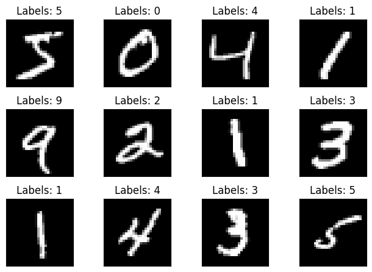
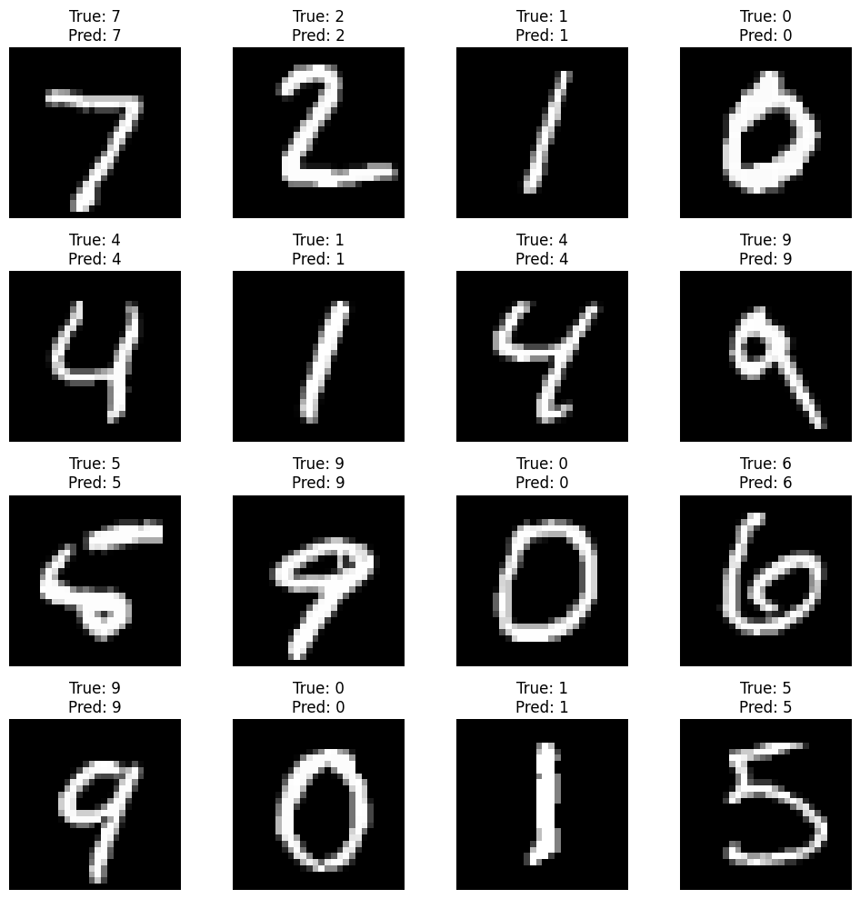

# 第2章 CNN基础

>本教程将以CNN网络为基础点，带领大家领略模型压缩的魅力。有一些基础的同学应该都了解过CNN，那么能分清通道（Channel）、卷积核（Kernel）、滤波器（Filter）、特征图（Feature Map）、层（Layer）等这些术语的区别吗？如果分不清，请带着疑问阅读本教程。

## 2.1 CNN介绍

&emsp;&emsp;CNN网络，即卷积神经网络(Convolutional Neural Network)，是一类特别为处理具有类似网格结构的数据设计的深度学习网络，比如图像（2D网格）和声音信号（1D网格）。CNN在图像和视频识别、图像分类、医学图像分析等领域取得了显著的成功。

### 2.1.1 核心组成
&emsp;&emsp;CNN的核心思想是利用卷积层来自动并有效地提取输入数据的特征，无需手动特征提取。这些特征通过网络的多个层次被逐渐抽象和组合，用以执行分类、检测或分割等任务。CNN通常包含以下类型的层：

1. **卷积层（Convolutional Layers）**：
   这些层通过卷积运算提取输入数据的局部特征，每个卷积层有多个卷积核（Kernel），能够产生不同的特征图（Feature Maps）。

2. **激活层（Activation Layers）**：
   通常跟在卷积层后面，引入非线性，使得网络可以学习更加复杂的特征。最常用的激活函数是ReLU（Rectified Linear Unit）。

3. **池化层（Pooling Layers）**：
   这些层用于降低特征图的空间尺寸，减少后续层的参数数量和计算量，同时使特征检测变得更加稳定。

4. **全连接层（Fully Connected Layers）**：
   通常位于CNN的末端，将卷积层或池化层输出的高维特征向量转换为最终的输出，如分类标签。

### 2.1.2 优点
&emsp;&emsp;CNN通过层的叠加和组合，能够自动并有效地从原始数据中学习到有用的特征表示，避免了传统机器学习方法中手工特征提取的繁琐过程。具有如下优点：
1. 参数共享：通过卷积层中的卷积核重复使用同一组参数，CNN能够以较少的参数量处理大规模输入数据。
2. 局部连接：卷积层中的神经元仅与输入数据的一个局部区域相连接，这使得网络专注于局部特征，并增强了模型的空间利用率。
3. 平移不变性：通过池化层，CNN能够对输入数据的小范围平移保持不变性，这对于识别图像中的对象特别重要。

&emsp;&emsp;下图是一个可视化示例，实现过程具体可参考[CNN Explainer](https://poloclub.github.io/cnn-explainer)：


## 2.2 相关术语解读

- 通道（Channel）：通常指数据的深度维度。例如，彩色图像有三个颜色通道：红、绿、蓝（RGB）。在CNN中，输入层的Channel数对应于图像的颜色通道数，而隐藏层的Channel数则对应于该层Filter的数量，即每个Filter产生的特征图数量。
- 卷积核（Kernel）：卷积层中用于特征提取的小矩阵。在进行卷积操作时，卷积核滑过输入数据的每个区域，与其对应的局部区域进行元素乘法操作，然后求和，最终形成卷积输出的一个元素。卷积核能够捕捉到数据的局部特征，如边缘、纹理等。
- 滤波器（Filter）：由多个卷积核组成，其数量等于输入数据的通道数。例如，对于一个有RGB三个颜色通道的彩色图像，一个Filter将包含三个卷积核，每个用于一个颜色通道。整个Filter作用于输入数据时，会产生一个二维的特征图（Feature Map）。Filter能够检测特定类型的特征，不同的Filter可以捕捉到不同的特征。
- 特征图（Feature Map）：指的是从输入数据（如图像）中通过特定的卷积滤波器（Filter）提取出的特征表示。当输入数据通过一个卷积层时，这个层的每一个滤波器都会独立地应用于输入数据，产生一个新的二维数组，这个数组就是特征图。
- 层（Layer）：CNN由多个层组成，每个层可以是卷积层、池化层、全连接层等。每个卷积层由多个Filter组成，每个Filter通过卷积操作生成一个特征图，所有特征图堆叠在一起形成该层的输出。

**联系与区别:**

- Kernel是构成Filter的基本单元。在对多通道输入进行卷积时，每个Channel都有其对应的Kernel，它们的集合构成了一个Filter。
- Filter是一组Kernel的集合，用于从输入数据中提取特定的特征集。
- Channel是指数据的深度维度，其中输入数据的Channel通常对应于自然图像的颜色通道，而卷积层输出的Channel数由该层的Filter数决定。
- Layer是CNN中的组成单元，根据其功能不同有各种类型的层。卷积层是其中一种，使用Filter进行特征提取。
- Kernel/Filter关注的是局部特征的提取，Channel关注的是特征的多样性和表示，而Layer则是网络结构的组成部分。

下图是对一个3通道的图片做卷积操作：


&emsp;&emsp;其中，有三个卷积核（也被称为滤波器）通道，维度是 `3 × 3 × 3`，分别代表卷积核的高度、宽度及深度。该卷积操作首先对三个输入通道分别做卷积操作，然后将卷积的结果相加，最后输出一个特征图。

&emsp;&emsp;下面来看一个例子，因为3D数据难以可视化，所以所有的数据（输入数据体是蓝色，权重数据体是红色，输出数据体是绿色）都采取将深度切片按照列的方式排列展现。


&emsp;&emsp;卷积运算本质上就是在滤波器和输入数据的局部区域间做点积。卷积层的常用实现方式就是利用这一点，将卷积层的前向传播变成一个巨大的矩阵乘法。

下面一起动手实践一个简单的CNN例子[Mnist手写数字识别](https://github.com/datawhalechina/awesome-compression/blob/main/docs/notebook/ch02/1.mnist_classify.ipynb)，通过这个例子来加深对CNN的理解。

## 2.3 实践

首先导入必要的包，并加载数据集

```python
import copy
import math
import time
import random
from collections import OrderedDict, defaultdict
from typing import Union, List

import numpy as np
import torch
from matplotlib import pyplot as plt
from torch import nn
from torch.optim import *
from torch.optim.lr_scheduler import *
from torch.utils.data import DataLoader
from torchvision.transforms import *
from tqdm.auto import tqdm
import torch.nn.functional as F
from torchvision import datasets

random.seed(0)
np.random.seed(0)
torch.manual_seed(0)

# 设置归一化
transform = transforms.Compose([transforms.ToTensor(), transforms.Normalize((0.1307,), (0.3081,))])

# 获取数据集
train_dataset = datasets.MNIST(root='./data/mnist', train=True, download=True, transform=transform)  
test_dataset = datasets.MNIST(root='./data/mnist', train=False, download=True, transform=transform)  # train=True训练集，=False测试集

# 设置DataLoader
batch_size = 64
train_loader = DataLoader(train_dataset, batch_size=batch_size, shuffle=True)
test_loader = DataLoader(test_dataset, batch_size=batch_size, shuffle=False)
```

展示数据集，如下图所示：
```python
# 展示数据集
fig = plt.figure()
for i in range(12):
    plt.subplot(3, 4, i+1)
    plt.tight_layout()
    plt.imshow(train_dataset.train_data[i], cmap='gray', interpolation='none')
    plt.title("Labels: {}".format(train_dataset.train_labels[i]))
    plt.xticks([])
    plt.yticks([])
plt.show()
```



定义一个LeNet网络，代码如下：

```python
# 定义一个LeNet网络
class LeNet(nn.Module):
    def __init__(self, num_classes=10):
        super(LeNet, self).__init__()
        self.conv1 = nn.Conv2d(in_channels=1, out_channels=6, kernel_size=5)
        self.conv2 = nn.Conv2d(in_channels=6, out_channels=16, kernel_size=5)
        self.maxpool = nn.MaxPool2d(kernel_size=2, stride=2)
        self.fc1 = nn.Linear(in_features=16 * 4 * 4, out_features=120)
        self.fc2 = nn.Linear(in_features=120, out_features=84)
        self.fc3 = nn.Linear(in_features=84, out_features=num_classes)

    def forward(self, x):
        x = self.maxpool(F.relu(self.conv1(x)))
        x = self.maxpool(F.relu(self.conv2(x)))

        x = x.view(x.size()[0], -1)
        x = F.relu(self.fc1(x))
        x = F.relu(self.fc2(x))
        x = self.fc3(x)

        return x
device = torch.device("cpu")
model = LeNet().to(device=device)
```
定义训练函数：

```python

def train(
  model: nn.Module,
  dataloader: DataLoader,
  criterion: nn.Module,
  optimizer: Optimizer,
  callbacks = None
) -> None:
  model.train()

  for inputs, targets in tqdm(dataloader, desc='train', leave=False):
    inputs = inputs.to(device)
    targets = targets.to(device)
    # print(inputs.shape)
    # Reset the gradients (from the last iteration)
    optimizer.zero_grad()

    # Forward inference
    outputs = model(inputs).cpu()
    loss = criterion(outputs, targets)

    # Backward propagation
    loss.backward()

    # Update optimizer 
    optimizer.step()

    if callbacks is not None:
        for callback in callbacks:
            callback()
```

定义评估函数：

```python
@torch.inference_mode()
def evaluate(
  model: nn.Module,
  dataloader: DataLoader,
  verbose=True,
) -> float:
  model.eval()

  num_samples = 0
  num_correct = 0

  for inputs, targets in tqdm(dataloader, desc="eval", leave=False,
                              disable=not verbose):
    inputs = inputs.to(device)
    targets = targets.to(device)
  
    # Inference
    outputs = model(inputs).cpu()

    # Convert logits to class indices
    outputs = outputs.argmax(dim=1)

    # Update metrics
    num_samples += targets.size(0)
    num_correct += (outputs == targets).sum()

  return (num_correct / num_samples * 100).item()
```

训练模型，并保存最好的模型和梯度，并输出预测准确率，代码如下：

```python
lr = 0.01
momentum = 0.5
num_epoch = 5

optimizer = torch.optim.SGD(model.parameters(),  lr=lr, momentum=momentum)  # lr学习率，momentum冲量
criterion = nn.CrossEntropyLoss()  # 交叉熵损失


best_accuracy = 0
best_checkpoint = dict()
gradients = dict()
for epoch in range(num_epoch):
    train(model, train_loader, criterion, optimizer)
    accuracy = evaluate(model, test_loader)
    is_best = accuracy > best_accuracy
    if is_best:
        best_checkpoint['state_dict'] = copy.deepcopy(model.state_dict())
        best_accuracy = accuracy
        
        # 将每个梯度保存到字典中
        for name, parameter in model.named_parameters():
            if parameter.grad is not None:
                # .clone()确保我们有梯度的复制，而非引用
                gradients[name] = parameter.grad.clone()

    print(f'Epoch{epoch+1:>2d} Accuracy {accuracy:.2f}% / Best Accuracy: {best_accuracy:.2f}%')


torch.save(best_checkpoint['state_dict'], './model.pt')
torch.save(gradients, './model_gradients.pt')

print(f"=> loading best checkpoint")
model.load_state_dict(best_checkpoint['state_dict'])
model_accuracy = evaluate(model, test_loader)
print(f"Model has accuracy={model_accuracy:.2f}%")
```

最后，加载模型并预测单张图像的标签：

```python
from torchvision import transforms
from PIL import Image
# Load the saved model
model = LeNet()  # Replace MyModel with your model's class
model.load_state_dict(torch.load('./model.pt'))
model.eval()  # Set the model to evaluation mode

# Preprocess the image (assuming input is grayscale 28x28 as in MNIST)
def preprocess_image(image_path):
    transform = transforms.Compose([
        transforms.Grayscale(num_output_channels=1),  # Convert to grayscale if needed
        transforms.Resize((28, 28)),  # Resize to match MNIST dimensions
        transforms.ToTensor(),  # Convert image to tensor
        transforms.Normalize((0.1307,), (0.3081,))  # Normalize as per model's training
    ])
    image = Image.open(image_path)
    image = transform(image).unsqueeze(0)  # Add batch dimension
    return image

# Perform prediction on a single image
def predict_image(image_path):
    image = preprocess_image(image_path)
    with torch.no_grad():
        output = model(image)
        prediction = output.argmax(dim=1, keepdim=True)  # Get the predicted class
    return prediction.item()

# Example usage
image_path = 'test.png'  # Replace with the actual image path
predicted_label = predict_image(image_path)
print(f'Predicted label: {predicted_label}')
```

同时预测多张图片的代码如下：

```python
def show_images(images, labels, preds, num_rows=4, num_cols=4):
    fig, axes = plt.subplots(num_rows, num_cols, figsize=(10, 10))
    axes = axes.flatten()  # Flatten axes array for easy iteration
    for idx in range(num_rows * num_cols):
        if idx >= len(images):
            break
        ax = axes[idx]
        img = images[idx].cpu().numpy().squeeze()  # Convert tensor to numpy and remove unnecessary dimensions
        ax.imshow(img, cmap='gray')
        ax.set_title(f'True: {labels[idx].item()}\nPred: {preds[idx].item()}')
        ax.axis('off')  # Turn off axis labels
    plt.tight_layout()
    plt.show()

# Load the saved model
model = LeNet()  # Replace MyModel with your model's class
model.load_state_dict(torch.load('./model.pt'))
model.eval()  # Set the model to evaluation mode
# Get a batch of test data
test_iter = iter(test_loader)
images, labels = next(test_iter)

# Run the model to predict labels
with torch.no_grad():
    outputs = model(images)
    _, preds = torch.max(outputs, 1)  # Get the predicted labels

# Show images with true and predicted labels
show_images(images.cpu(), labels.cpu(), preds.cpu())
```


## 引用资料

- [卷积核（kernel）和过滤器（filter）的区别](https://blog.csdn.net/weixin_38481963/article/details/109906338)
- [CS231n Convolutional Neural Networks for Visual Recognition](https://cs231n.github.io/convolutional-networks/)
- [CNN Explainer: Learn Convolutional Neural Network (CNN) in your browser!](https://poloclub.github.io/cnn-explainer/)