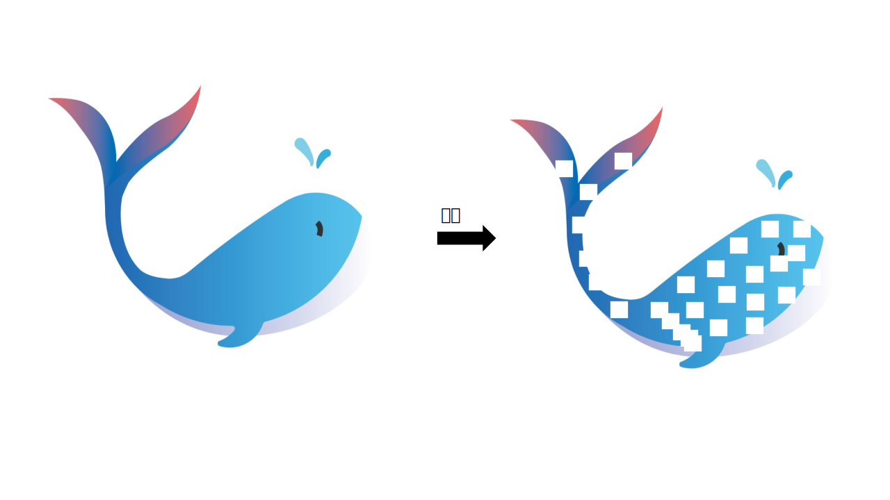
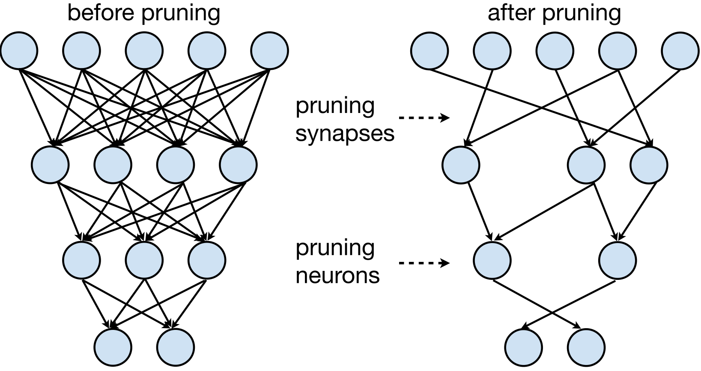
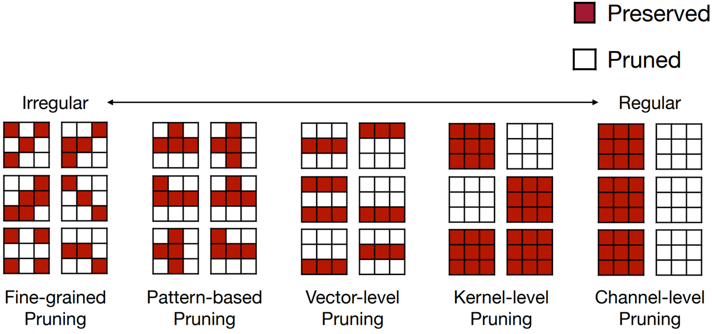
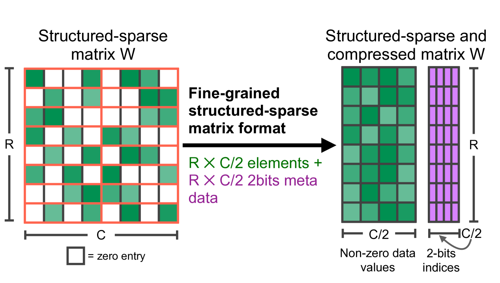
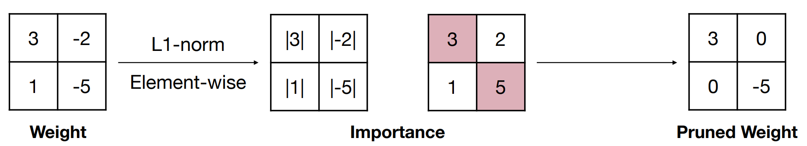
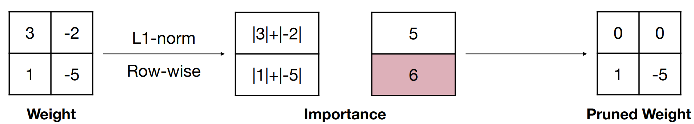
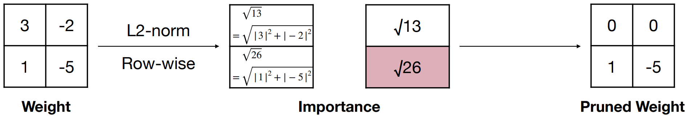

# 第3章 模型剪枝

## 3.1 模型剪枝介绍

&emsp;&emsp;模型剪枝是模型压缩中一种重要的技术，其基本思想是将模型中不重要的权重和分支裁剪掉，将网络结构稀疏化，进而得到参数量更小的模型，降低内存开销，使得推理速度更快，这对于需要在资源有限的设备上运行模型的应用来说尤为重要。然而，剪枝也可能导致模型性能的下降，因此需要在模型大小和性能之间找到一个平衡点。神经元在神经网络中的连接在数学上表示为权重矩阵，因此剪枝即是将权重矩阵中一部分元素变为零元素。这些剪枝后具有大量零元素的矩阵被称为稀疏矩阵，反之绝大部分元素非零的矩阵被称为稠密矩阵。剪枝过程如下图所示，目的是减去不重要的突触（Synapses）或神经元（Neurons）。

&emsp;&emsp;在神经网络中，模型权重（Weight）通常指的是神经元之间的连接，即突触。模型剪枝中的“移除权重”时，通常是指减少神经元之间的连接数，而不是移除神经元本身。对于一个简单的线性神经网络，其公式可表示为：

$$
Y=W X
$$

&emsp;&emsp;其中，$W$为权重，$X$为输入，即神经元。剪枝的具体实现即将权重矩阵中一部分元素变为零元素。这些剪枝后具有大量零元素的矩阵被称为稀疏矩阵，反之绝大部分元素非零的矩阵被称为稠密矩阵。

## 3.2 何为剪枝（What is Pruning?）

&emsp;&emsp;剪枝可以按照不同标准进行划分，下面主要从剪枝类型、剪枝范围、剪枝粒度三方面来阐述。

### 3.2.1 剪枝类型
&emsp;&emsp;按照剪枝类型进行划分，剪枝分为非结构化剪枝和结构化剪枝。

#### 3.2.1.1 非结构化剪枝

&emsp;&emsp;非结构化剪枝去除不重要的神经元，相应地，被剪除的神经元和其他神经元之间的连接在计算时会被忽略。由于剪枝后的模型通常很稀疏，并且破坏了原有模型的结构，所以这类方法被称为非结构化剪枝。非结构化剪枝并不关心权重在网络中的位置，只是根据某种标准（例如，权重的绝对值大小）来决定是否移除这个权重。移除权重后，剩下的权重分布是稀疏的，即大多数权重为零。非结构化剪枝能极大降低模型的参数量和理论计算量，但是现有硬件架构的计算方式无法对其进行加速，通常需要特殊的硬件或软件支持来有效利用结果模型的稀疏性。所以在实际运行速度上得不到提升，需要设计特定的硬件才可能加速。

#### 3.2.1.2 结构化剪枝

&emsp;&emsp;结构化剪枝则更加关注模型的组织结构，它试图识别并移除那些在整个模型结构中不重要的部分。这种剪枝方法可能涉及到移除整个神经元、卷积核、层或者更复杂的结构。通常以filter或者整个网络层为基本单位进行剪枝。一个filter被剪枝，那么其前一个特征图和下一个特征图都会发生相应的变化，但是模型的结构却没有被破坏，仍然能够通过 GPU 或其他硬件来加速，因此这类方法被称之为结构化剪枝。

&emsp;&emsp;非结构化剪枝关注于移除单个不重要的权重，导致权重矩阵变得稀疏，而结构化剪枝关注于移除整个神经单元或过滤器，导致网络结构上的变化，比如减小层数或通道数。在实际应用中，结构化剪枝通常能够提供更好的性能和压缩比，因为它能够更好地利用模型的内在结构。然而，结构化剪枝的实现通常更加复杂，需要更多的计算资源和对模型的深入理解。非结构化剪枝则相对简单，但可能不会达到结构化剪枝的压缩效果。

### 3.2.2 剪枝范围
&emsp;&emsp;按照剪枝范围进行划分，剪枝分为局部剪枝和全局剪枝。

#### 3.2.2.1 局部剪枝

&emsp;&emsp;局部剪枝关注的是模型中的单个权重或参数。这种剪枝方法通常针对模型中的每个权重进行评估，然后决定是否将其设置为零。局部剪枝的目的是移除那些对模型输出影响较小的权重。这种方法可以是权重剪枝，也可以是神经元剪枝，甚至是通道剪枝（在卷积神经网络中移除整个卷积通道）。局部剪枝的特点是它对模型的每个部分进行独立的操作，而不依赖于模型的其他部分。

### 3.2.2.2 全局剪枝

&emsp;&emsp;全局剪枝则考虑模型的整体结构和性能。这种剪枝方法可能会移除整个神经元、卷积核、层或者更复杂的结构，如卷积核组。全局剪枝的目标是优化整个模型的性能，同时减少模型的复杂度。全局剪枝通常需要对模型的整体结构有深入的理解，并且可能涉及到模型架构的重设计。这种方法可能会对模型的最终性能产生更大的影响，因为它改变了模型的整体特征提取能力。

### 3.2.3 剪枝粒度
&emsp;&emsp;按照剪枝粒度进行划分，剪枝可分为细粒度剪枝（Fine-grained Pruning）、基于模式的剪枝（Pattern-based Pruning）、向量级剪枝（Vector-level Pruning）、内核级剪枝（Kernel-level Pruning）与通道级剪枝（Channel-level Pruning）。

&emsp;&emsp;如下图所示，展示了从细粒度剪枝到通道级的剪枝，剪枝越来越规则和结构化。

#### 3.2.3.1 细粒度剪枝

&emsp;&emsp;细粒度剪枝通过移除权重矩阵中的任意值。细粒度剪枝可以实现高压缩比，但对硬件不友好，因此速度增益有限。

####  3.2.3.2 基于模式的剪枝

&emsp;&emsp;N:M 稀疏度表示 DNN 的稀疏度。N：M稀疏性要求每M个连续权重中最多N个为非零。它可以利用NVIDIA的稀疏张量核心以在实践中加速矩阵乘法。Nvidia Ampere A100 配备了 Sparse Tensor Cores，可加速 2:4 结构的细粒度稀疏性，充分利用了网络权重的细粒度稀疏性。它们提供高达 2 倍的密集数学最大吞吐量，而不会牺牲深度学习核心的矩阵乘法累加作业的准确性。

&emsp;&emsp;稀疏矩阵W首先会被压缩，压缩后的矩阵存储着非零的数据值，而metadata则存储着对应非零元素在原矩阵W中的索引信息。具体来说，metadata会将W中非零元素的行号和列号压缩成两个独立的一维数组，这两个数组就是metadata中存储的索引信息。如下图所示：

&emsp;&emsp;这里以NVIDIA 2：4为例，创建一个patterns，如下图所示，由于是2:4，即从4个中取出2个置为0，可以算出一共有6种不同的模式；然后将weight matrix变换成nx4的格式方便与pattern进行矩阵运算，运算后的结果为nx6的矩阵，在n的维度上进行argmax取得最大的索引(索引对应pattern)，然后将索引对应的pattern值填充到mask中。

### 3.2.3.3 向量级剪枝

&emsp;&emsp;向量级剪枝（Vector-level Pruning）以行或列为单位对权重进行裁剪。

### 3.2.3.4 内核级剪枝

&emsp;&emsp;内核级剪枝（Kernel-level Pruning）以卷积核（滤波器）为单位对权重进行裁剪。

### 3.2.3.5 通道级剪枝

&emsp;&emsp;通道级剪枝（Channel-level Pruning）以通道为单位对权重进行裁剪。

> 注：细粒度剪枝(fine-grained)、基于模式的剪枝（Pattern-based Pruning）、向量级剪枝(vector-level)、内核级剪枝(kernel-level)方法在参数量与模型性能之间取得了一定的平衡，但是网络的拓扑结构本身发生了变化，需要专门的算法设计来支持这种稀疏的运算，属于非结构化剪枝。
> 而通道级剪枝（Channel-level Pruning）改变了网络中的滤波器组和特征通道数目，所获得的模型不需要专门的算法设计就能够运行，属于结构化剪枝。

## 3.3 为何剪枝（Why Pruning?）

&emsp;&emsp;模型为什么能剪枝？即模型剪枝之所以有效，主要是因为它能够识别并移除那些对模型性能影响较小的参数，从而减少模型的复杂性和计算成本。这一过程通常不会显著影响模型的准确性，尤其是在模型本身可能存在过拟合的情况下，剪枝可以帮助模型更好地泛化到新的数据上。

- Han Song, et al. (2015) 在论文 "Learning both Weights and Connections for Efficient Neural Networks" 中提出了一种剪枝方法，该方法通过在训练过程中逐步移除权重较小的连接来减少模型的参数数量。实验结果表明，剪枝后的模型在保持相似性能的同时，显著减少了模型的复杂性。
- Liu Z, et al. (2016) 在 "Learning Efficient Convolutional Networks through Network Slimming" 中提出了一种基于梯度的剪枝方法，该方法通过计算权重的梯度来确定哪些权重可以被移除。这种方法在保持模型性能的同时，大幅减少了模型的参数数量。
- He Y, et al. (2017) 在 "Filter Pruning via Geometric Median for Deep Convolutional Neural Networks Acceleration" 中提出了一种基于几何中位数的剪枝方法，该方法通过计算每个滤波器的几何中位数来确定哪些滤波器可以被移除。实验结果表明，这种方法可以在保持模型性能的同时，显著减少模型的计算量。
- Zhu M, et al. (2017) 在 "To prune, or not to prune: exploring the efficacy of pruning for model compression" 中探讨了模型剪枝的有效性，并提出了一种新的渐进式剪枝技术。这项工作通过比较大型稀疏模型和小型密集模型的性能，证明了剪枝可以显著减少模型大小，同时保持或甚至提高模型的准确性。

## 3.4 剪枝标准（How to prune?）

&emsp;&emsp;怎么确定要减掉哪些呢？这里就涉及到剪枝的标准了。目前主流的剪枝标准有如下几种方法：

### 3.4.1 基于权重大小

&emsp;&emsp;最简单的方式是直接根据每个元素的权重绝对值大小来计算权重的重要性。基本思想是以单个元素为单位，移除神经网络中那些绝对值较小的权重。这种剪枝方法基于一个假设，即权重的绝对值越小，该权重对模型的输出影响越小，因此移除它们对模型性能的影响也会较小。该方法计算重要性的方式可以写成如下公式：

$$
\text { Importance }=|W|
$$

其中，$Importance$表示重要性，$W$为权重。其剪枝过程如下图所示。

&emsp;&emsp;L1和L2正则化是机器学习中常用的正则化技术，它们通过在损失函数中添加额外的惩罚项来防止模型过拟合。这两种正则化方法也可以用于指导模型剪枝，即通过正则化项来影响权重的大小，从而实现剪枝。L1和L2正则化基本思想是以行为单位，计算每行的重要性，移除权重中那些重要性较小的行。L1正则化计算每行元素的绝对值之和，其计算重要性的方式可以写成如下公式：

$$
\text { Importance }=\sum_{i \in S}\left|w_i\right|
$$

&emsp;&emsp;其剪枝过程如下图所示。

&emsp;&emsp;L2正则化计算每行元素绝对值平方之和的开方，其计算重要性的方式可以写成如下公式：

$$
\text { Importance }=\sqrt{\sum_{i \in S}\left|w_i\right|^2}
$$

&emsp;&emsp;其剪枝过程如下图所示。

### 3.4.2 基于梯度大小

&emsp;&emsp;以权值大小为重要性依据的剪枝算法，很容易剪掉重要的权值。以人脸识别为例，在人脸的诸多特征中，眼睛的细微变化如颜色、大小、形状，对于人脸识别的结果有很大影响。对应到深度网络中的权值，即使权值本身很小，但是它的细微变化对结果也将产生很大的影响，这类权值是不应该被剪掉的。梯度是计算损失函数对权值的偏导数，反映了损失对权值的敏感程度。基于梯度大小的剪枝算法是一种通过分析模型中权重梯度的方法，来判断权重的重要性，并去除较小梯度的权重的剪裁方法。这种方法的核心思想是：在模型训练过程中，权重的梯度反映了权重对输出损失的影响程度，较大的梯度表示权重对输出损失的影响较大，因此较重要；较小的梯度表示权重对输出损失的影响较小，因此较不重要。通过去除较小梯度的权重，可以减少模型的规模，同时保持模型的准确性。

## 3.5 剪枝频率（How often?）

&emsp;&emsp;模型剪枝方法按照剪枝频率进行划分，可以分为迭代式（Iterative）和单次剪枝（One-Shot）剪枝。

### 3.5.1 迭代剪枝（Iterative Pruning）

&emsp;&emsp;迭代剪枝是一种渐进式的模型剪枝方法，它涉及多个循环的剪枝和微调步骤。这个过程逐步削减模型中的权重，而不是一次性剪除大量的权重。迭代剪枝的基本思想是，通过逐步移除权重，可以更细致地评估每一次剪枝对模型性能的影响，并允许模型有机会调整其余权重来补偿被剪除的权重。

&emsp;&emsp;迭代剪枝通常遵循以下步骤：
- 训练模型：首先训练一个完整的、未剪枝的模型，使其在训练数据上达到一个良好的性能水平。
- 剪枝：使用一个预定的剪枝策略（例如基于权重大小）来轻微剪枝网络，移除一小部分权重。
- 微调：对剪枝后的模型进行微调，这通常涉及使用原始训练数据集重新训练模型，以恢复由于剪枝引起的性能损失。
- 评估：在验证集上评估剪枝后模型的性能，确保模型仍然能够维持良好的性能。
- 重复：重复步骤2到步骤4，每次迭代剪掉更多的权重，并进行微调，直到达到一个预定的性能标准或剪枝比例。

### 3.5.2 单次剪枝（One-Shot Pruning）

&emsp;&emsp;One-shot剪枝在训练完成后对模型进行一次性的剪枝操作。这种剪枝方法的特点是高效且直接，它不需要在剪枝和再训练之间进行多次迭代。在One-shot剪枝中，模型首先被训练到收敛，然后根据某种剪枝标准（如权重的绝对值大小）来确定哪些参数可以被移除。这些参数通常是那些对模型输出影响较小的参数。

&emsp;&emsp;单次剪枝会极大地受到噪声的影响，而迭代式剪枝方法则会好很多，因为它在每次迭代之后只会删除掉少量的权重，然后周而复始地进行其他轮的评估和删除，这就能够在一定程度上减少噪声对于整个剪枝过程的影响。但对于大模型来说，由于微调的成本太高，所以更倾向于使用单次剪枝方法。

## 3.6 剪枝时机（When to prune?）

### 3.6.1 训练后剪枝

&emsp;&emsp;训练后剪枝基本思想是先训练一个模型 ，然后对模型进行剪枝，最后对剪枝后模型进行微调。其核心思想是对模型进行一次训练，以了解哪些神经连接实际上很重要，修剪那些不重要（权重较低）的神经连接，然后再次训练以了解权重的最终值。以下是详细步骤：

- 初始训练：首先，使用标准的反向传播算法训练神经网络。在这个过程中，网络学习到权重（即连接的强度）和网络结构。
- 识别重要连接：在训练完成后，网络已经学习到了哪些连接对模型的输出有显著影响。通常，权重较大的连接被认为是重要的。
- 设置阈值：选择一个阈值，这个阈值用于确定哪些连接是重要的。所有权重低于这个阈值的连接将被视为不重要。
- 剪枝：移除所有权重低于阈值的连接。这通常涉及到将全连接层转换为稀疏层，因为大部分连接都被移除了。
- 重新训练：在剪枝后，网络的容量减小了，为了补偿这种变化，需要重新训练网络。在这个过程中，网络会调整剩余连接的权重，以便在保持准确性的同时适应新的结构。
- 迭代剪枝：剪枝和重新训练的过程可以迭代进行。每次迭代都会移除更多的连接，直到达到一个平衡点，即在不显著损失准确性的情况下尽可能减少连接。

### 3.6.2 训练时剪枝

&emsp;&emsp;训练时剪枝基本思想是直接在模型训练过程中进行剪枝，最后对剪枝后模型进行微调。与训练后剪枝相比，连接在训练期间根据其重要性动态停用，但允许权重适应并可能重新激活。训练时剪枝可以产生更有效的模型，因为不必要的连接会尽早修剪，从而可能减少训练期间的内存和计算需求。然而，它需要小心处理，以避免网络结构的突然变化和过度修剪的风险，这可能会损害性能。深度学习中常用到的Dropout其实就是一种训练时剪枝方法，在训练过程中，随机神经元以一定的概率被“dropout”或设置为零。训练时剪枝的训练过程包括以下几个详细步骤，以CNN网络为例：
- 初始化模型参数：首先，使用标准的初始化方法初始化神经网络的权重。
- 训练循环：在每个训练周期（epoch）开始时，使用完整的模型参数对训练数据进行前向传播和反向传播，以更新模型权重。
- 计算重要性：在每个训练周期结束时，计算每个卷积层中所有过滤器的重要性。
- 选择过滤器进行修剪：根据一个预先设定的修剪率，选择重要性最小的过滤器进行修剪。这些过滤器被认为是不重要的，因为它们对模型输出的贡献较小。
- 修剪过滤器：将选择的过滤器的权重设置为零，从而在后续的前向传播中不计算这些过滤器的贡献。
- 重建模型：在修剪过滤器之后，继续进行一个训练周期。在这个阶段，通过反向传播，允许之前被修剪的过滤器的权重更新，从而恢复模型的容量。
- 迭代过程：重复上述步骤，直到达到预定的训练周期数或者模型收敛。

### 3.6.3 训练前剪枝

&emsp;&emsp;训练前剪枝基本思想是在模型训练前进行剪枝，然后从头训练剪枝后的模型。这里就要提及到彩票假设，即任何随机初始化的稠密的前馈网络都包含具有如下性质的子网络——在独立进行训练时，初始化后的子网络在至多经过与原始网络相同的迭代次数后，能够达到跟原始网络相近的测试准确率。在彩票假设中，剪枝后的网络不是需要进行微调，而是将“中奖”的子网络重置为网络最初的权重后重新训练，最后得到的结果可以追上甚至超过原始的稠密网络。总结成一句话：随机初始化的密集神经网络包含一个子网络，该子网络经过初始化，以便在单独训练时，在训练最多相同次数的迭代后，它可以与原始网络的测试精度相匹配。

&emsp;&emsp;一开始，神经网络是使用预定义的架构和随机初始化的权重创建的。这构成了剪枝的起点。基于某些标准或启发法，确定特定的连接或权重以进行修剪。那么有个问题，我们还没有开始训练模型，那么我们如何知道哪些连接不重要呢？

目前常用的方式一般是在初始化阶段采用随机剪枝的方法。随机选择的连接被修剪，并且该过程重复多次以创建各种稀疏网络架构。这背后的想法是，如果在训练之前以多种方式进行修剪，可能就能够跳过寻找彩票的过程。

### 3.6.4 剪枝时机总结

**训练后剪枝（静态稀疏性）：** 初始训练阶段后的修剪涉及在单独的后处理步骤中从训练模型中删除连接或过滤器。这使得模型能够在训练过程中完全收敛而不会出现任何中断，从而确保学习到的表示得到很好的建立。剪枝后，可以进一步微调模型，以从剪枝过程引起的任何潜在性能下降中恢复过来。训练后的剪枝一般比较稳定，不太可能造成过拟合。适用于针对特定​​任务微调预训练模型的场景。

**训练时剪枝（动态稀疏）：** 在这种方法中，剪枝作为附加正则化技术集成到优化过程中。在训练迭代期间，根据某些标准或启发方法动态删除或修剪不太重要的连接。这使得模型能够探索不同级别的稀疏性并在整个训练过程中调整其架构。动态稀疏性可以带来更高效的模型，因为不重要的连接会被尽早修剪，从而可能减少内存和计算需求。然而，它需要小心处理，以避免网络结构的突然变化和过度修剪的风险，这可能会损害性能。

**训练前剪枝：** 训练前剪枝涉及在训练过程开始之前从神经网络中剪枝某些连接或权重。优点在于可以更快地进行训练，因为初始模型大小减小了，并且网络可以更快地收敛。然而，它需要仔细选择修剪标准，以避免过于积极地删除重要连接。

## 3.7 实践

- [剪枝粒度实践](https://github.com/datawhalechina/awesome-compression/blob/main/docs/notebook/ch03/1.pruning_granularity.ipynb)
- [剪枝标准实践](https://github.com/datawhalechina/awesome-compression/blob/main/docs/notebook/ch03/2.pruning_criteria.ipynb)
- [剪枝时机实践](https://github.com/datawhalechina/awesome-compression/blob/main/docs/notebook/ch03/3.pruning_timing.ipynb)
- [torch中的剪枝算法实践](https://github.com/datawhalechina/awesome-compression/blob/main/docs/notebook/ch03/4.torch_prune.ipynb)