# 第3章 模型剪枝


&emsp;&emsp;本章我们将逐步学习剪枝的理论基础，3.1节介绍了剪枝的概念，3.2节介绍了剪枝的类型、范围及粒度，3.3节介绍了为什么能剪枝，3.4节介绍了剪枝的标准，3.5节介绍了剪枝的频率，3.6节介绍了剪枝的时机，3.7节介绍了剪枝的比例，3.8节通过几个相关的剪枝实践来巩固学到的知识。

## 模型剪枝介绍

&emsp;&emsp;模型剪枝是模型压缩中一种重要的技术，其基本思想是将模型中不重要的权重和分支裁剪掉，将网络结构稀疏化，进而得到参数量更小的模型，降低内存开销，使得推理速度更快，这对于需要在资源有限的设备上运行模型的应用来说尤为重要。然而，剪枝也可能导致模型性能的下降，因此需要在模型大小和性能之间找到一个平衡点。神经元在神经网络中的连接在数学上表示为权重矩阵，因此剪枝即是将权重矩阵中一部分元素变为零元素。这些剪枝后具有大量零元素的矩阵被称为稀疏矩阵，反之绝大部分元素非零的矩阵被称为稠密矩阵。剪枝过程如下图所示，目的是减去不重要的突触（Synapses）或神经元（Neurons）。


&emsp;&emsp;在神经网络中，模型权重（Weight）通常指的是神经元之间的连接，即突触。模型剪枝中的“移除权重”时，通常是指减少神经元之间的连接数，而不是移除神经元本身。对于一个简单的线性神经网络，其公式可表示为：

$$
Y=W X
$$

&emsp;&emsp;其中，$W$为权重，$X$为输入，即神经元。剪枝的具体实现即将权重矩阵中一部分元素变为零元素。这些剪枝后具有大量零元素的矩阵被称为稀疏矩阵，反之绝大部分元素非零的矩阵被称为稠密矩阵。


## 何为剪枝（What is Pruning?）

&emsp;&emsp;剪枝可以按照不同标准进行划分，下面主要从剪枝类型、剪枝范围、剪枝粒度三方面来阐述。

### 剪枝类型
&emsp;&emsp;按照剪枝类型进行划分，剪枝分为非结构化剪枝、结构化剪枝和半结构化剪枝。

#### 非结构化剪枝

&emsp;&emsp;非结构化剪枝去除不重要的神经元，相应地，被剪除的神经元和其他神经元之间的连接在计算时会被忽略。由于剪枝后的模型通常很稀疏，并且破坏了原有模型的结构，所以这类方法被称为非结构化剪枝。非结构化剪枝并不关心权重在网络中的位置，只是根据某种标准（例如，权重的绝对值大小）来决定是否移除这个权重。移除权重后，剩下的权重分布是稀疏的，即大多数权重为零。非结构化剪枝能极大降低模型的参数量和理论计算量，但是现有硬件架构的计算方式无法对其进行加速，通常需要特殊的硬件或软件支持来有效利用结果模型的稀疏性。所以在实际运行速度上得不到提升，需要设计特定的硬件才可能加速。

#### 结构化剪枝

&emsp;&emsp;结构化剪枝则更加关注模型的组织结构，它试图识别并移除那些在整个模型结构中不重要的部分。这种剪枝方法可能涉及到移除整个神经元、卷积核、层或者更复杂的结构。通常以filter或者整个网络层为基本单位进行剪枝。一个filter被剪枝，那么其前一个特征图和下一个特征图都会发生相应的变化，但是模型的结构却没有被破坏，仍然能够通过 GPU 或其他硬件来加速，因此这类方法被称之为结构化剪枝。

&emsp;&emsp;非结构化剪枝关注于移除单个不重要的权重，导致权重矩阵变得稀疏，而结构化剪枝关注于移除整个神经单元或过滤器，导致网络结构上的变化，比如减小层数或通道数。在实际应用中，结构化剪枝通常能够提供更好的性能和压缩比，因为它能够更好地利用模型的内在结构。然而，结构化剪枝的实现通常更加复杂，需要更多的计算资源和对模型的深入理解。非结构化剪枝则相对简单，但可能不会达到结构化剪枝的压缩效果。

#### 半结构化剪枝

&emsp;&emsp;半结构化剪枝介于非结构化剪枝和结构化剪枝之间，它试图在保持模型结构的同时，移除不重要的权重。这种剪枝方法可能涉及到移除整个神经元或过滤器的一部分，而不是全部。半结构化剪枝可以提供比非结构化剪枝更好的性能，同时比结构化剪枝更容易实现。通常的做法是按某种规则对结构中的一部分进行剪枝，比如在某个维度上做非结构化剪枝，而在其他维度上保持结构化。这种方式可以在一定程度上提高模型的稀疏性，降低计算量，同时保持模型在硬件上的高效运行。NVIDIA A100 GPU在稀疏加速方面的一个显著特性是其支持的2:4 （50%）稀疏模式，这是一种特定形式的半结构化剪枝。在这种模式下，模型中的每个权重块（通常是 4 个连续的权重值）中有 2 个权重为非零值，剩下 2 个权重置为0。

### 剪枝范围
&emsp;&emsp;按照剪枝范围进行划分，剪枝分为局部剪枝和全局剪枝。

#### 局部剪枝

&emsp;&emsp;局部剪枝关注的是模型中的单个权重或参数。这种剪枝方法通常针对模型中的每个权重进行评估，然后决定是否将其设置为零。局部剪枝的目的是移除那些对模型输出影响较小的权重。这种方法可以是权重剪枝，也可以是神经元剪枝，甚至是通道剪枝（在卷积神经网络中移除整个卷积通道）。局部剪枝的特点是它对模型的每个部分进行独立的操作，而不依赖于模型的其他部分。

#### 全局剪枝

&emsp;&emsp;全局剪枝则考虑模型的整体结构和性能。这种剪枝方法可能会移除整个神经元、卷积核、层或者更复杂的结构，如卷积核组。全局剪枝的目标是优化整个模型的性能，同时减少模型的复杂度。全局剪枝通常需要对模型的整体结构有深入的理解，并且可能涉及到模型架构的重设计。这种方法可能会对模型的最终性能产生更大的影响，因为它改变了模型的整体特征提取能力。

### 剪枝粒度
&emsp;&emsp;按照剪枝粒度进行划分，剪枝可分为细粒度剪枝（Fine-grained Pruning）、基于模式的剪枝（Pattern-based Pruning）、向量级剪枝（Vector-level Pruning）、内核级剪枝（Kernel-level Pruning）与通道级剪枝（Channel-level Pruning）。

&emsp;&emsp;如下图所示，展示了从细粒度剪枝到通道级的剪枝，剪枝越来越规则和结构化。


#### 细粒度剪枝

&emsp;&emsp;细粒度剪枝通过移除权重矩阵中的任意值。细粒度剪枝可以实现高压缩比，但对硬件不友好，因此速度增益有限。

#### 基于模式的剪枝

&emsp;&emsp;N:M 稀疏度表示 DNN 的稀疏度。N：M稀疏性要求每M个连续权重中固定有N个非零值，其余元素均置为0。它可以利用NVIDIA的稀疏张量核心以在实践中加速矩阵乘法。Nvidia Ampere A100 配备了 Sparse Tensor Cores，可加速 2:4 结构的细粒度稀疏性，充分利用了网络权重的细粒度稀疏性。它们提供高达 2 倍的密集数学最大吞吐量，而不会牺牲深度学习核心的矩阵乘法累加作业的准确性。

&emsp;&emsp;稀疏矩阵W首先会被压缩，压缩后的矩阵存储着非零的数据值，而metadata则存储着对应非零元素在原矩阵W中的索引信息。具体来说，metadata会将W中非零元素的行号和列号压缩成两个独立的一维数组，这两个数组就是metadata中存储的索引信息。如下图所示：


&emsp;&emsp;这里以NVIDIA 2：4为例，创建一个patterns，如下图所示，由于是2:4，即从4个中取出2个为非零值，可以算出一共有6种不同的模式；然后将weight matrix变换成nx4的格式方便与pattern进行矩阵运算，运算后的结果为nx6的矩阵，在n的维度上进行argmax取得最大的索引(索引对应pattern)，然后将索引对应的pattern值填充到mask中。


#### 向量级剪枝

&emsp;&emsp;向量级剪枝（Vector-level Pruning）以行或列为单位对权重进行裁剪。

#### 内核级剪枝

&emsp;&emsp;内核级剪枝（Kernel-level Pruning）以卷积核（滤波器）为单位对权重进行裁剪。

#### 通道级剪枝

&emsp;&emsp;通道级剪枝（Channel-level Pruning）以通道为单位对权重进行裁剪。

> 注：细粒度剪枝(fine-grained)、基于模式的剪枝（Pattern-based Pruning）、向量级剪枝(vector-level)、内核级剪枝(kernel-level)方法在参数量与模型性能之间取得了一定的平衡，但是网络的拓扑结构本身发生了变化，需要专门的算法设计来支持这种稀疏的运算，属于非结构化剪枝。
> 而通道级剪枝（Channel-level Pruning）改变了网络中的滤波器组和特征通道数目，所获得的模型不需要专门的算法设计就能够运行，属于结构化剪枝。

## 为何剪枝（Why Pruning?）

&emsp;&emsp;模型为什么能剪枝？即模型剪枝之所以有效，主要是因为它能够识别并移除那些对模型性能影响较小的参数，从而减少模型的复杂性和计算成本。这一过程通常不会显著影响模型的准确性，尤其是在模型本身可能存在过拟合的情况下，剪枝可以帮助模型更好地泛化到新的数据上。其背后的理论依据主要集中在以下几个方面：
- 彩票假说：该假说认为，在随机初始化的大型神经网络中，存在一个子网络，如果独立训练，可以达到与完整网络相似的性能。这表明网络中并非所有部分都对最终性能至关重要，从而为剪枝提供了理论支持。
- 网络稀疏性：研究发现，许多深度神经网络参数呈现出稀疏性，即大部分参数值接近于零。这种稀疏性启发了剪枝技术，即通过移除这些非显著的参数来简化模型。
- 剪枝的一个重要理论来源是正则化，特别是L1正则化，它鼓励网络学习稀疏的参数分布。稀疏化的模型更容易进行剪枝，因为许多权重接近于零，可以安全移除。
- 权重的重要性：剪枝算法通常基于权重的重要性来决定是否剪枝。权重的重要性可以通过多种方式评估，例如权重的大小、权重对损失函数的梯度、或者权重对输入的激活情况等。

## 剪枝标准（How to prune?）

&emsp;&emsp;怎么确定要减掉哪些呢？这里就涉及到剪枝的标准了。目前主流的剪枝标准有如下几种方法：

### 基于权重大小

&emsp;&emsp;最简单的方式是直接根据每个元素的权重绝对值大小来计算权重的重要性。基本思想是以单个元素为单位，移除神经网络中那些绝对值较小的权重。这种剪枝方法基于一个假设，即权重的绝对值越小，该权重对模型的输出影响越小，因此移除它们对模型性能的影响也会较小。该方法计算重要性的方式可以写成如下公式：

$$
\text { Importance }=|W|
$$

其中，$Importance$表示重要性，$W$为权重。其剪枝过程如下图所示。


&emsp;&emsp;L1和L2正则化是机器学习中常用的正则化技术，它们通过在损失函数中添加额外的惩罚项来防止模型过拟合。这两种正则化方法也可以用于指导模型剪枝，即通过正则化项来影响权重的大小，从而实现剪枝。L1和L2正则化基本思想是以行为单位，计算每行的重要性，移除权重中那些重要性较小的行。L1正则化计算每行元素的绝对值之和，其计算重要性的方式可以写成如下公式：

$$
\text { Importance }=\sum_{i \in S}\left|w_i\right|
$$

&emsp;&emsp;其剪枝过程如下图所示。


&emsp;&emsp;L2正则化计算每行元素绝对值平方之和的开方，其计算重要性的方式可以写成如下公式：

$$
\text { Importance }=\sqrt{\sum_{i \in S}\left|w_i\right|^2}
$$

&emsp;&emsp;其剪枝过程如下图所示。


### 基于梯度大小

&emsp;&emsp;以权值大小为重要性依据的剪枝算法，很容易剪掉重要的权值。以人脸识别为例，在人脸的诸多特征中，眼睛的细微变化如颜色、大小、形状，对于人脸识别的结果有很大影响。对应到深度网络中的权值，即使权值本身很小，但是它的细微变化对结果也将产生很大的影响，这类权值是不应该被剪掉的。梯度是计算损失函数对权值的偏导数，反映了损失对权值的敏感程度。基于梯度大小的剪枝算法是一种通过分析模型中权重梯度的方法，来判断权重的重要性，并去除较小梯度的权重的剪裁方法。这种方法的核心思想是：在模型训练过程中，权重的梯度反映了权重对输出损失的影响程度，较大的梯度表示权重对输出损失的影响较大，因此较重要；较小的梯度表示权重对输出损失的影响较小，因此较不重要。通过去除较小梯度的权重，可以减少模型的规模，同时保持模型的准确性。

### 基于尺度

&emsp;&emsp;Network Slimming提出了一种基于尺度(Scaling-based)的剪枝方法。该方法专注于在卷积层中实现通道级的稀疏性。它会识别并剪枝那些对模型输出影响不大的整个通道（即一组特征映射），而不是单个权重。在标准的CNN训练中，批归一化（BN）层通常用于加速训练并提高模型的泛化能力。该方法利用BN层中的缩放因子（γ）来实现稀疏性。这些缩放因子原本用于调节BN层输出的尺度，但在该方法中，它们被用来指示每个通道的重要性。在训练过程中，通过在损失函数中添加一个L1正则化项来鼓励通道的缩放因子趋向于零。这样，不重要的通道的缩放因子将变得非常小，从而可以被识别并剪枝。

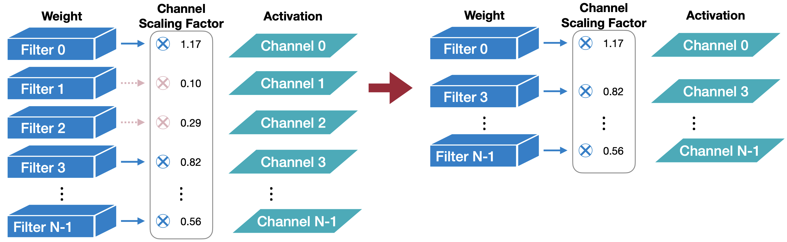

### 基于二阶

&emsp;&emsp;基于二阶（Second-Order-based）的剪枝方法中最具代表性的是最优脑损伤（Optimal Brain Damage，OBD）。OBD通过最小化由于剪枝突触引入的损失函数误差，利用二阶导数信息来评估网络中每个权重的重要性，然后根据这些评估结果来决定哪些权重可以被剪枝。首先，计算网络损失函数相对于权重的Hessian矩阵。Hessian矩阵是一个方阵，其元素是损失函数相对于网络参数的二阶偏导数。它提供了关于参数空间中曲线曲率的信息，可以用来判断权重的敏感度。其次，通过分析Hessian矩阵的特征值，可以确定网络参数的重要性。通常，与较大特征值相对应的权重被认为是更重要的，因为它们对损失函数的曲率贡献更大。

- **假设条件**：
  1. 目标函数 $L$ 近似为二次函数。
  2. 神经网络的训练已收敛。
  3. 删除每个参数所导致的误差是独立的。

- **误差计算**：
  公式 $\delta L_i = L(x; W) - L(x; W_p \mid w_i = 0)$，表示在将某个权重 $w_i$ 删除后，损失函数的变化近似为：
  $$
  \delta L_i \approx \frac{1}{2} h_{ii} w_i^2
  $$
  其中 $h_{ii}$ 是对应的Hessian矩阵的对角元素，定义为：
  $$
  h_{i i}=\frac{\partial^2 L}{\partial w_i^2}
  $$

- **剪枝原则**：
  权重引起的误差 $|\delta L_i|$ 较小的突触将被移除。即重要性度量为：
  $$
  \text{importance}_{w_i} = |\delta L_i| = \frac{1}{2} h_{ii} w_i^2
  $$
  其中 $h_{ii}$ 是非负的。

从最后的公式可以看出，OBD方法最后只需要考虑矩阵对角线元素，详细的公式推导过程参考[OBD公式推导](https://datawhalechina.github.io/llm-deploy/#/chapter3/chapter3_2_1)。

## 剪枝频率（How often?）

&emsp;&emsp;模型剪枝方法按照剪枝频率进行划分，可以分为迭代式（Iterative）和单次剪枝（One-Shot）剪枝。

### 迭代剪枝（Iterative Pruning）

&emsp;&emsp;迭代剪枝是一种渐进式的模型剪枝方法，它涉及多个循环的剪枝和微调步骤。这个过程逐步削减模型中的权重，而不是一次性剪除大量的权重。迭代剪枝的基本思想是，通过逐步移除权重，可以更细致地评估每一次剪枝对模型性能的影响，并允许模型有机会调整其余权重来补偿被剪除的权重。

&emsp;&emsp;迭代剪枝通常遵循以下步骤：
- 训练模型：首先训练一个完整的、未剪枝的模型，使其在训练数据上达到一个良好的性能水平。
- 剪枝：使用一个预定的剪枝策略（例如基于权重大小）来轻微剪枝网络，移除一小部分权重。
- 微调：对剪枝后的模型进行微调，这通常涉及使用原始训练数据集重新训练模型，以恢复由于剪枝引起的性能损失。
- 评估：在验证集上评估剪枝后模型的性能，确保模型仍然能够维持良好的性能。
- 重复：重复步骤2到步骤4，每次迭代剪掉更多的权重，并进行微调，直到达到一个预定的性能标准或剪枝比例。

### 单次剪枝（One-Shot Pruning）

&emsp;&emsp;单次(One-shot)剪枝在训练完成后对模型进行一次性的剪枝操作。这种剪枝方法的特点是高效且直接，它不需要在剪枝和再训练之间进行多次迭代。在One-shot剪枝中，模型首先被训练到收敛，然后根据某种剪枝标准（如权重的绝对值大小）来确定哪些参数可以被移除。这些参数通常是那些对模型输出影响较小的参数。

&emsp;&emsp;单次剪枝会极大地受到噪声的影响，而迭代式剪枝方法则会好很多，因为它在每次迭代之后只会删除掉少量的权重，然后周而复始地进行其他轮的评估和删除，这就能够在一定程度上减少噪声对于整个剪枝过程的影响。但对于大模型来说，由于微调的成本太高，所以更倾向于使用单次剪枝方法。

## 剪枝时机（When to prune?）

### 训练后剪枝

&emsp;&emsp;训练后剪枝基本思想是先训练一个模型 ，然后对模型进行剪枝，最后对剪枝后模型进行微调。其核心思想是对模型进行一次训练，以了解哪些神经连接实际上很重要，修剪那些不重要（权重较低）的神经连接，然后再次训练以了解权重的最终值。以下是详细步骤：

- 初始训练：首先，使用标准的反向传播算法训练神经网络。在这个过程中，网络学习到权重（即连接的强度）和网络结构。
- 识别重要连接：在训练完成后，网络已经学习到了哪些连接对模型的输出有显著影响。通常，权重较大的连接被认为是重要的。
- 设置阈值：选择一个阈值，这个阈值用于确定哪些连接是重要的。所有权重低于这个阈值的连接将被视为不重要。
- 剪枝：移除所有权重低于阈值的连接。这通常涉及到将全连接层转换为稀疏层，因为大部分连接都被移除了。
- 重新训练：在剪枝后，网络的容量减小了，为了补偿这种变化，需要重新训练网络。在这个过程中，网络会调整剩余连接的权重，以便在保持准确性的同时适应新的结构。
- 迭代剪枝：剪枝和重新训练的过程可以迭代进行。每次迭代都会移除更多的连接，直到达到一个平衡点，即在不显著损失准确性的情况下尽可能减少连接。

### 训练时剪枝

&emsp;&emsp;训练时剪枝基本思想是直接在模型训练过程中进行剪枝，最后对剪枝后模型进行微调。与训练后剪枝相比，连接在训练期间根据其重要性动态停用，但允许权重适应并可能重新激活。训练时剪枝可以产生更有效的模型，因为不必要的连接会尽早修剪，从而可能减少训练期间的内存和计算需求。然而，它需要小心处理，以避免网络结构的突然变化和过度修剪的风险，这可能会损害性能。深度学习中常用到的Dropout其实就是一种训练时剪枝方法，在训练过程中，随机神经元以一定的概率被“dropout”或设置为零。训练时剪枝的训练过程包括以下几个详细步骤，以CNN网络为例：
- 初始化模型参数：首先，使用标准的初始化方法初始化神经网络的权重。
- 训练循环：在每个训练周期（epoch）开始时，使用完整的模型参数对训练数据进行前向传播和反向传播，以更新模型权重。
- 计算重要性：在每个训练周期结束时，计算每个卷积层中所有过滤器的重要性。
- 选择过滤器进行修剪：根据一个预先设定的修剪率，选择重要性最小的过滤器进行修剪。这些过滤器被认为是不重要的，因为它们对模型输出的贡献较小。
- 修剪过滤器：将选择的过滤器的权重设置为零，从而在后续的前向传播中不计算这些过滤器的贡献。
- 重建模型：在修剪过滤器之后，继续进行一个训练周期。在这个阶段，通过反向传播，允许之前被修剪的过滤器的权重更新，从而恢复模型的容量。
- 迭代过程：重复上述步骤，直到达到预定的训练周期数或者模型收敛。

### 训练前剪枝

&emsp;&emsp;训练前剪枝基本思想是在模型训练前进行剪枝，然后从头训练剪枝后的模型。这里就要提及到彩票假设，即任何随机初始化的稠密的前馈网络都包含具有如下性质的子网络——在独立进行训练时，初始化后的子网络在至多经过与原始网络相同的迭代次数后，能够达到跟原始网络相近的测试准确率。在彩票假设中，剪枝后的网络不是需要进行微调，而是将“中奖”的子网络重置为网络最初的权重后重新训练，最后得到的结果可以追上甚至超过原始的稠密网络。总结成一句话：随机初始化的密集神经网络包含一个子网络，该子网络经过初始化，以便在单独训练时，在训练最多相同次数的迭代后，它可以与原始网络的测试精度相匹配。

&emsp;&emsp;一开始，神经网络是使用预定义的架构和随机初始化的权重创建的。这构成了剪枝的起点。基于某些标准或启发法，确定特定的连接或权重以进行修剪。那么有个问题，我们还没有开始训练模型，那么我们如何知道哪些连接不重要呢？

&emsp;&emsp;目前常用的方式一般是在初始化阶段采用随机剪枝的方法。随机选择的连接被修剪，并且该过程重复多次以创建各种稀疏网络架构。这背后的想法是，如果在训练之前以多种方式进行修剪，可能就能够跳过寻找彩票的过程。

### 剪枝时机总结

**训练后剪枝（静态稀疏性）：** 初始训练阶段后的修剪涉及在单独的后处理步骤中从训练模型中删除连接或过滤器。这使得模型能够在训练过程中完全收敛而不会出现任何中断，从而确保学习到的表示得到很好的建立。剪枝后，可以进一步微调模型，以从剪枝过程引起的任何潜在性能下降中恢复过来。训练后的剪枝一般比较稳定，不太可能造成过拟合。适用于针对特定​​任务微调预训练模型的场景。

**训练时剪枝（动态稀疏）：** 在这种方法中，剪枝作为附加正则化技术集成到优化过程中。在训练迭代期间，根据某些标准或启发方法动态删除或修剪不太重要的连接。这使得模型能够探索不同级别的稀疏性并在整个训练过程中调整其架构。动态稀疏性可以带来更高效的模型，因为不重要的连接会被尽早修剪，从而可能减少内存和计算需求。然而，它需要小心处理，以避免网络结构的突然变化和过度修剪的风险，这可能会损害性能。

**训练前剪枝：** 训练前剪枝涉及在训练过程开始之前从神经网络中剪枝某些连接或权重。优点在于可以更快地进行训练，因为初始模型大小减小了，并且网络可以更快地收敛。然而，它需要仔细选择修剪标准，以避免过于积极地删除重要连接。

## 剪枝比例

&emsp;&emsp;假设一个模型有很多层，给定一个全局的剪枝比例，那么应该怎么分配每层的剪枝率呢？主要可以分为两种方法：均匀分层剪枝和非均匀分层剪枝。
- 均匀分层剪枝（Uniform Layer-Wise Pruning）是指在神经网络的每一层中都应用相同的剪枝率。具体来说，就是对网络的所有层按照统一的标准进行剪枝，无论每一层的权重重要性或梯度如何分布。这种方法实现简单，剪枝率容易控制，但它忽略了每一层对模型整体性能的重要性差异。
- 非均匀分层剪枝（Non-Uniform Layer-Wise Pruning）则根据每一层的不同特点来分配不同的剪枝率。例如，可以根据梯度信息、权重的大小、或者其他指标（如信息熵、Hessian矩阵等）来确定每一层的剪枝率。层越重要，保留的参数越多；不重要的层则可以被更大程度地剪枝。如下图3-9所示，非均匀剪枝往往比均匀剪枝的性能更好。

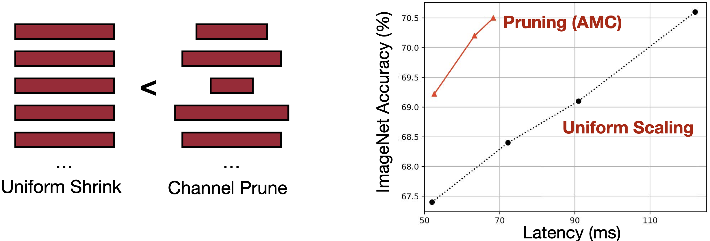

## 实践

下面我们将通过几个实践案例，分别从剪枝粒度、剪枝标准、剪枝时机等维度来演示如何进行模型剪枝。
 
### 剪枝粒度实践

按照剪枝粒度进行划分，剪枝可分为细粒度剪枝（Fine-grained Pruning）、基于模式的剪枝（Pattern-based Pruning）、向量级剪枝（Vector-level Pruning）、内核级剪枝（Kernel-level Pruning）与通道级剪枝（Channel-level Pruning）。下面将分别用一些简单的例子来举例说明。本节完整代码见[剪枝粒度实践](https://github.com/datawhalechina/awesome-compression/blob/main/docs/notebook/ch03/1.pruning_granularity.ipynb)。

```python
import torch
import matplotlib.pyplot as plt
from mpl_toolkits.mplot3d import Axes3D

# plt.rcParams['font.sans-serif'] = ['SimHei']  # 解决中文乱码
plt.rcParams['font.sans-serif'] = ['Arial Unicode MS']

# 创建一个可视化2维矩阵函数，将值为0的元素与其他区分开
def plot_tensor(tensor, title):
    # 创建一个新的图像和轴
    fig, ax = plt.subplots()
    
    # 使用 CPU 上的数据，转换为 numpy 数组，并检查相等条件，设置颜色映射
    ax.imshow(tensor.cpu().numpy() == 0, vmin=0, vmax=1, cmap='tab20c')
    ax.set_title(title)
    ax.set_yticklabels([])
    ax.set_xticklabels([])
    
    # 遍历矩阵中的每个元素并添加文本标签
    for i in range(tensor.shape[1]):
        for j in range(tensor.shape[0]):
            text = ax.text(j, i, f'{tensor[i, j].item():.2f}', ha="center", va="center", color="k")
    
    # 显示图像
    plt.show()

# 测试效果
weight=torch.tensor([[-0.46, -0.40, 0.39, 0.19, 0.37],
                            [0.00, 0.40, 0.17, -0.15, 0.16],
                            [-0.20, -0.23, 0.36, 0.25, 0.03],
                            [0.24, 0.41, 0.07, 0.00, -0.15],
                            [0.48, -0.09, -0.36, 0.12, 0.45]])
plot_tensor(weight, 'weight')
```

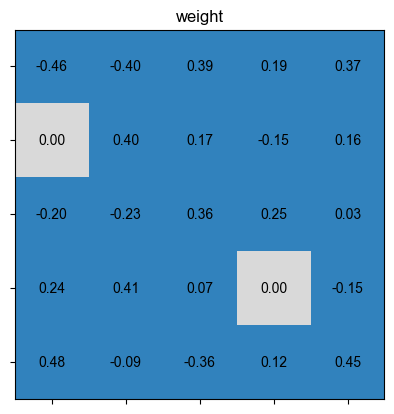

#### 细粒度剪枝

首先创建一个矩阵weight，如下图所示：

```python
weight = torch.rand(8, 8)
plot_tensor(weight, '剪枝前weight')
```

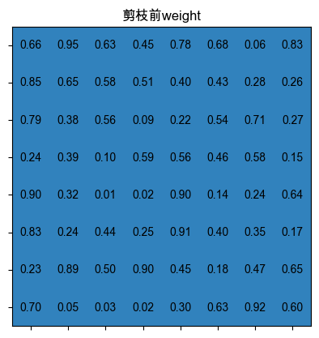

现在定义一个规则，比如想要将Tensor里的值小于0.5的都置为0。

```python
def _fine_grained_prune(tensor: torch.Tensor, threshold  : float) -> torch.Tensor:
    """
    :param tensor: 输入张量，包含需要剪枝的权重。
    :param threshold: 阈值，用于判断权重的大小。
    :return: 剪枝后的张量。
    """
    for i in range(tensor.shape[1]):
        for j in range(tensor.shape[0]):
            if tensor[i, j] < threshold:
                tensor[i][j] = 0
    return tensor

pruned_weight = _fine_grained_prune(weight, 0.5)
plot_tensor(weight, '细粒度剪枝后weight')
```

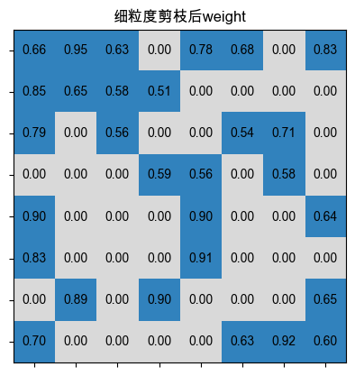

可能会有同学按照上述代码用for循环遍历去实现，虽然结果是对的，但如果参数太大的话，肯定会影响到速度，下面将介绍在剪枝中常用的一种方法，即使用mask掩码矩阵来实现。

```python
def fine_grained_prune(tensor: torch.Tensor, threshold  : float) -> torch.Tensor:
    """
    创建一个掩码张量，指示哪些权重不应被剪枝（应保持非零）。

    :param tensor: 输入张量，包含需要剪枝的权重。
    :param threshold: 阈值，用于判断权重的大小。
    :return: 剪枝后的张量。
    """
    mask = torch.gt(tensor, threshold)
    tensor.mul_(mask)
    return tensor
pruned_weight = fine_grained_prune(weight, 0.5)
plot_tensor(pruned_weight, '细粒度剪枝后weight')
```


#### 基于模式的剪枝

这里以NVIDIA 4：2为例，创建一个patterns，由于是2:4，即从4个中取出2个置为0，可以算出一共有6种不同的模式,首先创建一个矩阵，如下所示：

```python
# 创建一个矩阵weight
weight = torch.rand(8, 8)
plot_tensor(weight, '剪枝前weight')
```
然后定义模式剪枝函数，如下所示：

```python
from itertools import permutations

def reshape_1d(tensor, m):
    # 转换成列为m的格式，若不能整除m则填充0
    if tensor.shape[1] % m > 0:
        mat = torch.FloatTensor(tensor.shape[0], tensor.shape[1] + (m - tensor.shape[1] % m)).fill_(0)
        mat[:, : tensor.shape[1]] = tensor
        return mat.view(-1, m)
    else:
        return tensor.view(-1, m)

def compute_valid_1d_patterns(m, n):
    patterns = torch.zeros(m)
    patterns[:n] = 1
    valid_patterns = torch.Tensor(list(set(permutations(patterns.tolist()))))
    return valid_patterns

def compute_mask(tensor, m, n):
    # 计算所有可能的模式
    patterns = compute_valid_1d_patterns(m,n)

    # 找到m:n最好的模式
    mask = torch.IntTensor(tensor.shape).fill_(1).view(-1,m)
    mat = reshape_1d(tensor, m)
    pmax = torch.argmax(torch.matmul(mat.abs(), patterns.t()), dim=1)
    mask[:] = patterns[pmax[:]]
    mask = mask.view(tensor.shape)
    return mask

def pattern_pruning(tensor, m, n):
    mask = compute_mask(weight, m, n)
    tensor.mul_(mask)
    return tensor

pruned_weight = pattern_pruning(weight, 4, 2)
plot_tensor(pruned_weight, '剪枝后weight')
```

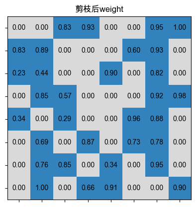


#### 向量级剪枝

首先创建一个矩阵，如下所示：

```python
# 创建一个矩阵weight
weight = torch.rand(8, 8)
plot_tensor(weight, '剪枝前weight')
```
我们剪枝某个点所在的行与列，如下所示：

```python
# 剪枝某个点所在的行与列
def vector_pruning(weight, point):
    row, col = point
    prune_weight = weight.clone()
    prune_weight[row, :] = 0
    prune_weight[:, col] = 0
    return prune_weight
point = (1, 1)
prune_weight = vector_pruning(weight, point)
plot_tensor(prune_weight, '向量级剪枝后weight')
```

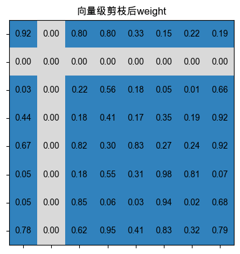

#### 卷积核级别剪枝


首先定义一个可视化4维张量的函数，如下所示：
```python
# 定义可视化4维张量的函数
def visualize_tensor(tensor, title, batch_spacing=3):
    fig = plt.figure()  # 创建一个新的matplotlib图形
    ax = fig.add_subplot(111, projection='3d')  # 向图形中添加一个3D子图

    # 遍历张量的批次维度
    for batch in range(tensor.shape[0]):
        # 遍历张量的通道维度
        for channel in range(tensor.shape[1]):
            # 遍历张量的高度维度
            for i in range(tensor.shape[2]):
                # 遍历张量的宽度维度
                for j in range(tensor.shape[3]):
                    # 计算条形的x位置，考虑到不同批次间的间隔
                    x = j + (batch * (tensor.shape[3] + batch_spacing))
                    y = i  # 条形的y位置，即张量的高度维度
                    z = channel  # 条形的z位置，即张量的通道维度
                    # 如果张量在当前位置的值为0，则设置条形颜色为红色，否则为绿色
                    color = 'red' if tensor[batch, channel, i, j] == 0 else 'green'
                    # 绘制单个3D条形
                    ax.bar3d(x, y, z, 1, 1, 1, shade=True, color=color, edgecolor='black', alpha=0.9)

    ax.set_title(title)  # 设置3D图形的标题
    ax.set_xlabel('Width')  # 设置x轴标签，对应张量的宽度维度
    ax.set_ylabel('Height')  # 设置y轴标签，对应张量的高度维度
    ax.set_zlabel('Channel')  # 设置z轴标签，对于张量的通道维度
    ax.set_zlim(ax.get_zlim()[::-1])  # 反转z轴方向
    ax.zaxis.labelpad = 15  # 调整z轴标签的填充

    plt.show()  # 显示图形

```

然后定义卷积核级别剪枝函数，如下所示：

```python
def prune_conv_layer(conv_layer, prune_method,title="", percentile=0.2, vis=True):
    prune_layer = conv_layer.clone()

    l2_norm = None
    mask = None

    # 计算每个kernel的L2范数
    l2_norm = torch.norm(prune_layer, p=2, dim=(-2, -1), keepdim=True)
    threshold = torch.quantile(l2_norm, percentile)
    mask = l2_norm > threshold
    prune_layer = prune_layer * mask.float()
    
    visualize_tensor(prune_layer,title=prune_method)  

# 使用PyTorch创建一个张量
tensor = torch.rand((3, 10, 4, 5))

# 调用函数进行剪枝

pruned_tensor = prune_conv_layer(tensor, 'Kernel级别剪枝', vis=True)

```

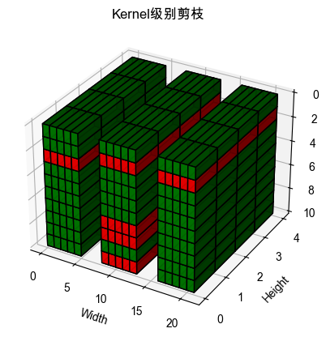

#### Filter级别剪枝

定义Filter级别剪枝函数，如下所示：

```python
def prune_conv_layer(conv_layer, prune_method,title="", percentile=0.2, vis=True):
    prune_layer = conv_layer.clone()

    l2_norm = None
    mask = None

    # 计算每个Filter的L2范数
    l2_norm = torch.norm(prune_layer, p=2, dim=(1, 2, 3), keepdim=True)
    threshold = torch.quantile(l2_norm, percentile)
    mask = l2_norm > threshold
    prune_layer = prune_layer * mask.float()
    
    visualize_tensor(prune_layer,title=prune_method)  

# 使用PyTorch创建一个张量
tensor = torch.rand((3, 10, 4, 5))

# 调用函数进行剪枝

pruned_tensor = prune_conv_layer(tensor, 'Filter级别剪枝', vis=True)

```


#### 通道级别剪枝

```python
def prune_conv_layer(conv_layer, prune_method,title="", percentile=0.2, vis=True):
    prune_layer = conv_layer.clone()

    l2_norm = None
    mask = None

    # 计算每个channel的L2范数
    l2_norm = torch.norm(prune_layer, p=2, dim=(0, 2, 3), keepdim=True)
    threshold = torch.quantile(l2_norm, percentile)
    mask = l2_norm > threshold
    prune_layer = prune_layer * mask.float()
    
    visualize_tensor(prune_layer,title=prune_method)  

# 使用PyTorch创建一个张量
tensor = torch.rand((3, 10, 4, 5))

# 调用函数进行剪枝

pruned_tensor = prune_conv_layer(tensor, 'Channel级别剪枝', vis=True)

```
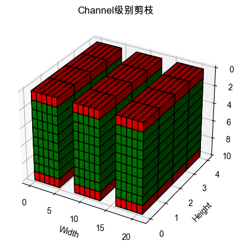


#### 总结

前面介绍了不同的剪枝方法，接下来将这些方法封装到一个函数中，整体对比一下，如下所示：

```python
# 返回一个mask
def get_threshold_and_mask(norms, percentile):
    threshold = torch.quantile(norms, percentile)
    return norms > threshold

def prune_conv_layer(conv_layer, prune_method, title= "", percentile=0.2, vis=True):
    prune_layer = conv_layer.clone()
    mask = None
    if prune_method == "fine_grained":
        prune_layer[torch.abs(prune_layer) < percentile] = 0
    elif prune_method == "vector_level":
        mask = get_threshold_and_mask(torch.norm(prune_layer, p=2, dim=-1), percentile).unsqueeze(-1)
    elif prune_method == "kernel_level":
        mask = get_threshold_and_mask(torch.norm(prune_layer, p=2, dim=(-2, -1), keepdim=True), percentile)
    elif prune_method == "filter_level":
        mask = get_threshold_and_mask(torch.norm(prune_layer, p=2, dim=(1, 2, 3), keepdim=True), percentile)
    elif prune_method == "channel_level":
        mask = get_threshold_and_mask(torch.norm(prune_layer, p=2, dim=(0, 2, 3), keepdim=True), percentile)


    if mask is not None:
        prune_layer = prune_layer * mask.float()

    if vis:
        visualize_tensor(prune_layer, title=title)  # 实现可视化的函数

    return prune_layer

# 使用PyTorch创建一个张量
tensor = torch.rand((3, 10, 4, 5)) 

# 调用函数进行剪枝
pruned_tensor = prune_conv_layer(tensor, 'fine_grained', '细粒度剪枝',  vis=True)
pruned_tensor = prune_conv_layer(tensor, 'vector_level', 'Vector级别剪枝', vis=True)
pruned_tensor = prune_conv_layer(tensor, 'kernel_level', 'Kernel级别剪枝', vis=True)
pruned_tensor = prune_conv_layer(tensor, 'filter_level', 'Filter级别剪枝', vis=True)
pruned_tensor = prune_conv_layer(tensor, 'channel_level', 'Channel级别剪枝', vis=True)
```
>注：请观察并思考不同方法的区别。


### 剪枝标准实践

本节我们将分别用L1范数、L2范数和梯度对模型进行剪枝，完整代码见[剪枝标准实践](https://github.com/datawhalechina/awesome-compression/blob/main/docs/notebook/ch03/2.pruning_criteria.ipynb)，接下来我们使用LeNet网络进行演示，首先加载模型，然后绘制权重分布图，代码如下所示：

```python
import copy
import math
import random
import time

import torch
import torch.nn as nn
import numpy as np
from matplotlib import pyplot as plt
from torch.utils.data import DataLoader
from torchvision import transforms
from torchvision import datasets
import torch.nn.functional as F

# 设置 matplotlib 使用支持负号的字体
plt.rcParams['font.family'] = 'DejaVu Sans'


# 定义一个LeNet网络
class LeNet(nn.Module):
    def __init__(self, num_classes=10):
        super(LeNet, self).__init__()
        self.conv1 = nn.Conv2d(in_channels=1, out_channels=6, kernel_size=5)
        self.conv2 = nn.Conv2d(in_channels=6, out_channels=16, kernel_size=5)
        self.maxpool = nn.MaxPool2d(kernel_size=2, stride=2)
        self.fc1 = nn.Linear(in_features=16 * 4 * 4, out_features=120)
        self.fc2 = nn.Linear(in_features=120, out_features=84)
        self.fc3 = nn.Linear(in_features=84, out_features=num_classes)

    def forward(self, x):
        x = self.maxpool(F.relu(self.conv1(x)))
        x = self.maxpool(F.relu(self.conv2(x)))

        x = x.view(x.size()[0], -1)
        x = F.relu(self.fc1(x))
        x = F.relu(self.fc2(x))
        x = self.fc3(x)

        return x
device = torch.device("cuda" if torch.cuda.is_available() else "cpu")
model = LeNet().to(device=device)

# 加载模型的状态字典
checkpoint = torch.load('../ch02/model.pt')
# 加载状态字典到模型
model.load_state_dict(checkpoint)
origin_model = copy.deepcopy(model)

# 绘制权重分布图
def plot_weight_distribution(model, bins=256, count_nonzero_only=False):
    fig, axes = plt.subplots(2,3, figsize=(10, 6))

    # 删除多余的子图
    fig.delaxes(axes[1][2])
    
    axes = axes.ravel()
    plot_index = 0
    for name, param in model.named_parameters():
        if param.dim() > 1:
            ax = axes[plot_index]
            if count_nonzero_only:
                param_cpu = param.detach().view(-1).cpu()
                param_cpu = param_cpu[param_cpu != 0].view(-1)
                ax.hist(param_cpu, bins=bins, density=True, 
                        color = 'green', alpha = 0.5)
            else:
                ax.hist(param.detach().view(-1).cpu(), bins=bins, density=True, 
                        color = 'green', alpha = 0.5)
            ax.set_xlabel(name)
            ax.set_ylabel('density')
            plot_index += 1
    fig.suptitle('Histogram of Weights')
    fig.tight_layout()
    fig.subplots_adjust(top=0.925)
    plt.show()

plot_weight_distribution(model)

```

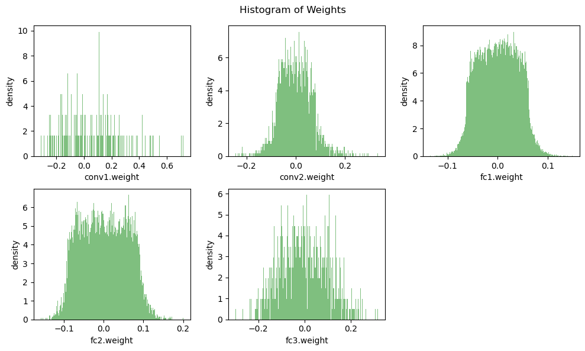

计算每一层网络的稠密程度，并画出weight直方图，如下所示：

```python
# 计算每一层网络的稠密程度
def plot_num_parameters_distribution(model):
    num_parameters = dict()
    num_nonzeros, num_elements = 0, 0
    for name,param in model.named_parameters():
        if param.dim() > 1:
            num_nonzeros = param.count_nonzero()
            num_elements = param.numel()
            dense = float(num_nonzeros) / num_elements
            num_parameters[name] = dense
    fig = plt.figure(figsize=(8, 6))
    plt.grid(axis='y')
    
    bars = plt.bar(list(num_parameters.keys()), list(num_parameters.values()))

    # 在柱状图上添加数据标签
    for bar in bars:
        yval = bar.get_height()
        plt.text(bar.get_x() + bar.get_width()/2.0, yval, yval, va='bottom')  # va='bottom' 使得文本在柱状图上方

    plt.title('#Parameter Distribution')
    plt.ylabel('Number of Parameters')
    plt.xticks(rotation=60)
    plt.tight_layout()
    plt.show()

# 画出weight直方图
plot_num_parameters_distribution(model)
```
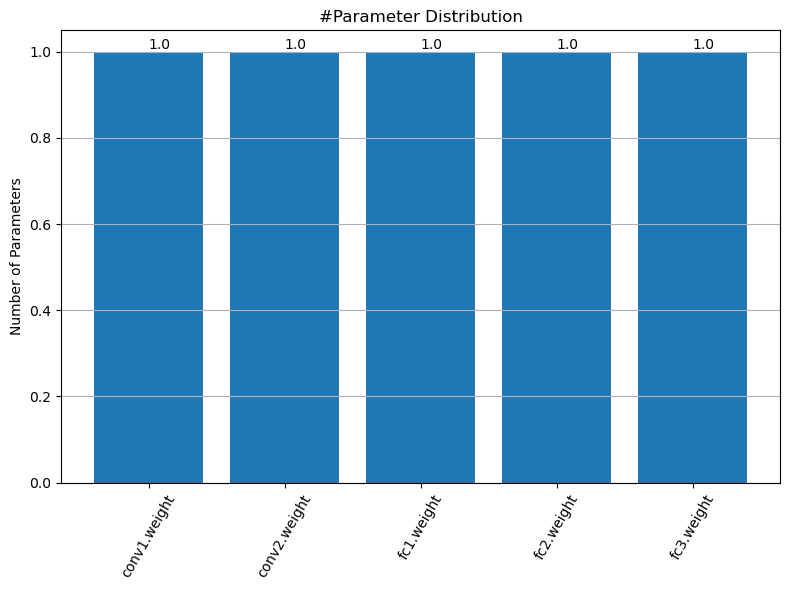

#### 基于L1权重大小的剪枝

下面我们使用L1范数进行剪枝，如下所示：

```python
@torch.no_grad()
def prune_l1(weight, percentile=0.5):
    num_elements = weight.numel()

    # 计算值为0的数量
    num_zeros = round(num_elements * percentile)
    # 计算weight的重要性
    importance = weight.abs()
    # 计算裁剪阈值
    threshold = importance.view(-1).kthvalue(num_zeros).values
    # 计算mask
    mask = torch.gt(importance, threshold)
    
    # 计算mask后的weight
    weight.mul_(mask)
    return weight

# 裁剪conv2层
weight_pruned = prune_l1(model.conv2.weight, percentile=0.5)

# 替换原有model层
model.conv2.weight.data = weight_pruned

# 画出weight直方图
plot_weight_distribution(model)

# 画出参数分布图
plot_num_parameters_distribution(model)

```

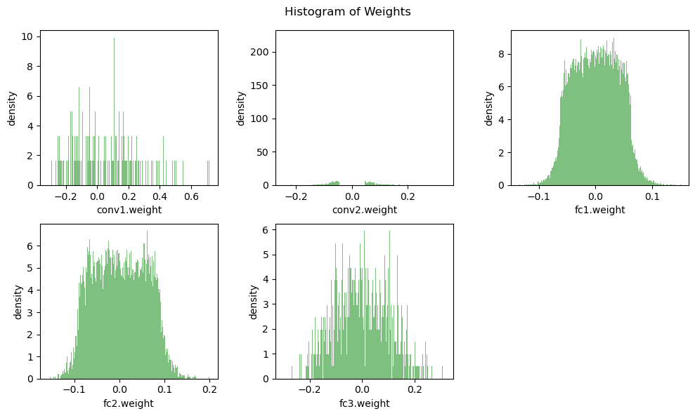

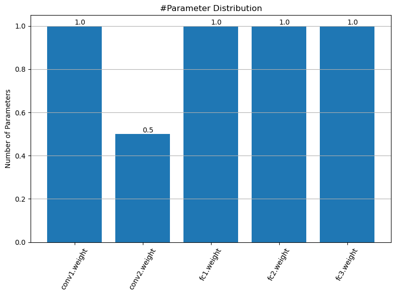

#### 基于L2权重大小的剪枝

下面我们使用L2范数进行剪枝，如下所示：

```python
@torch.no_grad()
def prune_l2(weight, percentile=0.5):
    num_elements = weight.numel()

    # 计算值为0的数量
    num_zeros = round(num_elements * percentile)
    # 计算weight的重要性（使用L2范数，即各元素的平方）
    importance = weight.pow(2)
    # 计算裁剪阈值
    threshold = importance.view(-1).kthvalue(num_zeros).values
    # 计算mask
    mask = torch.gt(importance, threshold)
    
    # 计算mask后的weight
    weight.mul_(mask)
    return weight

# 裁剪fc1层
weight_pruned = prune_l2(model.fc1.weight, percentile=0.4)

# 替换原有model层
model.fc1.weight.data = weight_pruned

# 列出weight直方图
plot_weight_distribution(model)

# 列出weight直方图
plot_num_parameters_distribution(model)

```

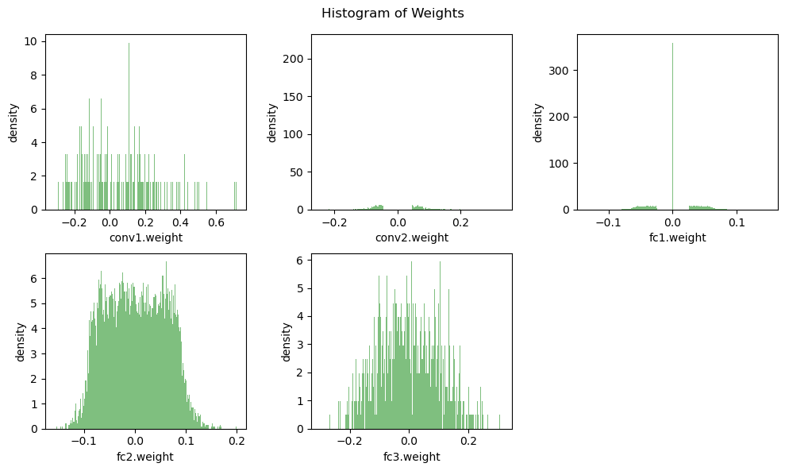

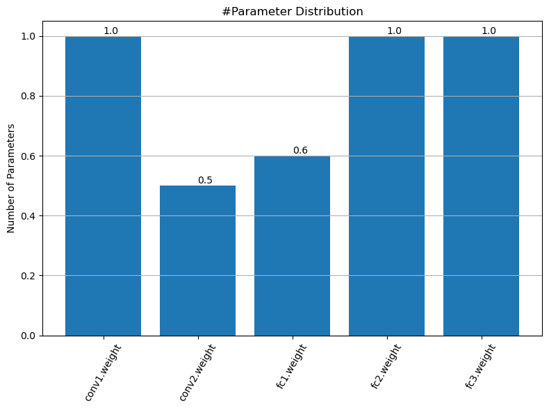

#### 基于梯度大小的剪枝

下面我们基于梯度大小进行剪枝，如下所示：

```python
# 为避免前面的操作影响后续结果，重新定义一个LeNet网络，和前面一致
class LeNet(nn.Module):
    def __init__(self, num_classes=10):
        super(LeNet, self).__init__()
        self.conv1 = nn.Conv2d(in_channels=1, out_channels=6, kernel_size=5)
        self.conv2 = nn.Conv2d(in_channels=6, out_channels=16, kernel_size=5)
        self.maxpool = nn.MaxPool2d(kernel_size=2, stride=2)
        self.fc1 = nn.Linear(in_features=16 * 4 * 4, out_features=120)
        self.fc2 = nn.Linear(in_features=120, out_features=84)
        self.fc3 = nn.Linear(in_features=84, out_features=num_classes)

    def forward(self, x):
        x = self.maxpool(F.relu(self.conv1(x)))
        x = self.maxpool(F.relu(self.conv2(x)))

        x = x.view(x.size()[0], -1)
        x = F.relu(self.fc1(x))
        x = F.relu(self.fc2(x))
        x = self.fc3(x)

        return x
device = torch.device("cuda" if torch.cuda.is_available() else "cpu")
model = LeNet().to(device=device)
# 加载梯度信息
gradients = torch.load('../ch02/model_gradients.pt')

# 加载参数信息
checkpoint = torch.load('../ch02/model.pt')
# 加载状态字典到模型
model.load_state_dict(checkpoint)

# 修剪整个模型的权重，传入整个模型
def gradient_magnitude_pruning(model, percentile):
    for name, param in model.named_parameters():
        if 'weight' in name:
            mask = torch.abs(gradients[name]) >= percentile
            param.data *= mask.float()

# 修剪局部模型权重，传入某一层的权重
@torch.no_grad()
def gradient_magnitude_pruning(weight, gradient, percentile=0.5):
    num_elements = weight.numel()

    # 计算值为0的数量
    num_zeros = round(num_elements * percentile)
    # 计算weight的重要性（使用L1范数）
    importance = gradient.abs()
    # 计算裁剪阈值
    threshold = importance.view(-1).kthvalue(num_zeros).values
    # 计算mask
    mask = torch.gt(importance, threshold)
    
    # 计算mask后的weight
    weight.mul_(mask)
    return weight

# 使用示例，这里以fc2层的权重为例
percentile = 0.5
gradient_magnitude_pruning(model.fc2.weight, gradients['fc2.weight'], percentile)

# 列出weight直方图
plot_weight_distribution(model)

# 列出参数分布图
plot_num_parameters_distribution(model)
```

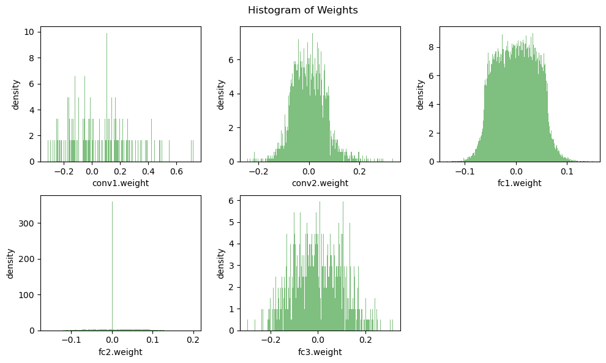
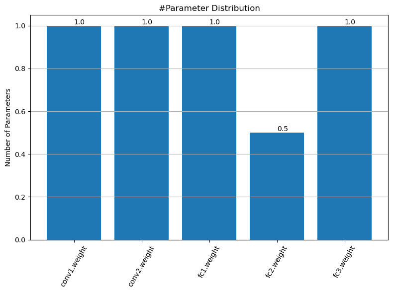

### 剪枝时机实践

本节我们主要演示训练后剪枝，完整代码见[剪枝时机实践](https://github.com/datawhalechina/awesome-compression/blob/main/docs/notebook/ch03/3.pruning_timing.ipynb)。
#### 训练后剪枝

首先训练一个模型，并计算出训练前的参数分布，如下所示：

```python
import copy
import math
import random
import time
from collections import OrderedDict, defaultdict
from typing import Union, List

import numpy as np
import torch
from matplotlib import pyplot as plt
from torch import nn
from torch.optim import *
from torch.optim.lr_scheduler import *
from torch.utils.data import DataLoader
from torchvision.transforms import *
from tqdm.auto import tqdm
import torch.nn.functional as F
from torchvision import datasets

from torchprofile import profile_macs


# 设置 matplotlib 使用支持负号的字体
plt.rcParams['font.family'] = 'DejaVu Sans'

random.seed(0)
np.random.seed(0)
torch.manual_seed(0)

def get_model_macs(model, inputs) -> int:
    return profile_macs(model, inputs)


def get_sparsity(tensor: torch.Tensor) -> float:
    """
    calculate the sparsity of the given tensor
        sparsity = #zeros / #elements = 1 - #nonzeros / #elements
    """
    return 1 - float(tensor.count_nonzero()) / tensor.numel()


def get_model_sparsity(model: nn.Module) -> float:
    """
    calculate the sparsity of the given model
        sparsity = #zeros / #elements = 1 - #nonzeros / #elements
    """
    num_nonzeros, num_elements = 0, 0
    for param in model.parameters():
        num_nonzeros += param.count_nonzero()
        num_elements += param.numel()
    return 1 - float(num_nonzeros) / num_elements

def get_num_parameters(model: nn.Module, count_nonzero_only=False) -> int:
    """
    calculate the total number of parameters of model
    :param count_nonzero_only: only count nonzero weights
    """
    num_counted_elements = 0
    for param in model.parameters():
        if count_nonzero_only:
            num_counted_elements += param.count_nonzero()
        else:
            num_counted_elements += param.numel()
    return num_counted_elements


def get_model_size(model: nn.Module, data_width=32, count_nonzero_only=False) -> int:
    """
    calculate the model size in bits
    :param data_width: #bits per element
    :param count_nonzero_only: only count nonzero weights
    """
    return get_num_parameters(model, count_nonzero_only) * data_width

Byte = 8
KiB = 1024 * Byte
MiB = 1024 * KiB
GiB = 1024 * MiB

# 定义一个LeNet网络
class LeNet(nn.Module):
    def __init__(self, num_classes=10):
        super(LeNet, self).__init__()
        self.conv1 = nn.Conv2d(in_channels=1, out_channels=6, kernel_size=5)
        self.conv2 = nn.Conv2d(in_channels=6, out_channels=16, kernel_size=5)
        self.maxpool = nn.MaxPool2d(kernel_size=2, stride=2)
        self.fc1 = nn.Linear(in_features=16 * 4 * 4, out_features=120)
        self.fc2 = nn.Linear(in_features=120, out_features=84)
        self.fc3 = nn.Linear(in_features=84, out_features=num_classes)

    def forward(self, x):
        x = self.maxpool(F.relu(self.conv1(x)))
        x = self.maxpool(F.relu(self.conv2(x)))

        x = x.view(x.size()[0], -1)
        x = F.relu(self.fc1(x))
        x = F.relu(self.fc2(x))
        x = self.fc3(x)

        return x

model = LeNet()

# 设置归一化
transform = transforms.Compose([transforms.ToTensor(), transforms.Normalize((0.1307,), (0.3081,))])

# 获取数据集
train_dataset = datasets.MNIST(root='../ch02/data/mnist', train=True, download=True, transform=transform)  
test_dataset = datasets.MNIST(root='../ch02/data/mnist', train=False, download=True, transform=transform)  # train=True训练集，=False测试集

# 设置DataLoader
batch_size = 64
train_loader = DataLoader(train_dataset, batch_size=batch_size, shuffle=True)
test_loader = DataLoader(test_dataset, batch_size=batch_size, shuffle=False)

def train(
  model: nn.Module,
  dataloader: DataLoader,
  criterion: nn.Module,
  optimizer: Optimizer,
  callbacks = None
) -> None:
  model.train()

  for inputs, targets in tqdm(dataloader, desc='train', leave=False):
    inputs = inputs
    targets = targets

    # Reset the gradients (from the last iteration)
    optimizer.zero_grad()

    # Forward inference
    outputs = model(inputs)
    loss = criterion(outputs, targets)

    # Backward propagation
    loss.backward()

    # Update optimizer 
    optimizer.step()

    if callbacks is not None:
        for callback in callbacks:
            callback()

@torch.inference_mode()
def evaluate(
  model: nn.Module,
  dataloader: DataLoader,
  verbose=True,
) -> float:
  model.eval()

  num_samples = 0
  num_correct = 0

  for inputs, targets in tqdm(dataloader, desc="eval", leave=False,
                              disable=not verbose):

    # Inference
    outputs = model(inputs)

    # Convert logits to class indices
    outputs = outputs.argmax(dim=1)

    # Update metrics
    num_samples += targets.size(0)
    num_correct += (outputs == targets).sum()

  return (num_correct / num_samples * 100).item()

# 加载之前模型训练后的状态字典
checkpoint = torch.load('../ch02/model.pt')
# 加载状态字典到模型
model.load_state_dict(checkpoint)

# 备份model
origin_model = copy.deepcopy(model)

origin_model_accuracy = evaluate(origin_model, test_loader)
origin_model_size = get_model_size(origin_model)
print(f"dense model has accuracy={origin_model_accuracy:.2f}%")
print(f"dense model has size={origin_model_size/MiB:.2f}%MiB")

# 绘制权重分布图
def plot_weight_distribution(model, bins=256, count_nonzero_only=False):
    fig, axes = plt.subplots(2,3, figsize=(10, 6))

    # 删除多余的子图（我们只需要5个子图）
    fig.delaxes(axes[1][2])
    
    axes = axes.ravel()
    plot_index = 0
    for name, param in model.named_parameters():
        if param.dim() > 1:
            ax = axes[plot_index]
            if count_nonzero_only:
                param_cpu = param.detach().view(-1).cpu()
                param_cpu = param_cpu[param_cpu != 0].view(-1)
                ax.hist(param_cpu, bins=bins, density=True, 
                        color = 'green', alpha = 0.5)
            else:
                ax.hist(param.detach().view(-1).cpu(), bins=bins, density=True, 
                        color = 'green', alpha = 0.5)
            ax.set_xlabel(name)
            ax.set_ylabel('density')
            plot_index += 1
    fig.suptitle('Histogram of Weights')
    fig.tight_layout()
    fig.subplots_adjust(top=0.925)
    plt.show()

# 绘制weight直方图
plot_weight_distribution(model)


# 计算每一层网络的稠密程度
def plot_num_parameters_distribution(model):
    num_parameters = dict()
    num_nonzeros, num_elements = 0, 0
    for name,param in model.named_parameters():
        if param.dim() > 1:
            num_nonzeros = param.count_nonzero()
            num_elements = param.numel()
            dense = float(num_nonzeros) / num_elements
            num_parameters[name] = dense
    fig = plt.figure(figsize=(8, 6))
    plt.grid(axis='y')
    
    bars = plt.bar(list(num_parameters.keys()), list(num_parameters.values()))

    # 在柱状图上添加数据标签
    for bar in bars:
        yval = bar.get_height()
        plt.text(bar.get_x() + bar.get_width()/2.0, yval, yval, va='bottom')  # va='bottom' 使得文本在柱状图上方

    plt.title('#Parameter Distribution')
    plt.ylabel('Number of Parameters')
    plt.xticks(rotation=60)
    plt.tight_layout()
    plt.show()

# 列出weight分布图
plot_num_parameters_distribution(model)
```
然后我们定义每一层网络的稀疏度，并使用细粒度剪枝方法对训练后模型进行剪枝,并评估剪枝后的模型性能与参数分布。

```python
# 定义每一层网络的稀疏度
sparsity_dict = {
    'conv1.weight': 0.85,
    'conv2.weight': 0.8,
    'fc1.weight': 0.75,
    'fc2.weight': 0.7,
    'fc3.weight': 0.8,
}

def fine_grained_prune(tensor: torch.Tensor, sparsity : float) -> torch.Tensor:
    """
    magnitude-based pruning for single tensor
    :param tensor: torch.(cuda.)Tensor, weight of conv/fc layer
    :param sparsity: float, pruning sparsity
        sparsity = #zeros / #elements = 1 - #nonzeros / #elements
    :return:
        torch.(cuda.)Tensor, mask for zeros
    """
    sparsity = min(max(0.0, sparsity), 1.0)
    if sparsity == 1.0:
        tensor.zero_()
        return torch.zeros_like(tensor)
    elif sparsity == 0.0:
        return torch.ones_like(tensor)

    num_elements = tensor.numel()
    num_zeros = round(num_elements * sparsity)
    importance = tensor.abs()
    threshold = importance.view(-1).kthvalue(num_zeros).values
    mask = torch.gt(importance, threshold)
    tensor.mul_(mask)

    return mask

class FineGrainedPruner:
    def __init__(self, model, sparsity_dict):
        self.masks = FineGrainedPruner.prune(model, sparsity_dict)

    @torch.no_grad()
    def apply(self, model):
        for name, param in model.named_parameters():
            if name in self.masks:
                param *= self.masks[name]

    @staticmethod
    @torch.no_grad()
    def prune(model, sparsity_dict):
        masks = dict()
        for name, param in model.named_parameters():
            if param.dim() > 1: # we only prune conv and fc weights
                masks[name] = fine_grained_prune(param, sparsity_dict[name])
        return masks

pruner = FineGrainedPruner(model, sparsity_dict)
print(f'After pruning with sparsity dictionary')
for name, sparsity in sparsity_dict.items():
    print(f'  {name}: {sparsity:.2f}')
print(f'The sparsity of each layer becomes')
for name, param in model.named_parameters():
    if name in sparsity_dict:
        print(f'  {name}: {get_sparsity(param):.2f}')

sparse_model_size = get_model_size(model, count_nonzero_only=True)
print(f"Sparse model has size={sparse_model_size / MiB:.2f} MiB = {sparse_model_size / origin_model_size * 100:.2f}% of orgin model size")
sparse_model_accuracy = evaluate(model, test_loader)
print(f"Sparse model has accuracy={sparse_model_accuracy:.2f}% before fintuning")

plot_weight_distribution(model, count_nonzero_only=True)

plot_num_parameters_distribution(model)

```

接下来，我们对剪枝后的模型进行微调（fine-tuning），以提高其在测试集上的性能。

```python

lr = 0.01
momentum = 0.5
num_finetune_epochs = 5

optimizer = torch.optim.SGD(model.parameters(),  lr=lr, momentum=momentum)  # lr学习率，momentum冲量
criterion = nn.CrossEntropyLoss()  # 交叉熵损失


best_sparse_model_checkpoint = dict()
best_accuracy = 0
print(f'Finetuning Fine-grained Pruned Sparse Model')
for epoch in range(num_finetune_epochs):
    # At the end of each train iteration, we have to apply the pruning mask
    #    to keep the model sparse during the training
    train(model, train_loader, criterion, optimizer,
          callbacks=[lambda: pruner.apply(model)])
    accuracy = evaluate(model, test_loader)
    is_best = accuracy > best_accuracy
    if is_best:
        best_sparse_model_checkpoint['state_dict'] = copy.deepcopy(model.state_dict())
        best_accuracy = accuracy
    print(f'    Epoch {epoch+1} Accuracy {accuracy:.2f}% / Best Accuracy: {best_accuracy:.2f}%')

# load the best sparse model checkpoint to evaluate the final performance
model.load_state_dict(best_sparse_model_checkpoint['state_dict'])
sparse_model_size = get_model_size(model, count_nonzero_only=True)
print(f"Sparse model has size={sparse_model_size / MiB:.2f} MiB = {sparse_model_size / origin_model_size * 100:.2f}% of dense model size")
sparse_model_accuracy = evaluate(model, test_loader)
print(f"Sparse model has accuracy={sparse_model_accuracy:.2f}% after fintuning")

# 绘制weight直方图
plot_weight_distribution(model)

# 列出weight分布图
plot_num_parameters_distribution(model)

```

最后，我们评估模型剪枝前后的性能。

```python

origin_model_size = get_model_size(origin_model, count_nonzero_only=True)
print(f"Origin model has size={origin_model_size / MiB:.2f} MiB")
origin_model_accuracy = evaluate(origin_model, test_loader)
print(f"Origin model has accuracy={origin_model_accuracy:.2f}% ")

plot_weight_distribution(origin_model, count_nonzero_only=True)


plot_num_parameters_distribution(origin_model)

@torch.no_grad()
def measure_latency(model, dummy_input, n_warmup=20, n_test=100):
    model.eval()
    # warmup
    for _ in range(n_warmup):
        _ = model(dummy_input)
    # real test
    t1 = time.time()
    for _ in range(n_test):
        _ = model(dummy_input)
    t2 = time.time()
    return (t2 - t1) / n_test  # average latency

table_template = "{:<15} {:<15} {:<15} {:<15}"
print (table_template.format('', 'Original','Pruned','Reduction Ratio'))

dummy_input = torch.randn(64, 1, 28, 28)


pruned_latency = measure_latency(model, dummy_input)
original_latency = measure_latency(origin_model, dummy_input)
print(table_template.format('Latency (ms)',
                            round(original_latency * 1000, 1),
                            round(pruned_latency * 1000, 1),
                            round(original_latency / pruned_latency, 1)))

# 2. measure the computation (MACs)
original_macs = get_model_macs(origin_model, dummy_input)
pruned_macs = get_model_macs(model, dummy_input)
print(table_template.format('MACs (M)',
                            round(original_macs / 1e6),
                            round(pruned_macs / 1e6),
                            round(original_macs / pruned_macs, 1)))

# 3. measure the model size (params)
original_param = get_num_parameters(origin_model, count_nonzero_only=True).item()
pruned_param = get_num_parameters(model, count_nonzero_only=True).item()
print(table_template.format('Param (M)',
                            round(original_param / 1e6, 2),
                            round(pruned_param / 1e6, 2),
                            round(original_param / pruned_param, 1)))

```

输出结果如下：
```
                Original        Pruned          Reduction Ratio
Latency (ms)    3.8             4.7             0.8            
MACs (M)        18              18              1.0            
Param (M)       0.04            0.01            3.8      
```

### pytorch中的prune实践

Pytorch在1.4.0版本开始，加入了剪枝操作，在`torch.nn.utils.prune`模块中，本教程按照剪枝范围划分，将其分以下几种剪枝方式:

- 局部剪枝（Local Pruning）
  - 结构化剪枝
    - 随机结构化剪枝（random_structured）
    - 范数结构化剪枝（ln_structured）
  - 非结构化剪枝
    - 随机非结构化剪枝（random_unstructured）
    - 范数非结构化剪枝（l1_unstructured）
- 全局剪枝（Global Pruning）
  - 非结构化剪枝（global_unstructured）
- 自定义剪枝（Custom  Pruning）

本节的完整代码见[torch中的剪枝算法实践](https://github.com/datawhalechina/awesome-compression/blob/main/docs/notebook/ch03/4.torch_prune.ipynb)。

**注：** 全局剪枝只有非结构化剪枝方式。

#### 局部剪枝

首先介绍局部剪枝（Local Pruning）方式，指的是对网络的单个层或局部范围内进行剪枝。


按照剪枝方式划分，可以分为结构化剪枝和非结构化剪枝方式。非结构化剪枝会随机地将一些权重参数变为0，结构化剪枝则将某个维度某些通道变成0。

我们首先定义一个LeNet网络，并打印模型结构：

```python
import torch
from torch import nn
import torch.nn.utils.prune as prune
import torch.nn.functional as F
from torchsummary import summary

# 定义一个LeNet网络
class LeNet(nn.Module):
    def __init__(self, num_classes=10):
        super(LeNet, self).__init__()
        self.conv1 = nn.Conv2d(in_channels=1, out_channels=6, kernel_size=5)
        self.conv2 = nn.Conv2d(in_channels=6, out_channels=16, kernel_size=5)
        self.maxpool = nn.MaxPool2d(kernel_size=2, stride=2)
        self.fc1 = nn.Linear(in_features=16 * 4 * 4, out_features=120)
        self.fc2 = nn.Linear(in_features=120, out_features=84)
        self.fc3 = nn.Linear(in_features=84, out_features=num_classes)

    def forward(self, x):
        x = self.maxpool(F.relu(self.conv1(x)))
        x = self.maxpool(F.relu(self.conv2(x)))

        x = x.view(x.size()[0], -1)
        x = F.relu(self.fc1(x))
        x = F.relu(self.fc2(x))
        x = self.fc3(x)

        return x
device = torch.device("cuda" if torch.cuda.is_available() else "cpu")
model = LeNet().to(device=device)

# 打印模型结构
summary(model, input_size=(1, 28, 28))

```
输出结果如下：

```
----------------------------------------------------------------
        Layer (type)               Output Shape         Param #
================================================================
            Conv2d-1            [-1, 6, 24, 24]             156
         MaxPool2d-2            [-1, 6, 12, 12]               0
            Conv2d-3             [-1, 16, 8, 8]           2,416
         MaxPool2d-4             [-1, 16, 4, 4]               0
            Linear-5                  [-1, 120]          30,840
            Linear-6                   [-1, 84]          10,164
            Linear-7                   [-1, 10]             850
================================================================
Total params: 44,426
Trainable params: 44,426
Non-trainable params: 0
----------------------------------------------------------------
Input size (MB): 0.00
Forward/backward pass size (MB): 0.04
Params size (MB): 0.17
Estimated Total Size (MB): 0.22
----------------------------------------------------------------
```

然后，我们打印第一个卷积层的参数：

```python
# 打印第一个卷积层的参数
module = model.conv1
print(list(module.named_parameters()))
```

输出结果如下：

```
    [('weight', Parameter containing:
    tensor([[[[ 0.0220,  0.1789, -0.0544, -0.0713,  0.0478],
              [ 0.1995, -0.0415,  0.0288, -0.1431,  0.1057],
              [ 0.1600,  0.0248, -0.1903, -0.0242, -0.1961],
              [-0.0211,  0.0257, -0.1116, -0.1678,  0.0611],
              [ 0.0012,  0.0420, -0.1725, -0.1265, -0.1075]]],
    
    
            [[[-0.0540, -0.1928, -0.0355, -0.0075, -0.1481],
              [ 0.0135,  0.0192,  0.0082, -0.0120, -0.0164],
              [-0.0435, -0.1488,  0.1092, -0.0041,  0.1960],
              [-0.1045, -0.0136,  0.0398, -0.1286,  0.0617],
              [-0.0091,  0.0466,  0.1827,  0.1655,  0.0727]]],
    
    
            [[[ 0.1216, -0.0833, -0.1491, -0.1143,  0.0113],
              [ 0.0452,  0.1662, -0.0425, -0.0904, -0.1235],
              [ 0.0565,  0.0933, -0.0721,  0.0909,  0.1837],
              [-0.1739,  0.0263,  0.1339,  0.0648, -0.0382],
              [-0.1667,  0.1478,  0.0448, -0.0892,  0.0815]]],
    
    
            [[[ 0.1976,  0.0123,  0.1523, -0.1207,  0.1493],
              [-0.1799,  0.0580,  0.1490,  0.1647, -0.0572],
              [-0.0908,  0.1094, -0.0676, -0.0023,  0.0624],
              [-0.0320, -0.1794,  0.1706, -0.0486,  0.0557],
              [ 0.1482, -0.1306,  0.1213, -0.1090, -0.1267]]],
    
    
            [[[ 0.1278,  0.1037, -0.0323, -0.1504,  0.1080],
              [ 0.0266, -0.0996,  0.1499, -0.0845,  0.0609],
              [-0.0662, -0.1405, -0.0586, -0.0615, -0.0462],
              [-0.1118, -0.0961, -0.1325, -0.0417, -0.0741],
              [ 0.1842, -0.1040, -0.1786, -0.0593,  0.0186]]],
    
    
            [[[-0.0889, -0.0737, -0.1655, -0.1708, -0.0988],
              [-0.1787,  0.1127,  0.0706, -0.0352,  0.1238],
              [-0.0985, -0.1929, -0.0062,  0.0488, -0.1152],
              [-0.1659, -0.0448,  0.0821, -0.0956, -0.0262],
              [ 0.1928,  0.1767, -0.1792, -0.1364,  0.0507]]]], requires_grad=True)), ('bias', Parameter containing:
    tensor([-0.0893, -0.1464, -0.1101, -0.0076,  0.1493, -0.0418],
           requires_grad=True))]
```

打印module中的属性张量named_buffers，因为还没有执行剪枝操作，初始时为空列表。

```python
print(list(module.named_buffers()))
```
输出结果如下：
```
    []
```
打印模型的状态字典，状态字典里包含了所有的参数

```python
print(model.state_dict().keys())
```
```
    odict_keys(['conv1.weight', 'conv1.bias', 'conv2.weight', 'conv2.bias', 'fc1.weight', 'fc1.bias', 'fc2.weight', 'fc2.bias', 'fc3.weight', 'fc3.bias'])
```

接下来，我们对第一个卷积层执行随机结构化剪枝，代码如下：
```python
# 第一个参数: module, 代表要进行剪枝的特定模块, 这里指的是module=model.conv1,
#             说明这里要对第一个卷积层执行剪枝.
# 第二个参数: name, 代表要对选中的模块中的哪些参数执行剪枝.
#             这里设定为name="weight", 说明是对网络中的weight剪枝, 而不对bias剪枝.
# 第三个参数: amount, 代表要对模型中特定比例或绝对数量的参数执行剪枝.
#             amount是一个介于0.0-1.0的float数值,代表比例, 或者一个正整数，代表指定剪裁掉多少个参数.
# 第四个参数: dim, 代表要进行剪枝通道(channel)的维度索引.
#            

prune.random_structured(module, name="weight", amount=2, dim=0)
```

再次打印模型的状态字典，观察conv1层

```python 
print(model.state_dict().keys())
```
输出结果如下：
```
    odict_keys(['conv1.bias', 'conv1.weight_orig', 'conv1.weight_mask', 'conv2.weight', 'conv2.bias', 'fc1.weight', 'fc1.bias', 'fc2.weight', 'fc2.bias', 'fc3.weight', 'fc3.bias'])
```

再次打印module中的属性张量named_buffers

```python
print(list(module.named_parameters()))
```
输出结果如下：
```
    [('bias', Parameter containing:
    tensor([-0.0893, -0.1464, -0.1101, -0.0076,  0.1493, -0.0418],
           requires_grad=True)), ('weight_orig', Parameter containing:
    tensor([[[[ 0.0220,  0.1789, -0.0544, -0.0713,  0.0478],
              [ 0.1995, -0.0415,  0.0288, -0.1431,  0.1057],
              [ 0.1600,  0.0248, -0.1903, -0.0242, -0.1961],
              [-0.0211,  0.0257, -0.1116, -0.1678,  0.0611],
              [ 0.0012,  0.0420, -0.1725, -0.1265, -0.1075]]],
    
    
            [[[-0.0540, -0.1928, -0.0355, -0.0075, -0.1481],
              [ 0.0135,  0.0192,  0.0082, -0.0120, -0.0164],
              [-0.0435, -0.1488,  0.1092, -0.0041,  0.1960],
              [-0.1045, -0.0136,  0.0398, -0.1286,  0.0617],
              [-0.0091,  0.0466,  0.1827,  0.1655,  0.0727]]],
    
    
            [[[ 0.1216, -0.0833, -0.1491, -0.1143,  0.0113],
              [ 0.0452,  0.1662, -0.0425, -0.0904, -0.1235],
              [ 0.0565,  0.0933, -0.0721,  0.0909,  0.1837],
              [-0.1739,  0.0263,  0.1339,  0.0648, -0.0382],
              [-0.1667,  0.1478,  0.0448, -0.0892,  0.0815]]],
    
    
            [[[ 0.1976,  0.0123,  0.1523, -0.1207,  0.1493],
              [-0.1799,  0.0580,  0.1490,  0.1647, -0.0572],
              [-0.0908,  0.1094, -0.0676, -0.0023,  0.0624],
              [-0.0320, -0.1794,  0.1706, -0.0486,  0.0557],
              [ 0.1482, -0.1306,  0.1213, -0.1090, -0.1267]]],
    
    
            [[[ 0.1278,  0.1037, -0.0323, -0.1504,  0.1080],
              [ 0.0266, -0.0996,  0.1499, -0.0845,  0.0609],
              [-0.0662, -0.1405, -0.0586, -0.0615, -0.0462],
              [-0.1118, -0.0961, -0.1325, -0.0417, -0.0741],
              [ 0.1842, -0.1040, -0.1786, -0.0593,  0.0186]]],
    
    
            [[[-0.0889, -0.0737, -0.1655, -0.1708, -0.0988],
              [-0.1787,  0.1127,  0.0706, -0.0352,  0.1238],
              [-0.0985, -0.1929, -0.0062,  0.0488, -0.1152],
              [-0.1659, -0.0448,  0.0821, -0.0956, -0.0262],
              [ 0.1928,  0.1767, -0.1792, -0.1364,  0.0507]]]], requires_grad=True))]
```

再次打印module中的属性张量named_buffers，看看有什么变化？

```python
print(list(module.named_buffers()))
```
输出结果如下：
```
    [('weight_mask', tensor([[[[0., 0., 0., 0., 0.],
              [0., 0., 0., 0., 0.],
              [0., 0., 0., 0., 0.],
              [0., 0., 0., 0., 0.],
              [0., 0., 0., 0., 0.]]],
    
    
            [[[1., 1., 1., 1., 1.],
              [1., 1., 1., 1., 1.],
              [1., 1., 1., 1., 1.],
              [1., 1., 1., 1., 1.],
              [1., 1., 1., 1., 1.]]],
    
    
            [[[1., 1., 1., 1., 1.],
              [1., 1., 1., 1., 1.],
              [1., 1., 1., 1., 1.],
              [1., 1., 1., 1., 1.],
              [1., 1., 1., 1., 1.]]],
    
    
            [[[0., 0., 0., 0., 0.],
              [0., 0., 0., 0., 0.],
              [0., 0., 0., 0., 0.],
              [0., 0., 0., 0., 0.],
              [0., 0., 0., 0., 0.]]],
    
    
            [[[1., 1., 1., 1., 1.],
              [1., 1., 1., 1., 1.],
              [1., 1., 1., 1., 1.],
              [1., 1., 1., 1., 1.],
              [1., 1., 1., 1., 1.]]],
    
    
            [[[1., 1., 1., 1., 1.],
              [1., 1., 1., 1., 1.],
              [1., 1., 1., 1., 1.],
              [1., 1., 1., 1., 1.],
              [1., 1., 1., 1., 1.]]]]))]
```

**结论:** 经过剪枝操作后, 原始的权重矩阵weight变成了weight_orig。 并且剪枝前打印为空列表的module.named_buffers(), 现在多了weight_mask参数。

打印module.weight, 看看发现了什么？

```python
print(module.weight)
```
输出结果如下：
```
    tensor([[[[ 0.0000,  0.0000, -0.0000, -0.0000,  0.0000],
              [ 0.0000, -0.0000,  0.0000, -0.0000,  0.0000],
              [ 0.0000,  0.0000, -0.0000, -0.0000, -0.0000],
              [-0.0000,  0.0000, -0.0000, -0.0000,  0.0000],
              [ 0.0000,  0.0000, -0.0000, -0.0000, -0.0000]]],
    
    
            [[[-0.0540, -0.1928, -0.0355, -0.0075, -0.1481],
              [ 0.0135,  0.0192,  0.0082, -0.0120, -0.0164],
              [-0.0435, -0.1488,  0.1092, -0.0041,  0.1960],
              [-0.1045, -0.0136,  0.0398, -0.1286,  0.0617],
              [-0.0091,  0.0466,  0.1827,  0.1655,  0.0727]]],
    
    
            [[[ 0.1216, -0.0833, -0.1491, -0.1143,  0.0113],
              [ 0.0452,  0.1662, -0.0425, -0.0904, -0.1235],
              [ 0.0565,  0.0933, -0.0721,  0.0909,  0.1837],
              [-0.1739,  0.0263,  0.1339,  0.0648, -0.0382],
              [-0.1667,  0.1478,  0.0448, -0.0892,  0.0815]]],
    
    
            [[[ 0.0000,  0.0000,  0.0000, -0.0000,  0.0000],
              [-0.0000,  0.0000,  0.0000,  0.0000, -0.0000],
              [-0.0000,  0.0000, -0.0000, -0.0000,  0.0000],
              [-0.0000, -0.0000,  0.0000, -0.0000,  0.0000],
              [ 0.0000, -0.0000,  0.0000, -0.0000, -0.0000]]],
    
    
            [[[ 0.1278,  0.1037, -0.0323, -0.1504,  0.1080],
              [ 0.0266, -0.0996,  0.1499, -0.0845,  0.0609],
              [-0.0662, -0.1405, -0.0586, -0.0615, -0.0462],
              [-0.1118, -0.0961, -0.1325, -0.0417, -0.0741],
              [ 0.1842, -0.1040, -0.1786, -0.0593,  0.0186]]],
    
    
            [[[-0.0889, -0.0737, -0.1655, -0.1708, -0.0988],
              [-0.1787,  0.1127,  0.0706, -0.0352,  0.1238],
              [-0.0985, -0.1929, -0.0062,  0.0488, -0.1152],
              [-0.1659, -0.0448,  0.0821, -0.0956, -0.0262],
              [ 0.1928,  0.1767, -0.1792, -0.1364,  0.0507]]]],
           grad_fn=<MulBackward0>)
```

**结论:** 经过剪枝操作后， 原始的weight变成了weight_orig，并存放在named_parameters中, 对应的剪枝矩阵存放在weight_mask中, 将weight_mask视作掩码张量, 再和weight_orig相乘的结果就存放在了weight中。

**注意:** 剪枝操作后的weight已经不再是module的参数(parameter), 而只是module的一个属性(attribute)。

对于每一次剪枝操作, 模型都会对应一个具体的_forward_pre_hooks函数用于剪枝，该函数存放执行过的剪枝操作。

打印_forward_pre_hooks代码如下：

```python
print(module._forward_pre_hooks)
```
输出结果如下：
```
    OrderedDict([(327, <torch.nn.utils.prune.RandomStructured object at 0x00000235D8EFF1C0>)])
```

**范数结构化剪枝（ln_structured）**。一个模型的参数可以执行多次剪枝操作，这种操作被称为迭代剪枝（Iterative Pruning）。上述步骤已经对conv1进行了随机结构化剪枝，接下来对其再进行范数结构化剪枝，看看会发生什么？


```python
# 第一个参数: module, 代表要进行剪枝的特定模块, 这里指的是module=model.conv1,
#             说明这里要对第一个卷积层执行剪枝.
# 第二个参数: name, 代表要对选中的模块中的哪些参数执行剪枝.
#             这里设定为name="weight", 说明是对网络中的weight剪枝, 而不对bias剪枝.
# 第三个参数: amount, 代表要对模型中特定比例或绝对数量的参数执行剪枝.
#             amount是一个介于0.0-1.0的float数值,代表比例, 或者一个正整数，代表指定剪裁掉多少个参数.
# 第四个参数: n, 代表范数类型，这里n=2代表是L2范数.
# 第五个参数: dim, 代表要进行剪枝通道(channel)的维度索引.

prune.ln_structured(module, name="weight", amount=0.5, n=2, dim=0)

# 再次打印模型参数
print(" model state_dict keys:")
print(model.state_dict().keys())
print('*'*50)

print(" module named_parameters:")
print(list(module.named_parameters()))
print('*'*50)

print(" module named_buffers:")
print(list(module.named_buffers()))
print('*'*50)

print(" module weight:")
print(module.weight)
print('*'*50)

print(" module _forward_pre_hooks:")
print(module._forward_pre_hooks)
```
输出结果如下：
```
     model state_dict keys:
    odict_keys(['conv1.bias', 'conv1.weight_orig', 'conv1.weight_mask', 'conv2.weight', 'conv2.bias', 'fc1.weight', 'fc1.bias', 'fc2.weight', 'fc2.bias', 'fc3.weight', 'fc3.bias'])
    **************************************************
     module named_parameters:
    [('bias', Parameter containing:
    tensor([-0.0893, -0.1464, -0.1101, -0.0076,  0.1493, -0.0418],
           requires_grad=True)), ('weight_orig', Parameter containing:
    tensor([[[[ 0.0220,  0.1789, -0.0544, -0.0713,  0.0478],
              [ 0.1995, -0.0415,  0.0288, -0.1431,  0.1057],
              [ 0.1600,  0.0248, -0.1903, -0.0242, -0.1961],
              [-0.0211,  0.0257, -0.1116, -0.1678,  0.0611],
              [ 0.0012,  0.0420, -0.1725, -0.1265, -0.1075]]],
    
    
            [[[-0.0540, -0.1928, -0.0355, -0.0075, -0.1481],
              [ 0.0135,  0.0192,  0.0082, -0.0120, -0.0164],
              [-0.0435, -0.1488,  0.1092, -0.0041,  0.1960],
              [-0.1045, -0.0136,  0.0398, -0.1286,  0.0617],
              [-0.0091,  0.0466,  0.1827,  0.1655,  0.0727]]],
    
    
            [[[ 0.1216, -0.0833, -0.1491, -0.1143,  0.0113],
              [ 0.0452,  0.1662, -0.0425, -0.0904, -0.1235],
              [ 0.0565,  0.0933, -0.0721,  0.0909,  0.1837],
              [-0.1739,  0.0263,  0.1339,  0.0648, -0.0382],
              [-0.1667,  0.1478,  0.0448, -0.0892,  0.0815]]],
    
    
            [[[ 0.1976,  0.0123,  0.1523, -0.1207,  0.1493],
              [-0.1799,  0.0580,  0.1490,  0.1647, -0.0572],
              [-0.0908,  0.1094, -0.0676, -0.0023,  0.0624],
              [-0.0320, -0.1794,  0.1706, -0.0486,  0.0557],
              [ 0.1482, -0.1306,  0.1213, -0.1090, -0.1267]]],
    
    
            [[[ 0.1278,  0.1037, -0.0323, -0.1504,  0.1080],
              [ 0.0266, -0.0996,  0.1499, -0.0845,  0.0609],
              [-0.0662, -0.1405, -0.0586, -0.0615, -0.0462],
              [-0.1118, -0.0961, -0.1325, -0.0417, -0.0741],
              [ 0.1842, -0.1040, -0.1786, -0.0593,  0.0186]]],
    
    
            [[[-0.0889, -0.0737, -0.1655, -0.1708, -0.0988],
              [-0.1787,  0.1127,  0.0706, -0.0352,  0.1238],
              [-0.0985, -0.1929, -0.0062,  0.0488, -0.1152],
              [-0.1659, -0.0448,  0.0821, -0.0956, -0.0262],
              [ 0.1928,  0.1767, -0.1792, -0.1364,  0.0507]]]], requires_grad=True))]
    **************************************************
     module named_buffers:
    [('weight_mask', tensor([[[[0., 0., 0., 0., 0.],
              [0., 0., 0., 0., 0.],
              [0., 0., 0., 0., 0.],
              [0., 0., 0., 0., 0.],
              [0., 0., 0., 0., 0.]]],
    
    
            [[[0., 0., 0., 0., 0.],
              [0., 0., 0., 0., 0.],
              [0., 0., 0., 0., 0.],
              [0., 0., 0., 0., 0.],
              [0., 0., 0., 0., 0.]]],
    
    
            [[[1., 1., 1., 1., 1.],
              [1., 1., 1., 1., 1.],
              [1., 1., 1., 1., 1.],
              [1., 1., 1., 1., 1.],
              [1., 1., 1., 1., 1.]]],
    
    
            [[[0., 0., 0., 0., 0.],
              [0., 0., 0., 0., 0.],
              [0., 0., 0., 0., 0.],
              [0., 0., 0., 0., 0.],
              [0., 0., 0., 0., 0.]]],
    
    
            [[[0., 0., 0., 0., 0.],
              [0., 0., 0., 0., 0.],
              [0., 0., 0., 0., 0.],
              [0., 0., 0., 0., 0.],
              [0., 0., 0., 0., 0.]]],
    
    
            [[[1., 1., 1., 1., 1.],
              [1., 1., 1., 1., 1.],
              [1., 1., 1., 1., 1.],
              [1., 1., 1., 1., 1.],
              [1., 1., 1., 1., 1.]]]]))]
    **************************************************
     module weight:
    tensor([[[[ 0.0000,  0.0000, -0.0000, -0.0000,  0.0000],
              [ 0.0000, -0.0000,  0.0000, -0.0000,  0.0000],
              [ 0.0000,  0.0000, -0.0000, -0.0000, -0.0000],
              [-0.0000,  0.0000, -0.0000, -0.0000,  0.0000],
              [ 0.0000,  0.0000, -0.0000, -0.0000, -0.0000]]],
    
    
            [[[-0.0000, -0.0000, -0.0000, -0.0000, -0.0000],
              [ 0.0000,  0.0000,  0.0000, -0.0000, -0.0000],
              [-0.0000, -0.0000,  0.0000, -0.0000,  0.0000],
              [-0.0000, -0.0000,  0.0000, -0.0000,  0.0000],
              [-0.0000,  0.0000,  0.0000,  0.0000,  0.0000]]],
    
    
            [[[ 0.1216, -0.0833, -0.1491, -0.1143,  0.0113],
              [ 0.0452,  0.1662, -0.0425, -0.0904, -0.1235],
              [ 0.0565,  0.0933, -0.0721,  0.0909,  0.1837],
              [-0.1739,  0.0263,  0.1339,  0.0648, -0.0382],
              [-0.1667,  0.1478,  0.0448, -0.0892,  0.0815]]],
    
    
            [[[ 0.0000,  0.0000,  0.0000, -0.0000,  0.0000],
              [-0.0000,  0.0000,  0.0000,  0.0000, -0.0000],
              [-0.0000,  0.0000, -0.0000, -0.0000,  0.0000],
              [-0.0000, -0.0000,  0.0000, -0.0000,  0.0000],
              [ 0.0000, -0.0000,  0.0000, -0.0000, -0.0000]]],
    
    
            [[[ 0.0000,  0.0000, -0.0000, -0.0000,  0.0000],
              [ 0.0000, -0.0000,  0.0000, -0.0000,  0.0000],
              [-0.0000, -0.0000, -0.0000, -0.0000, -0.0000],
              [-0.0000, -0.0000, -0.0000, -0.0000, -0.0000],
              [ 0.0000, -0.0000, -0.0000, -0.0000,  0.0000]]],
    
    
            [[[-0.0889, -0.0737, -0.1655, -0.1708, -0.0988],
              [-0.1787,  0.1127,  0.0706, -0.0352,  0.1238],
              [-0.0985, -0.1929, -0.0062,  0.0488, -0.1152],
              [-0.1659, -0.0448,  0.0821, -0.0956, -0.0262],
              [ 0.1928,  0.1767, -0.1792, -0.1364,  0.0507]]]],
           grad_fn=<MulBackward0>)
    **************************************************
     module _forward_pre_hooks:
    OrderedDict([(328, <torch.nn.utils.prune.PruningContainer object at 0x00000235D919EE50>)])
```

结论：迭代剪枝相当于把多个剪枝核序列化成一个剪枝核, 新的 mask 矩阵与旧的 mask 矩阵的结合使用 PruningContainer 中的 compute_mask 方法，最后只有一个weight_orig和weight_mask。

怎么能看到所有的剪枝历史呢？ module._forward_pre_hooks是一个用于在模型的前向传播之前执行自定义操作的机制，这里记录了执行过的剪枝方法。

打印剪枝历史代码如下：

```python
for hook in module._forward_pre_hooks.values():
    if hook._tensor_name == "weight":  
        break

print(list(hook))  
```
输出结果如下：
```
    [<torch.nn.utils.prune.RandomStructured object at 0x00000235D8EFF1C0>, <torch.nn.utils.prune.LnStructured object at 0x00000235D9381F10>]
```

**随机非结构化剪枝（random_unstructured）**。可以对模型的任意子结构进行剪枝操作, 除了在weight上面剪枝, 还可以对bias进行剪枝。


```python
# 第一个参数: module, 代表要进行剪枝的特定模块, 这里指的是module=model.conv1,
#             说明这里要对第一个卷积层执行剪枝.
# 第二个参数: name, 代表要对选中的模块中的哪些参数执行剪枝.
#             这里设定为name="weight", 说明是对网络中的weight剪枝, 而不对bias剪枝.
# 第三个参数: amount, 代表要对模型中特定比例或绝对数量的参数执行剪枝.
#             amount是一个介于0.0-1.0的float数值,代表比例, 或者一个正整数，代表指定剪裁掉多少个参数.

prune.random_unstructured(module, name="bias", amount=1)

# 再次打印模型参数
print(" model state_dict keys:")
print(model.state_dict().keys())
print('*'*50)

print(" module named_parameters:")
print(list(module.named_parameters()))
print('*'*50)

print(" module named_buffers:")
print(list(module.named_buffers()))
print('*'*50)

print(" module bias:")
print(module.bias)
print('*'*50)

print(" module _forward_pre_hooks:")
print(module._forward_pre_hooks)
```

     model state_dict keys:
    odict_keys(['conv1.weight_orig', 'conv1.bias_orig', 'conv1.weight_mask', 'conv1.bias_mask', 'conv2.weight', 'conv2.bias', 'fc1.weight', 'fc1.bias', 'fc2.weight', 'fc2.bias', 'fc3.weight', 'fc3.bias'])
    **************************************************
     module named_parameters:
    [('weight_orig', Parameter containing:
    tensor([[[[ 0.0220,  0.1789, -0.0544, -0.0713,  0.0478],
              [ 0.1995, -0.0415,  0.0288, -0.1431,  0.1057],
              [ 0.1600,  0.0248, -0.1903, -0.0242, -0.1961],
              [-0.0211,  0.0257, -0.1116, -0.1678,  0.0611],
              [ 0.0012,  0.0420, -0.1725, -0.1265, -0.1075]]],
    
    
            [[[-0.0540, -0.1928, -0.0355, -0.0075, -0.1481],
              [ 0.0135,  0.0192,  0.0082, -0.0120, -0.0164],
              [-0.0435, -0.1488,  0.1092, -0.0041,  0.1960],
              [-0.1045, -0.0136,  0.0398, -0.1286,  0.0617],
              [-0.0091,  0.0466,  0.1827,  0.1655,  0.0727]]],
    
    
            [[[ 0.1216, -0.0833, -0.1491, -0.1143,  0.0113],
              [ 0.0452,  0.1662, -0.0425, -0.0904, -0.1235],
              [ 0.0565,  0.0933, -0.0721,  0.0909,  0.1837],
              [-0.1739,  0.0263,  0.1339,  0.0648, -0.0382],
              [-0.1667,  0.1478,  0.0448, -0.0892,  0.0815]]],
    
    
            [[[ 0.1976,  0.0123,  0.1523, -0.1207,  0.1493],
              [-0.1799,  0.0580,  0.1490,  0.1647, -0.0572],
              [-0.0908,  0.1094, -0.0676, -0.0023,  0.0624],
              [-0.0320, -0.1794,  0.1706, -0.0486,  0.0557],
              [ 0.1482, -0.1306,  0.1213, -0.1090, -0.1267]]],
    
    
            [[[ 0.1278,  0.1037, -0.0323, -0.1504,  0.1080],
              [ 0.0266, -0.0996,  0.1499, -0.0845,  0.0609],
              [-0.0662, -0.1405, -0.0586, -0.0615, -0.0462],
              [-0.1118, -0.0961, -0.1325, -0.0417, -0.0741],
              [ 0.1842, -0.1040, -0.1786, -0.0593,  0.0186]]],
    
    
            [[[-0.0889, -0.0737, -0.1655, -0.1708, -0.0988],
              [-0.1787,  0.1127,  0.0706, -0.0352,  0.1238],
              [-0.0985, -0.1929, -0.0062,  0.0488, -0.1152],
              [-0.1659, -0.0448,  0.0821, -0.0956, -0.0262],
              [ 0.1928,  0.1767, -0.1792, -0.1364,  0.0507]]]], requires_grad=True)), ('bias_orig', Parameter containing:
    tensor([-0.0893, -0.1464, -0.1101, -0.0076,  0.1493, -0.0418],
           requires_grad=True))]
    **************************************************
     module named_buffers:
    [('weight_mask', tensor([[[[0., 0., 0., 0., 0.],
              [0., 0., 0., 0., 0.],
              [0., 0., 0., 0., 0.],
              [0., 0., 0., 0., 0.],
              [0., 0., 0., 0., 0.]]],
    
    
            [[[0., 0., 0., 0., 0.],
              [0., 0., 0., 0., 0.],
              [0., 0., 0., 0., 0.],
              [0., 0., 0., 0., 0.],
              [0., 0., 0., 0., 0.]]],
    
    
            [[[1., 1., 1., 1., 1.],
              [1., 1., 1., 1., 1.],
              [1., 1., 1., 1., 1.],
              [1., 1., 1., 1., 1.],
              [1., 1., 1., 1., 1.]]],
    
    
            [[[0., 0., 0., 0., 0.],
              [0., 0., 0., 0., 0.],
              [0., 0., 0., 0., 0.],
              [0., 0., 0., 0., 0.],
              [0., 0., 0., 0., 0.]]],
    
    
            [[[0., 0., 0., 0., 0.],
              [0., 0., 0., 0., 0.],
              [0., 0., 0., 0., 0.],
              [0., 0., 0., 0., 0.],
              [0., 0., 0., 0., 0.]]],
    
    
            [[[1., 1., 1., 1., 1.],
              [1., 1., 1., 1., 1.],
              [1., 1., 1., 1., 1.],
              [1., 1., 1., 1., 1.],
              [1., 1., 1., 1., 1.]]]])), ('bias_mask', tensor([1., 1., 0., 1., 1., 1.]))]
    **************************************************
     module bias:
    tensor([-0.0893, -0.1464, -0.0000, -0.0076,  0.1493, -0.0418],
           grad_fn=<MulBackward0>)
    **************************************************
     module _forward_pre_hooks:
    OrderedDict([(328, <torch.nn.utils.prune.PruningContainer object at 0x00000235D919EE50>), (329, <torch.nn.utils.prune.RandomUnstructured object at 0x00000235D8F4C310>)])


**结论:** 在module的不同参数集合上应用不同的剪枝策略, 可以发现在模型参数state_dict和named_parameters中不仅仅有了weight_orig, 也有了bias_orig。 在参数named_buffers中, 也同时出现了weight_mask和bias_mask。

最后, 因为我们在两类参数上应用了两种不同的剪枝函数, 因此_forward_pre_hooks中也打印出了2个不同的函数结果。

**范数非结构化剪枝（l1_unstructured）**。前面介绍了对指定的conv1层的weight和bias进行了不同方法的剪枝，那么能不能支持同时对多层网络的特定参数进行剪枝呢？


```python
# 对于模型进行分模块参数的剪枝
for n, m in model.named_modules():
    # 对模型中所有的卷积层执行l1_unstructured剪枝操作, 选取20%的参数剪枝
    if isinstance(m, torch.nn.Conv2d):
        prune.l1_unstructured(m, name="bias", amount=0.2)
    # 对模型中所有全连接层执行ln_structured剪枝操作, 选取40%的参数剪枝
    # elif isinstance(module, torch.nn.Linear):
    #     prune.random_structured(module, name="weight", amount=0.4,dim=0)

# 再次打印模型参数
print(" model state_dict keys:")
print(model.state_dict().keys())
print('*'*50)

print(" module named_parameters:")
print(list(module.named_parameters()))
print('*'*50)

print(" module named_buffers:")
print(list(module.named_buffers()))
print('*'*50)

print(" module weight:")
print(module.weight)
print('*'*50)

print(" module bias:")
print(module.bias)
print('*'*50)

print(" module _forward_pre_hooks:")
print(module._forward_pre_hooks)
```
输出结果如下：
```
     model state_dict keys:
    odict_keys(['conv1.weight_orig', 'conv1.bias_orig', 'conv1.weight_mask', 'conv1.bias_mask', 'conv2.weight', 'conv2.bias_orig', 'conv2.bias_mask', 'fc1.weight', 'fc1.bias', 'fc2.weight', 'fc2.bias', 'fc3.weight', 'fc3.bias'])
    **************************************************
     module named_parameters:
    [('weight_orig', Parameter containing:
    tensor([[[[ 0.0220,  0.1789, -0.0544, -0.0713,  0.0478],
              [ 0.1995, -0.0415,  0.0288, -0.1431,  0.1057],
              [ 0.1600,  0.0248, -0.1903, -0.0242, -0.1961],
              [-0.0211,  0.0257, -0.1116, -0.1678,  0.0611],
              [ 0.0012,  0.0420, -0.1725, -0.1265, -0.1075]]],
    
    
            [[[-0.0540, -0.1928, -0.0355, -0.0075, -0.1481],
              [ 0.0135,  0.0192,  0.0082, -0.0120, -0.0164],
              [-0.0435, -0.1488,  0.1092, -0.0041,  0.1960],
              [-0.1045, -0.0136,  0.0398, -0.1286,  0.0617],
              [-0.0091,  0.0466,  0.1827,  0.1655,  0.0727]]],
    
    
            [[[ 0.1216, -0.0833, -0.1491, -0.1143,  0.0113],
              [ 0.0452,  0.1662, -0.0425, -0.0904, -0.1235],
              [ 0.0565,  0.0933, -0.0721,  0.0909,  0.1837],
              [-0.1739,  0.0263,  0.1339,  0.0648, -0.0382],
              [-0.1667,  0.1478,  0.0448, -0.0892,  0.0815]]],
    
    
            [[[ 0.1976,  0.0123,  0.1523, -0.1207,  0.1493],
              [-0.1799,  0.0580,  0.1490,  0.1647, -0.0572],
              [-0.0908,  0.1094, -0.0676, -0.0023,  0.0624],
              [-0.0320, -0.1794,  0.1706, -0.0486,  0.0557],
              [ 0.1482, -0.1306,  0.1213, -0.1090, -0.1267]]],
    
    
            [[[ 0.1278,  0.1037, -0.0323, -0.1504,  0.1080],
              [ 0.0266, -0.0996,  0.1499, -0.0845,  0.0609],
              [-0.0662, -0.1405, -0.0586, -0.0615, -0.0462],
              [-0.1118, -0.0961, -0.1325, -0.0417, -0.0741],
              [ 0.1842, -0.1040, -0.1786, -0.0593,  0.0186]]],
    
    
            [[[-0.0889, -0.0737, -0.1655, -0.1708, -0.0988],
              [-0.1787,  0.1127,  0.0706, -0.0352,  0.1238],
              [-0.0985, -0.1929, -0.0062,  0.0488, -0.1152],
              [-0.1659, -0.0448,  0.0821, -0.0956, -0.0262],
              [ 0.1928,  0.1767, -0.1792, -0.1364,  0.0507]]]], requires_grad=True)), ('bias_orig', Parameter containing:
    tensor([-0.0893, -0.1464, -0.1101, -0.0076,  0.1493, -0.0418],
           requires_grad=True))]
    **************************************************
     module named_buffers:
    [('weight_mask', tensor([[[[0., 0., 0., 0., 0.],
              [0., 0., 0., 0., 0.],
              [0., 0., 0., 0., 0.],
              [0., 0., 0., 0., 0.],
              [0., 0., 0., 0., 0.]]],
    
    
            [[[0., 0., 0., 0., 0.],
              [0., 0., 0., 0., 0.],
              [0., 0., 0., 0., 0.],
              [0., 0., 0., 0., 0.],
              [0., 0., 0., 0., 0.]]],
    
    
            [[[1., 1., 1., 1., 1.],
              [1., 1., 1., 1., 1.],
              [1., 1., 1., 1., 1.],
              [1., 1., 1., 1., 1.],
              [1., 1., 1., 1., 1.]]],
    
    
            [[[0., 0., 0., 0., 0.],
              [0., 0., 0., 0., 0.],
              [0., 0., 0., 0., 0.],
              [0., 0., 0., 0., 0.],
              [0., 0., 0., 0., 0.]]],
    
    
            [[[0., 0., 0., 0., 0.],
              [0., 0., 0., 0., 0.],
              [0., 0., 0., 0., 0.],
              [0., 0., 0., 0., 0.],
              [0., 0., 0., 0., 0.]]],
    
    
            [[[1., 1., 1., 1., 1.],
              [1., 1., 1., 1., 1.],
              [1., 1., 1., 1., 1.],
              [1., 1., 1., 1., 1.],
              [1., 1., 1., 1., 1.]]]])), ('bias_mask', tensor([1., 1., 0., 0., 1., 1.]))]
    **************************************************
     module weight:
    tensor([[[[ 0.0000,  0.0000, -0.0000, -0.0000,  0.0000],
              [ 0.0000, -0.0000,  0.0000, -0.0000,  0.0000],
              [ 0.0000,  0.0000, -0.0000, -0.0000, -0.0000],
              [-0.0000,  0.0000, -0.0000, -0.0000,  0.0000],
              [ 0.0000,  0.0000, -0.0000, -0.0000, -0.0000]]],
    
    
            [[[-0.0000, -0.0000, -0.0000, -0.0000, -0.0000],
              [ 0.0000,  0.0000,  0.0000, -0.0000, -0.0000],
              [-0.0000, -0.0000,  0.0000, -0.0000,  0.0000],
              [-0.0000, -0.0000,  0.0000, -0.0000,  0.0000],
              [-0.0000,  0.0000,  0.0000,  0.0000,  0.0000]]],
    
    
            [[[ 0.1216, -0.0833, -0.1491, -0.1143,  0.0113],
              [ 0.0452,  0.1662, -0.0425, -0.0904, -0.1235],
              [ 0.0565,  0.0933, -0.0721,  0.0909,  0.1837],
              [-0.1739,  0.0263,  0.1339,  0.0648, -0.0382],
              [-0.1667,  0.1478,  0.0448, -0.0892,  0.0815]]],
    
    
            [[[ 0.0000,  0.0000,  0.0000, -0.0000,  0.0000],
              [-0.0000,  0.0000,  0.0000,  0.0000, -0.0000],
              [-0.0000,  0.0000, -0.0000, -0.0000,  0.0000],
              [-0.0000, -0.0000,  0.0000, -0.0000,  0.0000],
              [ 0.0000, -0.0000,  0.0000, -0.0000, -0.0000]]],
    
    
            [[[ 0.0000,  0.0000, -0.0000, -0.0000,  0.0000],
              [ 0.0000, -0.0000,  0.0000, -0.0000,  0.0000],
              [-0.0000, -0.0000, -0.0000, -0.0000, -0.0000],
              [-0.0000, -0.0000, -0.0000, -0.0000, -0.0000],
              [ 0.0000, -0.0000, -0.0000, -0.0000,  0.0000]]],
    
    
            [[[-0.0889, -0.0737, -0.1655, -0.1708, -0.0988],
              [-0.1787,  0.1127,  0.0706, -0.0352,  0.1238],
              [-0.0985, -0.1929, -0.0062,  0.0488, -0.1152],
              [-0.1659, -0.0448,  0.0821, -0.0956, -0.0262],
              [ 0.1928,  0.1767, -0.1792, -0.1364,  0.0507]]]],
           grad_fn=<MulBackward0>)
    **************************************************
     module bias:
    tensor([-0.0893, -0.1464, -0.0000, -0.0000,  0.1493, -0.0418],
           grad_fn=<MulBackward0>)
    **************************************************
     module _forward_pre_hooks:
    OrderedDict([(328, <torch.nn.utils.prune.PruningContainer object at 0x00000235D919EE50>), (330, <torch.nn.utils.prune.PruningContainer object at 0x00000235DA526AF0>)])
```

接下来对模型的weight进行剪枝永久化操作remove，经过前面的剪枝步骤， 原来的weight 已经变成'weight_orig', 而 weight 是'weight_orig' 与 mask 矩阵相乘后的结果，变成一个属性,请观察在remove之后发生了哪些变化？


```python
# 对module的weight执行剪枝永久化操作remove
for n, m in model.named_modules():
    if isinstance(m, torch.nn.Conv2d):
        prune.remove(m, 'bias')

# 对conv1的weight执行剪枝永久化操作remove
prune.remove(module, 'weight')
print('*'*50)

# 将剪枝后的模型的状态字典打印出来
print(" model state_dict keys:")
print(model.state_dict().keys())
print('*'*50)

# 再次打印模型参数
print(" model named_parameters:")
print(list(module.named_parameters()))
print('*'*50)

# 再次打印模型mask buffers参数
print(" model named_buffers:")
print(list(module.named_buffers()))
print('*'*50)

# 再次打印模型的_forward_pre_hooks
print(" model forward_pre_hooks:")
print(module._forward_pre_hooks)
```
输出结果如下：
```
    **************************************************
     model state_dict keys:
    odict_keys(['conv1.bias', 'conv1.weight', 'conv2.weight', 'conv2.bias', 'fc1.weight', 'fc1.bias', 'fc2.weight', 'fc2.bias', 'fc3.weight', 'fc3.bias'])
    **************************************************
     model named_parameters:
    [('bias', Parameter containing:
    tensor([-0.0893, -0.1464, -0.0000, -0.0000,  0.1493, -0.0418],
           requires_grad=True)), ('weight', Parameter containing:
    tensor([[[[ 0.0000,  0.0000, -0.0000, -0.0000,  0.0000],
              [ 0.0000, -0.0000,  0.0000, -0.0000,  0.0000],
              [ 0.0000,  0.0000, -0.0000, -0.0000, -0.0000],
              [-0.0000,  0.0000, -0.0000, -0.0000,  0.0000],
              [ 0.0000,  0.0000, -0.0000, -0.0000, -0.0000]]],
    
    
            [[[-0.0000, -0.0000, -0.0000, -0.0000, -0.0000],
              [ 0.0000,  0.0000,  0.0000, -0.0000, -0.0000],
              [-0.0000, -0.0000,  0.0000, -0.0000,  0.0000],
              [-0.0000, -0.0000,  0.0000, -0.0000,  0.0000],
              [-0.0000,  0.0000,  0.0000,  0.0000,  0.0000]]],
    
    
            [[[ 0.1216, -0.0833, -0.1491, -0.1143,  0.0113],
              [ 0.0452,  0.1662, -0.0425, -0.0904, -0.1235],
              [ 0.0565,  0.0933, -0.0721,  0.0909,  0.1837],
              [-0.1739,  0.0263,  0.1339,  0.0648, -0.0382],
              [-0.1667,  0.1478,  0.0448, -0.0892,  0.0815]]],
    
    
            [[[ 0.0000,  0.0000,  0.0000, -0.0000,  0.0000],
              [-0.0000,  0.0000,  0.0000,  0.0000, -0.0000],
              [-0.0000,  0.0000, -0.0000, -0.0000,  0.0000],
              [-0.0000, -0.0000,  0.0000, -0.0000,  0.0000],
              [ 0.0000, -0.0000,  0.0000, -0.0000, -0.0000]]],
    
    
            [[[ 0.0000,  0.0000, -0.0000, -0.0000,  0.0000],
              [ 0.0000, -0.0000,  0.0000, -0.0000,  0.0000],
              [-0.0000, -0.0000, -0.0000, -0.0000, -0.0000],
              [-0.0000, -0.0000, -0.0000, -0.0000, -0.0000],
              [ 0.0000, -0.0000, -0.0000, -0.0000,  0.0000]]],
    
    
            [[[-0.0889, -0.0737, -0.1655, -0.1708, -0.0988],
              [-0.1787,  0.1127,  0.0706, -0.0352,  0.1238],
              [-0.0985, -0.1929, -0.0062,  0.0488, -0.1152],
              [-0.1659, -0.0448,  0.0821, -0.0956, -0.0262],
              [ 0.1928,  0.1767, -0.1792, -0.1364,  0.0507]]]], requires_grad=True))]
    **************************************************
     model named_buffers:
    []
    **************************************************
     model forward_pre_hooks:
    OrderedDict()
```

**结论:** 对模型的weight和bias执行remove操作后, 模型参数集合中weight_orig和bias_orig消失, 变成了weight和bias, 说明剪枝已经永久化生效. 对于named_buffers张量打印可以看出, 只剩下[], 因为针对weight和bias做掩码的weight_mask和bias——mask已经生效完毕, 不再需要保留了。

同理, 在_forward_pre_hooks中也只剩下空字典了。weight和bias 又变成了 parameters, 剪枝变成永久化。

#### 全局剪枝(GLobal pruning)

前面已经介绍了局部剪枝（Local Pruning）的四种方法，但很大程度上需要根据自己的经验来决定对某一层网络进行剪枝。
更通用的剪枝策略是采用全局剪枝(global pruning),  从整体网络的角度进行剪枝，采用全局剪枝后, 不同的层被剪掉的百分比可能不同.


```python
model = LeNet().to(device=device)

# 首先打印初始化模型的状态字典
print(model.state_dict().keys())
print('*'*50)

# 构建参数集合, 决定哪些层, 哪些参数集合参与剪枝
parameters_to_prune = (
            (model.conv1, 'weight'),
            (model.conv2, 'weight'),
            (model.fc1, 'weight'),
            (model.fc2, 'weight'))

# 调用prune中的全局剪枝函数global_unstructured执行剪枝操作
prune.global_unstructured(parameters_to_prune, pruning_method=prune.L1Unstructured, amount=0.2)

# 打印剪枝后的模型的状态字典
print(model.state_dict().keys())
```
输出结果如下：
```
    odict_keys(['conv1.weight', 'conv1.bias', 'conv2.weight', 'conv2.bias', 'fc1.weight', 'fc1.bias', 'fc2.weight', 'fc2.bias', 'fc3.weight', 'fc3.bias'])
    **************************************************
    odict_keys(['conv1.bias', 'conv1.weight_orig', 'conv1.weight_mask', 'conv2.bias', 'conv2.weight_orig', 'conv2.weight_mask', 'fc1.bias', 'fc1.weight_orig', 'fc1.weight_mask', 'fc2.bias', 'fc2.weight_orig', 'fc2.weight_mask', 'fc3.weight', 'fc3.bias'])
```

针对模型剪枝后, 不同的层会有不同比例的权重参数被剪掉, 利用代码打印出来看看:


```python
print(
    "Sparsity in conv1.weight: {:.2f}%".format(
    100. * float(torch.sum(model.conv1.weight == 0))
    / float(model.conv1.weight.nelement())
    ))

print(
    "Sparsity in conv2.weight: {:.2f}%".format(
    100. * float(torch.sum(model.conv2.weight == 0))
    / float(model.conv2.weight.nelement())
    ))

print(
    "Sparsity in fc1.weight: {:.2f}%".format(
    100. * float(torch.sum(model.fc1.weight == 0))
    / float(model.fc1.weight.nelement())
    ))

print(
    "Sparsity in fc2.weight: {:.2f}%".format(
    100. * float(torch.sum(model.fc2.weight == 0))
    / float(model.fc2.weight.nelement())
    ))


print(
    "Global sparsity: {:.2f}%".format(
    100. * float(torch.sum(model.conv1.weight == 0)
               + torch.sum(model.conv2.weight == 0)
               + torch.sum(model.fc1.weight == 0)
               + torch.sum(model.fc2.weight == 0))
         / float(model.conv1.weight.nelement()
               + model.conv2.weight.nelement()
               + model.fc1.weight.nelement()
               + model.fc2.weight.nelement())
    ))
```
输出结果如下：
```
    Sparsity in conv1.weight: 5.33%
    Sparsity in conv2.weight: 17.25%
    Sparsity in fc1.weight: 22.03%
    Sparsity in fc2.weight: 14.67%
    Global sparsity: 20.00%
```

**结论: **当采用全局剪枝策略的时候(假定20%比例参数参与剪枝), 仅保证模型总体参数量的20%被剪枝掉, 具体到每一层的情况则由模型的具体参数分布情况来定。


#### 用户自定义剪枝(Custom pruning)

剪枝模型通过继承class BasePruningMethod()来执行剪枝, 内部有若干方法: call, apply_mask, apply, prune, remove等等.必须实现__init__（构造函数）和compute_mask两个函数才能完成自定义的剪枝规则设定。


```python
# 自定义剪枝方法的类, 一定要继承prune.BasePruningMethod
class custom_prune(prune.BasePruningMethod):
    # 指定此技术实现的修剪类型（支持的选项为global、 structured和unstructured）
    PRUNING_TYPE = "unstructured"

    # 内部实现compute_mask函数, 完定义的剪枝规则, 本质上就是如何去mask掉权重参数
    def compute_mask(self, t, default_mask):
        mask = default_mask.clone()
        # 此处定义的规则是每隔一个参数就遮掩掉一个, 最终参与剪枝的参数量的50%被mask掉
        mask.view(-1)[::2] = 0
        return mask

# 自定义剪枝方法的函数, 内部直接调用剪枝类的方法apply
def custome_unstructured_pruning(module, name):
    custom_prune.apply(module, name)
    return module
```


```python
import time
# 实例化模型类
model = LeNet().to(device=device)

start = time.time()
# 调用自定义剪枝方法的函数, 对model中的第1个全连接层fc1中的偏置bias执行自定义剪枝
custome_unstructured_pruning(model.fc1, name="bias")

# 剪枝成功的最大标志, 就是拥有了bias_mask参数
print(model.fc1.bias_mask)

# 打印一下自定义剪枝的耗时
duration = time.time() - start
print(duration * 1000, 'ms')
```
输出结果如下：
```
    tensor([0., 1., 0., 1., 0., 1., 0., 1., 0., 1., 0., 1., 0., 1., 0., 1., 0., 1.,
            0., 1., 0., 1., 0., 1., 0., 1., 0., 1., 0., 1., 0., 1., 0., 1., 0., 1.,
            0., 1., 0., 1., 0., 1., 0., 1., 0., 1., 0., 1., 0., 1., 0., 1., 0., 1.,
            0., 1., 0., 1., 0., 1., 0., 1., 0., 1., 0., 1., 0., 1., 0., 1., 0., 1.,
            0., 1., 0., 1., 0., 1., 0., 1., 0., 1., 0., 1., 0., 1., 0., 1., 0., 1.,
            0., 1., 0., 1., 0., 1., 0., 1., 0., 1., 0., 1., 0., 1., 0., 1., 0., 1.,
            0., 1., 0., 1., 0., 1., 0., 1., 0., 1., 0., 1.])
    2.996683120727539 ms
```

**结论:** 打印出来的bias_mask张量, 完全是按照预定义的方式每隔一位遮掩掉一位, 0和1交替出现, 后续执行remove操作的时候, 原始的bias_orig中的权重就会同样的被每隔一位剪枝掉一位。


## 引用资料

- [Learning Efficient Convolutional Networks through Network Slimming](https://arxiv.org/abs/1708.06519)
- [Pruning Tutorial](https://docs.pytorch.org/tutorials/intermediate/pruning_tutorial.html)
- [MIT 6.5940 TinyML and Efficient Deep Learning Computing](https://hanlab.mit.edu/courses/2023-fall-65940)

