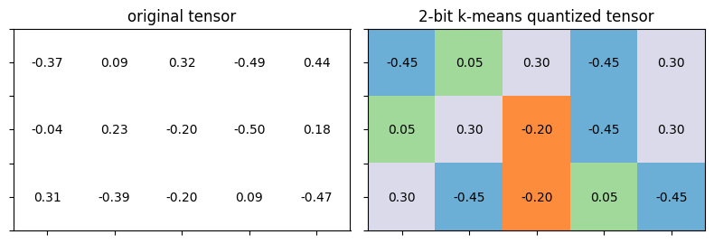
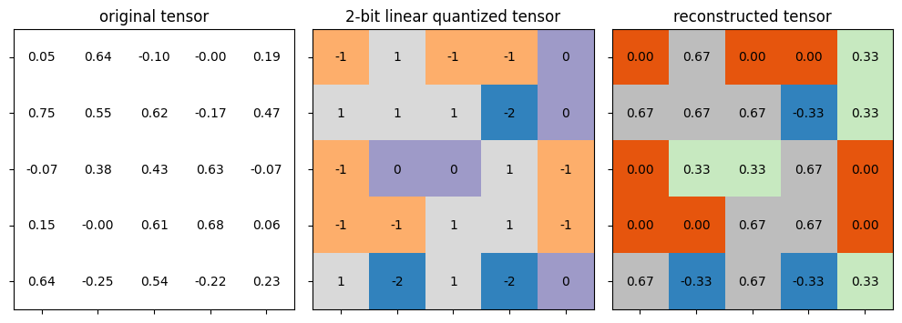
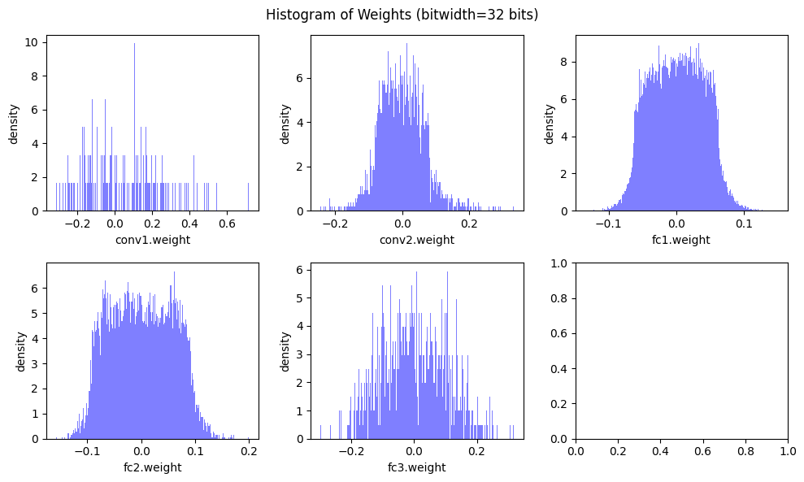
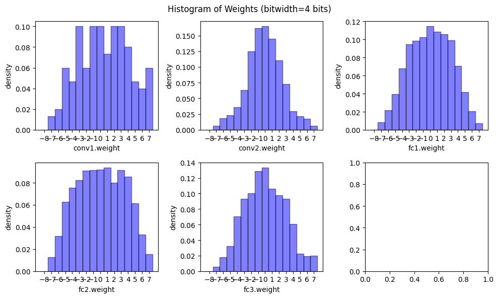
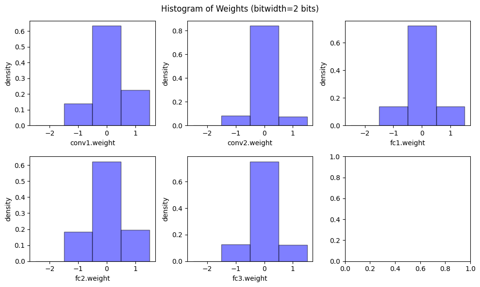
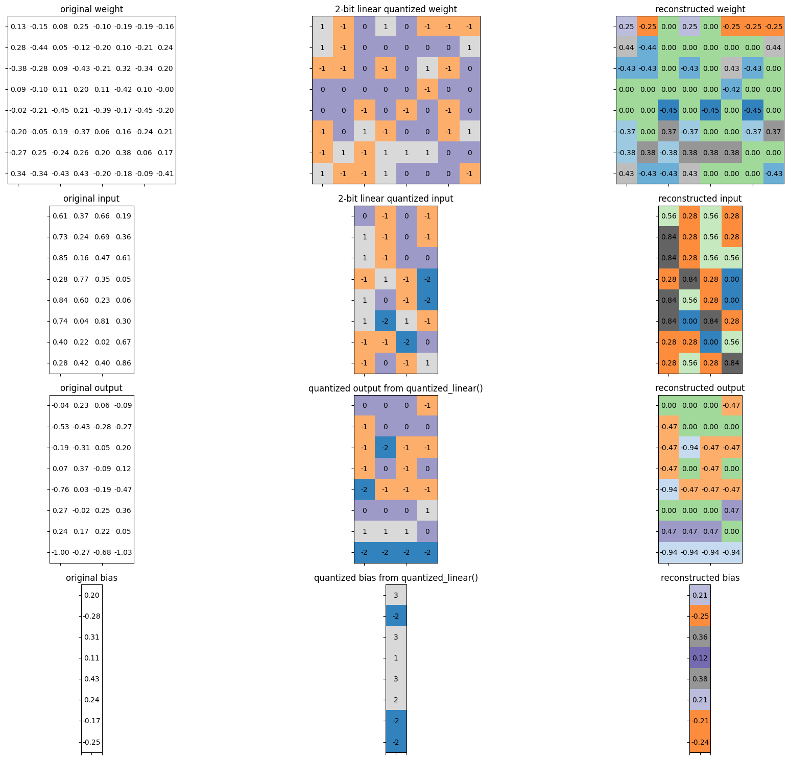
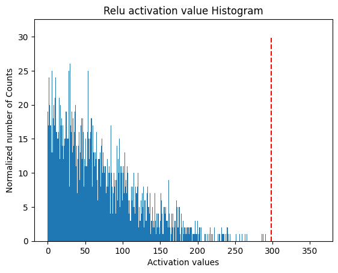

# 第4章 模型量化


&emsp;&emsp;本章我们将在 4.1 节学习什么是量化？为什么量化？4.2 节学习不同数据类型如何表示，以及 4.3 量化的基本方法，不同数据类型之间是如何进行量化转换的。当我们学习了量化的基本原理之后，将在 4.4、4.5、4.6、4.7、4.8 节进一步学习不同的量化策略来优化量化效果。最后我们通过几个量化实践来巩固学到的知识。

## 什么是量化？为什么量化？

&emsp;&emsp;上一章节我们学习了剪枝 (pruning)，剪枝操作能够减少网络的参数量，从而起到压缩模型的作用。而量化 (quantization) 是另一种能够压缩模型参数的方法。量化将神经网络的浮点算法转换为定点，修改网络中每个参数占用的比特数，从而减少模型参数占用的空间。

&emsp;&emsp;移动端的硬件资源有限，比如内存和算力。而量化可以减少模型的大小，从而减少内存和算力的占用。同时，量化可以提高模型的推理速度。下图为不同数据类型的加法和乘法操作的耗时对比。


&emsp;&emsp;模型量化有以下几个好处：
- 减小模型大小：如 int8 量化可减少 75% 的模型大小，int8 量化模型大小一般为 32 位浮点模型大小的 1/4。
- 减少存储空间：在端侧存储空间不足时更具备意义。
- 减少内存占用：更小的模型当然就意味着不需要更多的内存空间。
- 减少设备功耗：内存耗用少了推理速度快了自然减少了设备功耗。
- 加快推理速度：浮点型可以访问四次 int8 整型，整型运算比浮点型运算更快；CPU 用 int8 计算的速度更快。
- 某些硬件加速器如 DSP/NPU 只支持 int8。比如有些微处理器属于 8 位的，低功耗运行浮点运算速度慢，需要进行 8bit 量化。
  
## 数据类型（Data Type）

&emsp;&emsp;模型量化过程可以分为两部分：将模型从 fp32 转换为 int8 ;使用 int8 进行推理。整个量化过程都和数据类型的转换息息相关。我们先在这个小节了解数据类型，如果不了解基础的数据类型，在后续的量化细节内容中通常会感到困惑。
#### 整型（Integer）
&emsp;&emsp;如下图所示，整型数据可以分为无符号整型（Unsigned Integer）和有符号整型（Signed Integer）。
- 无符号整型：数据范围为 0 到 $2^{n-1}$，n 为数据位数。
- 有符号整型：
  - 原码表示(Sign-Magnitude Representation)：其实现的原理是取二进制数的最高位（左起第一位）为符号位，约定符号位为0时表示正数，符号位为1时表示负数，其余二进制位则用于待表示数值的绝对值。数据范围为 $-2^{n-1}-1$ 到 $2^{n-1}-1$，n 为数据位数。
  - 补码表示（Two's Complement Representation）：为了弥补原码表示，有 +0 和 -0 两种表示的缺点，最高位除了具有符号表示的功能，也具有权重值。数据范围为 $-2^{n-1}$ 到 $2^{n-1}-1$，n 为数据位数。


### 定点数（Fixed Point Number）

&emsp;&emsp;定点数的关键地方就在“定”和“点”这两个字上面，即在表示小数数据时，把小数点的位置已经约定好固定在某个位置。与之对应的是浮点数，其小数点的位置不是固定的。如下图所示，指定蓝色部分为符号位，绿色部分为整数位，橙色部分为小数位。


### 浮点数（Floating Point Number）

&emsp;&emsp;如下图所示，浮点数的每个位数表示的数值和定点数是一样的，但是计算方式不再是单纯的相加。其中fraction表示小数部分，exponent表示指数部分。fraction和exponent的位数分别决定了数据的精度和表示范围大小。例如指数的bias = 127 = $2^{7}-1$，所以指数部分表示的范围为 -127 到 128。

&emsp;&emsp;fp32浮点数的表示公式如下：


$$
fp32 = (-1)^{sign}·(1+fraction)·2^{exponent-127}
$$


&emsp;&emsp;我们考虑一下如何表示0呢？如下图所示，我们规定 exponent 为 0 时，强制 fraction 部分不再加 1，指数部分强制为 1-bias = -126 。当fraction = 0，表示 0 。这种表示方式叫非正规浮点数。公式如下：

$$
fp32 = (-1)^{sign}·(fraction)·2^{1-127}
$$


&emsp;&emsp;这两种表示方式的区别在于，当 expontent 不等于 0 时，采用正常的浮点表示方式。当 expontent = 0 时，采用非正规表示方式。
- 正常浮点可表示的最小正值为 fraction = 0，exponent = 1，结果为$2^{-126}$ 。
$$
(1+0)·2^{1-127} = 2^{-126}
$$
- 非正规浮点可表示的最小正值为 fraction = $2^{-23}$，结果为$2^{-149}$ 。
$$
2^{-23}·2^{1-127} = 2^{-149}
$$
- 非正规浮点可表示的最大值为 fraction 部分全为1 ，结果为$2^{-126}-2^{-149}$。
- 正常浮点数可表示的最大值为 fraction = $2^{-23}$，结果为$(1+1-2^{-23})·2^{127}$  。
- 正常浮点数的小数部分全为0，指数部分全为1时分别表示正无穷和负无穷。

&emsp;&emsp;我们可以扩展到其他数据类型：
- 当expontent位数为5，fraction位数为11时，为fp16。
  $$
  fp16 = (-1)^{sign}·(1+fraction)·2^{exponent-15}
  $$
- 当expontent位数为8，fraction位数为7时，为bf16。
$$
bf16 = (-1)^{sign}·(1+fraction)·2^{exponent-127}
$$
- 当expontent位数为4，fraction位数为3时，为fp8(E4M3)。
  $$
  fp8 = (-1)^{sign}·(1+fraction)·2^{exponent-7}
  $$
- 当expontent位数为5，fraction位数为2时，为fp8(E5M2)。
  $$
  fp8 = (-1)^{sign}·(1+fraction)·2^{exponent-15}
  $$

> 与 fp16 相比，bf16 扩大了可表示范围，从而降低了下溢和上溢风险。尽管由于有效位数较少而导致精度降低，但 bf16 通常不会显着影响模型性能。

&emsp;&emsp;我们需要注意的是，expontent 决定了表示范围，fraction决定了精度范围。fp8的两种表示方式fp8(E4M3)精度更高，fp8(E5M2)表示范围更大。


> **定点数和浮点数的比较:** 在计算机上用相同位数表示数据时，浮点数可以表示的数据范围比定点数大得多。在计算机上用相同位数表示数据时，浮点数的相对精度高于定点数。浮点数在计算时需要同时计算指数和尾数，并且需要对结果进行归一化。因此，浮点运算比定点运算涉及更多步骤，导致计算速度较慢。


## 量化基本方法

&emsp;&emsp;根据存储和计算时使用的数据类型不同，主要介绍以下两种量化方法：
- 基于 k-means 的量化（K-means-based Quantization）：存储方式为整型权重 + 浮点型的转换表），计算方式为浮点计算。
- 线性量化（Linear Quantization）：存储方式为整型权重存储，计算方式为整型计算。
 


### k-means 量化

&emsp;&emsp;如下图所示，k-means 量化将weights聚类。每个权重的位置只需要存储聚类的索引值。将权重聚类成4类(0,1,2,3)，就可以实现2-bit的压缩。
存储占用从 `32bit x 16 = 512 bit = 64 B => 2bit x 16 + 32 bit x 4 = 32 bit + 128 bit = 160 bit = 20 B`

&emsp;&emsp;当weight更大时，压缩比例将会更大。


- 推理时，我们读取转换表，根据索引值获取对应的值。
- 训练时，我们将gradient按照weights的聚类方式进行聚类相加，反向传播到转换表，更新转换表的值。

&emsp;&emsp;以下是将上一节的剪枝和k-means 量化结合起来的压缩流程。首先，剪枝将模型中的参数进行剪枝，循环进行微调和剪枝，得到最优的剪枝模型。然后，k-means 量化将剪枝后的参数进行聚类，将聚类的索引值存储在模型中，并构建相应的索引表，并使用哈夫曼编码进一步压缩。


### 线性量化
#### 定义

&emsp;&emsp;线性量化是将原始浮点数据和量化后的定点数据之间建立一个简单的线性变换关系，因为卷积、全连接等网络层本身只是简单的线性计算，因此线性量化中可以直接用量化后的数据进行直接计算。

&emsp;&emsp;我们用 $r$ 表示浮点实数，$q$ 表示量化后的定点整数。浮点和整型之间的换算公式为：

$$
r = S(q - Z)
$$ 

$$
q = round(r / S + Z)
$$ 
其中，$S$ 是量化放缩的尺度，表示实数和整数之间的比例关系，$Z$ 是偏移量，表示浮点数中的 0 经过量化后对应的数（量化偏移），根据偏移量$Z$是否为0，可以将浮点数的线性量化分为对称量化（$Z$=0）和非对称量化（$Z$≠0）。大多数情况下量化是选用无符号整数，比如INT8的值域为[0,255],这种情况下需要要用非对称量化。$S$和$Z$的计算方法为：
$$
S =  \frac{r_{max} - r_{min}}{q_{max} - q_{min}}
$$ 
$$
Z = round(q_{max}-\frac{r_{max}}{S})
$$ 

&emsp;&emsp;其中，$r_{min}$ 和 $r_{max}$分别表示浮点数中的最小值和最大值,$q_{min}$ 和 $q_{max}$分别表示定点数中的最小值和最大值。


下面举一个例子来详细说明：

如下图所示，给定一个矩阵，可以通过上面的公式计算出Z和S。


可进一步利用上面的公式计算出量化后的矩阵。


> 上述方法又经常被称为零点量化(Zero-Point Quantization)。

&emsp;&emsp;此外，还有一种比较常见的线性量化方法:绝对最大（ absmax ）量化。


&emsp;&emsp;我们用 $X$ 表示原始张量，$X_{quant}$ 表示量化后的张量。两者之间的换算公式为：


$$
X_{quant}=round(S \cdot X)
$$ 


其中，$S$ 是量化放缩的尺度，表示实数和整数之间的比例关系。$S$的计算方式为：
$$
S = \frac{2^{n-1}-1}{\max |X|}
$$ 
其中，$n$表示要量化的字节数，$\max |\cdot|$表示张量中的绝对值最大值。

&emsp;&emsp;反量化$X_{dequant}$ 公式表示为：
$$
X_{dequant} = round(X_{quant} / S )
$$ 

#### 线性矩阵乘量化

&emsp;&emsp;线性矩阵乘量化是将线性量化应用于矩阵乘法。

&emsp;&emsp;矩阵乘法可以用下式表示：

$$
Y = WX
$$

&emsp;&emsp;假设 $S_Y$ 和 $Z_Y$ 是矩阵输出 Y 对应的 scale 和 zero point，$S_W$、$Z_W$、$S_X$、$Z_X$ 同理，那么由上式可以推出：

$$
S_Y(q_Y-Z_Y) = S_W(q_W-Z_W)·S_X(q_S-Z_X)
$$

&emsp;&emsp;整理一下可以得到：
$$
q_Y = \frac{S_WS_X}{S_Y}(q_Wq_X-Z_Wq_X-Z_Xq_W+Z_WZ_X) + Z_Y
$$

&emsp;&emsp;其中，$\frac{S_WS_X}{S_Y}$表示为$2^{-n}M_0$ 转化成为定点计算，便可以通过移位得到近似的缩放因子。所谓定点，指的是小数点的位置是固定的，即小数位数是固定的。$Z_Xq_W$ 和 $Z_WZ_X$ 以及 $Z_Y$ 我们可以提前计算出来。

&emsp;&emsp;我们能否让 $Z_W$ 的值为 0 呢？当 $Z_W$ 的值为 0 时，我们只需要将 $q_W$ 和 $q_X$ 存储起来，然后根据公式计算出 $q_Y$，最后将 $q_Y$ 存储起来。

&emsp;&emsp;当$Z_W$的值为0时，对应的量化方式为线性对称量化(symmetric quantization)。


&emsp;&emsp;计算公式变换如下：
$$
S =\frac{｜r｜_{max}}{2^{N-1}}
$$ 
$$
Z = 0
$$ 

&emsp;&emsp;其中，$N$ 表示定点数的小数位数。

&emsp;&emsp;矩阵乘法的公式变为如下：
$$
q_Y = \frac{S_WS_X}{S_Y}(q_Wq_X-Z_Xq_W) + Z_Y
$$


#### 全连接层线性量化

&emsp;&emsp;全连接层线性量化与矩阵乘法相比多了一个bias，因此需要对bias进行线性量化。

&emsp;&emsp;对称量化的全连接层的线性量化公式为：
$$
{S_Y}(q_Y-Z_Y) = {S_WS_X}(q_Wq_X-Z_Xq_W) + S_b(q_b-Z_b)
$$

&emsp;&emsp;其中，$S_b$ 表示bias的缩放因子。

&emsp;&emsp;我们强制$Z_b=0$ , $S_b=S_WS_X$, 则全连接层的线性量化公式变为：
$$
{S_Y}(q_Y-Z_Y) = {S_WS_X}(q_Wq_X-Z_Xq_W+q_b)
$$ 
$$
q_Y = \frac{S_WS_X}{S_Y}(q_Wq_X-Z_Xq_W+q_b) + Z_Y
$$

&emsp;&emsp;其中，$-Z_Xq_W+q_b$ 可以提前计算出来。

#### 卷积层线性量化


&emsp;&emsp;卷积层线性量化与全连接层线性量化相比多了一个卷积核，因此可以推导出卷积的线性量化公式：
$$
q_Y = \frac{S_WS_X}{S_Y}(Conv(q_W,q_X)-Conv(Z_X,q_W)+q_b) + Z_Y
$$ 

&emsp;&emsp;下图所示为模型量化后的推理过程，量化的activations和量化的weight进行卷积，然后加上bias。与scale_factor相乘，再加上ouput的zero_point，就可得到最后的量化结果。


## 训练后量化 （Post-Training Quantization）

&emsp;&emsp;训练后量化（Post-Training Quantization, PTQ）是指在训练完成后，对模型进行量化，因此也叫做离线量化。根据量化零点是否为 0，训练后量化分为对称量化和非对称量化，这部分内容已在上述章节进行介绍；根据量化粒度区分，训练后量化又分为逐张量量化和逐通道量化以及组量化。

&emsp;&emsp;量化会带来精度损失，那么如何选取量化时所用参数（如scaling factor，zero point）可以尽可能地减少对准确率的影响呢？这也是我们需要关注的地方。量化误差来自两方面，一个是clip操作，一个是round操作。因此，我们还要介绍动态量化参数的计算方式，以及 round 这个操作带来的影响。

### 量化粒度

&emsp;&emsp;量化通常会导致模型精度下降。这就是量化粒度发挥作用的地方。选择正确的粒度有助于最大化量化，而不会大幅降低准确性性能。

&emsp;&emsp;逐张量量化（Per-Tensor Quantization）是指对每一层进行量化。在逐张量量化中，相同的量化参数应用于张量内的所有元素。在张量之间应用相同的参数会导致精度下降，因为张量内参数值的范围可能会有所不同。如下图的红框所示，3个channel共享一个量化参数。但是我们可以看到不同channel的数据范围是不同的。因此当 Layer-wise 量化效果不好时，需要对每个channel进行量化。


&emsp;&emsp;逐通道量化（Channel-wise Quantization就是将数据按照通道维度进行拆分，分别对每一通道的数据进行量化。相较于逐张量量化，逐通道量化可以减少量化误差，但需要更多的存储空间。逐通道量化可以更准确地捕获不同通道中的变化。这通常有助于 CNN 模型，因为不同通道的权重范围不同。由于现阶段模型越来越大，每个通道的参数也原来越多，参数的数值范围也越来越大，因此我们需要更细粒度的量化方式。

&emsp;&emsp;逐张量量化与逐通道量化的对比结果如下图所示。从图中可以看出：使用逐通道量化的误差更小，但付出的代价是必须存储更多信息(多个r和S) 。


&emsp;&emsp;组量化（Group Quantization）是指对通道内的数据拆分成多组向量，每组向量共享一个量化参数。VS-Quant 对张量的单个维度内的每个元素向量应用比例因子。它将通道维度细分为一组向量。

$$
r=S(q-Z) \rightarrow r=\gamma \cdot S_q(q-Z)
$$
其中，$\gamma$是浮点数的粗粒度缩放因子,$S_q$是每个向量的整数缩放因子。这种方法通过结合不同粒度的缩放因子，实现了精度和硬件效率的平衡：
- 较小粒度时，使用较简单的整数缩放因子；
- 较大粒度时，使用较复杂的浮点缩放因子。

&emsp;&emsp;存储开销：对于两级缩放因子，假设使用4-bit的量化，每16个元素有一个4-bit的向量缩放因子，那么有效位宽为 `4+4/16=4.25`bits。


&emsp;&emsp;为了提高能源效率，引入了两级缩放方案MX (Microscaling)。微缩放 (MX) 规范是从著名的 Microsoft 浮点 (MSFP) 数据类型升级而来的。该算法首先以每个向量的粒度计算浮点比例因子。然后，它通过将每向量比例因子分成整数逐向量分量和浮点逐通道分量来量化它们。MX 系列（如 MX4、MX6、MX9）表示了不同量化方案，它们的主要区别在于数据类型、缩放因子的设计以及组大小，目的在于通过压缩模型权重数据，优化神经网络的性能。

&emsp;&emsp;下图是不同的多级缩放方案对比结果。`有效位宽 = (L0 数据位宽 + L0 量化尺度位宽 / L0 组大小 + L1 量化尺度位宽 / L1 组大小)`。L0缩放因子通常采用较低的精度，用定点数表示，L1缩放因子则采用浮点数的表示方式。以MX6为例：L0数据类型是S1M4，表示1位符号位+4位尾数，共5位，用于表示数值。L0 量化尺度数据类型为E1M0，表示1位指数位，因此占1位。L0组大小是 2，这意味着L0量化尺度是针对每2个元素进行分组。L1 量化尺度数据类型为E8M0，表示8位指数位，因此占8 位。L1 组大小是 16，意味着 L1 量化尺度是针对每 16 个元素进行分组。所以可得到：`有效位宽 = 5 + 1/2 + 8/16 = 6` bits。


### 动态量化参数的计算 ( Cliping )
##### 指数移动平均（EMA）

&emsp;&emsp;指数移动平均（Exponential Moving Average, EMA）是一种常用的统计方法，用于计算数据的指数移动平均值。

&emsp;&emsp;EMA 收集了训练过程中激活函数的取值范围 $r_{min}$ 和 $r_{max}$，然后在每个 epoch 对这些取值范围进行平滑处理。

&emsp;&emsp;EMA的计算公式如下：
$$
r^{t+1}_{min,max} = \alpha r^{t}_{min,max} + (1-\alpha) r^{t+1}_{min,max}
$$

其中，$r^{t}_{min,max}$ 表示第 $t$ 步的取值范围，$\alpha$ 表示平滑系数。


##### Min-Max 
&emsp;&emsp;Min-Max 是一种常用的校准方法，通过在训练好的 fp32 模型上跑少量的校准数据。统计校准数据的 $r_{min,max}$ 并取平均值作为量化参数。

##### KL 量化

&emsp;&emsp;KL 量化是用 KL 散度来衡量数据和量化后的数据之间的相似性；这种方法不是直接将$ [min, max] $v映射到 $[-127,128]$，而是去寻找一个阈值 $|T| < max(|max|, |min|)$ ，将 $ [-T, T]$ 映射到 $[-127, 128]$ 。并假设只要阈值选取得当，使得两个数据之间的分布相似，就不会对精度损失造成影响。

$$
D_{KL}(P||Q) = \sum_{i=1}^nP(x_i)\log\frac{P(x_i)}{Q(x_i)}
$$

##### 均方误差（MSE）

&emsp;&emsp;均方误差量化是指通过最小化输入数据 $X$ 和量化后的数据 $Q(X)$ 之间的均方误差，计算得到最合适的量化参数。

$$
min_{|r|_{max}}E|(X-Q(X))^2|
$$ 

&emsp;&emsp;通过动态调整 $｜r｜_{max}$ 来最小化均方误差。

### 近似（Rounding）

&emsp;&emsp;Rounding 是指将浮点数进行舍入操作，将浮点数映射到整数。最常用的 Rounding 方法是最近整数（Rounding-to-nearest）。权重是互相关联的，对每个权重的最好舍入不一定是对整个张量的最好舍入。如下图所示，如果我们考虑整体的数据分布，将权重 0.5 舍入为 1 不是一个好的选择。


&emsp;&emsp;我们最终想要的量化效果是输出数据的损失尽可能小，因此我们可以通过评判 rounding 对输出的影响来决定权重的舍入方式，也就是 AdaRound。简化的计算公式如下所示：

$$
argmin||(Wx-\widehat{W}x)||
$$
其中，$\widehat{W} = \lfloor\lfloor{W}\rfloor+\sigma\rceil$ , $\sigma \in [0,1]$，表示当前值是向上取整还是向下取整。


## 量化感知训练（Quantization-Aware Training）


&emsp;&emsp;量化感知训练（Quantization-Aware Training, QAT）是指在训练过程中，对模型添加模拟量化算子，模拟量化模型在推理阶段的舍入和裁剪操作，引入量化误差。并通过反向传播更新模型参数，使得模型在量化后和量化前保持一致。

### 前向传播

&emsp;&emsp;如下图所示，量化训练的前向传播过程如下：

- $Layer_{N-1}$ 的输出 $Q(X)$ 作为输入传入到下一层 $Layer_{N}$，其中 $Q(X)$ 表示量化反量化后的数据；

- $Layer_{N}$ 的权重 $W$ 经过量化反量化之后 $Q(W)$ 成为新的权重与 $Q(X)$ 计算得到输出 $Y$ 。

- $Y$ 量化反量化之后得到Q(Y) 输入到下一层 $Layer_{N+1}$。


&emsp;&emsp;因为int8的表示范围远小于fp32，当fp32 量化成 int8 时，不同大小的数据会映射到int8的相同数值，再反量化回 fp32 时就会产生误差。量化反量化操作就是为了将量化误差引入到模型的训练中。

&emsp;&emsp;我们要注意的是，整个量化过程中算子的计算都是在高精度下完成的。

### 反向传播

&emsp;&emsp;量化感知训练的损失函数与普通训练的损失函数类似，但是量化后的权重是离散值。如图所示为 $W$ 和 $Q(W)$ 的关系。


&emsp;&emsp;可以得到以下式子：
$$
\frac{\partial Q(\mathbf{W})}{\partial \mathbf{W}}=0
$$ 

&emsp;&emsp;求导公式可以做如下转换：

$$
g_{\mathbf{W}}=\frac{\partial L}{\partial \mathbf{W}}=\frac{\partial L}{\partial Q(\mathbf{W})} \cdot \frac{\partial Q(\mathbf{W})}{\partial \mathbf{W}}=0
$$

&emsp;&emsp;如果按照上述式子进行梯度计算，这样的话梯度就永远为 0，无法进行梯度更新。因此人们提出了一个修正的方式，被称为直通估计器(Straight-Through Estimator，STE)。将 $W$ 和 $Q(W)$ 的关系假设为上图中的红色虚线。

$$
W=Q(W), \quad \frac{\partial Q(W)}{\partial W}=1
$$

梯度公式可以转换为如下式子，梯度公式可以转换为如下式子：

$$
g_{\mathbf{W}}=\frac{\partial L}{\partial \mathbf{W}}=\frac{\partial L}{\partial Q(\mathbf{W})}
$$

&emsp;&emsp;这样，我们就可以进行反向传播计算。

## 混合精度量化

&emsp;&emsp;混合精度量化指同时使用低精度和高精度数据类型来减少模型的大小和计算成本的一种方法。通过针对性地对不同 layer 选择不同的量化精度，可以有效地避免量化误差的传播和积累，从而保证模型的性能不受影响。

## 其他量化方法

### INT4 和 FP4

&emsp;&emsp;INT4 和 FP4 是一种特殊的定点数和浮点数，目前的模型越来越大，所以我们需要更低bits的表示方法。

&emsp;&emsp;INT4 表示的范围为 -8 到 7；FP4 表示的范围根据不同的指数位和小数位而有所不同。具体表示范围如下图所示。


### 二值和三值量化

##### 二值量化 (Binarization)
&emsp;&emsp;在二值量化中，模型的权重或激活值被限制为两个离散值，通常是 -1 和 1 。这样可以大幅减少模型的存储需求，因为每个参数只需要一位 bit 来表示。二值神经网络的计算也可以大幅加速，因为二值运算比浮点运算要简单得多。

&emsp;&emsp;二值化（Binarization）的具体实现有两种方法：**确定性二值化（Deterministic Binarization）** 和 **随机二值化（Stochastic Binarization）**。

1） **确定性二值化（Deterministic Binarization）**：
- 直接根据一个阈值（通常是0）计算位值，结果为符号函数：
  $$
  q = \text{sign}(r) = 
  \begin{cases} 
  +1, & r \geq 0 \\
  -1, & r < 0 
  \end{cases}
  $$
- 即，如果输入大于等于0，则输出1；否则输出-1。

2） **随机二值化（Stochastic Binarization）**：
 - 使用全局统计或输入数据的值来确定输出为 -1 或 +1 的概率。例如，在 Binary Connect (BC) 方法中，概率由 sigmoid 函数 $\sigma(r)$ 确定：
   $$
   q = 
   \begin{cases} 
   +1, & \text{with probability } p = \sigma(r) \\
   -1, & \text{with probability } 1 - p 
   \end{cases}
   $$
   其中，$\sigma(r) = \min(\max(\frac{r+1}{2}, 0), 1)$。
 - 这种方法的实现较为困难，因为量化时需要硬件生成随机比特。


&emsp;&emsp;上图展示了在二值化中最小化量化误差的方法。

&emsp;&emsp;为了更好地逼近原始权重，二值权重 $W^{\mathbb{B}}$ 乘以一个缩放因子 $\alpha$
：
   $$
   \alpha = \frac{1}{n} \| W \|_1
   $$
&emsp;&emsp;计算后得到缩放后的二值权重 $\alpha W^{\mathbb{B}}$，其中 $n$ 为矩阵中元素的个数。

&emsp;&emsp;通过引入缩放因子，误差从9.28减少到9.24，显示出缩放对减小误差的效果。

##### 三值量化 (Ternary Quantization)

&emsp;&emsp;在三值量化中，模型的权重或激活值被限制为三个离散值，通常是 -1 、 0 和 1 。相比二值量化，三值量化允许模型拥有一个额外的零值，这可以压缩模型参数的同时保留模型的精度。

&emsp;&emsp;三值量化的具体规则如下：
$$
q = \begin{cases} 
r_t, & r > \Delta \\
0, & |r| \leq \Delta \\
-r_t, & r < -\Delta 
\end{cases}
$$
其中， $\Delta=0.7 \times \mathbb{E}(|r|), \quad r_t=\mathbb{E}_{|r|>\Delta}(|r|)$。


&emsp;&emsp;如上图所示为三值量化的具体示例，展示了一个权重矩阵 $ W $ 如何被量化为三值权重矩阵。
   - 量化的阈值 $ \Delta $ 被计算为：  
     $$
     \Delta = 0.7 \times \frac{1}{16} \|W\|_1 = 0.73
     $$
     其中， $ \|W\|_1 $ 是原始权重矩阵 $ W $ 的 L1 范数，即所有元素绝对值的平均值。

   - 确定非零权重的值 $r_t$：
     $$
     r_t = \frac{1}{11} \|W_{W^T \neq 0}\|_1 = 1.5
     $$
     其中，$\|W_{W^T \neq 0}\|_1$ 是非零权重的 L1 范数。

&emsp;&emsp;二值量化和三值量化可以显著减小模型的尺寸和加速推理速度，但通常也会导致模型精度的下降。因此，这些方法常用于对精度要求不太高的应用场景或需要在低计算资源环境下运行的场景中。

## 模型量化对象

&emsp;&emsp;模型量化对象主要包括以下几个方面：
- 权重（Weights）：量化权重是最常见和流行的方法，它可以减少模型大小、内存使用和空间占用。
- 激活（Activations）：在实践中，激活通常占内存使用的大部分。因此，量化激活不仅可以大大减少内存使用，而且与权重量化结合时，可以充分利用整数计算来实现性能提升。
- KV缓存（KV cache）：量化KV缓存对于提高长序列生成的吞吐量至关重要。
- 梯度（Gradients）：与上面相比，梯度稍微不常见，因为它们主要用于训练。训练深度学习模型时，梯度通常是浮点数。它们主要用于减少分布式计算中的通信开销，也可以减少后向传递过程中的成本。


## 实践

本节我们将通过线性量化、KL量化、量化感知训练等方面进行实践，以加深读者对前面所学知识的理解。

### K-means量化实践

聚类量化是利用K-means方法得到权重的聚类中心和标签。同时根据聚类中心和标签又可以回推到weight，当然过程中有损失。本节完整代码见[k-means量化实践](https://github.com/datawhalechina/awesome-compression/blob/main/docs/notebook/ch04/1.kmeans_quantzations.ipynb)。


首先，我们安装必需的环境，数据集和model使用和前几章相同的minist数据集和LeNet网络。
- 模型权重：https://github.com/datawhalechina/awesome-compression/blob/main/docs/notebook/ch02/model.pt
- 数据集：https://github.com/datawhalechina/awesome-compression/tree/main/docs/notebook/ch02/data/mnist/MNIST/raw

首先加载用到的python库。

```python
import copy
import math
import random
from collections import OrderedDict, defaultdict

from matplotlib import pyplot as plt
from matplotlib.colors import ListedColormap
import numpy as np
from tqdm.auto import tqdm

import torch
from torch import nn
from torch.optim import *
from torch.optim.lr_scheduler import *
from torch.utils.data import DataLoader
from torchprofile import profile_macs
from torchvision.datasets import *
from torchvision.transforms import *
import torch.nn.functional as F
from torchvision import datasets


random.seed(0)
np.random.seed(0)
torch.manual_seed(0)
```

创建模型并加载数据集。

```python
# 定义一个LeNet网络
class LeNet(nn.Module):
    def __init__(self, num_classes=10):
        super(LeNet, self).__init__()
        self.conv1 = nn.Conv2d(in_channels=1, out_channels=6, kernel_size=5)
        self.conv2 = nn.Conv2d(in_channels=6, out_channels=16, kernel_size=5)
        self.maxpool = nn.MaxPool2d(kernel_size=2, stride=2)
        self.fc1 = nn.Linear(in_features=16 * 4 * 4, out_features=120)
        self.fc2 = nn.Linear(in_features=120, out_features=84)
        self.fc3 = nn.Linear(in_features=84, out_features=num_classes)

    def forward(self, x):
        x = self.maxpool(F.relu(self.conv1(x)))
        x = self.maxpool(F.relu(self.conv2(x)))

        x = x.view(x.size()[0], -1)
        x = F.relu(self.fc1(x))
        x = F.relu(self.fc2(x))
        x = self.fc3(x)

        return x
# device = torch.device("cuda" if torch.cuda.is_available() else "cpu")
device = torch.device("cpu") # 默认使用CPU
model = LeNet().to(device=device)

# 设置归一化
transform = transforms.Compose([transforms.ToTensor(), transforms.Normalize((0.1307,), (0.3081,))])

# 获取数据集
train_dataset = datasets.MNIST(root='../ch02/data/mnist', train=True, download=True, transform=transform)  
test_dataset = datasets.MNIST(root='../ch02/data/mnist', train=False, download=True, transform=transform)  # train=True训练集，=False测试集

# 设置DataLoader
batch_size = 64
train_loader = DataLoader(train_dataset, batch_size=batch_size, shuffle=True)
test_loader = DataLoader(test_dataset, batch_size=batch_size, shuffle=False)

# 加载模型的状态字典
checkpoint = torch.load('../ch02/model.pt')
# 加载状态字典到模型
model.load_state_dict(checkpoint)
fp32_model = copy.deepcopy(model)

def train(
  model: nn.Module,
  dataloader: DataLoader,
  criterion: nn.Module,
  optimizer: Optimizer,
  scheduler: LambdaLR,
  callbacks = None
) -> None:
  model.train()

  for inputs, targets in tqdm(dataloader, desc='train', leave=False):
    # Move the data from CPU to GPU
    # inputs = inputs.to('mps')
    # targets = targets.to('mps')

    # Reset the gradients (from the last iteration)
    optimizer.zero_grad()

    # Forward inference
    outputs = model(inputs)
    loss = criterion(outputs, targets)

    # Backward propagation
    loss.backward()

    # Update optimizer and LR scheduler
    optimizer.step()
    scheduler.step()

    if callbacks is not None:
        for callback in callbacks:
            callback()

@torch.inference_mode()
def evaluate(
  model: nn.Module,
  dataloader: DataLoader,
  extra_preprocess = None
) -> float:
  model.eval()

  num_samples = 0
  num_correct = 0

  for inputs, targets in tqdm(dataloader, desc="eval", leave=False):
    # Move the data from CPU to GPU
    # inputs = inputs.to('mps')
    if extra_preprocess is not None:
        for preprocess in extra_preprocess:
            inputs = preprocess(inputs)

    # targets = targets.to('mps')

    # Inference
    outputs = model(inputs)

    # Convert logits to class indices
    outputs = outputs.argmax(dim=1)

    # Update metrics
    num_samples += targets.size(0)
    num_correct += (outputs == targets).sum()

  return (num_correct / num_samples * 100).item()
```

创建两个函数：计算 Flops 和 Model Size

- 参数量（ params ）：
    参数的数量，通常以M为单位。
    params = Kh × Kw × Cin × Cout
- 模型大小(模型大小)：
    在一般的深度学习的框架中（如 PyTorch ），一般是 32 位存储，即一个参数用 32 个 bit 来存储。所以，一个拥有 1M（这里的M是数量单位一百万）参数量的模型所需要的存储空间大小为：1M * 32bit = 32Mb = 4MB。
- 计算量( Flops )：
    即浮点运算数，用来衡量算法/模型的复杂度。图通常只考虑乘加操作的数量，而且只考虑Conv和FC等参数层计算量，忽略BN和PReLU等。一般情况下，Conv和FC层也会忽略仅纯加操作的计算量，如偏置加和shortcut残差加等。目前技术只有BN和CNN可以不加偏置。
    FLOPs = Kh * Kw * Cin * Cout * H * W


```python
def get_model_flops(model, inputs):
    num_macs = profile_macs(model, inputs)
    return num_macs

def get_model_size(model: nn.Module, data_width=32):
    """
    calculate the model size in bits
    :param data_width: #bits per element
    """
    num_elements = 0
    for param in model.parameters():
        num_elements += param.numel()
    return num_elements * data_width

Byte = 8
KiB = 1024 * Byte
MiB = 1024 * KiB
GiB = 1024 * MiB
```

验证 FP32 模型的精度以及模型大小


```python
fp32_model_accuracy = evaluate(fp32_model, test_loader)
fp32_model_size = get_model_size(fp32_model)
print(f"fp32 model has accuracy={fp32_model_accuracy:.2f}%")
print(f"fp32 model has size={fp32_model_size/MiB:.2f} MiB")
```

输出结果如下：
```
    fp32 model has accuracy=97.99%
    fp32 model has size=0.17 MiB
```

接下来构建 K-means 量化函数。

$n$比特的k-means量化将把数据划分为$2^n$个聚类，而相同聚类中的数据将共享相同的权重值。

k-means量化将创建一个 codebook ，其中包括：

- centroids：$2^n$ 个FP32聚类中心。
- labels：一个$n$比特的整数张量，与原始的FP32权重张量具有相同的元素数量。每个整数表示它属于哪个聚类。

在推理期间，基于 codebook 生成一个 FP32 张量进行推理：

```python
from fast_pytorch_kmeans import KMeans
from collections import namedtuple
import pdb
Codebook = namedtuple('Codebook', ['centroids', 'labels'])
def k_means_quantize(fp32_tensor: torch.Tensor, bitwidth=4, codebook=None):
    """
    quantize tensor using k-means clustering
    :param fp32_tensor:
    :param bitwidth: [int] quantization bit width, default=4
    :param codebook: [Codebook] (the cluster centroids, the cluster label tensor)
    :return:
        [Codebook = (centroids, labels)]
            centroids: [torch.(cuda.)FloatTensor] the cluster centroids
            labels: [torch.(cuda.)LongTensor] cluster label tensor
    """
    if codebook is None:
        # 首先计算聚类的中心点个数
        # get number of clusters based on the quantization precision
        n_clusters = 2**bitwidth
        # print(n_clusters)
        # 用kmeans算法得到聚类的中心
        # use k-means to get the quantization centroids
        kmeans = KMeans(n_clusters=n_clusters, mode='euclidean', verbose=0)
        labels = kmeans.fit_predict(fp32_tensor.view(-1, 1)).to(torch.long)
        centroids = kmeans.centroids.to(torch.float).view(-1)
        codebook = Codebook(centroids, labels)
    
    # decode the codebook into k-means quantized tensor for inference
    # 解码codebook，得到k-means量化后的tensor
    quantized_tensor = codebook.centroids[codebook.labels]
    
    fp32_tensor.set_(quantized_tensor.view_as(fp32_tensor))
    return codebook

def plot_matrix(tensor, ax, title, cmap=ListedColormap(['white'])):
    ax.imshow(tensor.cpu().numpy(), vmin=-0.5, vmax=0.5, cmap=cmap)
    ax.set_title(title)
    ax.set_yticklabels([])
    ax.set_xticklabels([])
    for i in range(0,tensor.shape[0]):
        for j in range(0,tensor.shape[1]):
            
            text = ax.text(j, i, f'{tensor[i, j].item():.2f}',ha="center", va="center", color="k") 
 
if __name__ == "__main__":
    bitwidth = 2
    test_tensor = torch.tensor([
        [-0.3747,  0.0874,  0.3200, -0.4868,  0.4404],
        [-0.0402,  0.2322, -0.2024, -0.4986,  0.1814],
        [ 0.3102, -0.3942, -0.2030,  0.0883, -0.4741]])
    
    fig, axes = plt.subplots(1,2, figsize=(8, 12))
    ax_left, ax_right = axes.ravel()
    
    plot_matrix(test_tensor, ax_left, 'original tensor')
    
    num_unique_values_before_quantization = test_tensor.unique().numel()

    codebook_test = k_means_quantize(fp32_tensor=test_tensor, bitwidth=bitwidth)
    # pdb.set_trace()
    num_unique_values_after_quantization = test_tensor.unique().numel()
    
    print(f'    target bitwidth: {bitwidth} bits')
    print(f'        num unique values before k-means quantization: {num_unique_values_before_quantization}')
    print(f'        num unique values after  k-means quantization: {num_unique_values_after_quantization}')
    assert num_unique_values_after_quantization == min((1 << bitwidth), num_unique_values_before_quantization)
    
    plot_matrix(test_tensor, ax_right, f'{bitwidth}-bit k-means quantized tensor', \
                    cmap='tab20c')
    fig.tight_layout()
    plt.show()
```
输出结果如下：
```
        target bitwidth: 2 bits
            num unique values before k-means quantization: 15
            num unique values after  k-means quantization: 4
```
    


在下边代码中构建的类`KMeansQuantizer`中，我们必须记录`centroids`和`labels`，以便在模型权重改变时应用或更新 `codebooks`。

```python
from torch.nn import parameter
class KMeansQuantizer:
    def __init__(self, model : nn.Module, bitwidth=4):
        self.codebook = self.quantize(model, bitwidth)

    @torch.no_grad()
    def apply(self, model, update_centroids):
        for name, param in model.named_parameters():
            if name in self.codebook:
                if update_centroids:
                    self.update_codebook(param, codebook=self.codebook[name])
                self.codebook[name] = k_means_quantize(
                    param, codebook=self.codebook[name])
                
    def update_codebook(self,fp32_tensor: torch.Tensor, codebook: Codebook):
        """
        update the centroids in the codebook using updated fp32_tensor
        :param fp32_tensor: [torch.(cuda.)Tensor]
        :param codebook: [Codebook] (the cluster centroids, the cluster label tensor)
        """
        n_clusters = codebook.centroids.numel()
        fp32_tensor = fp32_tensor.view(-1)
        for k in range(n_clusters):
            cluster_points = fp32_tensor[codebook.labels == k]
            if cluster_points.numel() > 0:
                codebook.centroids[k] = cluster_points.mean()
                
    @staticmethod
    @torch.no_grad()
    def quantize(model: nn.Module, bitwidth=4):
        codebook = dict()
        if isinstance(bitwidth, dict):
            for name, param in model.named_parameters():
                if name in bitwidth:
                    codebook[name] = k_means_quantize(param, bitwidth=bitwidth[name])
        else:
            for name, param in model.named_parameters():
                if param.dim() > 1:
                    codebook[name] = k_means_quantize(param, bitwidth=bitwidth)
        return codebook

```

接下来我们看一下不同的bitwidth下，模型量化后的精度和大小。


```python
print('Note that the storage for codebooks is ignored when calculating the model size.')
quantizers = dict()
for bitwidth in [8, 4, 2]:
    print(f'k-means quantizing model into {bitwidth} bits')
    quantizer = KMeansQuantizer(model, bitwidth)
    quantized_model_size = get_model_size(model, bitwidth)
    print(f"    {bitwidth}-bit k-means quantized model has size={quantized_model_size/MiB:.2f} MiB")
    quantized_model_accuracy = evaluate(model, test_loader)
    print(f"    {bitwidth}-bit k-means quantized model has accuracy={quantized_model_accuracy:.2f}%")
    quantizers[bitwidth] = quantizer
```
输出结果如下：
```
    k-means quantizing model into 8 bits
        8-bit k-means quantized model has size=0.04 MiB
        8-bit k-means quantized model has accuracy=97.85%
    k-means quantizing model into 4 bits
        4-bit k-means quantized model has size=0.02 MiB
        4-bit k-means quantized model has accuracy=97.23%
    k-means quantizing model into 2 bits
        2-bit k-means quantized model has size=0.01 MiB
        2-bit k-means quantized model has accuracy=88.56%
```

可以看到上一步中量化后的模型精度大幅下降，因此我们必须执行量化感知训练来恢复精度。

centroids的梯度更新公式如下：

$$\frac{\partial \mathcal{L} }{\partial C_k} = \sum_{j} \frac{\partial \mathcal{L} }{\partial W_{j}} \frac{\partial W_{j} }{\partial C_k} = \sum_{j} \frac{\partial \mathcal{L} }{\partial W_{j}} \mathbf{1}(I_{j}=k)$$

 $\mathcal{L}$ 是损失, $C_k$ 是第 *k* 个 centroids , $I_{j}$ 是权重 $W_{j}$ 的 label 。$\mathbf{1}()$ 是找对应 label 的函数, 即, $I_{j}==k$.

我们用如下公式更新centroids：

$$C_k = \frac{\sum_{j}W_{j}\mathbf{1}(I_{j}=k)}{\sum_{j}\mathbf{1}(I_{j}=k)}$$


```python
accuracy_drop_threshold = 0.5
quantizers_before_finetune = copy.deepcopy(quantizers)
quantizers_after_finetune = quantizers

for bitwidth in [8, 4, 2]:
    quantizer = quantizers[bitwidth]
    print(f'k-means quantizing model into {bitwidth} bits')
    quantizer.apply(model, update_centroids=False)
    quantized_model_size = get_model_size(model, bitwidth)
    print(f"    {bitwidth}-bit k-means quantized model has size={quantized_model_size/MiB:.2f} MiB")
    quantized_model_accuracy = evaluate(model, test_loader)
    print(f"    {bitwidth}-bit k-means quantized model has accuracy={quantized_model_accuracy:.2f}% before quantization-aware training ")
    accuracy_drop = fp32_model_accuracy - quantized_model_accuracy
    if accuracy_drop > accuracy_drop_threshold:
        print(f"        Quantization-aware training due to accuracy drop={accuracy_drop:.2f}% is larger than threshold={accuracy_drop_threshold:.2f}%")
        num_finetune_epochs = 10
        optimizer = torch.optim.SGD(model.parameters(), lr=0.01, momentum=0.9)
        scheduler = torch.optim.lr_scheduler.CosineAnnealingLR(optimizer, num_finetune_epochs)
        criterion = nn.CrossEntropyLoss()
        best_accuracy = 0
        epoch = num_finetune_epochs
        while accuracy_drop > accuracy_drop_threshold and epoch > 0:
            train(model, train_loader, criterion, optimizer, scheduler,
                  callbacks=[lambda: quantizer.apply(model, update_centroids=True)])
            model_accuracy = evaluate(model, test_loader)
            is_best = model_accuracy > best_accuracy
            best_accuracy = max(model_accuracy, best_accuracy)
            print(f'        Epoch {num_finetune_epochs-epoch} Accuracy {model_accuracy:.2f}% / Best Accuracy: {best_accuracy:.2f}%')
            accuracy_drop = fp32_model_accuracy - best_accuracy
            epoch -= 1
    else:
        print(f"        No need for quantization-aware training since accuracy drop={accuracy_drop:.2f}% is smaller than threshold={accuracy_drop_threshold:.2f}%")
```

部分输出结果如下：
```
Epoch 9 Accuracy 97.14% / Best Accuracy: 97.14%
```

### 线性量化实践

顾名思义，线性量化是将原始浮点数据和量化后的定点数据之间建立一个简单的线性变换关系，因为卷积、全连接等网络层本身只是简单的线性计算，因此线性量化中可以直接用量化后的数据进行直接计算。本小节完整代码见[线性量化实践](https://github.com/datawhalechina/awesome-compression/blob/main/docs/notebook/ch04/2.linear_quantizations.ipynb)。

我们安装必需的环境，和前一小节的代码保持一致。我们加载模型和数据集后，验证 FP32 模型的精度以及模型大小。

```python
fp32_model_accuracy = evaluate(fp32_model, test_loader)
fp32_model_size = get_model_size(fp32_model)
print(f"fp32 model has accuracy={fp32_model_accuracy:.2f}%")
print(f"fp32 model has size={fp32_model_size/MiB:.2f} MiB")
```
输出结果如下：
```
    fp32 model has accuracy=97.99%
    fp32 model has size=0.17 MiB
```


**量化范围的计算：** 一个 n-bit 有符号整型数据的范围如下：$[-2^{n-1}, 2^{n-1}-1]$。其中，$n$ 表示整数的位数。


```python
def get_quantized_range(bitwidth):
    quantized_max = (1 << (bitwidth - 1)) - 1
    quantized_min = -(1 << (bitwidth - 1))
    return quantized_min, quantized_max
```

*  从 $r=S(q-Z)$，我们有 $q = r/S + Z$。
*  $r$ 和 $S$ 都是浮点数，因此我们不能直接将整数 $Z$ 加到 $r/S$ 上。因此 $q = \mathrm{int}(\mathrm{round}(r/S)) + Z$。
*  要将 [`torch.FloatTensor`](https://pytorch.org/docs/stable/tensors.html) 转换为 [`torch.IntTensor`](https://pytorch.org/docs/stable/tensors.html)，我们可以使用 [`torch.round()`](https://pytorch.org/docs/stable/generated/torch.round.html#torch.round)、[`torch.Tensor.round()`](https://pytorch.org/docs/stable/generated/torch.Tensor.round.html#torch.Tensor.round)、[`torch.Tensor.round_()`](https://pytorch.org/docs/stable/generated/torch.Tensor.round_) 先将所有值转换为浮点整数，然后使用 [`torch.Tensor.to(torch.int8)`](https://pytorch.org/docs/stable/generated/torch.Tensor.to.html#torch.Tensor.to) 将数据类型从 [`torch.float`](https://pytorch.org/docs/stable/tensors.html) 转换为 [`torch.int8`](https://pytorch.org/docs/stable/tensors.html)。


```python
def linear_quantize(fp_tensor, bitwidth, scale, zero_point, dtype=torch.int8) -> torch.Tensor:
    """
    linear quantization for single fp_tensor
      from
        fp_tensor = (quantized_tensor - zero_point) * scale
      we have,
        quantized_tensor = int(round(fp_tensor / scale)) + zero_point
    :param tensor: [torch.(cuda.)FloatTensor] floating tensor to be quantized
    :param bitwidth: [int] quantization bit width
    :param scale: [torch.(cuda.)FloatTensor] scaling factor
    :param zero_point: [torch.(cuda.)IntTensor] the desired centroid of tensor values
    :return:
        [torch.(cuda.)FloatTensor] quantized tensor whose values are integers
    """
    assert(fp_tensor.dtype == torch.float)
    assert(isinstance(scale, float) or
           (scale.dtype == torch.float and scale.dim() == fp_tensor.dim()))
    assert(isinstance(zero_point, int) or
           (zero_point.dtype == dtype and zero_point.dim() == fp_tensor.dim()))

    # Step 1: scale the fp_tensor
    scaled_tensor = (fp_tensor)/scale
    # max(fp_tensor)-min(fp_tensor)/(1<<bitwidth-1)
    
    # Step 2: round the floating value to integer value
    rounded_tensor = torch.round(scaled_tensor)
    
    rounded_tensor = rounded_tensor.to(dtype)
    
    # Step 3: shift the rounded_tensor to make zero_point 0
    shifted_tensor = rounded_tensor+zero_point

    # Step 4: clamp the shifted_tensor to lie in bitwidth-bit range
    quantized_min, quantized_max = get_quantized_range(bitwidth)
    quantized_tensor = shifted_tensor.clamp_(quantized_min, quantized_max)
    return quantized_tensor
  
def plot_matrix(tensor, ax, title, vmin=0, vmax=1, cmap=ListedColormap(['white'])):
        ax.imshow(tensor.cpu().numpy(), vmin=vmin, vmax=vmax, cmap=cmap)
        ax.set_title(title)
        ax.set_yticklabels([])
        ax.set_xticklabels([])
        for i in range(tensor.shape[0]):
            for j in range(tensor.shape[1]):
                datum = tensor[i, j].item()
                if isinstance(datum, float):
                    text = ax.text(j, i, f'{datum:.2f}',
                                    ha="center", va="center", color="k")
                else:
                    text = ax.text(j, i, f'{datum}',
                                    ha="center", va="center", color="k")  
def get_quantization_scale_and_zero_point(fp_tensor, bitwidth):
    """
    get quantization scale for single tensor
    :param fp_tensor: [torch.(cuda.)Tensor] floating tensor to be quantized
    :param bitwidth: [int] quantization bit width
    :return:
        [float] scale
        [int] zero_point
    """
    quantized_min, quantized_max = get_quantized_range(bitwidth)
    fp_max = fp_tensor.max().item()
    fp_min = fp_tensor.min().item()
    
    scale = (fp_max-fp_min)/(quantized_max-quantized_min)
    # hint: one line of code for calculating zero_point
    zero_point = quantized_min-fp_min/scale

    # clip the zero_point to fall in [quantized_min, quantized_max]
    if zero_point < quantized_min:
        zero_point = quantized_min
    elif zero_point > quantized_max:
        zero_point = quantized_max
    else: # convert from float to int using round()
        zero_point = round(zero_point)
    return scale, int(zero_point)

def linear_quantize_feature(fp_tensor, bitwidth):
    """
    linear quantization for feature tensor
    :param fp_tensor: [torch.(cuda.)Tensor] floating feature to be quantized
    :param bitwidth: [int] quantization bit width
    :return:
        [torch.(cuda.)Tensor] quantized tensor
        [float] scale tensor
        [int] zero point
    """
    scale, zero_point = get_quantization_scale_and_zero_point(fp_tensor, bitwidth)
    quantized_tensor = linear_quantize(fp_tensor, bitwidth, scale, zero_point)
    return quantized_tensor, scale, zero_point
if __name__ == '__main__':
    bitwidth = 2
    test_tensor=torch.tensor([
            [ 0.0523,  0.6364, -0.0968, -0.0020,  0.1940],
            [ 0.7500,  0.5507,  0.6188, -0.1734,  0.4677],
            [-0.0669,  0.3836,  0.4297,  0.6267, -0.0695],
            [ 0.1536, -0.0038,  0.6075,  0.6817,  0.0601],
            [ 0.6446, -0.2500,  0.5376, -0.2226,  0.2333]])
    quantized_min, quantized_max = get_quantized_range(bitwidth)
    fig, axes = plt.subplots(1,3, figsize=(10, 32))
    real_min = test_tensor.min().item()
    real_max =  test_tensor.max().item()

    plot_matrix(test_tensor, axes[0], 'original tensor', vmin=real_min, vmax=real_max)
    _quantized_test_tensor, scale, zero_point = linear_quantize_feature(test_tensor, bitwidth)
    _reconstructed_test_tensor = scale * (_quantized_test_tensor.float() - zero_point)
    print('* Test linear_quantize()')
    print(f'    target bitwidth: {bitwidth} bits')
    print(f'        scale: {scale}')
    print(f'        zero point: {zero_point}')
    print('* Test passed.')
    plot_matrix(_quantized_test_tensor, axes[1], f'2-bit linear quantized tensor',
                vmin=quantized_min, vmax=quantized_max, cmap='tab20c')
    plot_matrix(_reconstructed_test_tensor, axes[2], f'reconstructed tensor',
                vmin=real_min, vmax=real_max, cmap='tab20c')
    fig.tight_layout()
    plt.show()
  
```
输出结果如下：
```
    * Test linear_quantize()
        target bitwidth: 2 bits
            scale: 0.3333333333333333
            zero point: -1
    * Test passed.
```
    

    
**特殊情况**：权重的量化。我们首先看一下权重数据的分布。

```python
def plot_weight_distribution(model, bitwidth=32):
    # bins = (1 << bitwidth) if bitwidth <= 8 else 256
    if bitwidth <= 8:
        qmin, qmax = get_quantized_range(bitwidth)
        bins = np.arange(qmin, qmax + 2)
        align = 'left'
    else:
        bins = 256
        align = 'mid'
    fig, axes = plt.subplots(2,3, figsize=(10, 6))
    axes = axes.ravel()
    plot_index = 0
    for name, param in model.named_parameters():
        if param.dim() > 1:
            ax = axes[plot_index]
            ax.hist(param.detach().view(-1).cpu(), bins=bins, density=True,
                    align=align, color = 'blue', alpha = 0.5,
                    edgecolor='black' if bitwidth <= 4 else None)
            if bitwidth <= 4:
                quantized_min, quantized_max = get_quantized_range(bitwidth)
                ax.set_xticks(np.arange(start=quantized_min, stop=quantized_max+1))
            ax.set_xlabel(name)
            ax.set_ylabel('density')
            plot_index += 1
    fig.suptitle(f'Histogram of Weights (bitwidth={bitwidth} bits)')
    fig.tight_layout()
    fig.subplots_adjust(top=0.925)
    plt.show()
test_model = copy.deepcopy(model)
plot_weight_distribution(test_model)

```
    

    
如上面的直方图所示，权重值的分布大致对称于0（除了这种情况下的分类器）。因此，在量化权重时，通常我们将零点$Z=0$。

从 $r = S(q-Z)$ ，我们有$r_{\mathrm{max}} = S \cdot q_{\mathrm{max}}$。

然后 $S = r_{\mathrm{max}} / q_{\mathrm{max}}$。我们直接使用权重值的最大幅值作为$r_{\mathrm{max}}$。


```python
def get_quantization_scale_for_weight(weight, bitwidth):
    """
    get quantization scale for single tensor of weight
    :param weight: [torch.(cuda.)Tensor] floating weight to be quantized
    :param bitwidth: [integer] quantization bit width
    :return:
        [floating scalar] scale
    """
    # we just assume values in weight are symmetric
    # we also always make zero_point 0 for weight
    fp_max = max(weight.abs().max().item(), 5e-7)
    _, quantized_max = get_quantized_range(bitwidth)
    return fp_max / quantized_max
```

**按通道线性量化。** 回顾一下，对于二维卷积，权重张量是一个四维张量，形状为（输出通道数，输入通道数，卷积核高度，卷积核宽度）。

大量实验表明，对于不同的输出通道使用不同的缩放因子 $S$ 和零点 $Z$ 将会表现更好。因此，我们需要独立确定每个输出通道的子张量的缩放因子 $S$ 和零点 $Z$。

```python
def linear_quantize_weight_per_channel(tensor, bitwidth):
    """
    linear quantization for weight tensor
        using different scales and zero_points for different output channels
    :param tensor: [torch.(cuda.)Tensor] floating weight to be quantized
    :param bitwidth: [int] quantization bit width
    :return:
        [torch.(cuda.)Tensor] quantized tensor
        [torch.(cuda.)Tensor] scale tensor
        [int] zero point (which is always 0)
    """
    dim_output_channels = 0
    num_output_channels = tensor.shape[dim_output_channels]
    scale = torch.zeros(num_output_channels, device=tensor.device)
    for oc in range(num_output_channels):
        _subtensor = tensor.select(dim_output_channels, oc)
        _scale = get_quantization_scale_for_weight(_subtensor, bitwidth)
        scale[oc] = _scale
    scale_shape = [1] * tensor.dim()
    scale_shape[dim_output_channels] = -1
    
    scale = scale.view(scale_shape)# 举例子：3->3,1,1,1(后边的维度=tensor的维度)
    quantized_tensor = linear_quantize(tensor, bitwidth, scale, zero_point=0)
    return quantized_tensor, scale, 0
```

接下来我们看一下应用不同比特宽度的线性权重量化时，权重分布。

```python
@torch.no_grad()
def model_linear_quantization():
    for bitwidth in [8, 4, 2]:
        for name, param in model.named_parameters():
            if param.dim() > 1:
                quantized_param, scale, zero_point = \
                    linear_quantize_weight_per_channel(param, bitwidth)
                param.copy_(quantized_param)
        plot_weight_distribution(model, bitwidth)

model_linear_quantization()
```
输出结果如下：



    

    

**卷积和全连接层的线性量化**。在量化之后，卷积和全连接层的推理也会发生变化。

回想一下 $r = S(q-Z)$，我们有

> $r_{\mathrm{input}} = S_{\mathrm{input}}(q_{\mathrm{input}}-Z_{\mathrm{input}})$

> $r_{\mathrm{weight}} = S_{\mathrm{weight}}(q_{\mathrm{weight}}-Z_{\mathrm{weight}})$

> $r_{\mathrm{bias}} = S_{\mathrm{bias}}(q_{\mathrm{bias}}-Z_{\mathrm{bias}})$

由于 $Z_{\mathrm{weight}}=0$，$r_{\mathrm{weight}} = S_{\mathrm{weight}}q_{\mathrm{weight}}$。

浮点卷积可以写成，

> $r_{\mathrm{output}} = \mathrm{CONV}[r_{\mathrm{input}}, r_{\mathrm{weight}}] + r_{\mathrm{bias}}\\
\;\;\;\;\;\;\;\;= \mathrm{CONV}[S_{\mathrm{input}}(q_{\mathrm{input}}-Z_{\mathrm{input}}), S_{\mathrm{weight}}q_{\mathrm{weight}}] + S_{\mathrm{bias}}(q_{\mathrm{bias}}-Z_{\mathrm{bias}})\\
\;\;\;\;\;\;\;\;= \mathrm{CONV}[q_{\mathrm{input}}-Z_{\mathrm{input}}, q_{\mathrm{weight}}]\cdot (S_{\mathrm{input}} \cdot S_{\mathrm{weight}}) + S_{\mathrm{bias}}(q_{\mathrm{bias}}-Z_{\mathrm{bias}})$

为了进一步简化计算，我们可以让

> $Z_{\mathrm{bias}} = 0$
>
> $S_{\mathrm{bias}} = S_{\mathrm{input}} \cdot S_{\mathrm{weight}}$

这样

> $r_{\mathrm{output}} = (\mathrm{CONV}[q_{\mathrm{input}}-Z_{\mathrm{input}}, q_{\mathrm{weight}}] + q_{\mathrm{bias}})\cdot (S_{\mathrm{input}} \cdot S_{\mathrm{weight}})$
> $\;\;\;\;\;\;\;\;= (\mathrm{CONV}[q_{\mathrm{input}}, q_{\mathrm{weight}}] - \mathrm{CONV}[Z_{\mathrm{input}}, q_{\mathrm{weight}}] + q_{\mathrm{bias}})\cdot (S_{\mathrm{input}}S_{\mathrm{weight}})$

由于
> $r_{\mathrm{output}} = S_{\mathrm{output}}(q_{\mathrm{output}}-Z_{\mathrm{output}})$

我们有
> $S_{\mathrm{output}}(q_{\mathrm{output}}-Z_{\mathrm{output}}) = (\mathrm{CONV}[q_{\mathrm{input}}, q_{\mathrm{weight}}] - \mathrm{CONV}[Z_{\mathrm{input}}, q_{\mathrm{weight}}] + q_{\mathrm{bias}})\cdot (S_{\mathrm{input}} S_{\mathrm{weight}})$

因此
> $q_{\mathrm{output}} = (\mathrm{CONV}[q_{\mathrm{input}}, q_{\mathrm{weight}}] - \mathrm{CONV}[Z_{\mathrm{input}}, q_{\mathrm{weight}}] + q_{\mathrm{bias}})\cdot (S_{\mathrm{input}}S_{\mathrm{weight}} / S_{\mathrm{output}}) + Z_{\mathrm{output}}$

由于 $Z_{\mathrm{input}}$，$q_{\mathrm{weight}}$，$q_{\mathrm{bias}}$ 在推理之前就确定了，让

> $Q_{\mathrm{bias}} = q_{\mathrm{bias}} - \mathrm{CONV}[Z_{\mathrm{input}}, q_{\mathrm{weight}}]$

我们有

> $q_{\mathrm{output}} = (\mathrm{CONV}[q_{\mathrm{input}}, q_{\mathrm{weight}}] + Q_{\mathrm{bias}}) \cdot (S_{\mathrm{input}}S_{\mathrm{weight}} / S_{\mathrm{output}}) + Z_{\mathrm{output}}$

类似地，对于全连接层，

> $q_{\mathrm{output}} = (\mathrm{Linear}[q_{\mathrm{input}}, q_{\mathrm{weight}}] + Q_{\mathrm{bias}})\cdot (S_{\mathrm{input}} \cdot S_{\mathrm{weight}} / S_{\mathrm{output}}) + Z_{\mathrm{output}}$

其中

> $Q_{\mathrm{bias}} = q_{\mathrm{bias}} - \mathrm{Linear}[Z_{\mathrm{input}}, q_{\mathrm{weight}}]$

全连接层量化代码如下：

```python
def linear_quantize_bias_per_output_channel(bias, weight_scale, input_scale):
    """
    linear quantization for single bias tensor
        quantized_bias = fp_bias / bias_scale
    :param bias: [torch.FloatTensor] bias weight to be quantized
    :param weight_scale: [float or torch.FloatTensor] weight scale tensor
    :param input_scale: [float] input scale
    :return:
        [torch.IntTensor] quantized bias tensor
    """
    assert(bias.dim() == 1)
    assert(bias.dtype == torch.float)
    assert(isinstance(input_scale, float))
    if isinstance(weight_scale, torch.Tensor):
        assert(weight_scale.dtype == torch.float)
        weight_scale = weight_scale.view(-1)
        assert(bias.numel() == weight_scale.numel())

    bias_scale = weight_scale*input_scale

    quantized_bias = linear_quantize(bias, 32, bias_scale,
                                     zero_point=0, dtype=torch.int32)
    return quantized_bias, bias_scale, 0

def shift_quantized_linear_bias(quantized_bias, quantized_weight, input_zero_point):
    """
    shift quantized bias to incorporate input_zero_point for nn.Linear
        shifted_quantized_bias = quantized_bias - Linear(input_zero_point, quantized_weight)
    :param quantized_bias: [torch.IntTensor] quantized bias (torch.int32)
    :param quantized_weight: [torch.CharTensor] quantized weight (torch.int8)
    :param input_zero_point: [int] input zero point
    :return:
        [torch.IntTensor] shifted quantized bias tensor
    """
    assert(quantized_bias.dtype == torch.int32)
    assert(isinstance(input_zero_point, int))
    return quantized_bias - quantized_weight.sum(1).to(torch.int32) * input_zero_point

def quantized_linear(input, weight, bias, feature_bitwidth, weight_bitwidth,
                     input_zero_point, output_zero_point,
                     input_scale, weight_scale, output_scale):
    """
    quantized fully-connected layer
    :param input: [torch.CharTensor] quantized input (torch.int8)
    :param weight: [torch.CharTensor] quantized weight (torch.int8)
    :param bias: [torch.IntTensor] shifted quantized bias or None (torch.int32)
    :param feature_bitwidth: [int] quantization bit width of input and output
    :param weight_bitwidth: [int] quantization bit width of weight
    :param input_zero_point: [int] input zero point
    :param output_zero_point: [int] output zero point
    :param input_scale: [float] input feature scale
    :param weight_scale: [torch.FloatTensor] weight per-channel scale
    :param output_scale: [float] output feature scale
    :return:
        [torch.CharIntTensor] quantized output feature (torch.int8)
    """
    assert(input.dtype == torch.int8)
    assert(weight.dtype == input.dtype)
    assert(bias is None or bias.dtype == torch.int32)
    assert(isinstance(input_zero_point, int))
    assert(isinstance(output_zero_point, int))
    assert(isinstance(input_scale, float))
    assert(isinstance(output_scale, float))
    assert(weight_scale.dtype == torch.float)

    # Step 1: integer-based fully-connected (8-bit multiplication with 32-bit accumulation)
    if 'cpu' in input.device.type:
        # use 32-b MAC for simplicity
        output = torch.nn.functional.linear(input.to(torch.int32), weight.to(torch.int32), bias)
    else:
        # current version pytorch does not yet support integer-based linear() on GPUs
        output = torch.nn.functional.linear(input.float(), weight.float(), bias.float())
    # Step 2: scale the output
    #         hint: 1. scales are floating numbers, we need to convert output to float as well
    #               2. the shape of weight scale is [oc, 1, 1, 1] while the shape of output is [batch_size, oc]
    weight_scale_expanded = weight_scale.reshape(1,-1).expand_as(output)
    
    output = (output+bias).float() * (input_scale * weight_scale_expanded / (output_scale))

    
    # Step 3: shift output by output_zero_point
    output += output_zero_point
    # Make sure all value lies in the bitwidth-bit range
    output = output.round().clamp(*get_quantized_range(feature_bitwidth)).to(torch.int8)
    return output

def plot_matrix(tensor, ax, title, vmin=0, vmax=1, cmap=ListedColormap(['white'])):
    ax.imshow(tensor.cpu().numpy(), vmin=vmin, vmax=vmax, cmap=cmap)
    ax.set_title(title)
    ax.set_yticklabels([])
    ax.set_xticklabels([])
    for i in range(tensor.shape[0]):
        for j in range(tensor.shape[1]):
            datum = tensor[i, j].item()
            if isinstance(datum, float):
                text = ax.text(j, i, f'{datum:.2f}',
                                ha="center", va="center", color="k")
            else:
                text = ax.text(j, i, f'{datum}',
                                ha="center", va="center", color="k")
def quantized_linear_output(weight, bias, input,output,bitwidth):
    
    quantized_weight, weight_scale, weight_zero_point = linear_quantize_weight_per_channel(weight, bitwidth)#对称量化

    quantized_input, input_scale, input_zero_point = linear_quantize_feature(input, bitwidth) #正常量化

    quantized_bias, bias_scale, bias_zero_point = linear_quantize_bias_per_output_channel(bias, weight_scale, input_scale)#bias量化
        
    shifted_quantized_bias = shift_quantized_linear_bias(quantized_bias, quantized_weight, input_zero_point)#bias量化shift

    _, output_scale, output_zero_point = linear_quantize_feature(output, bitwidth)#output量化

    calc_quantized_output = quantized_linear(
        quantized_input, quantized_weight, shifted_quantized_bias,
        bitwidth, bitwidth,
        input_zero_point, output_zero_point,
        input_scale, weight_scale, output_scale) 
    
    return   calc_quantized_output,output_scale,output_zero_point,\
        quantized_weight, weight_scale,weight_zero_point,\
        quantized_input, input_scale, input_zero_point, \
        quantized_bias,bias_scale,bias_zero_point
        
if __name__ == '__main__':
    input=torch.tensor([
        [0.6118, 0.7288, 0.8511, 0.2849, 0.8427, 0.7435, 0.4014, 0.2794],
        [0.3676, 0.2426, 0.1612, 0.7684, 0.6038, 0.0400, 0.2240, 0.4237],
        [0.6565, 0.6878, 0.4670, 0.3470, 0.2281, 0.8074, 0.0178, 0.3999],
        [0.1863, 0.3567, 0.6104, 0.0497, 0.0577, 0.2990, 0.6687, 0.8626]])
    weight=torch.tensor([
        [ 1.2626e-01, -1.4752e-01,  8.1910e-02,  2.4982e-01, -1.0495e-01,
         -1.9227e-01, -1.8550e-01, -1.5700e-01],
        [ 2.7624e-01, -4.3835e-01,  5.1010e-02, -1.2020e-01, -2.0344e-01,
          1.0202e-01, -2.0799e-01,  2.4112e-01],
        [-3.8216e-01, -2.8047e-01,  8.5238e-02, -4.2504e-01, -2.0952e-01,
          3.2018e-01, -3.3619e-01,  2.0219e-01],
        [ 8.9233e-02, -1.0124e-01,  1.1467e-01,  2.0091e-01,  1.1438e-01,
         -4.2427e-01,  1.0178e-01, -3.0941e-04],
        [-1.8837e-02, -2.1256e-01, -4.5285e-01,  2.0949e-01, -3.8684e-01,
         -1.7100e-01, -4.5331e-01, -2.0433e-01],
        [-2.0038e-01, -5.3757e-02,  1.8997e-01, -3.6866e-01,  5.5484e-02,
          1.5643e-01, -2.3538e-01,  2.1103e-01],
        [-2.6875e-01,  2.4984e-01, -2.3514e-01,  2.5527e-01,  2.0322e-01,
          3.7675e-01,  6.1563e-02,  1.7201e-01],
        [ 3.3541e-01, -3.3555e-01, -4.3349e-01,  4.3043e-01, -2.0498e-01,
         -1.8366e-01, -9.1553e-02, -4.1168e-01]])
    bias=torch.tensor([ 0.1954, -0.2756,  0.3113,  0.1149,  0.4274,  0.2429, -0.1721, -0.2502])
    bitwidth=2
    in_channels=weight.shape[1]
    out_channels=weight.shape[0]
    output = torch.nn.functional.linear(input, weight, bias)

    calc_quantized_output,output_scale,output_zero_point,\
        quantized_weight, weight_scale,weight_zero_point,\
        quantized_input, input_scale, input_zero_point, \
        quantized_bias,bias_scale,bias_zero_point = quantized_linear_output(weight, bias, input,output,bitwidth)
        
    reconstructed_weight = weight_scale * (quantized_weight.float() - weight_zero_point)
    reconstructed_input = input_scale * (quantized_input.float() - input_zero_point)
    reconstructed_bias = bias_scale * (quantized_bias.float() - bias_zero_point)
    reconstructed_calc_output = output_scale * (calc_quantized_output.float() - output_zero_point)

    fig, axes = plt.subplots(4,3, figsize=(20, 15))
    
    plot_matrix(weight, axes[0, 0], 'original weight', vmin=-0.5, vmax=0.5)
    plot_matrix(input.t(), axes[1, 0], 'original input', vmin=0, vmax=1)
    plot_matrix(output.t(), axes[2, 0], 'original output', vmin=-1.5, vmax=1.5)
    plot_matrix(bias.reshape(1,-1).t(), axes[3,0], 'original bias')
    
    plot_matrix(quantized_weight, axes[0, 1], f'{bitwidth}-bit linear quantized weight',
                vmin=quantized_min, vmax=quantized_max, cmap='tab20c')
    plot_matrix(quantized_input.t(), axes[1, 1], f'{bitwidth}-bit linear quantized input',
                vmin=quantized_min, vmax=quantized_max, cmap='tab20c')
    plot_matrix(calc_quantized_output.t(), axes[2, 1], f'quantized output from quantized_linear()',
                vmin=quantized_min, vmax=quantized_max, cmap='tab20c')
    plot_matrix(quantized_bias.reshape(1,-1).t(), axes[3,1], f'quantized bias from quantized_linear()',
                vmin=quantized_min, vmax=quantized_max, cmap='tab20c')
    
    
    plot_matrix(reconstructed_weight, axes[0, 2], f'reconstructed weight',
                vmin=-0.5, vmax=0.5, cmap='tab20c')
    plot_matrix(reconstructed_input.t(), axes[1, 2], f'reconstructed input',
                vmin=0, vmax=1, cmap='tab20c')
    plot_matrix(reconstructed_calc_output.t(), axes[2, 2], f'reconstructed output',
                vmin=-1.5, vmax=1.5, cmap='tab20c')
    plot_matrix(reconstructed_bias.reshape(1,-1).t(), axes[3,2], f'reconstructed bias',
                vmin=-0.5, vmax=0.5, cmap='tab20c')

    print('* Test quantized_fc()')
    print(f'    target bitwidth: {bitwidth} bits')
    print(f'      batch size: {batch_size}')
    print(f'      input channels: {in_channels}')
    print(f'      output channels: {out_channels}')
    print(f'      input scale: {input_scale}')
    print(f'      input zero point: {input_zero_point}')
    print(f'      weight scale: {weight_scale}')
    print(f'      weight zero point: {weight_zero_point}')
    print(f'      bias scale: {bias_scale}')
    print(f'      bias zero point: {bias_zero_point}')
    print(f'      output scale: {output_scale}')
    print(f'      output zero point: {output_zero_point}')
    print('* Test passed.')
    fig.tight_layout()
    plt.show()  
```
输出结果如下：
```
    * Test quantized_fc()
        target bitwidth: 2 bits
          batch size: 64
          input channels: 8
          output channels: 8
          input scale: 0.281600009649992
          input zero point: -2
          weight scale: tensor([[0.2498],
            [0.4383],
            [0.4250],
            [0.4243],
            [0.4533],
            [0.3687],
            [0.3767],
            [0.4335]])
          weight zero point: 0
          bias scale: tensor([0.0703, 0.1234, 0.1197, 0.1195, 0.1277, 0.1038, 0.1061, 0.1221])
          bias zero point: 0
          output scale: 0.4681522846221924
          output zero point: 0
    * Test passed.
```



接下来进行卷积层量化。

> $Q_{\mathrm{bias}} = q_{\mathrm{bias}} - \mathrm{CONV}[Z_{\mathrm{input}}, q_{\mathrm{weight}}]$.

> $q_{\mathrm{output}} = (\mathrm{CONV}[q_{\mathrm{input}}, q_{\mathrm{weight}}] + Q_{\mathrm{bias}}) \cdot (S_{\mathrm{input}}S_{\mathrm{weight}} / S_{\mathrm{output}}) + Z_{\mathrm{output}}$


```python
def shift_quantized_conv2d_bias(quantized_bias, quantized_weight, input_zero_point):
    """
    shift quantized bias to incorporate input_zero_point for nn.Conv2d
        shifted_quantized_bias = quantized_bias - Conv(input_zero_point, quantized_weight)
    :param quantized_bias: [torch.IntTensor] quantized bias (torch.int32)
    :param quantized_weight: [torch.CharTensor] quantized weight (torch.int8)
    :param input_zero_point: [int] input zero point
    :return:
        [torch.IntTensor] shifted quantized bias tensor
    """
    assert(quantized_bias.dtype == torch.int32)
    assert(isinstance(input_zero_point, int))
    return quantized_bias - quantized_weight.sum((1,2,3)).to(torch.int32) * input_zero_point

def quantized_conv2d(input, weight, bias, feature_bitwidth, weight_bitwidth,
                     input_zero_point, output_zero_point,
                     input_scale, weight_scale, output_scale,
                     stride, padding, dilation, groups):
    """
    quantized 2d convolution
    :param input: [torch.CharTensor] quantized input (torch.int8)
    :param weight: [torch.CharTensor] quantized weight (torch.int8)
    :param bias: [torch.IntTensor] shifted quantized bias or None (torch.int32)
    :param feature_bitwidth: [int] quantization bit width of input and output
    :param weight_bitwidth: [int] quantization bit width of weight
    :param input_zero_point: [int] input zero point
    :param output_zero_point: [int] output zero point
    :param input_scale: [float] input feature scale
    :param weight_scale: [torch.FloatTensor] weight per-channel scale
    :param output_scale: [float] output feature scale
    :return:
        [torch.(cuda.)CharTensor] quantized output feature
    """
    assert(len(padding) == 4)
    assert(input.dtype == torch.int8)
    assert(weight.dtype == input.dtype)
    assert(bias is None or bias.dtype == torch.int32)
    assert(isinstance(input_zero_point, int))
    assert(isinstance(output_zero_point, int))
    assert(isinstance(input_scale, float))
    assert(isinstance(output_scale, float))
    assert(weight_scale.dtype == torch.float)

    # Step 1: calculate integer-based 2d convolution (8-bit multiplication with 32-bit accumulation)
    input = torch.nn.functional.pad(input, padding, 'constant', input_zero_point)
    if 'cpu' in input.device.type:
        # use 32-b MAC for simplicity
        output = torch.nn.functional.conv2d(input.to(torch.int32), weight.to(torch.int32), None, stride, 0, dilation, groups)
    else:
        # current version pytorch does not yet support integer-based conv2d() on GPUs
        output = torch.nn.functional.conv2d(input.float(), weight.float(), None, stride, 0, dilation, groups)
        output = output.round().to(torch.int32)
    if bias is not None:
        output = output + bias.view(1, -1, 1, 1)

    # Step 2: scale the output
    #         hint: 1. scales are floating numbers, we need to convert output to float as well
    #               2. the shape of weight scale is [oc, 1, 1, 1] while the shape of output is [batch_size, oc, height, width]
    output = output*((input_scale*weight_scale)/output_scale).reshape(1,-1,1,1).expand_as(output)

    # Step 3: shift output by output_zero_point
    output += output_zero_point
    # Make sure all value lies in the bitwidth-bit range
    output = output.round().clamp(*get_quantized_range(feature_bitwidth)).to(torch.int8)
    return output
```

最后，我们将所有步骤汇总起来，对模型进行后训练的 `int8` 量化。我们将逐个将模型中的卷积层和线性层转换为量化版本。
步骤如下：

-  我们将使用一些样本数据运行模型，以获取每个特征图的范围，这样我们就可以得到特征图的范围，并计算它们对应的缩放因子和零点。
-  在 `_record_range` 函数中，实际上我们只记录了输入和输出张量的值，并将它们存储在全局字典 `input_activation` 和 `output_activation` 中，以模块名称作为键。这样做的目的是为了在模型的每个模块中记录输入和输出的张量数据，以便在需要时进行分析或后续处理。
-  最后开始量化，在 QuantizedMaxPool2d 类中，我们只需要调用父类的 forward 方法，并在其基础上进行后续处理，例如将池化结果转换为整数类型。因此，QuantizedMaxPool2d 类的 forward 方法本身并没有实现最大池化操作，而是委托给了父类的 forward 方法来完成最大池化操作。
-  验证量化后模型的精度


```python
# add hook to record the min max value of the activation
input_activation = {}
output_activation = {}

def add_range_recoder_hook(model):
    import functools
    def _record_range(self, x, y, module_name):
        x = x[0]
        input_activation[module_name] = x.detach()
        output_activation[module_name] = y.detach()

    all_hooks = []
    for name, m in model.named_modules():
        if isinstance(m, (nn.Conv2d, nn.Linear, nn.ReLU)):
            all_hooks.append(m.register_forward_hook(
                functools.partial(_record_range, module_name=name)))
    return all_hooks
test_model = copy.deepcopy(model)
hooks = add_range_recoder_hook(test_model)
sample_data = iter(train_loader).__next__()[0]
test_model(sample_data)

# remove hooks
for h in hooks:
    h.remove()


class QuantizedConv2d(nn.Module):
    def __init__(self, weight, bias,
                 input_zero_point, output_zero_point,
                 input_scale, weight_scale, output_scale,
                 stride, padding, dilation, groups,
                 feature_bitwidth=8, weight_bitwidth=8):
        super().__init__()
        # current version Pytorch does not support IntTensor as nn.Parameter
        self.register_buffer('weight', weight)
        self.register_buffer('bias', bias)

        self.input_zero_point = input_zero_point
        self.output_zero_point = output_zero_point

        self.input_scale = input_scale
        self.register_buffer('weight_scale', weight_scale)
        self.output_scale = output_scale

        self.stride = stride
        self.padding = (padding[1], padding[1], padding[0], padding[0])
        self.dilation = dilation
        self.groups = groups

        self.feature_bitwidth = feature_bitwidth
        self.weight_bitwidth = weight_bitwidth


    def forward(self, x):
        # print(x.shape)
        # print(self.weight.shape)
        
        return quantized_conv2d(
            x, self.weight, self.bias,
            self.feature_bitwidth, self.weight_bitwidth,
            self.input_zero_point, self.output_zero_point,
            self.input_scale, self.weight_scale, self.output_scale,
            self.stride, self.padding, self.dilation, self.groups
            )

class QuantizedLinear(nn.Module):
    def __init__(self, weight, bias,
                 input_zero_point, output_zero_point,
                 input_scale, weight_scale, output_scale,
                 feature_bitwidth=8, weight_bitwidth=8):
        super().__init__()
        # current version Pytorch does not support IntTensor as nn.Parameter
        self.register_buffer('weight', weight)
        self.register_buffer('bias', bias)

        self.input_zero_point = input_zero_point
        self.output_zero_point = output_zero_point

        self.input_scale = input_scale
        self.register_buffer('weight_scale', weight_scale)
        self.output_scale = output_scale

        self.feature_bitwidth = feature_bitwidth
        self.weight_bitwidth = weight_bitwidth

    def forward(self, x):
        # print(x.shape)
        # print(self.weight.shape)
        return quantized_linear(
            x, self.weight, self.bias,
            self.feature_bitwidth, self.weight_bitwidth,
            self.input_zero_point, self.output_zero_point,
            self.input_scale, self.weight_scale, self.output_scale
            )

class QuantizedMaxPool2d(nn.MaxPool2d):
    def forward(self, x):
        # current version PyTorch does not support integer-based MaxPool
        return super().forward(x.float()).to(torch.int8)
class Reshape(nn.Module):
    def forward(self, x):
        # current version PyTorch does not support integer-based MaxPool
        return x.view(x.shape[0], -1)
class QuantizedAvgPool2d(nn.AvgPool2d):
    def forward(self, x):
        # current version PyTorch does not support integer-based AvgPool
        return super().forward(x.float()).to(torch.int8)

# we use int8 quantization, which is quite popular
feature_bitwidth = weight_bitwidth = 8
quantized_model = copy.deepcopy(model)
quantized_backbone = []
model_list = []
model_name = []
for name, layer in model.named_children():
    # print( name + ':', layer)

    model_list.append(layer)
    model_name.append(name)
    # print('finish')
ptr = 0
# print(model_list)
for name, layer in model.named_children():
    
    print(name, layer)
    print(ptr)
    if isinstance(layer, nn.Conv2d) :
        # print('conv')
        if isinstance(layer, nn.Conv2d) and isinstance(model_list[ptr+1], nn.ReLU):
            #print(ptr)
            input_scale, input_zero_point = get_quantization_scale_and_zero_point(
                    input_activation[name], feature_bitwidth)

            output_scale, output_zero_point = get_quantization_scale_and_zero_point(
                    output_activation[model_name[ptr+1]], feature_bitwidth)

            quantized_weight, weight_scale, weight_zero_point = linear_quantize_weight_per_channel(layer.weight.data, weight_bitwidth)
                
            quantized_bias, bias_scale, bias_zero_point = linear_quantize_bias_per_output_channel(
                    layer.bias.data, weight_scale, input_scale)
            shifted_quantized_bias = shift_quantized_conv2d_bias(quantized_bias, quantized_weight,
                                            input_zero_point)

            quantized_conv = QuantizedConv2d(
                quantized_weight, shifted_quantized_bias,
                input_zero_point, output_zero_point,
                input_scale, weight_scale, output_scale,
                layer.stride, layer.padding, layer.dilation, layer.groups,
                feature_bitwidth=feature_bitwidth, weight_bitwidth=weight_bitwidth
            )
            # print(quantized_conv)
            quantized_backbone.append(quantized_conv)
            ptr += 1
        else:
            #print(ptr)
            input_scale, input_zero_point = get_quantization_scale_and_zero_point(
                    input_activation[name], feature_bitwidth)

            output_scale, output_zero_point = get_quantization_scale_and_zero_point(
                    output_activation[model_name[ptr]], feature_bitwidth)

            quantized_weight, weight_scale, weight_zero_point = linear_quantize_weight_per_channel(layer.weight.data, weight_bitwidth)
                
            quantized_bias, bias_scale, bias_zero_point = linear_quantize_bias_per_output_channel(
                    layer.bias.data, weight_scale, input_scale)
            shifted_quantized_bias = shift_quantized_conv2d_bias(quantized_bias, quantized_weight,
                                            input_zero_point)

            quantized_conv = QuantizedConv2d(
                quantized_weight, shifted_quantized_bias,
                input_zero_point, output_zero_point,
                input_scale, weight_scale, output_scale,
                layer.stride, layer.padding, layer.dilation, layer.groups,
                feature_bitwidth=feature_bitwidth, weight_bitwidth=weight_bitwidth
            )
            # print(quantized_conv)
            quantized_backbone.append(quantized_conv)
            ptr += 1
    elif isinstance(layer, nn.MaxPool2d):
        if isinstance(layer, nn.MaxPool2d) and isinstance(model_list[ptr+1], nn.Linear):
            # print(888888)
            #print(ptr)
            quantized_backbone.append(QuantizedAvgPool2d(
                kernel_size=layer.kernel_size,
                stride=layer.stride
                ))
            quantized_backbone.append(Reshape()
                )
            ptr += 1

        else:
            #print(ptr)
            
            quantized_backbone.append(QuantizedAvgPool2d(
                kernel_size=layer.kernel_size,
                stride=layer.stride
                ))
            ptr += 1
    elif isinstance(layer, nn.Linear) :
  
        if isinstance(layer, nn.Linear) and  (ptr< len(model_list)-1)  :
            if isinstance(model_list[ptr+1], nn.ReLU):
                input_scale, input_zero_point = get_quantization_scale_and_zero_point(
                        input_activation[name], feature_bitwidth)

                output_scale, output_zero_point =  get_quantization_scale_and_zero_point(
                        output_activation[model_name[ptr+1]], feature_bitwidth)

                quantized_weight, weight_scale, weight_zero_point =  linear_quantize_weight_per_channel(layer.weight.data, weight_bitwidth)
                quantized_bias, bias_scale, bias_zero_point = linear_quantize_bias_per_output_channel(
                        layer.bias.data, weight_scale, input_scale)
                shifted_quantized_bias = shift_quantized_linear_bias(quantized_bias, quantized_weight,
                                                input_zero_point)

                quantized_lin = QuantizedLinear(
                    quantized_weight, shifted_quantized_bias,
                    input_zero_point, output_zero_point,
                    input_scale, weight_scale, output_scale,
                    feature_bitwidth=feature_bitwidth, weight_bitwidth=weight_bitwidth
                )
                quantized_backbone.append(quantized_lin)
                ptr += 1
            else:
                input_scale, input_zero_point = get_quantization_scale_and_zero_point(
                input_activation[name], feature_bitwidth)

                output_scale, output_zero_point =  get_quantization_scale_and_zero_point(
                        output_activation[name], feature_bitwidth)

                quantized_weight, weight_scale, weight_zero_point =  linear_quantize_weight_per_channel(layer.weight.data, weight_bitwidth)
                quantized_bias, bias_scale, bias_zero_point = linear_quantize_bias_per_output_channel(
                        layer.bias.data, weight_scale, input_scale)
                shifted_quantized_bias = shift_quantized_linear_bias(quantized_bias, quantized_weight,
                                                input_zero_point)

                quantized_lin = QuantizedLinear(
                    quantized_weight, shifted_quantized_bias,
                    input_zero_point, output_zero_point,
                    input_scale, weight_scale, output_scale,
                    feature_bitwidth=feature_bitwidth, weight_bitwidth=weight_bitwidth
                )
                quantized_backbone.append(quantized_lin)
                ptr += 1  
        else:
            input_scale, input_zero_point = get_quantization_scale_and_zero_point(
            input_activation[name], feature_bitwidth)

            output_scale, output_zero_point =  get_quantization_scale_and_zero_point(
                    output_activation[name], feature_bitwidth)

            quantized_weight, weight_scale, weight_zero_point =  linear_quantize_weight_per_channel(layer.weight.data, weight_bitwidth)
            quantized_bias, bias_scale, bias_zero_point = linear_quantize_bias_per_output_channel(
                    layer.bias.data, weight_scale, input_scale)
            shifted_quantized_bias = shift_quantized_linear_bias(quantized_bias, quantized_weight,
                                            input_zero_point)

            quantized_lin = QuantizedLinear(
                quantized_weight, shifted_quantized_bias,
                input_zero_point, output_zero_point,
                input_scale, weight_scale, output_scale,
                feature_bitwidth=feature_bitwidth, weight_bitwidth=weight_bitwidth
            )
            quantized_backbone.append(quantized_lin)
            ptr += 1  
    
    elif isinstance(layer, nn.ReLU):
        ptr += 1
    else:
        raise NotImplementedError(type(layer))  # should not happen
    
quantized_model = nn.Sequential(*quantized_backbone)

print(quantized_model)
print(model)
```
输出结果如下：

```
    conv1 Conv2d(1, 6, kernel_size=(5, 5), stride=(1, 1))
    0
    relu1 ReLU()
    1
    maxpool1 MaxPool2d(kernel_size=2, stride=2, padding=0, dilation=1, ceil_mode=False)
    2
    conv2 Conv2d(6, 16, kernel_size=(5, 5), stride=(1, 1))
    3
    relu2 ReLU()
    4
    maxpool2 MaxPool2d(kernel_size=2, stride=2, padding=0, dilation=1, ceil_mode=False)
    5
    fc1 Linear(in_features=256, out_features=120, bias=True)
    6
    relu3 ReLU()
    7
    fc2 Linear(in_features=120, out_features=84, bias=True)
    8
    relu4 ReLU()
    9
    fc3 Linear(in_features=84, out_features=10, bias=True)
    10
    Sequential(
      (0): QuantizedConv2d()
      (1): QuantizedAvgPool2d(kernel_size=2, stride=2, padding=0)
      (2): QuantizedConv2d()
      (3): QuantizedAvgPool2d(kernel_size=2, stride=2, padding=0)
      (4): Reshape()
      (5): QuantizedLinear()
      (6): QuantizedLinear()
      (7): QuantizedLinear()
    )
    LeNet(
      (conv1): Conv2d(1, 6, kernel_size=(5, 5), stride=(1, 1))
      (relu1): ReLU()
      (maxpool1): MaxPool2d(kernel_size=2, stride=2, padding=0, dilation=1, ceil_mode=False)
      (conv2): Conv2d(6, 16, kernel_size=(5, 5), stride=(1, 1))
      (relu2): ReLU()
      (maxpool2): MaxPool2d(kernel_size=2, stride=2, padding=0, dilation=1, ceil_mode=False)
      (fc1): Linear(in_features=256, out_features=120, bias=True)
      (relu3): ReLU()
      (fc2): Linear(in_features=120, out_features=84, bias=True)
      (relu4): ReLU()
      (fc3): Linear(in_features=84, out_features=10, bias=True)
    )
```
接下来，我们将验证量化模型的精度。我们需要对输入数据进行额外的预处理，将其转换为 `int8` 格式，并确保范围在 `(-128, 127)` 之间。

```python
def extra_preprocess(x):
    # hint: you need to convert the original fp32 input of range (0, 1)
    #  into int8 format of range (-128, 127)
    # print(x.shape)
    return x.clamp(-128, 127).to(torch.int8)

int8_model_accuracy = evaluate(quantized_model, test_loader,
                               extra_preprocess=[extra_preprocess])
print(f"int8 model has accuracy={int8_model_accuracy:.2f}%")
```
输出结果如下：
```
    int8 model has accuracy=10.10%
```


### KL量化实践

&emsp;&emsp;上一小节介绍的线性量化分为对称量化和非对称量化。非对称量化中，是将数据中的min值和max值直接映射到[-128, 127]。
同样的，对称量化是将数据的最大绝对值直接映射到127。

&emsp;&emsp;上面两种直接映射的方法比较粗暴，而 TensorRT 中的 int8 量化是基于 KL 散度来选取最佳的阈值 T 来映射到 127 中。超出阈值 T 的数据会直接映射为阈值（类似于截断映射）。

&emsp;&emsp;KL散度常用来衡量两个分布P和Q之间的差异，KL散度越小，两个分布越相似，其公式定义如下:
$$
D_{KL} = \sum_{i=1}^n P(i) \log \frac{P(i)}{Q(i)}
$$

&emsp;&emsp;若 KL 散度值越小，说明这两个分布越相似，也就说明这个阈值 |T| 选择的最好。


**KL散度量化实现步骤如下：**
1. 基于原始输入数据生成拥有 2048 个 bin 的直方图
2. 在 [128, 2048] 范围内循环执行 3-5 步，寻找最佳的划分 $bin_{i}$ ;
3. [0, $bin_{i}$ ] 范围内的直方图数据作为原始 P, 并将 $bin_{i}$ 之后的直方图数据进行求和，并累加到 $bin_{i-1}$ 中，形成以 $bin_{i}$ 作为划分的最终 P 分布。
4. 对 P 分布进行量化形成 Q 分布(一般是划分和合并 bins ，计算合并后的平均值作为 Q 分布对应 bins 的值)。
5. 计算 P 分布和 Q 分布的 KL 散度。
6. 根据最小的 KL 散度来选取最佳的 $bin_{best}$ ，将 $bin_{best}$ 作为最终的阈值 threshold，即映射到 127 的阈值 T。
7. 根据最佳的阈值T来计算scale，scale = T / 127 。
8. 根据对称量化来量化原始数据（权重、激活值等等）。

本小节完整实现代码见[KL量化实践](https://github.com/datawhalechina/awesome-compression/blob/main/docs/notebook/ch04/3.KL_quantization.ipynb)。**KL散度量化代码实现如下：**

```python
import random
import numpy as np
import matplotlib.pyplot as plt  
import copy
import scipy.stats as stats

# 随机生成测试数据
def generator_P(size):
    walk = []
    avg = random.uniform(0.000, 0.999)
    std = random.uniform(50.000, 99.999)
    for _ in range(size):
        walk.append(random.gauss(avg, std)) # 生成符合高斯分布的随机数
    return walk

# 平滑p和q，防止出现nan值，因为KL散度会计算log(p/q), 当q为0值时会出现nan
def smooth_distribution(p, eps=0.0001):
    is_zeros = (p == 0).astype(np.float32)
    is_nonzeros = (p != 0).astype(np.float32)
    n_zeros = is_zeros.sum()
    n_nonzeros = p.size - n_zeros
    if not n_nonzeros:
        raise ValueError('The discrete probability distribution is malformed. All entries are 0.')
    eps1 = eps * float(n_zeros) / float(n_nonzeros)
    assert eps1 < 1.0, 'n_zeros=%d, n_nonzeros=%d, eps1=%f' % (n_zeros, n_nonzeros, eps1)
    hist = p.astype(np.float32)
    hist += eps * is_zeros + (-eps1) * is_nonzeros
    assert (hist <= 0).sum() == 0
    return hist

def threshold_distribution(distribution, target_bin = 128):
    distribution = distribution[1:]
    length = distribution.size # 2047
    threshold_sum = sum(distribution[target_bin:]) # [128: ]
    kl_divergence = np.zeros(length - target_bin) # 初始化 2047 - 128 = 1919 个KL散度值
    
    for threshold in range(target_bin, length): # 遍历threshold寻找KL散度最低的阈值
        sliced_nd_hist = copy.deepcopy(distribution[:threshold]) # [0, threshold）内的作为P
        p = sliced_nd_hist.copy() # 生成p

        p[threshold - 1] += threshold_sum # 把 [threshold:] 后的累加和加到 p[threshold - 1] 中
        threshold_sum = threshold_sum - distribution[threshold] # 更新下一轮的累加和，即上一轮的累加和减去即将移入P分布的区间数据

        is_nonzeros = (p != 0).astype(np.int64) # [0:threshold]内不为0的区间
        
        quantized_bins = np.zeros(target_bin, dtype = np.int64) # 初始化量化后的bins
        num_merged_bins = sliced_nd_hist.size // target_bin # 计算多少个区间需要合并来计算平均值，例如最初有8个bins，需要合并到4个bins，则每两个bins需要进行合并

        # 合并bins
        for j in range(target_bin): 
            start = j * num_merged_bins # 合并开始的bins
            stop = start + num_merged_bins # 合并结束的bins
            quantized_bins[j] = sliced_nd_hist[start:stop].sum() # 计算区间内bins的总和
        quantized_bins[-1] += sliced_nd_hist[target_bin * num_merged_bins:].sum()

        # 计算q
        q = np.zeros(sliced_nd_hist.size, dtype = np.float64) # 初始化量化后的q
        for j in range(target_bin):
            start = j * num_merged_bins
            if j == target_bin - 1:
                stop = -1
            else:
                stop = start + num_merged_bins # 每num_merged_bins个bins进行合并组成q
            norm = is_nonzeros[start:stop].sum() # 看看合并区间里，不为0的区间个数
            if norm != 0:
                q[start:stop] = float(quantized_bins[j]) / float(norm) # 用均值（假如区间内都不为0）填充q
        
        # 平滑p和q
        p = smooth_distribution(p)
        q = smooth_distribution(q)
        # 计算p和q之间的KL散度
        kl_divergence[threshold - target_bin] = stats.entropy(p, q)

    # 寻找最小KL散度对应threshold的索引
    min_kl_divergence = np.argmin(kl_divergence)
    threshold_value = min_kl_divergence + target_bin # 计算真正的threshold, 基于最初的128, 因为一开始就是从128开始不断向外计算来扩大P的范围

    return threshold_value

if __name__ == '__main__':
    
    int_max = 127
    # 随机初始化测试数据
    size = 20000
    P = generator_P(size) 
    P = np.array(P)
    P = P[P > 0] # 保留大于0的数
    print("maximum activation value", max(np.absolute(P))) # 最大的激活值

    hist, bin_edges = np.histogram(P, bins = 2048) # 生成直方图 hist表示每一个bins对应的数量, bins表示截止 
    threshold = threshold_distribution(hist, target_bin = 128) # 返回KL散度最小的划分bins
    print("threshold: ", threshold)
    print("threshold edges:", bin_edges[threshold]) # 截止到threshold对应的bins, 能够表示的范围 bin_edges[-1]表示上面最大的激活值，即能够表示所有数

    # 计算scale
    scale = bin_edges[threshold] / int_max # 即bin_edges[threshold] / 127 
    
    # 分成 split_zie 组, density表示是否要normed
    plt.title("Relu activation value Histogram")
    plt.xlabel("Activation values")
    plt.ylabel("Normalized number of Counts")
    plt.hist(P, bins=2047)
    plt.vlines(bin_edges[threshold], 0, 30, colors = "r", linestyles = "dashed") # 红线向左就是能够表示的所有范围
    plt.show()

```
输出结果如下：

```
    maximum activation value 361.96209708403654
    threshold:  1688
    threshold edges: 298.33624726958067
```


 
### 量化感知训练实践

我们首先安装必需的环境，和前一小节的代码保持一致。我们加载模型和数据集后，验证 FP32 模型的精度以及模型大小。本节完整代码见[量化感知训练实践](https://github.com/datawhalechina/awesome-compression/blob/main/docs/notebook/ch04/4.pytorch_QAT.ipynb)。

```python
fp32_model_accuracy = evaluate(fp32_model, test_loader)
fp32_model_size = get_model_size(fp32_model)
print(f"fp32 model has accuracy={fp32_model_accuracy:.2f}%")
print(f"fp32 model has size={fp32_model_size/MiB:.2f} MiB")
```
输出结果如下：
```
    fp32 model has accuracy=97.99%
    fp32 model has size=0.17 MiB
```
然后将将模型转化为量化模型。

```python
backend = torch.backends.quantized.supported_engines #运行时可以使用这句命令检查自己支持的后端
print(backend)
```
输出结果如下：
```
    ['qnnpack', 'none', 'onednn', 'x86', 'fbgemm']
```


```python
# 将模型量化为QAT模型
quant_model = copy.deepcopy(model)
quant_model.qconfig = torch.quantization.get_default_qat_qconfig(backend[-1])
torch.quantization.prepare_qat(quant_model, inplace=True)
print(quant_model)
```
输出结果如下：
```
    LeNet(
      (conv1): Conv2d(
        1, 6, kernel_size=(5, 5), stride=(1, 1)
        (weight_fake_quant): FusedMovingAvgObsFakeQuantize(
          fake_quant_enabled=tensor([1]), observer_enabled=tensor([1]), scale=tensor([1.]), zero_point=tensor([0], dtype=torch.int32), dtype=torch.qint8, quant_min=-128, quant_max=127, qscheme=torch.per_channel_symmetric, reduce_range=False
          (activation_post_process): MovingAveragePerChannelMinMaxObserver(min_val=tensor([]), max_val=tensor([]))
        )
        (activation_post_process): FusedMovingAvgObsFakeQuantize(
          fake_quant_enabled=tensor([1]), observer_enabled=tensor([1]), scale=tensor([1.]), zero_point=tensor([0], dtype=torch.int32), dtype=torch.quint8, quant_min=0, quant_max=127, qscheme=torch.per_tensor_affine, reduce_range=True
          (activation_post_process): MovingAverageMinMaxObserver(min_val=inf, max_val=-inf)
        )
      )
      (relu1): ReLU()
      (maxpool1): MaxPool2d(kernel_size=2, stride=2, padding=0, dilation=1, ceil_mode=False)
      (conv2): Conv2d(
        6, 16, kernel_size=(5, 5), stride=(1, 1)
        (weight_fake_quant): FusedMovingAvgObsFakeQuantize(
          fake_quant_enabled=tensor([1]), observer_enabled=tensor([1]), scale=tensor([1.]), zero_point=tensor([0], dtype=torch.int32), dtype=torch.qint8, quant_min=-128, quant_max=127, qscheme=torch.per_channel_symmetric, reduce_range=False
          (activation_post_process): MovingAveragePerChannelMinMaxObserver(min_val=tensor([]), max_val=tensor([]))
        )
        (activation_post_process): FusedMovingAvgObsFakeQuantize(
          fake_quant_enabled=tensor([1]), observer_enabled=tensor([1]), scale=tensor([1.]), zero_point=tensor([0], dtype=torch.int32), dtype=torch.quint8, quant_min=0, quant_max=127, qscheme=torch.per_tensor_affine, reduce_range=True
          (activation_post_process): MovingAverageMinMaxObserver(min_val=inf, max_val=-inf)
        )
      )
      (relu2): ReLU()
      (maxpool2): MaxPool2d(kernel_size=2, stride=2, padding=0, dilation=1, ceil_mode=False)
      (fc1): Linear(
        in_features=256, out_features=120, bias=True
        (weight_fake_quant): FusedMovingAvgObsFakeQuantize(
          fake_quant_enabled=tensor([1]), observer_enabled=tensor([1]), scale=tensor([1.]), zero_point=tensor([0], dtype=torch.int32), dtype=torch.qint8, quant_min=-128, quant_max=127, qscheme=torch.per_channel_symmetric, reduce_range=False
          (activation_post_process): MovingAveragePerChannelMinMaxObserver(min_val=tensor([]), max_val=tensor([]))
        )
        (activation_post_process): FusedMovingAvgObsFakeQuantize(
          fake_quant_enabled=tensor([1]), observer_enabled=tensor([1]), scale=tensor([1.]), zero_point=tensor([0], dtype=torch.int32), dtype=torch.quint8, quant_min=0, quant_max=127, qscheme=torch.per_tensor_affine, reduce_range=True
          (activation_post_process): MovingAverageMinMaxObserver(min_val=inf, max_val=-inf)
        )
      )
      (relu3): ReLU()
      (fc2): Linear(
        in_features=120, out_features=84, bias=True
        (weight_fake_quant): FusedMovingAvgObsFakeQuantize(
          fake_quant_enabled=tensor([1]), observer_enabled=tensor([1]), scale=tensor([1.]), zero_point=tensor([0], dtype=torch.int32), dtype=torch.qint8, quant_min=-128, quant_max=127, qscheme=torch.per_channel_symmetric, reduce_range=False
          (activation_post_process): MovingAveragePerChannelMinMaxObserver(min_val=tensor([]), max_val=tensor([]))
        )
        (activation_post_process): FusedMovingAvgObsFakeQuantize(
          fake_quant_enabled=tensor([1]), observer_enabled=tensor([1]), scale=tensor([1.]), zero_point=tensor([0], dtype=torch.int32), dtype=torch.quint8, quant_min=0, quant_max=127, qscheme=torch.per_tensor_affine, reduce_range=True
          (activation_post_process): MovingAverageMinMaxObserver(min_val=inf, max_val=-inf)
        )
      )
      (relu4): ReLU()
      (fc3): Linear(
        in_features=84, out_features=10, bias=True
        (weight_fake_quant): FusedMovingAvgObsFakeQuantize(
          fake_quant_enabled=tensor([1]), observer_enabled=tensor([1]), scale=tensor([1.]), zero_point=tensor([0], dtype=torch.int32), dtype=torch.qint8, quant_min=-128, quant_max=127, qscheme=torch.per_channel_symmetric, reduce_range=False
          (activation_post_process): MovingAveragePerChannelMinMaxObserver(min_val=tensor([]), max_val=tensor([]))
        )
        (activation_post_process): FusedMovingAvgObsFakeQuantize(
          fake_quant_enabled=tensor([1]), observer_enabled=tensor([1]), scale=tensor([1.]), zero_point=tensor([0], dtype=torch.int32), dtype=torch.quint8, quant_min=0, quant_max=127, qscheme=torch.per_tensor_affine, reduce_range=True
          (activation_post_process): MovingAverageMinMaxObserver(min_val=inf, max_val=-inf)
        )
      )
      (quant): QuantStub(
        (activation_post_process): FusedMovingAvgObsFakeQuantize(
          fake_quant_enabled=tensor([1]), observer_enabled=tensor([1]), scale=tensor([1.]), zero_point=tensor([0], dtype=torch.int32), dtype=torch.quint8, quant_min=0, quant_max=127, qscheme=torch.per_tensor_affine, reduce_range=True
          (activation_post_process): MovingAverageMinMaxObserver(min_val=inf, max_val=-inf)
        )
      )
      (dequant): DeQuantStub()
    )
```

可以看到上边的model中添加了FakeQuantize这个函数，这个函数就是用来进行模拟量化的。

接下来验证量化模型的精度。

```python
quant_model_accuracy = evaluate(quant_model, test_loader)
print(f"quant model has accuracy={quant_model_accuracy:.5f}%")

```
输出结果如下：
```
    quant model has accuracy=97.95000%
```

我们继续对量化后的模型进行训练。

```python
num_finetune_epochs = 3 #   这里一般微调5～10个epoch
optimizer = torch.optim.SGD(quant_model.parameters(), lr=0.001, momentum=0.9) #学习率调低一些
scheduler = torch.optim.lr_scheduler.CosineAnnealingLR(optimizer, num_finetune_epochs)
criterion = nn.CrossEntropyLoss()
best_accuracy = 0
epoch = num_finetune_epochs
while epoch > 0:
    train(quant_model, train_loader, criterion, optimizer, scheduler)
    model_accuracy = evaluate(quant_model, test_loader)
    is_best = model_accuracy > best_accuracy
    best_accuracy = max(model_accuracy, best_accuracy)
    print(f'        Epoch {num_finetune_epochs-epoch} Accuracy {model_accuracy:.2f}% / Best Accuracy: {best_accuracy:.2f}%')
    epoch -= 1
```


将量化模型转化为量化部署模型并验证其精度。这里重新定义一个验证函数。因为模型在量化后，输入输出也需要进行量化。具体添加的内容如下：

```    
    outputs = dequant(outputs)
    inputs = quant(inputs)
```

```python
from tqdm.auto import tqdm
quant = torch.quantization.QuantStub() 
dequant = torch.quantization.DeQuantStub()

def evaluate_quant(
  model: nn.Module,
  dataloader: DataLoader,
  extra_preprocess = None
) -> float:
  model.eval()

  num_samples = 0
  num_correct = 0
  
  for inputs, targets in tqdm(dataloader, desc="eval", leave=False):
    if extra_preprocess is not None:
        for preprocess in extra_preprocess:
            inputs = quant(inputs)
            inputs = preprocess(inputs)

    # Inference
    outputs = model(inputs)
    outputs = dequant(outputs)
    # Convert logits to class indices
    outputs = outputs.to("cpu")
    outputs=torch.max(outputs,1)[1]

    # Update metrics
    num_samples += targets.size(0)
    num_correct += (outputs == targets).sum()

  return (num_correct / num_samples * 100).item()
```

将量化训练后的模型中的Fake节点去掉，这样可以得到一个真正的int8模型。下边模型中的节点算子都变成了Quantized算子。

```python
torch.quantization.convert(quant_model, inplace=True)
print(quant_model)
```
输出结果如下：
```
    LeNet(
      (conv1): QuantizedConv2d(1, 6, kernel_size=(5, 5), stride=(1, 1), scale=0.16234222054481506, zero_point=36)
      (relu1): ReLU()
      (maxpool1): MaxPool2d(kernel_size=2, stride=2, padding=0, dilation=1, ceil_mode=False)
      (conv2): QuantizedConv2d(6, 16, kernel_size=(5, 5), stride=(1, 1), scale=0.376271516084671, zero_point=54)
      (relu2): ReLU()
      (maxpool2): MaxPool2d(kernel_size=2, stride=2, padding=0, dilation=1, ceil_mode=False)
      (fc1): QuantizedLinear(in_features=256, out_features=120, scale=0.2880975306034088, zero_point=54, qscheme=torch.per_channel_affine)
      (relu3): ReLU()
      (fc2): QuantizedLinear(in_features=120, out_features=84, scale=0.22282877564430237, zero_point=55, qscheme=torch.per_channel_affine)
      (relu4): ReLU()
      (fc3): QuantizedLinear(in_features=84, out_features=10, scale=0.2805671691894531, zero_point=60, qscheme=torch.per_channel_affine)
      (quant): Quantize(scale=tensor([0.0256]), zero_point=tensor([17]), dtype=torch.quint8)
      (dequant): DeQuantize()
    )
```

验证全int8模型的精度。可以看到全int8模型的精度和量化训练时的最后一个epoch的精度几乎一致。


```python
final_quant_model_accuracy = evaluate_quant(quant_model, test_loader)
print(f"final_quant model has accuracy={final_quant_model_accuracy:.5f}%")
```
输出结果如下：
```
    final_quant model has accuracy=98.37000%
```


## 引用资料

- [Model Quantization 1: Basic Concepts](https://medium.com/@florian_algo/model-quantization-1-basic-concepts-860547ec6aa9)
- [Model Quantization 3: Timing and Granularity](https://blog.gopenai.com/model-quantization-3-timing-and-granularity-a0978c6e58d4)
- [A Visual Guide to Quantization](https://newsletter.maartengrootendorst.com/p/a-visual-guide-to-quantization#%C2%A7symmetric-quantization)
- [MIT 6.5940 TinyML and Efficient Deep Learning Computing](https://hanlab.mit.edu/courses/2023-fall-65940)
