# 第4章 模型量化

&emsp;&emsp;本章我们将在 4.1 节学习什么是量化？为什么量化？4.2 节学习不同数据类型如何表示，以及 4.3 量化的基本方法，不同数据类型之间是如何进行量化转换的。当我们学习了量化的基本原理之后，将在 4.4、4.5、4.6 节进一步学习不同的量化策略来优化量化效果。最后我们通过几个量化实践来巩固学到的知识。

## 4.1 什么是量化？为什么量化？

&emsp;&emsp;上一章节我们学习了剪枝 (pruning)，剪枝操作能够减少网络的参数量，从而起到压缩模型的作用。而量化 (quantization) 是另一种能够压缩模型参数的方法。量化将神经网络的浮点算法转换为定点，修改网络中每个参数占用的比特数，从而减少模型参数占用的空间。

&emsp;&emsp;移动端的硬件资源有限，比如内存和算力。而量化可以减少模型的大小，从而减少内存和算力的占用。同时，量化可以提高模型的推理速度。下图为不同数据类型的加法和乘法操作的耗时对比。

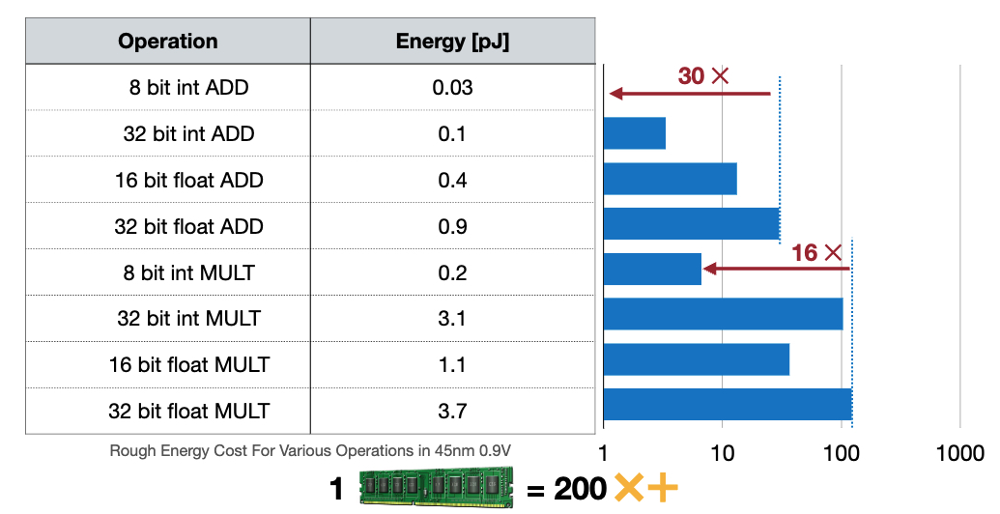

&emsp;&emsp;模型量化有以下几个好处：
- 减小模型大小：如 int8 量化可减少 75% 的模型大小，int8 量化模型大小一般为 32 位浮点模型大小的 1/4；
  - 减少存储空间：在端侧存储空间不足时更具备意义。
  - 减少内存占用：更小的模型当然就意味着不需要更多的内存空间。
  - 减少设备功耗：内存耗用少了推理速度快了自然减少了设备功耗。
- 加快推理速度：浮点型可以访问四次 int8 整型，整型运算比浮点型运算更快；CPU 用 int8 计算的速度更快；
- 某些硬件加速器如 DSP/NPU 只支持 int8。比如有些微处理器属于 8 位的，低功耗运行浮点运算速度慢，需要进行 8bit 量化。
  
## 4.2 数据类型（Data Type）

&emsp;&emsp;模型量化过程可以分为两部分：将模型从 fp32 转换为 int8 ;使用 int8 进行推理。整个量化过程都和数据类型的转换息息相关。我们先在这个小节了解数据类型，如果不了解基础的数据类型，在后续的量化细节内容中通常会感到困惑。
#### 4.2.1 整型（Integer）
&emsp;&emsp;如下图所示，整型数据可以分为无符号整型（Unsigned Integer）和有符号整型（Signed Integer）。
- 无符号整型：数据范围为 0 到 $2^{n-1}$，n 为数据位数。
- 有符号整型：
  - 原码表示(Sign-Magnitude Representation)：其实现的原理是取二进制数的最高位（左起第一位）为符号位，约定符号位为0时表示正数，符号位为1时表示负数，其余二进制位则用于待表示数值的绝对值。数据范围为 $-2^{n-1}-1$ 到 $2^{n-1}-1$，n 为数据位数。
  - 补码表示（Two's Complement Representation）：为了弥补源码表示，有 +0 和 -0 两种表示的缺点，最高位除了具有符号表示的功能，也具有权重值。数据范围为 $-2^{n-1}$ 到 $2^{n-1}-1$，n 为数据位数。

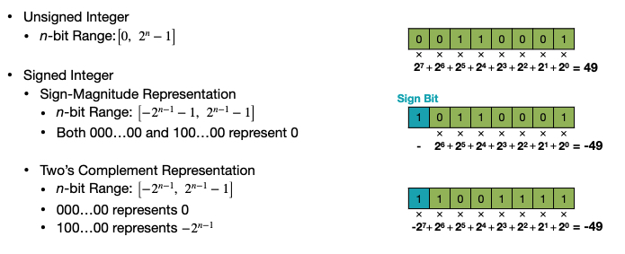

### 4.2.2 定点数（Fixed Point Number）

&emsp;&emsp;定点数的关键地方就在“定”和“点”这两个字上面，即在表示小数数据时，把小数点的位置已经约定好固定在某个位置。与之对应的是浮点数，其小数点的位置不是固定的。如下图所示，指定蓝色部分为符号位，绿色部分为整数位，橙色部分为小数位。

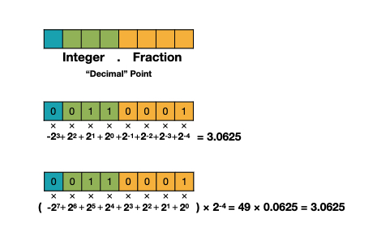

### 4.2.3 浮点数（Floating Point Number）

&emsp;&emsp;如下图所示，浮点数的每个位数表示的数值和定点数是一样的，但是计算方式不再是单纯的相加。其中fraction表示小数部分，exponent表示指数部分。fraction和exponent的位数分别决定了数据的精度和表示范围大小。指数的bias = 127 = $2^{7}-1$，所以指数部分表示的范围为 -127 到 128。

&emsp;&emsp;fp32浮点数的表示公式如下：

$$
fp32 = (-1)^{sign}·(1+fraction)·2^{exponent-127}
$$

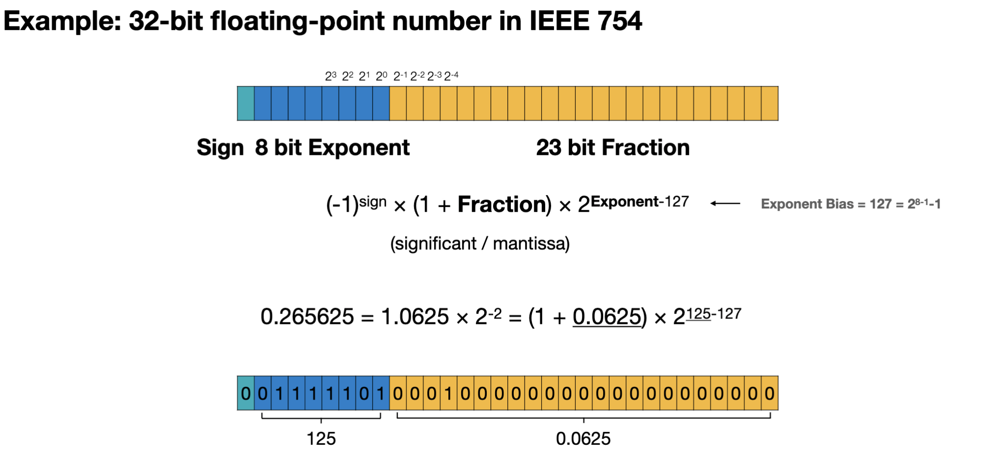

&emsp;&emsp;我们考虑一下如何表示0呢？如下图所示，我们规定 exponent 为 0 时，强制 fraction 部分不再加 1，指数部分强制为 1-bias = -126 。当fraction = 0，表示 0 。这种表示方式叫非正规浮点数。公式如下：

$$
fp32 = (-1)^{sign}·(fraction)·2^{1-127}
$$

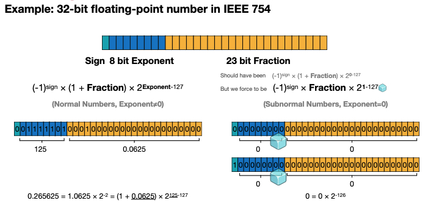

&emsp;&emsp;这两种表示方式的区别在于，当 expontent 不等于 0 时，采用正常的浮点表示方式。当 expontent = 0 时，采用非正规表示方式。
- 正常浮点可表示的最小正值为 fraction = 0，exponent = 1，结果为$2^{-126}$ 。
$$
(1+0)·2^{1-127} = 2^{-126}
$$
- 非正规浮点可表示的最小正值为 fraction = $2^{-23}$，结果为$2^{-149}$ 。
$$
2^{-23}·2^{1-127} = 2^{-149}
$$
- 非正规浮点可表示的最大值为 fraction 部分全为1 ，结果为$2^{-126}-2^{-149}$。
- 正常浮点数可表示的最大值为 fraction = $2^{-23}$，结果为$(1+1-2^{-23})·2^{127}$  。
- 正常浮点数的小数部分全为0，指数部分全为1时分别表示正无穷和负无穷。

&emsp;&emsp;如下所示，我们可以扩展到其他数据类型：
- 当expontent位数为5，fraction位数为11时，为fp16。
  $$
  fp16 = (-1)^{sign}·(1+fraction)·2^{exponent-15}
  $$
- 当expontent位数为8，fraction位数为7时，为bf16。
$$
bf16 = (-1)^{sign}·(1+fraction)·2^{exponent-127}
$$
- 当expontent位数为4，fraction位数为3时，为fp8(E4M3)。
  $$
  fp8 = (-1)^{sign}·(1+fraction)·2^{exponent-7}
  $$
- 当expontent位数为5，fraction位数为2时，为fp8(E5M2)。
  $$
  fp8 = (-1)^{sign}·(1+fraction)·2^{exponent-15}
  $$
&emsp;&emsp;我们需要注意的是，fp8的两种表示方式一个精度更高，一个表示范围更大。

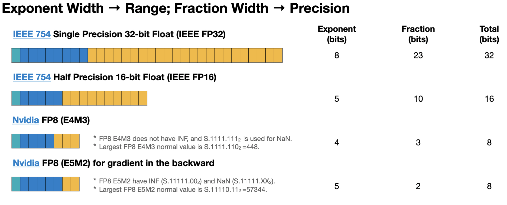

## 4.3 量化基本方法

&emsp;&emsp;根据存储和计算时使用的数据类型不同，主要介绍以下两种量化方法：
- 基于 k-means 的量化（K-means-based Quantization）：存储（整型数据的weights + 浮点型的转换表），计算（浮点计算）。
- 线性量化（Linear Quantization）：存储（整型存储），计算（浮点存储）。
 
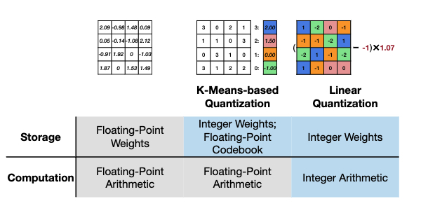

### 4.3.1 k-means 量化

&emsp;&emsp;如下图所示，k-means 量化将weights聚类。每个权重的位置只需要存储聚类的索引值。将权重聚类成4类，就可以实现2-bit的压缩。
存储占用从 32bit x 16 = 512 bit = 64 B ----> 2bit x 16 + 32 bit x 4 = 32 bit + 128 bit = 160 bit = 20 B

&emsp;&emsp;当weight更大时，压缩比例将会更大。

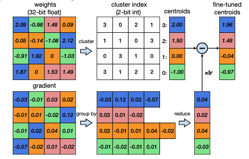

- 推理时，我们读取转换表，根据索引值获取对应的值。
- 训练时，我们将gradient按照weights的聚类方式进行聚类相加，反向传播到转换表，更新转换表的值。

&emsp;&emsp;以下是将上一节的剪枝和k-means 量化结合起来的压缩流程。首先，剪枝将模型中的参数进行剪枝，循环进行微调和剪枝，得到最优的剪枝模型。然后，k-means 量化将剪枝后的参数进行聚类，将聚类的索引值存储在模型中，并构建相应的索引表，并对模型进行微调。

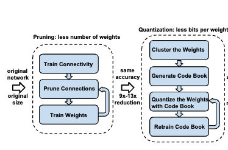

### 4.3.2 线性量化
#### 4.3.2.1 转换公式
&emsp;&emsp;顾名思义，线性量化是将原始浮点数据和量化后的定点数据之间建立一个简单的线性变换关系，因为卷积、全连接等网络层本身只是简单的线性计算，因此线性量化中可以直接用量化后的数据进行直接计算。

&emsp;&emsp;我们用 r 表示浮点实数，q 表示量化后的定点整数。浮点和整型之间的换算公式为：

$$
r = (q - Z) / scale
$$ 
$$
q = round(r / S + Z)
$$ 

&emsp;&emsp;其中，S 是scale，表示实数和整数之间的比例关系，Z 是 zero point，表示浮点数中的 0 经过量化后对应的整数，它们的计算方法为：
$$
S =  \frac{r_{max} - r_{min}}{q_{max} - q_{min}}
$$ 
$$
Z = round(q_{max}-\frac{r_{max}}{S})
$$ 

&emsp;&emsp;其中，$r_{max}$ 和 $r_{max}$分别表示浮点数中的最小值和最大值,$q_{max}$ 和 $q_{min}$分别表示定点数中的最小值和最大值。

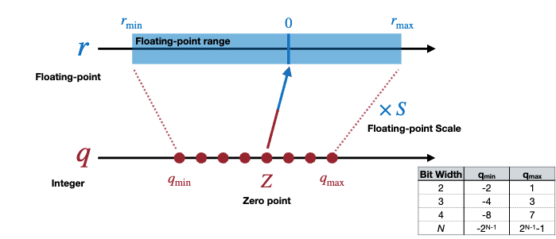

#### 4.3.2.2 线性矩阵乘量化

&emsp;&emsp;线性矩阵乘量化是将线性量化应用于矩阵乘法。

&emsp;&emsp;矩阵乘法可以用下式表示：

$$
Y = WX
$$

&emsp;&emsp;假设 $S_Y$ 和 $Z_Y$ 是矩阵输出 Y 对应的 scale 和 zero point，$S_W$、$Z_W$、$S_X$、$Z_X$ 同理，那么由上式可以推出：

$$
S_Y(q_Y-Z_Y) = S_W(q_W-Z_W)·S_X(q_S-Z_X)
$$

&emsp;&emsp;整理一下可以得到：
$$
q_Y = \frac{S_WS_X}{S_Y}(q_Wq_X-Z_Wq_X-Z_Xq_W+Z_WZ_X) + Z_Y
$$

&emsp;&emsp;其中，$\frac{S_WS_X}{S_Y}$表示为$2^{-n}M_0$ 转化成为定点计算，便可以通过移位得到近似的缩放因子。所谓定点，指的是小数点的位置是固定的，即小数位数是固定的。$Z_Xq_W$ 和 $Z_WZ_X$ 以及 $Z_Y$ 我们可以提前计算出来。

&emsp;&emsp;我们能否让$Z_W$的值为0呢？当$Z_W$的值为0时，我们只需要将 $q_W$ 和 $q_X$ 存储起来，然后根据公式计算出 $q_Y$，最后将 $q_Y$ 存储起来。

&emsp;&emsp;当$Z_W$的值为0时，对应的量化方式为线性对称量化(symmetric quantization)。

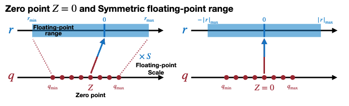

&emsp;&emsp;计算公式变换如下：
$$
S =\frac{｜r｜_{max}}{2^{N-1}}
$$ 
$$
Z = 0
$$ 

&emsp;&emsp;其中，$N$ 表示定点数的小数位数。

&emsp;&emsp;矩阵乘法的公式变为如下：
$$
q_Y = \frac{S_WS_X}{S_Y}(q_Wq_X-Z_Xq_W) + Z_Y
$$

#### 4.3.2.3 全连接层线性量化
&emsp;&emsp;全连接层线性量化与矩阵乘法相比多了一个bias，因此需要对bias进行线性量化。
&emsp;&emsp;对称量化的全连接层的线性量化公式为：
$$
{S_Y}(q_Y-Z_Y) = {S_WS_X}(q_Wq_X-Z_Xq_W) + S_b(q_b-Z_b)
$$

&emsp;&emsp;其中，$S_b$ 表示bias的缩放因子。

&emsp;&emsp;我们强制$Z_b=0$ , $S_b=S_WS_X$, 则全连接层的线性量化公式变为：
$$
{S_Y}(q_Y-Z_Y) = {S_WS_X}(q_Wq_X-Z_Xq_W+q_b)
$$ 
$$
q_Y = \frac{S_WS_X}{S_Y}(q_Wq_X-Z_Xq_W+q_b) + Z_Y
$$ 

&emsp;&emsp;其中，$-Z_Xq_W+q_b$ 可以提前计算出来。

#### 4.3.2.4 卷积层线性量化

&emsp;&emsp;卷积层线性量化与全连接层线性量化相比多了一个卷积核，因此可以推导出卷积的线性量化公式：
$$
q_Y = \frac{S_WS_X}{S_Y}(Conv(q_W,q_X)-Conv(Z_X,q_W)+q_b) + Z_Y
$$ 

&emsp;&emsp;下图所示为模型量化后的推理过程，量化的activations和量化的weight进行卷积，然后加上bias。与scale_factor相乘，再加上ouput的zero_point，就可得到最后的量化结果。

## 4.4 训练后量化 （Post-Training Quantization）

&emsp;&emsp;训练后量化（Post-Training Quantization, PTQ）是指在训练完成后，对模型进行量化，因此也叫做离线量化。根据量化零点  是否为 0，训练后量化分为对称量化和非对称量化，这部分内容已在上述章节进行介绍；根据量化粒度区分，训练后量化又分为逐层量化和逐通道量化以及组量化。

&emsp;&emsp;量化会带来精度损失，那么如何选取量化时所用参数（如scaling factor，zero point）可以尽可能地减少对准确率的影响呢？这也是我们需要关注的地方。量化误差来自两方面，一个是clip操作，一个是round操作。因此，我们还要介绍动态量化参数的计算方式，以及 round 这个操作带来的影响。

### 4.4.1 量化粒度

&emsp;&emsp;逐层量化（Layer-wise Quantization）是指对每一层进行量化，如下图的红框所示，3个channel共享一个量化参数。但是我们可以看到不同channel的数据范围是不同的。因此当 Layer-wise 量化效果不好时，需要对每个channel进行量化。

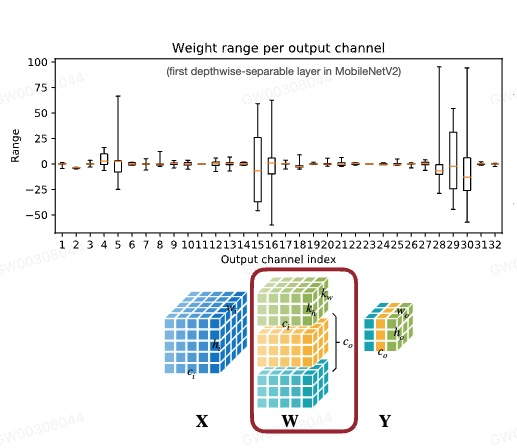

&emsp;&emsp;逐通道量化（Channel-wise Quantization就是将数据按照通道维度进行拆分，分别对每一通道的数据进行量化。相较于逐层量化，逐通道量化可以减少量化误差，但需要更多的存储空间。由于现阶段模型越来越大，每个通道的参数也原来越多，参数的数值范围也越来越大，因此我们需要更细粒度的量化方式。

&emsp;&emsp;组量化（Group Quantization）是指对通道内的数据拆分成多组向量，每组向量共享一个量化参数。

### 4.4.2 动态量化参数的计算 ( Cliping )
#### 4.4.2.1 指数移动平均（EMA）

&emsp;&emsp;指数移动平均（Exponential Moving Average, EMA）是一种常用的统计方法，用于计算数据的指数移动平均值。

&emsp;&emsp;EMA 收集了训练过程中激活函数的取值范围 $r_{min}$ 和 $r_{max}$，然后在每个 epoch 对这些取值范围进行平滑处理。

&emsp;&emsp;EMA的计算公式如下：
$$
r^{t+1}_{min,max} = \alpha r^{t}_{min,max} + (1-\alpha) r^{t+1}_{min,max}
$$

其中，$r^{t}_{min,max}$ 表示第 $t$ 步的取值范围，$\alpha$ 表示平滑系数。

#### 4.4.2.2 Min-Max 

&emsp;&emsp;Min-Max 是一种常用的校准方法，通过在训练好的 fp32 模型上跑少量的校准数据。统计校准数据的 $r_{min,max}$ 并取平均值作为量化参数。

#### 4.4.2.3 KL 量化

&emsp;&emsp;KL 量化是用 KL 散度来衡量数据和量化后的数据之间的相似性；这种方法不是直接将$ [min, max] $v映射到 $[-127,128]$，而是去寻找一个阈值 $|T| < max(|max|, |min|)$ ，将 $ [-T, T]$ 映射到 $[-127, 128]$ 。并假设只要阈值选取得当，使得两个数据之间的分布相似，就不会对精度损失造成影响。

$$
D_{KL}(P||Q) = \sum_{i=1}^nP(x_i)\log\frac{P(x_i)}{Q(x_i)}
$$

#### 4.4.2.4 均方误差（MSE）

&emsp;&emsp;均方误差量化是指通过最小化输入数据 $X$ 和量化后的数据 $Q(X)$ 之间的均方误差，计算得到最合适的量化参数。

$$
min_{|r|_{max}}E|(X-Q(X))^2|
$$ 

&emsp;&emsp;通过动态调整 $｜r｜_{max}$ 来最小化均方误差。

### 4.4.3 Rounding

&emsp;&emsp;Rounding 是指将浮点数进行舍入操作，将浮点数映射到整数。最常用的 Rounding 方法是最近整数（Rounding-to-nearest）。如下图所示，如果我们考虑整体的数据分布，将权重 0.5 舍入为 1 不是一个好的选择。

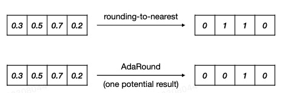

&emsp;&emsp;我们最终想要的量化效果是输出数据的损失尽可能小，因此我们可以通过评判 rounding 对输出的影响来决定权重的舍入方式，也就是 AdaRound。简化的计算公式如下所示：

$$
argmin||(Wx-\widehat{W}x)||
$$

&emsp;&emsp;其中，$\widehat{W} = \lfloor\lfloor{W}\rfloor+\sigma\rceil$ , $\sigma \in [0,1]$，表示当前值是向上取整还是向下取整。

## 4.5 量化感知训练（Quantization-Aware Training）

&emsp;&emsp;量化感知训练（Quantization-Aware Training, QAT）是指在训练过程中，对模型添加模拟量化算子，模拟量化模型在推理阶段的舍入和裁剪操作，引入量化误差。并通过反向传播更新模型参数，使得模型在量化后和量化前保持一致。

### 4.5.1 前向传播

&emsp;&emsp;如上图所示，量化训练的前向传播过程如下：

&emsp;&emsp;1）$Layer_{N-1}$ 的输出 $Q(X)$ 作为输入传入到下一层 $Layer_{N}$，其中 $Q(X)$ 表示量化反量化后的数据；

&emsp;&emsp;2）$Layer_{N}$ 的权重 $W$ 经过量化反量化之后成为 $Q(W)$ 成为新的权重与 $Q(X)$ 计算得到输出 $Y$ 。

&emsp;&emsp;3）$Y$ 量化反量化之后得到Q(Y) 输入到下一层 $Layer_{N+1}$。

&emsp;&emsp;因为int8的表示范围远小于fp32，当fp32 量化成 int8 时，不同大小的数据会映射到int8的相同数值，再反量化回 fp32 时就会产生误差。量化反量化操作就是为了将量化误差引入到模型的训练中。

&emsp;&emsp;我们要注意的是，整个量化过程中算子的计算都是在高精度下完成的。

### 4.5.2 反向传播

&emsp;&emsp;量化感知训练的损失函数与普通训练的损失函数类似，但是量化后的权重是离散值。如图所示为 $W$ 和 $Q(W)$ 的关系。

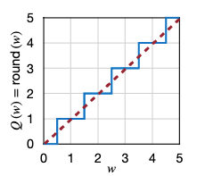

&emsp;&emsp;可以得到以下式子：
$$
\frac{\partial{Q(W)}}{\partial{W}}=0
$$ 

&emsp;&emsp;求导公式可以做如下转换：

$$
g_w =\frac{\partial{L}}{\partial{W}} =  \frac{\partial{Q(W)}}{\partial{W}}·\frac{\partial{L}}{\partial{W}} =0
$$ 

&emsp;&emsp;如果按照上述式子进行梯度计算，这样的话梯度就永远为 0，无法进行梯度更新。因此人们提出了一个修正的方式，Streaming-Thresholding-Error（STE）。将 $W$ 和 $Q(W)$ 的关系假设为上图中的红色虚线，$W = Q(W)$，$
\frac{\partial{Q(W)}}{\partial{W}}=1$ ，梯度公式可以转换为如下式子：

$$
g_w =\frac{\partial{L}}{\partial{W}} =  \frac{\partial{L}}{\partial{Q(W)}}
$$ 
&emsp;&emsp;这样，我们就可以进行反向传播计算。

## 4.6 混合精度量化

&emsp;&emsp;混合精度量化指同时使用低精度和高精度数据类型来减少模型的大小和计算成本的一种方法。通过针对性地对不同 layer 选择不同的量化精度，可以有效地避免量化误差的传播和积累，从而保证模型的性能不受影响。

## 4.7 选修

### 4.7.1 INT4 和 FP4

&emsp;&emsp;INT4 和 FP4 是一种特殊的定点数和浮点数，目前的模型越来越大，所以我们需要更低bits的表示方法。

&emsp;&emsp;INT4 表示的范围为 -8 到 7；FP4 表示的范围根据不同的指数位和小数位而有所不同。具体表示范围如下图所示。

### 4.7.2 二值和三值量化

待更新～
## 实践
1. [k-means量化实践](https://github.com/datawhalechina/awesome-compression/blob/main/docs/notebook/ch04/1.kmeans_quantzations.ipynb)
2. [线性量化实践](https://github.com/datawhalechina/awesome-compression/blob/main/docs/notebook/ch04/2.linear_quantizations.ipynb)
3. [KL量化实践](https://github.com/datawhalechina/awesome-compression/blob/main/docs/notebook/ch04/3.KL_quantization.ipynb)
4. [量化感知训练实践](https://github.com/datawhalechina/awesome-compression/blob/main/docs/notebook/ch04/4.pytorch_QAT.ipynb)
