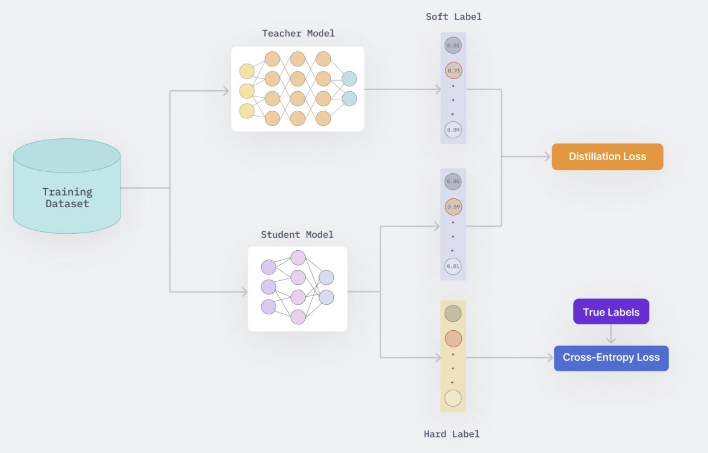
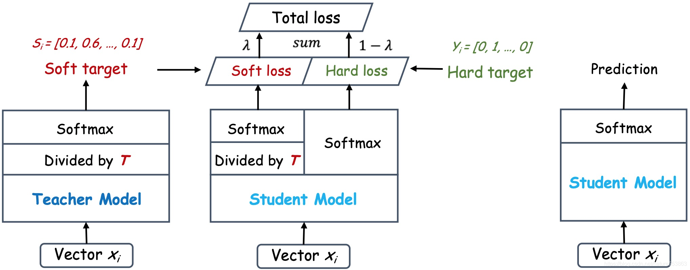
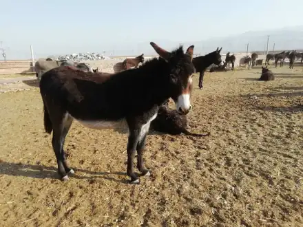
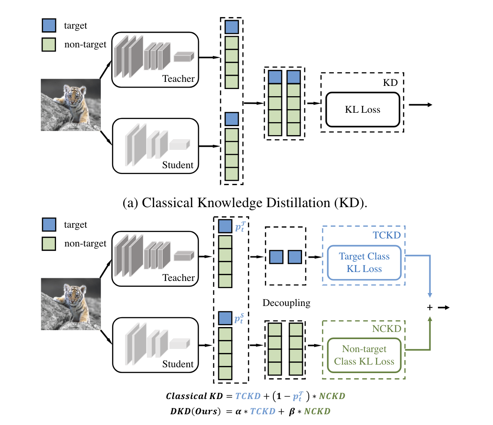
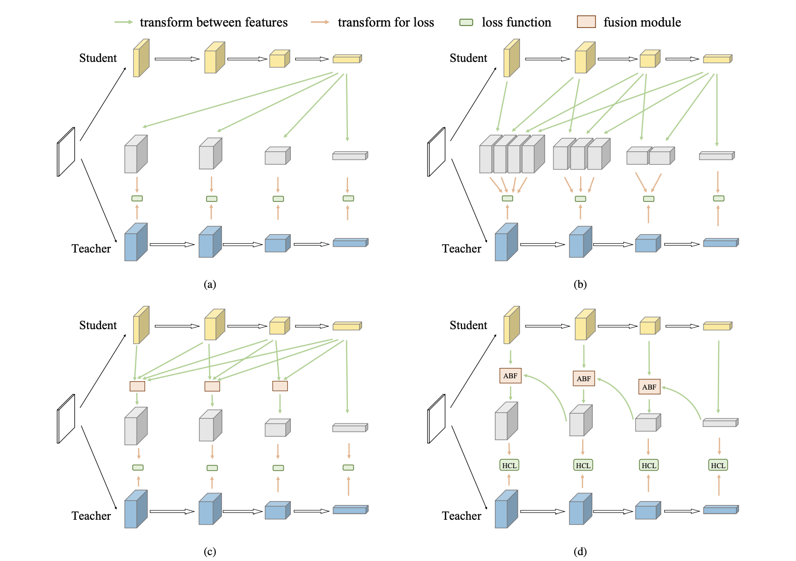

# 第6章 知识蒸馏

## 6.1 简介

&emsp;&emsp;通常情况下，对于同一个机器学习任务，复杂的网络往往具有更多的参数和更大的计算量，但通常表现更优。相反，简单的网络往往参数较少，计算量较小，但其性能可能相对较差一些。知识蒸馏（Knowledge Distillation, KD）是一种将知识从大型(教师)模型迁移到小型(学生)模型的模型压缩技术。它通过学习教师模型的输出(Logits)分布或特征图(Feature Map)来帮助学生模型学习更好，从而提高学生模型的精度和效率。

### 主要概念

#### 教师模型(Teacher Model)
- 一个预先训练好的复杂模型，通常性能优异，但计算开销大。
- 提供软标签或者中间层的信息作为 “知识”。

#### 学生模型(Student Model)
- 一个较小、较简单的模型，旨在学习并模仿教师模型的行为。
- 通过学习教师模型的“知识”，学生模型能够在较小规模上实现接近教师模型的性能。

#### 软标签(Soft Target)
- 教师模型输出的概率分布，通常比硬标签(即One-Hot Lable)包含更多信息。
- 通过温度调节(Temperature)将输出的概率分布软化，使得学生模型能更好地学习概率间的相对关系。

## 6.2 知识蒸馏具体过程

&emsp;&emsp; 知识蒸馏的基本架构如上图所示,其中教师模型(Teacher Model)是已经训练好的模型,而学生模型(Student Model)则是需要被训练的模型。

&emsp;&emsp; 假设现在的任务是一个图像分类任务,在训练阶段,对于一张训练图片 $\mathbf x$ 及其对应的真实标签 $y$(也称为硬标签Hard Label)而言。 分别将图片 $\mathbf{x}$ 喂入教师和学习模型,得到两个尺寸相同的输出Logits：$\mathbf{u} = [u_1, u_2, ..., u_K]\in \mathbb{R}^{1\times K}$ 和 $\mathbf{v} = [v_1, v_2, ..., v_K] \in \mathbb{R}^{1\times K}$，其中$K$表示分类任务的数据集对应的类别总数。随后，两个Logits经过Softmax函数处理后，分别得到两个模型关于输入 $\mathbf{x}$ 的最终预测 $\mathbf{p} = [p_1, p_2, ..., p_K]$ 和 $\mathbf{q} = [q_1, q_2, ..., q_K]$。

&emsp;&emsp; 由于教师模型的输出通常较为自信，这将会导致未经处理的 $\mathbf{p}$ 倾向于接近一个 one-hot 向量($[0, 0, 1, 0, ..., 0, 0]$)。为了软化教师模型的预测概率,通常的做法是在 softmax 函数中引入温度 $\tau$ 来进行软化,对于软化后的Logits进行KL散度计算 Loss,成为 Soft Loss (软损失)。

&emsp;&emsp; 同时在蒸馏的时候, 学生模型也要收到监督新号(Hard Label)的监督, 此时和正常的分类任务训练的损失没有区别, 直接对学生模型的输出 $\mathbf{v}$ 和 硬标签 $y$ 计算交叉熵损失即可。这部分的损失称为 Hard Loss (硬损失)，最终在 Soft Loss 和 Hard Loss 的共同作用下来进行模型蒸馏。

## 6.2 温度

### 温度是什么

&emsp;&emsp; 温度在知识蒸馏中用于调整教师模型输出的概率分布，从而更好地指导学生模型的学习。

### 为什么需要温度

&emsp;&emsp; 教师模型的输出通常是一个类别概率分布，通过 Softmax 函数生成。对于未调整温度的 Softmax 输出，通常是某个类别的概率接近 1，而其他类别的概率接近 0。这种尖锐的分布对学生模型不够友好，因为它只提供了关于正确答案的信息，而忽略了其他类别的信息。(而且这个时候教师模型输出的概率分布和 标签Hard Label 是非常接近的)。而通过温度调整后, 可以得到一个相对“软”的概率分布, 称为 “软标签” (Soft Label). 这一调整的过程称为 “软化”。例如: 

|        标签    | 马   |  驴  | 汽车 |
| :--------: | :--: | :--: | :--: |
|img|  | | |
| 网络输出 | 6.0 | 2.0 | -2.0 |
| Softmax | 0.98 | 0.018 | 0.0003 |
| Hard Label(真实标签) | 1    |  0   |  0   |
| Soft Label(使用温度进行软化) | 0.75 | 0.25 | 0.05  |

&emsp;&emsp; 可以发现, 网络的原始输出再经过Softmax后得到的概率分布, 和真实标签几乎一致。此时的分布忽略了类别之间的潜在关系。 例如, “马” 是更像 “驴”的, 而更不像 “车”。 虽然原始输出的Softmax概率分布也能体现出这种关系, 但是差别不是很明显。 而经过温度软化后得到的 Soft Label, 其可以清晰的展示出不同类别之间的差别, 很好的反应了不同类别之间的相对关系。 这种细节可以帮助学生模型更好的理解输入样本的完整信息, 而不仅仅只是学习硬标签。

### 温度的计算过程

&emsp;&emsp; 假设某个模型的输出为 $z = [z_1, z_2, ..., z_K]$, 其中 $K$ 是类别数。 传统的Softmax为

$$
\frac{\exp {z_i}}{\sum _ {j=1} ^ K \exp {z_j}}
$$

&emsp;&emsp; 而带温度的Softmax计算方式为 

$$
\frac{\exp {z_i / \tau}}{\sum _ {j=1} ^ K \exp {z_j / \tau}}
$$

&emsp;&emsp; 其中 $\tau$ 表示的是温度。那么传统的Softmax也可以看作是温度 $\tau$ 为1的特殊情况。

&emsp;&emsp; 一个更加具体的例子, 如表所示 : 

<!--  -->

| 类别 | Logits(网络的直接输出) |                       Softmax (T=1)                        |                Softmax(T=4) 带温度的软化                |
| :--: | :--------------------: | :--------------------------------------------------------: | :----------------------------------------------------------: |
|  马  |          6.0           |  $\frac{e^{6.0}}{e ^ {6.0} + e ^ {2.0}+ e^{-2.0}} = 0.98$  | $\frac{e^{\frac{6.0}{4}}}{e^{\frac{6.0}{4}} + e^{\frac{2.0}{4}} + e^{\frac{-2.0}{4}} }= 0.75$ |
|  驴  |          2.0           | $\frac{e^{2.0}}{e ^ {6.0} + e ^ {2.0}+ e^{-2.0}} = 0.018$  | $\frac{e^{\frac{2.0}{4}}}{e^{\frac{6.0}{4}} + e^{\frac{2.0}{4}} + e^{\frac{-2.0}{4}} } = 0.25$ |
|  车  |          -2.0          | $\frac{e^{-2.0}}{e ^ {6.0} + e ^ {2.0}+ e^{-2.0}} = 0.002$ | $\frac{e^{\frac{-2.0}{4}}}{e^{\frac{6.0}{4}} + e^{\frac{2.0}{4}} + e^{\frac{-2.0}{4}}}=0.05$ |

&emsp;&emsp;在实践中,我们通常也会软化学生模型的输出。最终，软化后的教师模型和学生模型的软标签分别为 $\mathbf{p}(\tau) = [p_1(\tau), p_2(\tau), ..., p_K(\tau)]$ 和 $\mathbf{q}(\tau) = [q_1(\tau), q_2(\tau), ..., q_K(\tau)]$。

&emsp;&emsp;$p_i(\tau)$ 和 $q_i(\tau)$ 的定义如下: 
$$
\begin{aligned}
    p_{i}(\tau) = \frac{\exp(u_i / \tau)}{\sum_{i=1}^K \exp(u_i / \tau)}   \\
    q_{i}(\tau) = \frac{\exp(v_i / \tau)}{\sum_{i=1}^K \exp(v_i / \tau)} 
\end{aligned}
$$
&emsp;&emsp;其中，$\tau$ 表示的是在蒸馏过程中使用的温度。当温度$\tau$ 为1的时候,此时 $\mathbf p(\tau)$ ,$\mathbf q(\tau)$ 的结果和一般的Softmax函数结果一致。

### 温度的大小对Logits软化程度的影响

&emsp;&emsp; 温度 $\tau$ 的大小会控制预测概率的软化程度。较小的 $\tau$ 会导致较尖锐的软化效果，而较大的 $\tau$ 则会使软化效果较为平滑。如上图所示,其中最左侧Origin表示的是某个分类网络对任意一张图片的输出Logits的分布。其中横坐标表示的是具体的类别号,而纵轴表示的是网络对于具体某个类型的预测值。而最右侧的是对 Logits 进行 Argmax() 后的结果。 

&emsp;&emsp; 可以发现, 当温度很大的时候(例如 $\tau = 14$ ),此时软化后的Logits分布几乎接近一致, 而当温度很小的时候(例如 $\tau = 0.5$),此时软化后的 Logits 分布几乎等价于 Arg max() 的结果。也就是说, 当温度很大的时候, 教师网络软化后的 Logits 接近于平均值, 此时学生模型无法从教师模型那里学习到知识, 因为教师模型的 Logits 对于每一个类别的预测概率都是一致的。而当温度很小的时候, 此时蒸馏就失去了意义, 因为教师模型传递给学生的知识可以看作和 Hard Label等价。所以选择**合适的温度**对于蒸馏而言是至关重要的。 一般在 CIFAR-10/100 数据集上, 采用的温度是 $4$, 而在 ImageNet 数据集上, 一般使用的温度是 $1$。

### 不同大小温度的蒸馏结果

&emsp;&emsp; 图中的教师模型为 Res32x4, 学生模型为 Res8x4。实验所选择的数据集为 CIFAR-100。其中横轴表示的是在蒸馏中使用的温度, 纵轴表示的是在CIFAR-100验证集上的蒸馏结果。可以发现不同的温度对于蒸馏的结果影响是比较大的, 读者在自行实践时, 应多选择不同的温度进行尝试, 而非仅仅是依赖于 经验性的设置。

## 6.3 知识蒸馏的损失函数

&emsp;&emsp;知识蒸馏的损失函数由软损失和硬损失线性结合构成, 具体的定义如下:

&emsp;&emsp;**软损失**

$$
\mathcal{L}_{\operatorname{KL}} = \operatorname {KL}(\mathbf{q}(\tau), \mathbf{p}(\tau)) = \sum_j \ p_j(\tau) \log \frac{p_j(\tau)}{q_j(\tau)}
$$

&emsp;&emsp;**硬损失**

$$
\mathcal L_{CE} = \operatorname {CE}(\mathbf q(\tau = 1), \mathbf y) = \sum _ {j} - y_j \log q_j(1)
$$

&emsp;&emsp;其中 $\mathbf{p}$ 和 $\mathbf{q}$ 分别表示教师模型和学生模型的输出Logits, 而 $\tau$ 表示的是蒸馏所使用的温度。最终的损失函数为 
$$
Loss = \alpha \cdot \mathcal L_{CE} + \beta \cdot \tau ^ 2 \cdot \mathcal L_{KL}\\
	=  \alpha \cdot \operatorname {CE}(\mathbf q(\tau = 1), \mathbf y) + \beta \cdot \tau ^ 2 \cdot \operatorname {KL}(\mathbf{q}(\tau), \mathbf{p}(\tau))
$$

&emsp;&emsp; 一般情况下, 要保持 $\alpha + \beta = 1$. 实践中 $\alpha$ 通常取 $0.1$, 而 $\beta$ 通常取 $0.9$。至于为什么要对软损失部分的 $\operatorname {KL}$ 乘一个 $\tau ^ 2$, 简单的解释是为了保持软损失和硬损失在梯度上的平衡, 而具体的解释请选择性的阅读 [6.4]()

## 6.4 损失函数部分推导(选修)

### 6.4.1 Softmax函数求导

&emsp;&emsp;假设对于一个任意的 Logits 向量 $\mathbf z = [z_1, z_2, ..., z_{K}]\in \mathbb{R}^{1\times K}$, 其中 $K$ 是数据集的类别数。通过带温度的Softmax函数计算后得到向量 $\mathbf s = [s_1(\tau), s_2(\tau), ..., s_K(\tau)]$ ,其中 $s_i(\tau)$ 的定义为 : 
$$
s_i(\tau) = \frac{e^{z_i/ \tau}}{\sum_{j=1}^K e^{z_j / \tau}}
$$

&emsp;&emsp;对于任意 $z_k \in \mathbf z$ ,   $s_i(\tau)$ 对 $z_k$ 的偏导分为两种情况:

&emsp;&emsp; 当 $i = k$ 时, 有
$$
\begin{align*}
  \frac{\partial s_i(\tau)}{\partial z_k}
  &= \frac{\partial}{\partial z_k}\frac{e^{z_k / \tau}}{\sum_{j=1}^K e^{z_j / \tau}} \\ 
  &= \frac{\frac{\partial}{\partial z_k}e^{z_k / \tau}\ \sum_{j=1}^K e^{z_j / \tau} - e^{z_k / \tau}\ \frac{\partial}{\partial z_k}\sum_{j=1}^K e^{z_j / \tau}}{\left( \sum_{j=1}^K e^{z_j / \tau}\right) ^ 2} \\
  &= \frac{\frac{1}{\tau}\ e^{z_k/ \tau}}{\sum_{j=1}^K e^{z_j / \tau}} - \frac{e^{z_k/ \tau }\ \frac{1}{\tau}\ e^{z_k/ \tau }}{\left( \sum_{j=1}^K e^{z_j / \tau}\right) ^ 2}\\ 
  &= \frac{1}{\tau} (s_k(\tau) - s_k(\tau)\ s_k(\tau)) \\
  &= \frac{1}{\tau}\ s_k(\tau)\ (1 - s_k(\tau))
\end{align*}
$$

&emsp;&emsp; 当 $i \neq k$ 时, 有
$$
\begin{align*}
  \frac{\partial s_i(\tau)}{\partial z_k}
  &= \frac{\partial}{\partial z_k}\frac{e^{z_i / \tau}}{\sum_{j=1}^K e^{z_j / \tau}} \\ 
  &= \frac{\frac{\partial}{\partial z_k}e^{z_i / \tau}\ \sum_{j=1}^K e^{z_j / \tau} - e^{z_i / \tau}\ \frac{\partial}{\partial z_k}\sum_{j=1}^K e^{z_j / \tau}}{\left( \sum_{j=1}^K e^{z_j / \tau}\right) ^ 2} \\
  &= 0 - \frac{e^{z_i/ \tau }\frac{1}{\tau}e^{z_k/ \tau }}{\left(\sum_{j=1}^K e^{z_j / \tau}\right) ^ 2}\\ 
  &= -\frac{1}{\tau}\ s_i(\tau)\ s_k(\tau)
\end{align*}
$$

&emsp;&emsp; 因此, 对于 $\varphi (z_i)$ 对 $z_k$ 偏导有
$$
\frac{\partial s_i(\tau)}{\partial z_k} =
\left\{
\begin{matrix}
\frac{1}{\tau}\ s_k(\tau)\ (1 - s_k(\tau))& \text{if } i = k \\
-\frac{1}{\tau}\ s_i(\tau)\ s_k(\tau) & \text{if } i \neq k
\end{matrix}
\right.
$$

### 6.4.2 硬损失CE求导

&emsp;&emsp;对于学生模型的输出logits $\mathbf{v} = [v_1, v_2, ..., v_K] \in \mathbb{R}^{1\times K}$ 中任意一个 $v_k$ , 硬损失 $ \mathcal L_{CE}$ 对 $v_k$ 的梯度为 :
$$
\begin{align*}
\mathcal L_{CE} &= \operatorname {CE}(\mathbf q(\tau = 1), \mathbf y) \\ 
&= \sum _ {j=1}^K - y_j \log q_j(\tau = 1) \\
\frac{\partial \mathcal L_{CE}}{\partial v_k} &= \frac{\partial}{\partial v_k}\sum _ {j=1}^K - y_j \log q_j(\tau = 1)\\
&= \frac{\partial}{\partial v_k}\sum _ {j=1, j\neq k}^K - y_{j} \log q_j(\tau = 1) + \frac{\partial}{\partial v_k} - y_k \log q_k(\tau = 1)\\
&= \sum _ {j=1, j\neq k}^K - y_{j} \frac{1}{q_j(\tau=1)}\ \frac{-1}{\tau=1}q_j(\tau=1)q_k(\tau=1) \\ &\ \ \ \ \ \ - y_k \frac{1}{q_k(\tau=1)}\frac{1}{\tau=1}q_k(\tau=1)(1-q_k(\tau=1))\\
&= \frac{1}{1}(1-y_k)q_k(\tau=1) - \frac{1}{1}y_k(1-q_k(\tau=1))\\
&= q_k(\tau=1) - y_k \\
\end{align*}
$$

### 6.4.3 软损失KL求导

&emsp;&emsp;软损失$\mathcal L_{KL}$为教师模型的软标签$\mathbf p(\tau)$ 和学生模型的软标签 $\mathbf q(\tau)$  的KL散度。$\mathcal L_{KL}$ 对于学生模型的输出中任意一个 $v_k$ 的梯度为
$$
\begin{align*}
\mathcal{L}_{\operatorname{KL}} &= \operatorname {KL}(\mathbf{q}(\tau), \mathbf{p}(\tau)) \\
&= \sum_{j=1}^{K} \ p_j(\tau) \log \frac{p_j(\tau)}{q_j(\tau)} \\
\frac{\partial \mathcal{L}_{\operatorname{KL}}}{\partial v_k} &= \frac{\partial}{\partial v_k} \sum_{j=1}^{K} \ p_j(\tau) \log \frac{p_j(\tau)}{q_j(\tau)} \\
&= \frac{\partial}{\partial v_k} \sum_{j=1}^{K} \left( \ p_j(\tau) \log {p_j(\tau)} - p_j(\tau)\log{q_j(\tau)} \right) \\
&= \frac{\partial}{\partial v_k} \left(\sum_{j=1}^{K} - p_j(\tau)\log{q_j(\tau)}\right) \\
&= \frac{\partial}{\partial v_k} \left( \sum_{j=1, j\neq k} ^ K -p_j(\tau) \log q_j(\tau)  -p_k(\tau) \log q_k(\tau) \right) \\
&= \sum_{j=1, j\neq k}^K \left( -p_j(\tau) \frac{\partial}{\partial v_k} \log q_j(\tau)\right) - \frac{\partial}{\partial v_k} p_k(\tau) \log q_k(\tau)\\
&= \sum_{j=1, j\neq k}^K -\frac{p_j(\tau)}{q_j(\tau)}\left[ -\frac{1}{\tau}q_j(\tau)q_k(\tau) \right] - \frac{p_k(\tau)}{q_k(\tau)}\left[ \frac{1}{\tau} q_k(\tau)(1 - q_k(\tau))\right]\\ 
&= \frac{1}{\tau}  \sum_{j=1, j\neq k}^K p_j(\tau) q_k(\tau) - \frac{1}{\tau} p_k(\tau)(1 - q_k(\tau)) \ \ \ \text{where} \sum_{j=1}^K p_j(\tau)=1\\
&= \frac{1}{\tau} (1 - p_k(\tau))q_k(\tau) - \frac{1}{\tau} p_k(\tau)(1 - q_k(\tau)) \\
&= \frac{1}{\tau} \left[ q_k(\tau) - p_k(\tau)q_k(\tau) - p_k(\tau) + p_k(\tau)q_k(\tau)\right] \\
&= \frac{q_k(\tau) - p_k(\tau)}{\tau}
\end{align*}
$$

### 6.4.4 泰勒逼近

&emsp;&emsp;对于 $e^x$ , 当 $x$ 趋于 0 的时候有 $e^x \approx 1 + x + ...$

&emsp;&emsp;最终, 硬损失CE和软损失KL对于$v_k$ 的梯度为:
$$
\left\{
\begin{matrix}
\frac{\partial \mathcal L_{CE}}{\partial v_k} = q_k(\tau=1) - y_k
\\
\frac{\partial \mathcal{L}_{\operatorname{KL}}}{\partial v_k} = \frac{1}{\tau}(q_k(\tau) - p_k(\tau))
\end{matrix}
\right.
$$

&emsp;&emsp;对于$\frac{\partial \mathcal L_{CE}}{\partial v_k}$ 展开有 :
$$
\begin{align*}
\frac{\partial \mathcal L_{CE}}{\partial v_k} &= q_k(\tau=1)-y_k\\
&= \frac{e^{v_k}}{\sum_{j=1}^K e^{v_j}} - y_k \\
&\approx \frac{1+v_k}{\sum_{j=1}^K 1 + v_j} - y_k  , \text{where} \sum v_j = 0\\
&= \frac{1+v_k}{K} - y_k\\
\end{align*}
$$
​
&emsp;&emsp;对于 $\frac{\partial \mathcal{L}_{\operatorname{KL}}}{\partial v_k}$ 展开有 :
$$
\begin{align*}
\frac{\partial \mathcal{L}_{\operatorname{KL}}}{\partial v_k} &= \frac{1}{\tau}(q_k(\tau) - p_k(\tau))\\
&= \frac{1}{\tau} (\frac{e^{v_k/\tau}}{\sum_{j=1}^K e^{v_j / \tau}} - \frac{e^{u_k/ \tau}}{\sum_{j=1}^K e^{u_k/\tau}}) \\
&\approx \frac{1}{\tau}(\frac{1 + v_k/\tau}{\sum_{j=1}^K (1 + v_j/\tau)} - \frac{1+u_k/\tau}{\sum_{j=1}^K (1+u_j/ \tau)})\\
&= \frac{1}{\tau}(\frac{v_k/\tau - u_k}{K}) \\
&= \frac{1}{K \ \tau^2} v_k - \frac{u_k}{K\tau}
\end{align*}
$$

&emsp;&emsp;此时可以发现, 硬损失中梯度对于$v_k$ 的部分时软损失的梯度中对于$v_k$部分的 $\tau ^ 2$ 倍, 所以在最终计算损失函数Loss的时候, 需要给 $\mathcal{L}_{\operatorname{KL}}$ 乘上一个 $\tau ^ 2$ 以平衡两个损失之间的梯度。

## 6.5 更多类型的知识蒸馏

### 6.5.1 解耦知识蒸馏

&emsp;&emsp;Decoupled Knowledge Distillation([DKD](https://arxiv.org/abs/2203.08679))。对普通的 KD (Knowledge Distillation) 损失解耦得到 Target Class Knowledge Distillation (TCKD) 和 Non-target Class Knowledge Distillation (NCKD) 两部分。 由此提出新的蒸馏损失以强化 NCKD 部分。 

### 6.5.2 FitNet

&emsp;&emsp; [FitNet](https://arxiv.org/abs/1412.6550) 通过匹配教师网络和学生网络在中间层的特征来进行训练，而不仅仅是匹配最终输出。这种利用中间层进行蒸馏的方法，就像向学生模型传授教师模型对输入的思考过程，而不仅仅是告知思考结果。但由于两者的中间层的维度往往是不匹配的，这里往往需要加入新的参考来调整学生模型的维度。

### 6.5.3 ReviewKD

&emsp;&emsp; [ReviewKD](https://arxiv.org/abs/2104.09044) 认为在训练初期, 让学生模型去学习教师模型深层的抽象语义信息是不太合理的。该论文通过引入knowledge review的方法来解决这个问题.具体可见[知乎](https://zhuanlan.zhihu.com/p/363994781)。

### 6.5.4 结果对比

&emsp;&emsp; 对本小节中提到的蒸馏方法在CIFAR-100数据集进行一个比较。

|          | 教师 : ResNet32x4, Acc : 79.42 学生 : ResNet8x4, Acc : 72.50 | 教师 : VGG13, Acc : 74.64 学生 : VGG8, Acc : 70.36 | 教师 : ResNet32x4, Acc : 79.42 学生 : ShuffleNetV2, Acc : 71.82 |
| :------: | :----------------------------------------------------------: | :-----------------------------------------------------: | :----------------------------------------------------------: |
|    KD    |                            73.33                             |                          72.98                          |                            74.45                             |
|  FitNet  |                            73.50                             |                          71.02                          |                            73.54                             |
| ReviewKD |                            75.63                             |                        **74.84**                        |                          **77.78**                           |
|   DKD    |                          **76.32**                           |                          74.68                          |                            77.07                             |

### 6.5.5 目标检测的知识蒸馏

&emsp;&emsp; 相比于分类任务的知识蒸馏, 目标检测的知识蒸馏更加复杂。 因为 1) 分类任务中的标签类别相对均衡, 而在目标检测任务中, 存在类别不平衡的问题。 2) 目标检测的任务更加复杂, 既有分类任务, 也有位置的回归任务。 如图所示, 主要通过三个部分的损失函数来进行蒸馏, 同时针对前后背景不平衡的问题，进一步提出带权重的交叉熵损失。

## 6.6 实践

- [KD知识蒸馏](https://github.com/datawhalechina/awesome-compression/blob/main/docs/notebook/ch06/1.kd.ipynb)
- [DKD解耦知识蒸馏](https://github.com/datawhalechina/awesome-compression/blob/main/docs/notebook/ch06/2.dkd.ipynb)

## 6.7 更多KD资料

- [代码库](https://github.com/megvii-research/mdistiller)