# 第6章 知识蒸馏

&emsp;&emsp;本章我们将在 6.1 节介绍知识蒸馏概、相关术语、具体过程以及其中比较关键的温度和损失函数，在6.2节介绍知识蒸馏的匹配内容，在6.3节介绍自蒸馏和在线蒸馏，在6.4节介绍知识蒸馏的应用，在6.5节介绍网络增强，在6.6节通过具体实践加深对知识蒸馏的理解，在6.7节介绍损失函数部分推导。
- [第6章 知识蒸馏](#第6章-知识蒸馏)
  - [6.1 知识蒸馏介绍](#61-知识蒸馏介绍)
    - [6.1.1 相关术语](#611-相关术语)
      - [教师模型(Teacher Model)](#教师模型teacher-model)
      - [学生模型(Student Model)](#学生模型student-model)
      - [硬标签(Hard Target)](#硬标签hard-target)
      - [软标签(Soft Target)](#软标签soft-target)
      - [交叉熵损失（Cross-Entropy Loss）](#交叉熵损失cross-entropy-loss)
  - [6.1.2 知识蒸馏具体过程](#612-知识蒸馏具体过程)
  - [6.1.3 温度](#613-温度)
    - [6.1.3.1 温度的作用](#6131-温度的作用)
    - [6.1.3.2 为什么需要温度](#6132-为什么需要温度)
    - [6.1.3.3 温度的计算过程](#6133-温度的计算过程)
    - [6.1.3.4 温度的大小对Logits的影响](#6134-温度的大小对logits的影响)
    - [6.1.3.5 不同大小温度的蒸馏结果](#6135-不同大小温度的蒸馏结果)
  - [6.1.4 知识蒸馏的损失函数](#614-知识蒸馏的损失函数)
  - [6.2 知识蒸馏匹配内容](#62-知识蒸馏匹配内容)
    - [6.2.1 匹配中间层权重](#621-匹配中间层权重)
    - [6.2.2 匹配中间层特征](#622-匹配中间层特征)
    - [6.2.3 匹配中间层注意力图](#623-匹配中间层注意力图)
    - [6.2.4 匹配中间层稀疏模式](#624-匹配中间层稀疏模式)
    - [6.2.5 匹配相关信息](#625-匹配相关信息)
  - [6.3 自蒸馏和在线蒸馏](#63-自蒸馏和在线蒸馏)
    - [6.3.1 自蒸馏](#631-自蒸馏)
    - [6.3.2 在线蒸馏](#632-在线蒸馏)
    - [6.3.3 结合在线蒸馏和自蒸馏](#633-结合在线蒸馏和自蒸馏)
  - [6.4 知识蒸馏的应用](#64-知识蒸馏的应用)
    - [6.4.1 目标检测](#641-目标检测)
    - [6.4.2 语义分割](#642-语义分割)
    - [6.4.3 生成对抗网络（GAN）](#643-生成对抗网络gan)
    - [6.4.4 自然语言处理](#644-自然语言处理)
  - [6.5 网络增强](#65-网络增强)
  - [6.6 实践](#66-实践)
  - [6.7 损失函数部分推导(选修)](#67-损失函数部分推导选修)
    - [6.7.1 Softmax函数求导](#671-softmax函数求导)
    - [6.7.2 硬损失CE求导](#672-硬损失ce求导)
    - [6.7.3 软损失KL求导](#673-软损失kl求导)
    - [6.7.4 泰勒逼近](#674-泰勒逼近)
  - [6.8 更多KD资料](#68-更多kd资料)

## 6.1 知识蒸馏介绍

&emsp;&emsp;随着人工智能的广泛应用，越来越多的场景需要将AI模型部署在边缘设备上，例如智能传感器、物联网设备和智能手机。这些设备通常具有极为有限的计算能力和内存，相比于在云端运行的大型模型，它们无法处理复杂的神经网络。

&emsp;&emsp;传统的云端AI依赖于强大的计算资源，如下图中提到的NVIDIA A100显卡，能够提供高达19.5 TFLOPS的浮点运算能力，并配备高达80GB的内存。这类硬件使得模型可以承载更大的参数量并处理复杂任务。

&emsp;&emsp;因此，如何将大模型的能力迁移到小设备上，以便在资源有限的条件下高效运行，成为了一个重要的研究方向。前面提到的模型剪枝、量化、神经网络架构搜索等技术分别从不同角度出发，解决模型压缩问题，旨在减少模型的参数和计算需求，从而适配边缘设备。

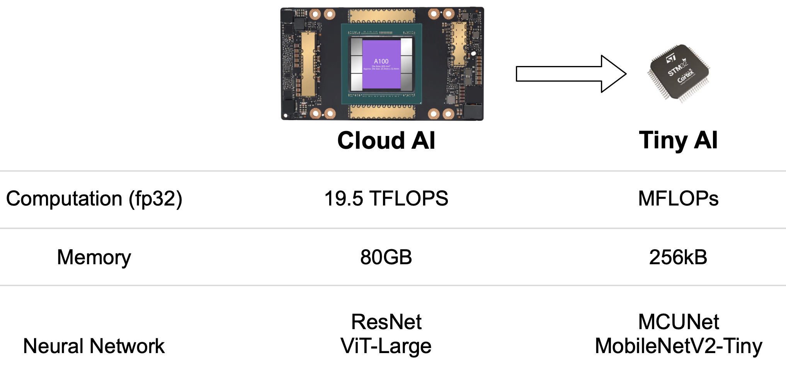

&emsp;&emsp;在解决资源受限的边缘设备上运行AI模型的挑战时，**知识蒸馏（Knowledge Distillation， KD）** 是一种有效的模型压缩技术，旨在通过大模型（教师模型）的指导来训练小模型（学生模型），从而提高小模型的性能，同时保持计算和内存的高效利用。

### 6.1.1 相关术语

&emsp;&emsp;知识蒸馏的核心思想是通过让小模型（学生模型）学习大模型（教师模型）的行为模式，从而在减少计算成本和模型大小的同时，保留教师模型的性能。知识蒸馏的目标是对齐教师模型和学生模型的输出概率分布。知识蒸馏如下图所示：

#### 教师模型(Teacher Model)
- 一个预先训练好的复杂模型，通常性能优异，但计算开销大。
- 提供软标签或者中间层的信息作为 “知识”，用于指导学生模型的学习。

#### 学生模型(Student Model)
- 一个较小、较简单的模型，旨在学习并模仿教师模型的行为。
- 通过学习教师模型的“知识”，学生模型能够在较小规模上实现接近教师模型的性能。

#### 硬标签(Hard Target)
- 实际训练数据集中为每个输入样本分配的真实类别标签（即标准的分类标签，0或1）。
- 硬标签是传统训练中使用的目标输出。

#### 软标签(Soft Target)
- 教师模型输出的概率分布，通常比硬标签(即One-Hot Lable)包含更多信息。
- 通过温度调节(Temperature)将输出的概率分布软化，使得学生模型能更好地学习概率间的相对关系。

#### 交叉熵损失（Cross-Entropy Loss）

- 学生模型使用硬标签计算的标准分类损失函数（交叉熵）。
- 衡量了模型预测的类别分布与真实标签之间的差异，帮助模型在常规分类任务中更好地学习。

## 6.1.2 知识蒸馏具体过程

&emsp;&emsp; 知识蒸馏的基本流程如上图所示，其中教师模型(Teacher Model)是已经训练好的模型，而学生模型(Student Model)则是需要被训练的模型。

&emsp;&emsp; 假设现在的任务是一个图像分类任务，$\mathbf x$为训练图片，$y$为对应的真实标签 (也称为硬标签Hard Label)，$K$表示分类任务的数据集对应的类别总数。
- 输入图片$\mathbf{x}$进入教师模型。通过 Softmax 函数处理输出结果，生成软目标（soft target），即$\mathbf{p} = [p_1, p_2, ..., p_K]$。教师模型的输出经过一个温度系数$T$调整，用于平滑概率分布，从而为学生模型提供更丰富的知识。

- 学生模型输入同样的图片$\mathbf{x}$也经过 Softmax 函数生成其自己的输出概率分布。学生模型同样使用温度系数$T$进行概率分布的平滑。

- 软损失(Soft loss)是学生模型和教师模型输出之间的损失，通常通过 KL散度（Kullback-Leibler Divergence）来衡量。这部分损失帮助学生模型学习教师模型的预测分布。

- 学生模型的输出还会与真实标签（hard target）$[0, 0， 1, 0, ..., 0, 0]$进行比较，计算交叉熵损失（cross-entropy loss），即硬损失。这部分损失确保学生模型在标准分类任务上仍然具有竞争力。

- 软损失和硬损失的加权和形成总损失，使用权重参数$\lambda$控制两者的平衡。通过调节 $\lambda$，可以控制学生模型在多大程度上依赖教师模型的指导与真实标签。

$$
\text { Total loss }=\lambda \times \text { Soft loss }+(1-\lambda) \times \text { Hard loss }
$$

## 6.1.3 温度

### 6.1.3.1 温度的作用

&emsp;&emsp; 温度在知识蒸馏中用于调整教师模型输出的概率分布，从而更好地指导学生模型的学习。

### 6.1.3.2 为什么需要温度

&emsp;&emsp; 教师模型的输出通常是一个类别概率分布，通过 Softmax 函数生成。如下表所示，当输入一张马的图片时，对于未调整温度（默认为1）的 Softmax 输出，正标签的概率接近 1，而负标签的概率接近 0。这种尖锐的分布对学生模型不够友好，因为它只提供了关于正确答案的信息，而忽略了错误答案的信息。即`驴比汽车更像马`，识别为驴的概率应该大于识别为汽车的概率。而通过温度调整后， 最后得到一个相对平滑的概率分布， 称为 “软标签” (Soft Label)。

|        标签    | 马   |  驴  | 汽车 |
| :--------: | :--: | :--: | :--: |
|img|  | | |
| 网络输出 | 6.0 | 2.0 | -2.0 |
| Softmax | 0.98 | 0.018 | 0.0003 |
| Hard Label(真实标签) | 1    |  0   |  0   |
| Soft Label(使用温度) | 0.75 | 0.25 | 0.05  |

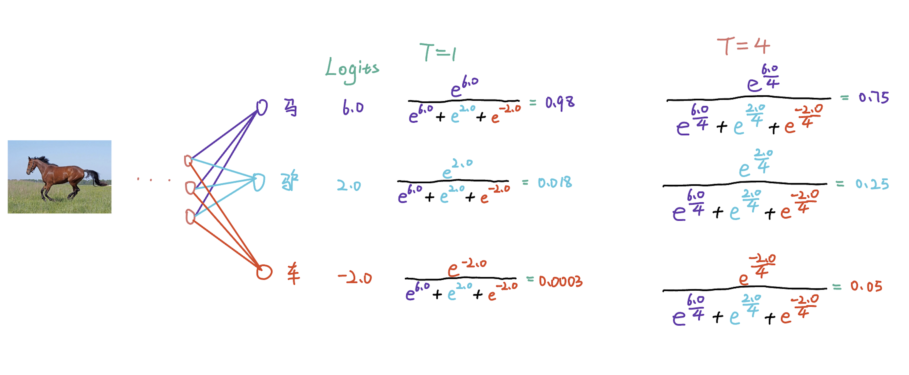

&emsp;&emsp; 可以发现， 网络的原始输出再经过Softmax后得到的概率分布， 和真实标签几乎一致。此时的分布忽略了类别之间的潜在关系。虽然原始输出的Softmax概率分布也能体现出这种关系， 但是差别不是很明显。 而加入温度后得到的 Soft Label， 其可以清晰的展示出不同类别之间的差别， 很好的反应了不同类别之间的相对关系。 这种细节可以帮助学生模型更好的理解输入样本的完整信息， 而不仅仅只是学习硬标签。

### 6.1.3.3 温度的计算过程

&emsp;&emsp; 假设某个模型的输出为 $z = [z_1, z_2, ..., z_K]$, 其中 $K$ 是类别数。 传统的Softmax为

$$
\frac{\exp {z_i}}{\sum _ {j=1} ^ K \exp {z_j}}
$$

&emsp;&emsp; 而带温度的Softmax计算方式为 

$$
\frac{\exp {z_i / \tau}}{\sum _ {j=1} ^ K \exp {z_j / \tau}}
$$

&emsp;&emsp; 其中 $\tau$ 表示的是温度。那么传统的Softmax也可以看作是温度 $\tau$ 为1的特殊情况。

&emsp;&emsp; 一个更加具体的例子， 如表所示 : 

<!--  -->

| 类别 | Logits(网络的直接输出) |                       Softmax (T=1)                        |                Softmax(T=4)                |
| :--: | :--------------------: | :--------------------------------------------------------: | :----------------------------------------------------------: |
|  马  |          6.0           |  $\frac{e^{6.0}}{e ^ {6.0} + e ^ {2.0}+ e^{-2.0}} = 0.98$  | $\frac{e^{\frac{6.0}{4}}}{e^{\frac{6.0}{4}} + e^{\frac{2.0}{4}} + e^{\frac{-2.0}{4}} }= 0.75$ |
|  驴  |          2.0           | $\frac{e^{2.0}}{e ^ {6.0} + e ^ {2.0}+ e^{-2.0}} = 0.018$  | $\frac{e^{\frac{2.0}{4}}}{e^{\frac{6.0}{4}} + e^{\frac{2.0}{4}} + e^{\frac{-2.0}{4}} } = 0.25$ |
|  车  |          -2.0          | $\frac{e^{-2.0}}{e ^ {6.0} + e ^ {2.0}+ e^{-2.0}} = 0.002$ | $\frac{e^{\frac{-2.0}{4}}}{e^{\frac{6.0}{4}} + e^{\frac{2.0}{4}} + e^{\frac{-2.0}{4}}}=0.05$ |

&emsp;&emsp;在实践中，为了能够有效地学习教师模型的分布，学生模型也需要在同样的条件下进行训练。即学生模型的输出同样需要使用相同的温度来计算softmax。这样，学生模型就能够更好地模仿教师模型的行为，因为它们都在相似的概率分布上进行比较和学习。最终，教师模型和学生模型的软标签分别为 $\mathbf{p}(\tau) = [p_1(\tau), p_2(\tau), ..., p_K(\tau)]$ 和 $\mathbf{q}(\tau) = [q_1(\tau), q_2(\tau), ..., q_K(\tau)]$。

&emsp;&emsp;$p_i(\tau)$ 和 $q_i(\tau)$ 的定义如下: 
$$
\begin{aligned}
    p_{i}(\tau) = \frac{\exp(u_i / \tau)}{\sum_{i=1}^K \exp(u_i / \tau)}   \\
    q_{i}(\tau) = \frac{\exp(v_i / \tau)}{\sum_{i=1}^K \exp(v_i / \tau)} 
\end{aligned}
$$
&emsp;&emsp;其中，$\tau$ 表示的是在蒸馏过程中使用的温度。当温度$\tau$ 为1的时候，此时 $\mathbf p(\tau)$ ,$\mathbf q(\tau)$ 的结果和一般的Softmax函数结果一致。

### 6.1.3.4 温度的大小对Logits的影响

&emsp;&emsp; 温度 $\tau$ 的大小会控制输出概率分布。较小的 $\tau$ 会导致输出概率分布更加尖锐，而较大的 $\tau$ 则会使输出概率分布更加平滑。如上图所示，其中最左侧Origin表示的是某个分类网络对任意一张图片的输出Logits的分布。其中横坐标表示的是具体的类别号，而纵轴表示的是网络对于具体某个类型的预测值。而最右侧的是对 Logits 进行 Argmax() 后的结果。 

&emsp;&emsp; 可以发现， 当温度很大的时候(例如 $\tau = 14$ )，此时Logits分布几乎接近一致， 而当温度很小的时候(例如 $\tau = 0.5$)，此时Logits 分布几乎等价于 Arg max() 的结果。也就是说， 当温度很大的时候， 教师网络软化后的 Logits 接近于平均值， 此时学生模型无法从教师模型那里学习到知识， 因为教师模型的 Logits 对于每一个类别的预测概率都是一致的。而当温度很小的时候， 此时蒸馏就失去了意义， 因为教师模型传递给学生的知识可以看作和 Hard Label等价。所以选择**合适的温度**对于蒸馏而言是至关重要的。 一般在 CIFAR-10/100 数据集上， 采用的温度是 $4$， 而在 ImageNet 数据集上， 一般使用的温度是 $1$。

> 当需要考虑负标签之间的关系时，可以采用较大的温度。例如，在自然语言处理任务中，模型可能需要学习到“猫”和“狗”之间的相似性，而不仅仅是它们的硬标签。在这种情况下，较大的温度可以使模型更好地捕捉到这些关系。反之，如果为了消除负标签中噪声的影响，可以采用较大的温度。

### 6.1.3.5 不同大小温度的蒸馏结果

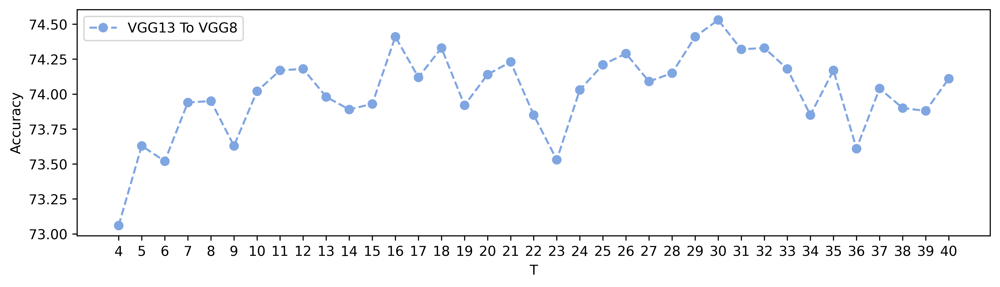

&emsp;&emsp; 上图分别展示了不同温度下将Res32x4蒸馏Res8x4及将VGG13蒸馏VGG8的准确率。实验所选择的数据集为 CIFAR-100。其中横轴表示的是在蒸馏中使用的温度， 纵轴表示的是在CIFAR-100验证集上的蒸馏结果。可以发现不同的温度对于蒸馏的结果影响是比较大的， 读者在自行实践时， 应多选择不同的温度进行尝试， 而非仅仅是依赖于经验性的设置。注意 : 目前并没有实验或者论文表明温度和精度之间的绝对关系。

## 6.1.4 知识蒸馏的损失函数

&emsp;&emsp;知识蒸馏的损失函数由软损失和硬损失线性结合构成， 具体的定义如下:

&emsp;&emsp;**软损失**

$$
\mathcal{L}_{\operatorname{KL}} = \operatorname {KL}(\mathbf{q}(\tau)， \mathbf{p}(\tau)) = \sum_j \ p_j(\tau) \log \frac{p_j(\tau)}{q_j(\tau)}
$$

&emsp;&emsp;**硬损失**

$$
\mathcal L_{CE} = \operatorname {CE}(\mathbf q(\tau = 1)， \mathbf y) = \sum _ {j} - y_j \log q_j(1)
$$

&emsp;&emsp;其中 $\mathbf{p}$ 和 $\mathbf{q}$ 分别表示教师模型和学生模型的输出Logits， 而 $\tau$ 表示的是蒸馏所使用的温度。最终的损失函数为 
$$
Loss = \alpha \cdot \mathcal L_{CE} + \beta \cdot \tau ^ 2 \cdot \mathcal L_{KL}\\
	=  \alpha \cdot \operatorname {CE}(\mathbf q(\tau = 1), \mathbf y) + \beta \cdot \tau ^ 2 \cdot \operatorname {KL}(\mathbf{q}(\tau), \mathbf{p}(\tau))
$$

&emsp;&emsp; 一般情况下， 要保持 $\alpha + \beta = 1$。 实践中 $\alpha$ 通常取 $0.1$， 而 $\beta$ 通常取 $0.9$。至于为什么要对软损失部分的 $\operatorname {KL}$ 乘一个 $\tau ^ 2$， 简单的解释是为了保持软损失和硬损失在梯度上的平衡， 而具体的推导过程请选择性的阅读 [6.7](#67-损失函数部分推导选修) 节。

## 6.2 知识蒸馏匹配内容

&emsp;&emsp;前面主要介绍了通过匹配教师网络和学生网络的输出logits进行知识蒸馏，除此之外， 还有很多可以其他匹配的内容。比如匹配教师网络和学生网络在中间层的特征、中间层的权重、中间层注意力图、中间层稀疏模式、不同层之间的相关信息、不同样本之间的相关信息等等。

### 6.2.1 匹配中间层权重

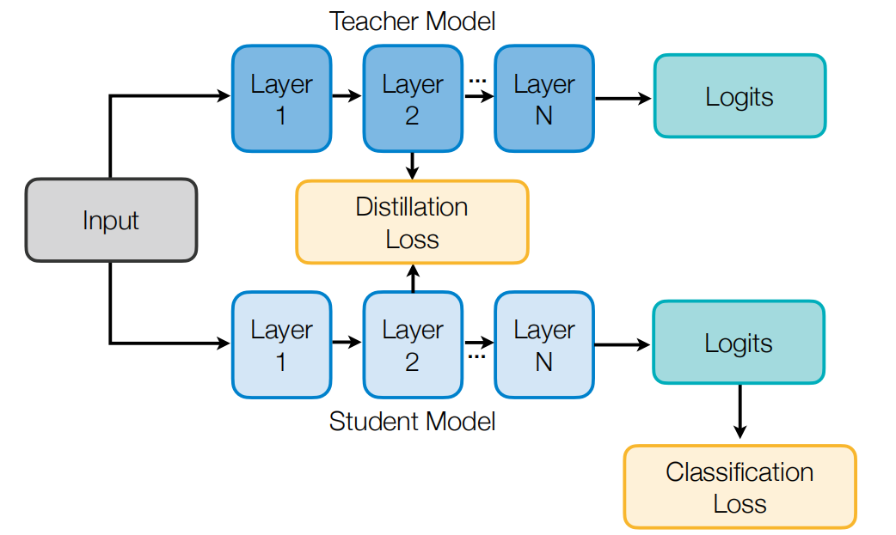

&emsp;&emsp; [FitNet](https://arxiv.org/abs/1412.6550) 通过匹配教师网络和学生网络在中间层的权重来进行训练，而不仅仅是匹配最终输出。这种利用中间层进行蒸馏的方法，就像向学生模型传授教师模型对输入的思考过程，而不仅仅是告知思考结果。但由于两者的中间层的维度是不匹配的，这里需要加入线性转换层（图b中的蓝色部分）来对齐教师网络和学生网络的维度。

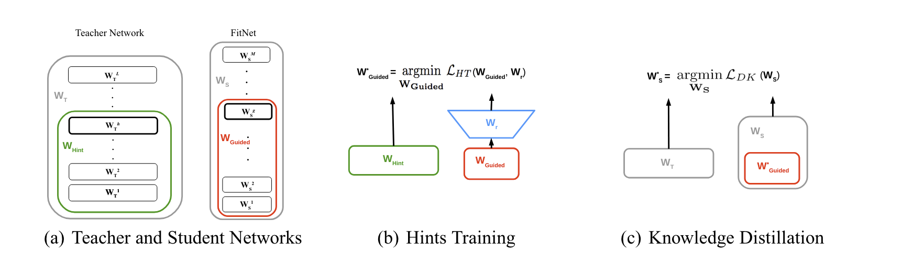

### 6.2.2 匹配中间层特征

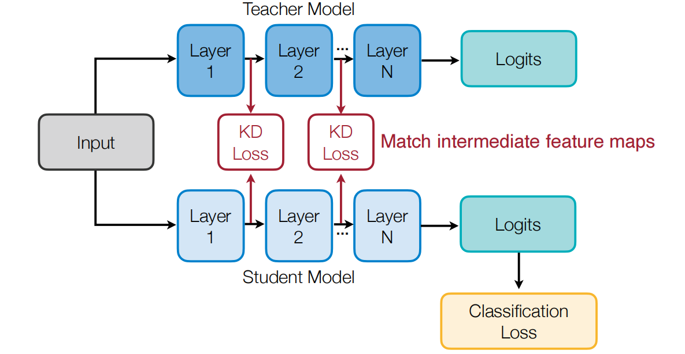

&emsp;&emsp;如上图所示，可以通过匹配中间层特征的方式进行知识蒸馏。教师模型和学生模型在每个对应的中间层之间进行特征图匹配，通过计算 KD Loss 来最小化它们之间的差异。[NST](https://arxiv.org/abs/1707.01219)将学生网络经过训练，使其中间层的激活分布与教师网络的激活分布保持一致。使用最大平均差异（MMD）作为损失函数来衡量教师和学生特征之间的差异。

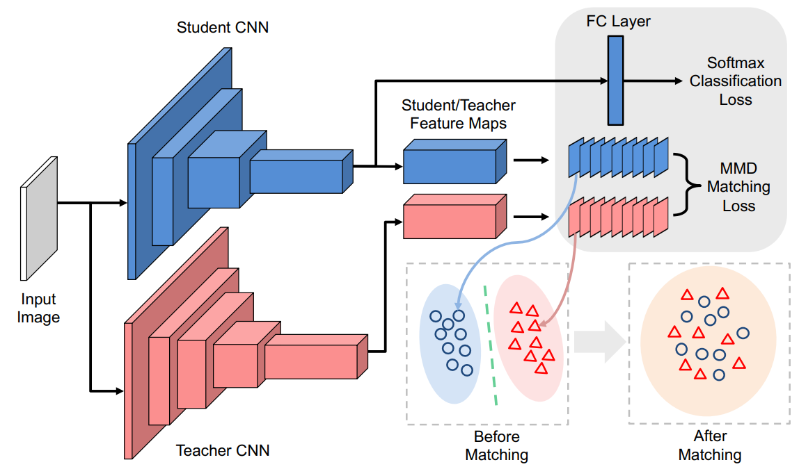

### 6.2.3 匹配中间层注意力图

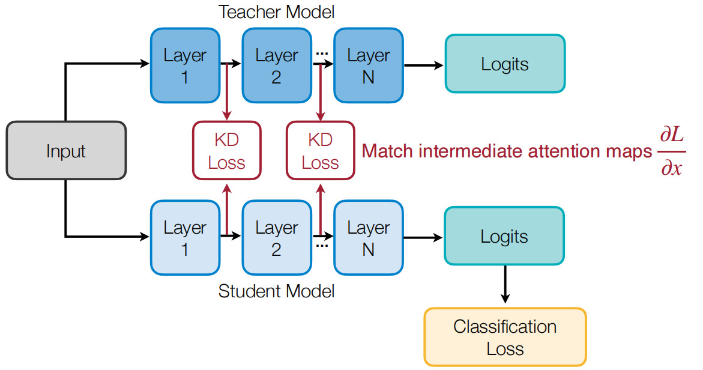

&emsp;&emsp;如上图所示，可以通过匹配中间层注意力图的方式进行知识蒸馏。一般通过特征图的梯度来表征深度神经网络（DNNs）的注意力机制，CNN（卷积神经网络）中特征图的注意力通过$\frac{\partial L}{\partial x}$表示，其中$L$表示损失函数，$x$表示特征图。注意力图可以用于表示特征图的重要性，注意力图越大，特征图越重要。如果$\frac{\partial L}{\partial x_{i,j}}$ 很大，意味着在位置 $i,j$ 处的一个小扰动将显著影响最终的输出。这表示网络对位置 $i,j$赋予了更多的注意力。如下图所示，左侧展示了输入图像（狼在雪地中休息），右侧展示了对应的注意力图。注意力图显示了网络对输入图像中的哪些部分更加关注，颜色越亮的区域表示注意力越集中。

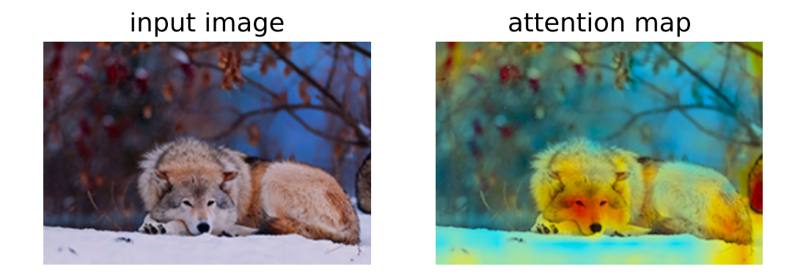

&emsp;&emsp;另外，还有一个有趣的现象，就是高性能模型具有相似的注意力图，如下图所示，图中比较了表现较好的 ResNet 模型与表现较差的 NIN 模型的注意力图。可以看到，ResNet34 和 ResNet101 模型的注意力图彼此相似，而 NIN 模型的注意力图则明显不同。结论：表现更好的模型（如 ResNet 系列）生成的注意力图更为相似，且能够更好地聚焦于输入图像的重要区域，而表现较差的模型（如 NIN）的注意力图则相对分散。

### 6.2.4 匹配中间层稀疏模式

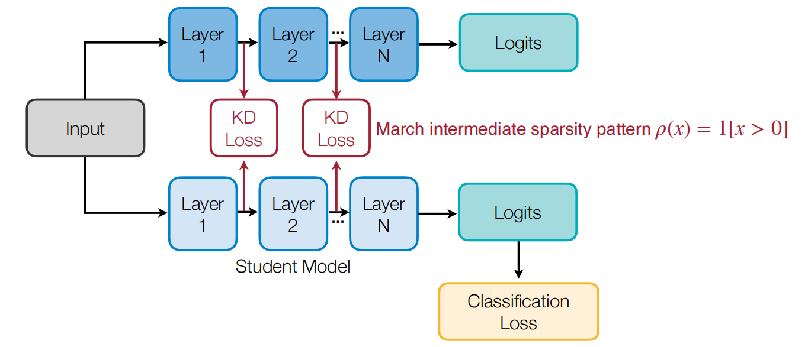

&emsp;&emsp;如上图所示，可以通过教师模型和学生模型在ReLU激活后的稀疏性模式匹配进行知识蒸馏。其核心思想是，教师和学生网络在激活后应具有相似的稀疏性模式。如果一个神经元经过激活后的值大于0，则表示成$\rho(x)=1[x>0]$。

### 6.2.5 匹配相关信息

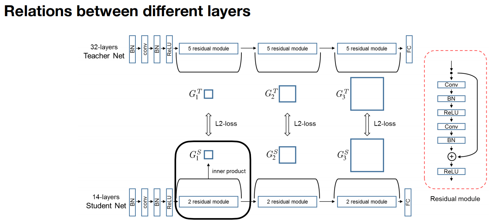

&emsp;&emsp;如上图所示，可以匹配教师模型和学生模型不同层之间的关系信息进行知识蒸馏。教师网络有32层，学生网络有14层。两者在层数上有所不同，但在通道数上相同。为了提取层之间的关系信息，图中使用了内积操作，生成一个形状为
$C_{\text {in }} \times C_{\text {out }}$的矩阵。教师网络和学生网络之间的关系通过匹配各自生成的内积结果来实现。每一层（如$G_1^T$ 和 $G_1^S$）之间通过 L2 损失进行比较，以确保学生网络学习到与教师网络相似的表示。

&emsp;&emsp;除了匹配教师模型和学生模型不同层之间的关系信息之外，还可以匹配不同样本之间的关系，如下图所示。图中比较了传统知识蒸馏（Conventional KD）和关系知识蒸馏（Relational KD）的区别。输入是几张不同的鸟类图片，通过深度神经网络（DNN）处理后，得到教师网络 $\left(f_T\right)$ 和学生网络 $\left(f_S\right)$ 的输出，分别用 $t_1, t_2, t_3$ (教师网络)和 $s_1, s_2, s_3$ (学生网络) 表示。传统知识蒸馏关注的是每个输入样本的特征或输出的对齐，即点对点的匹配。如下图左侧所示，学生网络的每个输出（如$s_1$）直接对应教师网络的相应输出（$t_1$）。关系知识蒸馏不仅仅关注单个输入样本的特征匹配，而是通过观察多个输入样本之间的关系结构，进行结构到结构的匹配。如下图右侧所示，教师网络的输出之间形成了关系结构（如$t_1$到$t_2$的连接），学生网络也学习并匹配相应的结构（如$s_1$到$s_2$的连接）。两者的区别在于关系知识蒸馏通过多个样本的中间特征之间的关系来进行学习和对齐，从而更全面地捕捉到教师网络与学生网络的特征映射。
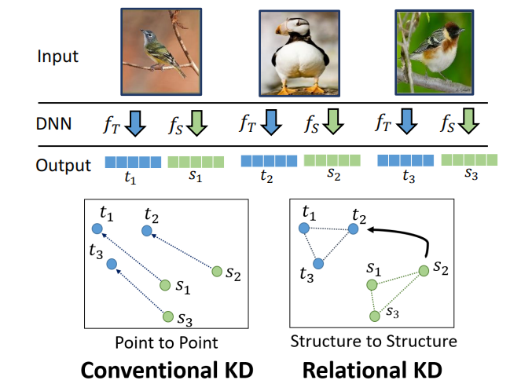

## 6.3 自蒸馏和在线蒸馏

&emsp;&emsp;回到我们最初的目的，我们想得到一个学生模型，但必须要训练一个大型的教师模型，这显然额外增加了开销。那么有没有一种方法可以简化这种操作吗？接下来进行介绍的自蒸馏（Self-distillation）和在线蒸馏（Online distillation）就是两种比较常用的方法。它们在训练过程中采用不同的策略来提取和传递知识。自蒸馏方法通常在训练过程中使用模型自身的输出作为教师模型的输出，而在线蒸馏方法则使用另一个模型（通常是教师模型）的输出作为知识源。这两种方法各有优缺点，具体选择哪种方法取决于具体的应用场景和需求。

### 6.3.1 自蒸馏

&emsp;&emsp;自蒸馏方法模型本身既充当教师模型，又充当学生模型, 学生模型并不依赖于外部的教师模型，而是从自己已有的知识中学习。自蒸馏方法在训练过程中，将模型的某一阶段（或初始模型）的输出作为指导信号，来训练模型的下一阶段。在多个训练步骤中，学生模型通过学习前一阶段的知识，不断提高自身的性能。如下图所示：
- Step 0：首先有一个教师网络 $T$ ，输入数据 $X$ 后得到输出 $f(x)$ ，并与真实标签 $y$ 进行对比，训练教师网络。
- Step 1: 在第一步中，使用教师网络的输出作为学生网络 $S_1$ 的监督信号，同时保留真实标签 $y$ 。学生网络基于教师网络的输出继续进行训练。
- Step K：经过多次迭代训练，每个新的学生网络 $S_k$ 都使用前一阶段学生网络的输出 $f_{k-1}(x)$ 进行训练。

 Born-Again网络通过添加迭代训练阶段，结合分类目标和蒸馏目标进行训练，使得每一步生成的新模型基于前一个模型的知识进行改进。其中，网络结构保持—致，即教师网络和所有学生网络 $T=S_1=S_2=\ldots=$ $S_k$ 。 随着训练的进行，网络的准确性逐步提升，即 $T<S_1<S_2<\ldots<S_k$。最后还可以通过集成多个阶段的网络 $T, S_1, S_2, \ldots, S_k$ 来进一步提高性能。

> 自蒸馏与传统的知识蒸馏的不同之处在于，自蒸馏无需额外的教师模型，模型本身通过自我监督，提升性能。

### 6.3.2 在线蒸馏

&emsp;&emsp;在线蒸馏主要思想是在教师网络和学生网络之间添加一个蒸馏目标，以最小化对方的输出分布。教师模型和学生模型同时进行训练，允许教师网络和学生网络相同,不需要像传统蒸馏那样事先训练出一个教师模型。两者可以同步更新并通过蒸馏损失相互监督和学习。如下图所示：
- 两个神经网络，分别由参数 $\Theta_1$ 和 $\Theta_2$ 表示，可以是相同或不同的网络，它们从头开始训练。
- 两个网络接收相同的输入图像（如一只鸟和一只狗），并分别生成预测结果 (logits) 。
- 然后，通过对比两个网络输出的概率分布，计算KL散度来约束网络之间的相互学习，同时每个网络也通过与真实标签进行交叉嫡损失来训练。

&emsp;&emsp;损失函数:
- 网络1的损失函数： $\mathcal{L}(S)=\mathrm{CrossEntropy}(S(I), y)+$ $\mathrm{KL}(S(I), T(I))$ 。
- 网络2的损失函数： $\mathcal{L}(T)=\operatorname{CrossEntropy}(T(I), y)+$ $\mathrm{KL}(T(I), S(I))$ 。

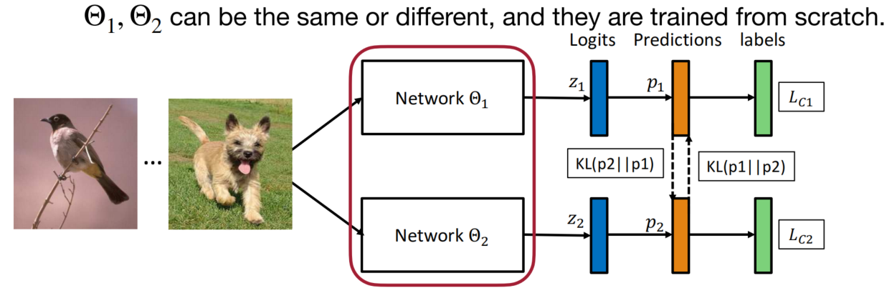

> 在线蒸馏与传统的蒸馏方法的不同之处在于，在线蒸馏通常是在训练过程中让教师模型和学生模型同时学习并相互传递知识，而传统蒸馏方法是预先训练一个教师模型再将知识传递给学生模型。

### 6.3.3 结合在线蒸馏和自蒸馏

&emsp;&emsp;此外，还可以结合在线蒸馏和自蒸馏方法，采用“成为你自己的老师”策略，通过深度监督 + 蒸馏来优化模型。使用深层网络的输出去蒸馏较浅层的预测，提升浅层的学习能力。模型不仅可以从自身的不同层次中学习，还可以通过在线的方式与其他模型进行相互学习。直觉上，越接近最后阶段的标签越可靠，因此可以用后期的标签监督前期的预测。具体流程如下图所示：
- 输入图像（如熊猫）经过多个ResBlock（残差块），每个残差块后接有瓶颈层（Bottleneck）和全连接层（FC Layer），最后输出分类结果。
- 每个瓶颈层的输出会被用于监督较浅层的输出：
  - 通过标签进行交叉熵损失。
  - 通过蒸馏计算KL散度损失，来自深层的监督用于指导浅层的输出。
  - 通过特征的L2损失（hints），提供来自深度网络的提示。

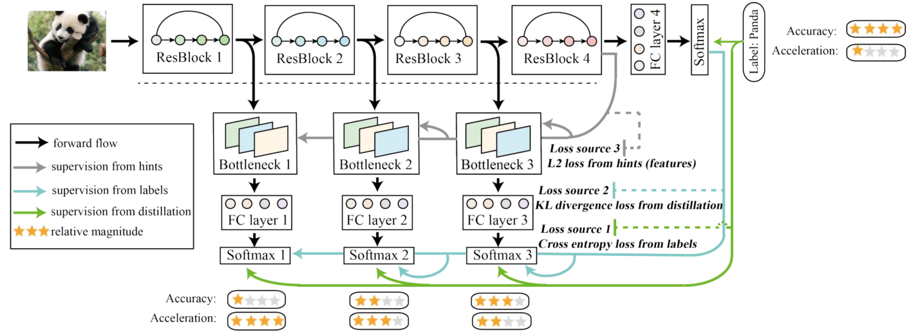

## 6.4 知识蒸馏的应用

&emsp;&emsp;知识蒸馏不仅适用于分类任务，还适用于回归任务，比如目标检测、语义分割等。知识蒸馏在回归问题中主要通过教师模型输出的“软标签”（Soft Label）为学生模型提供更加丰富的监督信息，从而帮助学生模型在回归任务中进行优化。与分类任务相比，回归问题的目标是预测连续值，而不是离散类别。

### 6.4.1 目标检测

&emsp;&emsp;目标检测任务不仅涉及物体类别的分类，还需要精确地预测物体在图像中的边界框位置。因此，目标检测中的知识蒸馏不仅需要处理分类任务中的类别监督，还需对回归任务中的边界框进行监督。在回归任务中，教师模型可以输出连续的回归值，这些值作为学生模型的目标，通过蒸馏损失引导学生模型学习。例如，在物体检测中的边界框回归任务中，教师模型可以输出精确的边界框位置，而学生模型通过模仿这些位置的预测来提升其回归能力。下图展示了目标检测中的知识蒸馏方法。

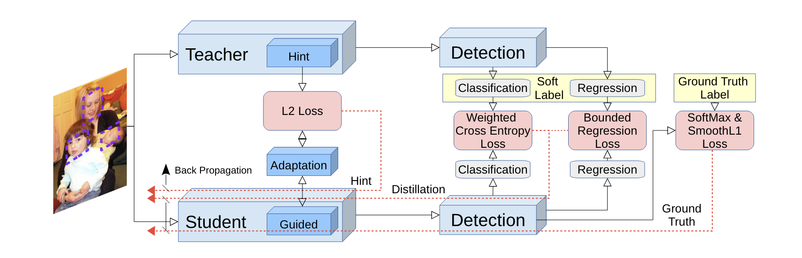

&emsp;&emsp;教师模型：

- 教师模型经过先前训练，拥有较好的检测和分类能力。通过教师模型的输出，学生模型可以学习到更有用的特征。
- 教师模型的特征图通过一种称为“Hint”的方式传递给学生模型，用于监督学生模型的学习。

&emsp;&emsp;学生模型：
- 学生模型通过学习教师模型传递的“Hint”特征图，适应和调整自身的特征提取过程。
- 通过L2损失和教师模型的特征图进行对比，调整学生模型的权重。
- 最终，学生模型通过模仿教师模型输出的软标签（Soft Label），通过反向传播进一步提高模型的性能。

&emsp;&emsp;检测模块：

- 教师和学生模型均包含检测模块，分别负责分类和回归。分类用于判断图像中的对象类别，而回归用于精确定位对象的位置。
- 在检测过程中，损失函数的设计至关重要。学生模型的损失由以下几个部分组成：
  - 加权交叉熵损失（Weighted Cross Entropy Loss）：主要用于处理分类任务，通过对前景和背景类别使用不同的权重，解决类别不平衡问题。在对象检测中，前景（如人、动物等）和背景（如天空、地面等）类别通常数量差异较大。通过对不同类别赋予不同的权重，可以避免模型过度偏向多数类别。
  - 边界回归损失（Bounded Regression Loss）：用于处理回归任务，即定位对象的框架。

&emsp;&emsp;蒸馏损失：

- 蒸馏的核心是通过KL散度（或其他损失函数）将教师模型的软标签传递给学生模型，帮助学生模型更好地学习预测概率分布。

&emsp;&emsp;在目标检测中，边界框需要至少2个坐标点,例如，左上角(x1,y1)和右下角(x2,y2)来精确地描述对象的位置。因此，边界框回归任务需要预测4个连续值。在知识蒸馏中具体要怎么做呢？如下图所示，在知识蒸馏中，教师模型可以输出这些连续值作为软标签，学生模型通过模仿这些值来学习边界框回归。通过将x轴和y轴分别划分为6个bin（即6个区间），把原本连续的回归问题转换为分类问题，即对每个点的坐标(x1,y1)和(x2,y2)在这些bin中进行分类。

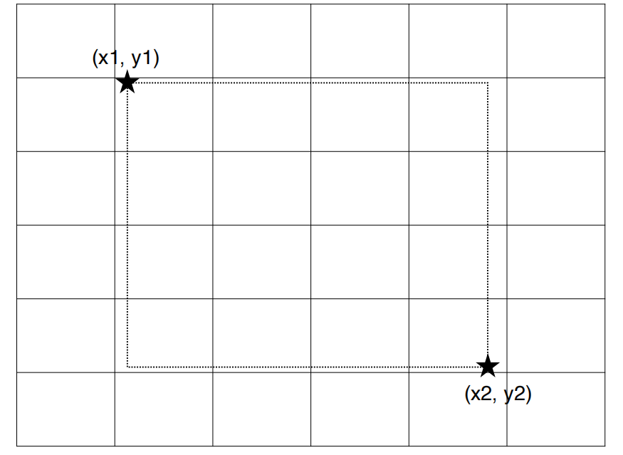

### 6.4.2 语义分割

&emsp;&emsp;知识蒸馏还可以应用于语义分割。如下图所示，通过像素级蒸馏、成对蒸馏和整体蒸馏来传递大型网络的知识，从而提高小型网络在语义分割任务上的性能

&emsp;&emsp;像素级蒸馏 (Pixel-wise Distillation):
- 将语义分割问题视为多个独立的像素分类问题。
- 利用知识蒸馏将大型网络（教师模型）产生的每个像素的类别概率作为软目标，来训练小型网络（学生模型）。

&emsp;&emsp;成对蒸馏 (Pair-wise Distillation):
- 基于成对马尔可夫随机场框架，传递像素对之间的相似性。
- 计算教师网络和学生网络产生的像素对的相似度，并使用平方差来定义成对相似度蒸馏损失。
  
&emsp;&emsp;整体蒸馏 (Holistic Distillation):
- 旨在对齐大型网络和小型网络产生的分割图之间的高阶关系。
- 采用条件生成对抗网络（Conditional GANs）来制定整体蒸馏问题。
- 将学生网络视为生成器，其预测的分割图视为假样本，教师网络的分割图视为真实样本。
- 使用Wasserstein距离来评估真实分布和假分布之间的差异。

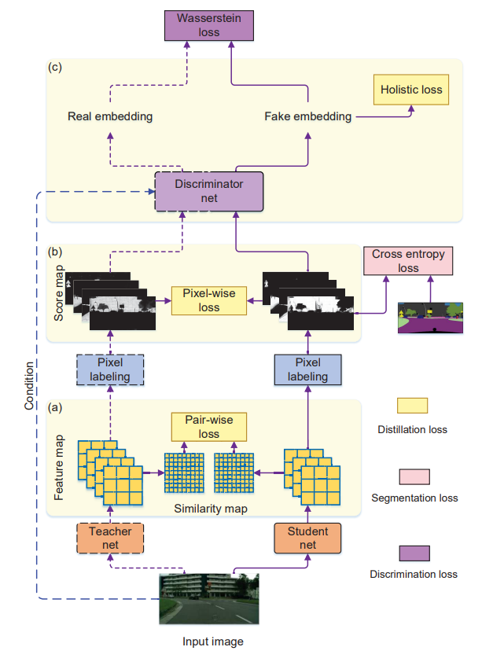

### 6.4.3 生成对抗网络（GAN）

&emsp;&emsp;知识蒸馏还可以应用于生成对抗网络（GAN）中。如下图所示，通过蒸馏、重构和对抗性损失，帮助学生生成器在保持性能的同时实现模型压缩。

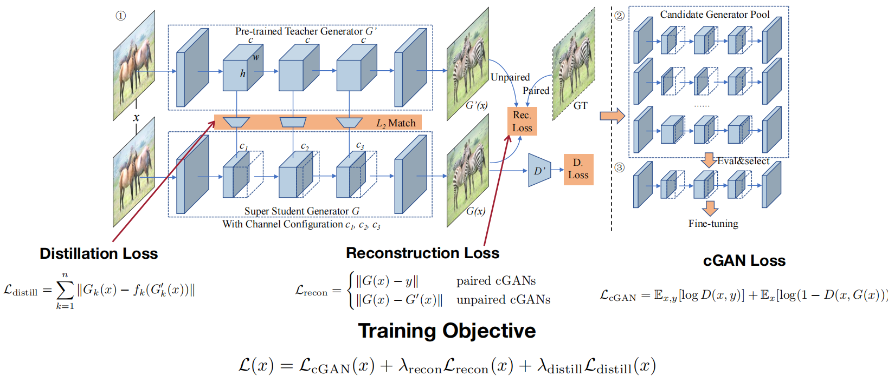

- 蒸馏损失：确保学生生成器学到教师生成器的特征和知识，有助于在压缩时保留性能。
- 重构损失：通过强制学生生成器的输出与真实数据或教师输出匹配，确保模型在生成任务中具有高质量的表现。
- 对抗损失：传统的GAN训练目标，保证学生生成器的输出在视觉上尽可能接近真实图像。

### 6.4.4 自然语言处理

&emsp;&emsp;知识蒸馏还可以应用于自然语言处理中。如下图所示，通过注意力传递（Attention Transfer）实现教师模型与学生模型之间的知识转移。左侧为教师模型，右侧为学生模型。两者的结构相似，均由嵌入层、线性层、注意力机制、多头注意力模块、前馈网络等组成，均有层级堆叠（Lx表示多个层叠加）。在蒸馏过程中，不仅转移了特征图，还特别强调了注意力图的传递（attention map transfer），让学生模型模仿教师模型的注意力分布。中间的红色虚线框表示注意力传递机制，通过这种机制，学生模型被训练成模仿教师模型在每一层中的注意力分布。右侧图中显示了教师模型、无注意力传递的学生模型、以及有注意力传递的学生模型在不同层次（L1到L12）和不同头（H1到H4）的注意力图对比。
- 教师模型：注意力图显示出较为清晰的注意力分布，表明其在处理输入时的注意力聚焦点。
- 无注意力传递的学生模型：注意力图较为模糊，注意力模式与教师模型的差异较大，显示其未能很好地捕捉教师模型的注意力模式。
- 有注意力传递的学生模型：注意力图更加接近教师模型，证明通过注意力传递，学生模型成功学习到了教师模型的注意力分布。

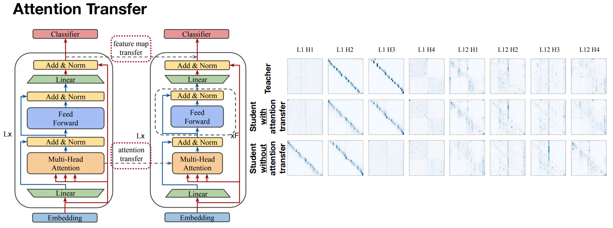

&emsp;&emsp;注意力机制是Transformer架构的重要部分，直接影响模型如何选择和处理输入信息。通过将教师模型的注意力图传递给学生模型，学生模型能够更好地理解输入特征，提升在不同任务中的性能。

## 6.5 网络增强

&emsp;&emsp;现有的正则化技术（例如，数据增强、dropout）通过添加噪声来克服过度拟合，在大型神经网络上取得了很大的成功。然而，这些技术会损害微型神经网络的性能。训练微型模型与大型模型不同：我们不应该增加数据，而应该增加模型，因为由于容量有限，微型模型往往会出现欠拟合而不是过度拟合。为了缓解这个问题，[NetAug](https://arxiv.org/abs/2110.08890) 增强了网络（反向 dropout），而不是向数据集或网络中插入噪声。如下图所示，它将微小模型放入更大的模型中，并鼓励它除了作为独立模型发挥作用之外，还作为更大模型的子模型来获得额外的监督。

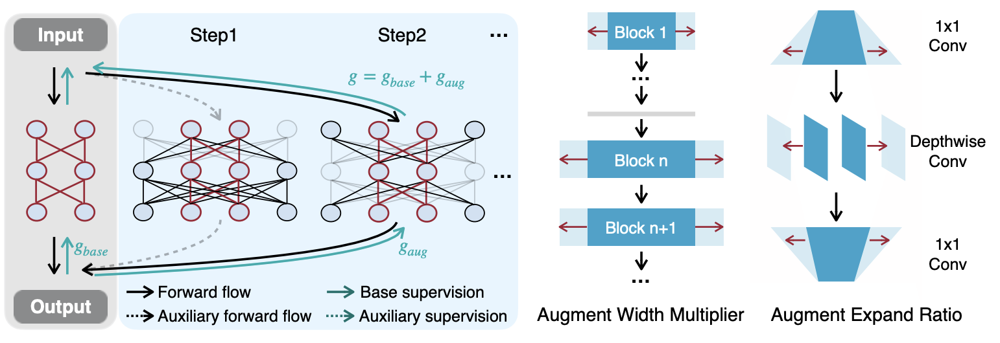

&emsp;&emsp;在上图中，左图展示了如何通过将一个小型神经网络嵌入到更大的神经网络中来增强它们。它们共享权重，小型神经网络被监督以生成对更大网络有用的表示。每个训练步骤都会抽取一个增强网络，以提供添加到基础监督中的辅助监督。在测试时，仅使用小型网络进行推理，没有额外开销。右图：解释了通过宽度乘数和扩展比率来实际实施NetAug的方法。这是在增强小型神经网络过程中使用的一种结构调整方法。

## 6.6 实践

- [KD知识蒸馏](https://github.com/datawhalechina/awesome-compression/blob/main/docs/notebook/ch06/1.kd.ipynb)
- [DKD解耦知识蒸馏](https://github.com/datawhalechina/awesome-compression/blob/main/docs/notebook/ch06/2.dkd.ipynb)

## 6.7 损失函数部分推导(选修)

### 6.7.1 Softmax函数求导

&emsp;&emsp;假设对于一个任意的 Logits 向量 $\mathbf z = [z_1, z_2, ..., z_{K}]\in \mathbb{R}^{1\times K}$, 其中 $K$ 是数据集的类别数。通过带温度的Softmax函数计算后得到向量 $\mathbf s = [s_1(\tau), s_2(\tau), ..., s_K(\tau)]$ ，其中 $s_i(\tau)$ 的定义为 : 
$$
s_i(\tau) = \frac{e^{z_i/ \tau}}{\sum_{j=1}^K e^{z_j / \tau}}
$$

&emsp;&emsp;对于任意 $z_k \in \mathbf z$ ,   $s_i(\tau)$ 对 $z_k$ 的偏导分为两种情况:

&emsp;&emsp; 当 $i = k$ 时， 有
$$
\begin{align*}
  \frac{\partial s_i(\tau)}{\partial z_k}
  &= \frac{\partial}{\partial z_k}\frac{e^{z_k / \tau}}{\sum_{j=1}^K e^{z_j / \tau}} \\ 
  &= \frac{\frac{\partial}{\partial z_k}e^{z_k / \tau}\ \sum_{j=1}^K e^{z_j / \tau} - e^{z_k / \tau}\ \frac{\partial}{\partial z_k}\sum_{j=1}^K e^{z_j / \tau}}{\left( \sum_{j=1}^K e^{z_j / \tau}\right) ^ 2} \\
  &= \frac{\frac{1}{\tau}\ e^{z_k/ \tau}}{\sum_{j=1}^K e^{z_j / \tau}} - \frac{e^{z_k/ \tau }\ \frac{1}{\tau}\ e^{z_k/ \tau }}{\left( \sum_{j=1}^K e^{z_j / \tau}\right) ^ 2}\\ 
  &= \frac{1}{\tau} (s_k(\tau) - s_k(\tau)\ s_k(\tau)) \\
  &= \frac{1}{\tau}\ s_k(\tau)\ (1 - s_k(\tau))
\end{align*}
$$

&emsp;&emsp; 当 $i \neq k$ 时， 有
$$
\begin{align*}
  \frac{\partial s_i(\tau)}{\partial z_k}
  &= \frac{\partial}{\partial z_k}\frac{e^{z_i / \tau}}{\sum_{j=1}^K e^{z_j / \tau}} \\ 
  &= \frac{\frac{\partial}{\partial z_k}e^{z_i / \tau}\ \sum_{j=1}^K e^{z_j / \tau} - e^{z_i / \tau}\ \frac{\partial}{\partial z_k}\sum_{j=1}^K e^{z_j / \tau}}{\left( \sum_{j=1}^K e^{z_j / \tau}\right) ^ 2} \\
  &= 0 - \frac{e^{z_i/ \tau }\frac{1}{\tau}e^{z_k/ \tau }}{\left(\sum_{j=1}^K e^{z_j / \tau}\right) ^ 2}\\ 
  &= -\frac{1}{\tau}\ s_i(\tau)\ s_k(\tau)
\end{align*}
$$

&emsp;&emsp; 因此， 对于 $\varphi (z_i)$ 对 $z_k$ 偏导有
$$
\frac{\partial s_i(\tau)}{\partial z_k} =
\left\{
\begin{matrix}
\frac{1}{\tau}\ s_k(\tau)\ (1 - s_k(\tau))& \text{if } i = k \\
-\frac{1}{\tau}\ s_i(\tau)\ s_k(\tau) & \text{if } i \neq k
\end{matrix}
\right.
$$

### 6.7.2 硬损失CE求导

&emsp;&emsp;对于学生模型的输出logits $\mathbf{v} = [v_1, v_2, ..., v_K] \in \mathbb{R}^{1\times K}$ 中任意一个 $v_k$ ， 硬损失 $ \mathcal L_{CE}$ 对 $v_k$ 的梯度为 :
$$
\begin{align*}
\mathcal L_{CE} &= \operatorname {CE}(\mathbf q(\tau = 1), \mathbf y) \\ 
&= \sum _ {j=1}^K - y_j \log q_j(\tau = 1) \\
\frac{\partial \mathcal L_{CE}}{\partial v_k} &= \frac{\partial}{\partial v_k}\sum _ {j=1}^K - y_j \log q_j(\tau = 1)\\
&= \frac{\partial}{\partial v_k}\sum _ {j=1, j\neq k}^K - y_{j} \log q_j(\tau = 1) + \frac{\partial}{\partial v_k} - y_k \log q_k(\tau = 1)\\
&= \sum _ {j=1, j\neq k}^K - y_{j} \frac{1}{q_j(\tau=1)}\ \frac{-1}{\tau=1}q_j(\tau=1)q_k(\tau=1) \\ &\ \ \ \ \ \ - y_k \frac{1}{q_k(\tau=1)}\frac{1}{\tau=1}q_k(\tau=1)(1-q_k(\tau=1))\\
&= \frac{1}{1}(1-y_k)q_k(\tau=1) - \frac{1}{1}y_k(1-q_k(\tau=1))\\
&= q_k(\tau=1) - y_k \\
\end{align*}
$$

### 6.7.3 软损失KL求导

&emsp;&emsp;软损失$\mathcal L_{KL}$为教师模型的软标签$\mathbf p(\tau)$ 和学生模型的软标签 $\mathbf q(\tau)$  的KL散度。$\mathcal L_{KL}$ 对于学生模型的输出中任意一个 $v_k$ 的梯度为
$$
\begin{align*}
\mathcal{L}_{\operatorname{KL}} &= \operatorname {KL}(\mathbf{q}(\tau), \mathbf{p}(\tau)) \\
&= \sum_{j=1}^{K} \ p_j(\tau) \log \frac{p_j(\tau)}{q_j(\tau)} \\
\frac{\partial \mathcal{L}_{\operatorname{KL}}}{\partial v_k} &= \frac{\partial}{\partial v_k} \sum_{j=1}^{K} \ p_j(\tau) \log \frac{p_j(\tau)}{q_j(\tau)} \\
&= \frac{\partial}{\partial v_k} \sum_{j=1}^{K} \left( \ p_j(\tau) \log {p_j(\tau)} - p_j(\tau)\log{q_j(\tau)} \right) \\
&= \frac{\partial}{\partial v_k} \left(\sum_{j=1}^{K} - p_j(\tau)\log{q_j(\tau)}\right) \\
&= \frac{\partial}{\partial v_k} \left( \sum_{j=1, j\neq k} ^ K -p_j(\tau) \log q_j(\tau)  -p_k(\tau) \log q_k(\tau) \right) \\
&= \sum_{j=1, j\neq k}^K \left( -p_j(\tau) \frac{\partial}{\partial v_k} \log q_j(\tau)\right) - \frac{\partial}{\partial v_k} p_k(\tau) \log q_k(\tau)\\
&= \sum_{j=1, j\neq k}^K -\frac{p_j(\tau)}{q_j(\tau)}\left[ -\frac{1}{\tau}q_j(\tau)q_k(\tau) \right] - \frac{p_k(\tau)}{q_k(\tau)}\left[ \frac{1}{\tau} q_k(\tau)(1 - q_k(\tau))\right]\\ 
&\approx \frac{1}{\tau}  \sum_{j=1, j\neq k}^K p_j(\tau) q_k(\tau) - \frac{1}{\tau} p_k(\tau)(1 - q_k(\tau)) \ \ \ \text{where} \sum_{j=1}^K p_j(\tau)\approx 1\\
&= \frac{1}{\tau} (1 - p_k(\tau))q_k(\tau) - \frac{1}{\tau} p_k(\tau)(1 - q_k(\tau)) \\
&= \frac{1}{\tau} \left[ q_k(\tau) - p_k(\tau)q_k(\tau) - p_k(\tau) + p_k(\tau)q_k(\tau)\right] \\
&= \frac{q_k(\tau) - p_k(\tau)}{\tau}
\end{align*}
$$

### 6.7.4 泰勒逼近

&emsp;&emsp;对于 $e^x$ ， 当 $x$ 趋于 0 的时候有 $e^x \approx 1 + x + ...$

&emsp;&emsp;最终， 硬损失CE和软损失KL对于$v_k$ 的梯度为:
$$
\left\{
\begin{matrix}
\frac{\partial \mathcal L_{CE}}{\partial v_k} = q_k(\tau=1) - y_k
\\
\frac{\partial \mathcal{L}_{\operatorname{KL}}}{\partial v_k} = \frac{1}{\tau}(q_k(\tau) - p_k(\tau))
\end{matrix}
\right.
$$

&emsp;&emsp;对于$\frac{\partial \mathcal L_{CE}}{\partial v_k}$ 展开有 :
$$
\begin{align*}
\frac{\partial \mathcal L_{CE}}{\partial v_k} &= q_k(\tau=1)-y_k\\
&= \frac{e^{v_k}}{\sum_{j=1}^K e^{v_j}} - y_k \\
&\approx \frac{1+v_k}{\sum_{j=1}^K 1 + v_j} - y_k  , \text{where} \sum v_j = 0\\
&= \frac{1+v_k}{K} - y_k\\
\end{align*}
$$
​
&emsp;&emsp;对于 $\frac{\partial \mathcal{L}_{\operatorname{KL}}}{\partial v_k}$ 展开有 :
$$
\begin{align*}
\frac{\partial \mathcal{L}_{\operatorname{KL}}}{\partial v_k} &= \frac{1}{\tau}(q_k(\tau) - p_k(\tau))\\
&= \frac{1}{\tau} (\frac{e^{v_k/\tau}}{\sum_{j=1}^K e^{v_j / \tau}} - \frac{e^{u_k/ \tau}}{\sum_{j=1}^K e^{u_k/\tau}}) \\
&\approx \frac{1}{\tau}(\frac{1 + v_k/\tau}{\sum_{j=1}^K (1 + v_j/\tau)} - \frac{1+u_k/\tau}{\sum_{j=1}^K (1+u_j/ \tau)})\\
&= \frac{1}{\tau}(\frac{v_k/\tau - u_k}{K}) \\
&= \frac{1}{K \ \tau^2} v_k - \frac{u_k}{K\tau}
\end{align*}
$$

&emsp;&emsp;此时可以发现， 硬损失中梯度对于$v_k$ 的部分时软损失的梯度中对于$v_k$部分的 $\tau ^ 2$ 倍， 所以在最终计算损失函数Loss的时候， 需要给 $\mathcal{L}_{\operatorname{KL}}$ 乘上一个 $\tau ^ 2$ 以平衡两个损失之间的梯度。

## 6.8 更多KD资料

- [mdistiller](https://github.com/megvii-research/mdistiller)