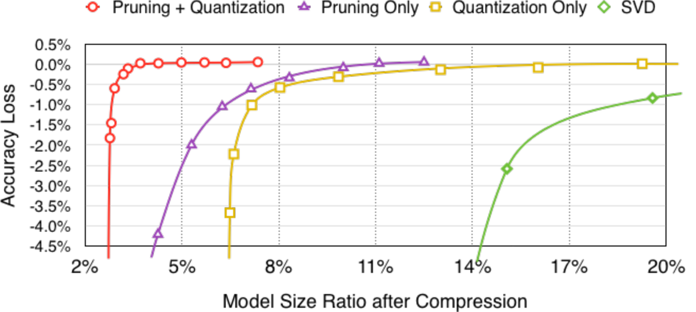

# 第7章 项目实践

&emsp;&emsp;在前面的章节里，我们分别学习了剪枝、量化、神经网络架构搜索及知识蒸馏等模型压缩技术，那么你能融合两种以上的技术对模型进行压缩吗？
> 任务：根据前面已学内容，选择一种实际应用场景，使用两种及以上技术对模型进行压缩并对比效果~

## 7.1 总结

&emsp;&emsp;本教程中提到的模型压缩算法，剪枝、量化、蒸馏、神经网络架构搜索，在实际应用中相互垂直，各有自己适用的场景和取舍。然而我们可以将多种模型压缩算法进行结合，以达到更好的效果。

&emsp;&emsp;目前，模型压缩算法的结合运用包括但不限于：
- 剪枝与量化结合
- 知识蒸馏与量化结合
- 剪枝与知识蒸馏结合
- 神经架构搜索与知识蒸馏结合
- 知识蒸馏与剪枝，量化结合
- 神经网络架构搜索与剪枝，量化结合

&emsp;&emsp;本教程将结合实际中的应用，对于常见的图像分类任务，通过对ResNet-18模型应用不同的压缩方法，并从硬件效率提升，模型能力保留(考虑实现难度，主要基于CIFAR-10数据集)，与算法实现难度的角度进行对比。

&emsp;&emsp;剪枝和量化都可以很好地减少模型权重和激活值中的冗余，从而减少模型的大小和计算量。因为二者都可以在后训练阶段进行，并且相对来说需要的计算资源可以较少，是模型压缩结合的热门方向。Song Han et.al (2016)在论文[Deep Compression: Compressing Deep Neural Networks with Pruning, Trained Quantization and Huffman Coding](https://arxiv.org/abs/1510.00149)中的实验中表明，比起单独的剪枝或量化，将剪枝与量化结合，可以高压缩率时更好地保持模型的准确度。



&emsp;&emsp;前面的章节提到：

>剪枝（从时机上）可以分为：
> - 训练后剪枝 （静态稀疏性）
> - 训练时剪枝 （动态稀疏性）
> - 训练前剪枝

>而量化主要分为：
> - 训练后量化 PTQ
> - 量化感知训练 QAT

&emsp;&emsp;对于部署和压缩加速已有的预训练模型，在时间和计算资源相对有限时，常用的解决方案是将训练后剪枝和训练后量化结合。具体例子可参考[剪枝和量化结合实践](https://github.com/datawhalechina/awesome-compression/blob/main/docs/notebook/ch07/7.1_prune_quant.ipynb)。

## 7.2 NNI

## 7.2.1 NNI简介
NNI（Neural Network Intelligence）是一个开源的自动机器学习（AutoML）工具，由微软亚洲研究院推出。它可以帮助用户自动化地进行超参数调优、神经网络架构搜索、模型压缩和特征工程等任务。NNI 支持多种深度学习框架，如PyTorch、TensorFlow等，并且可以在多种训练平台上运行，包括本地机器、远程服务器、Kubernetes等。NNI主要有以下功能：

- 剪枝
    - `Level Pruner`:根据权重元素的绝对值对每个权重元素进行指定比例的剪枝。
    - `L1 Norm Pruner`:使用最小 L1 权重范数修剪输出通道。
    - `L2 Norm Pruner`:使用最小 L2 权重范数修剪输出通道。
    - `FPGM Pruner`:通过几何中值进行滤波器剪枝的深度卷积神经网络加速。
    - `Slim Pruner`:通过修剪 BN 层中的缩放因子来修剪输出通道。
    - `Taylor FO Weight Pruner`:基于权重一阶泰勒展开式的剪枝滤波器。
    - `Linear Pruner`:稀疏率在每一轮剪枝期间线性增加，在每一轮中，使用基本剪枝器来剪枝模型。
    - `AGP Pruner`:自动渐进剪枝。
    - `Movement Pruner`:运动剪枝：通过微调实现自适应稀疏性。
- 量化
    - `QAT Quantizer`：用于高效整数算术推理的神经网络的量化和训练。
    - `DoReFa Quantizer`：DoReFa-Net：训练具有低位宽梯度的低位宽卷积神经网络。
    - `BNN Quantizer`：二值化神经网络：训练权重和激活限制为 +1 或 -1 的深度神经网络。
    - `LSQ Quantizer`：学习步长量化。
    - `PTQ Quantizer`：训练后量化。
- 神经网络架构搜索
    - 搜索空间设计：定义一组要探索的模型的模型搜索空间。
    - 搜索策略选择：用于探索模型搜索空间的算法。
    - 性能评估：负责训练模型并评估其性能。
- 知识蒸馏
    - `DynamicLayerwiseDistiller`：每个学生模型蒸馏目标（即学生模型中层的输出）将链接到该蒸馏器中的教师模型蒸馏目标列表。在蒸馏过程中，学生目标将计算与其链接的每个教师目标的蒸馏损失列表，然后选择损失列表中的最小损失作为当前学生目标蒸馏损失。最终蒸馏损失是每个学生目标蒸馏损失乘以 lambda 的总和。最终的训练损失是原始损失乘以 origin_loss_lambda 加上最终的蒸馏损失。
    - `Adaptive1dLayerwiseDistiller`：该蒸馏器将通过在学生蒸馏目标和教师蒸馏目标之间添加可训练的torch.nn.Linear来自适应地调整学生蒸馏目标和教师蒸馏目标之间的最后一个维度。 （如果学生和教师之间的最后一个维度已经对齐，则不会添加新的线性图层。）

此外，NNI还支持超参数调优、特征工程和实验管理，更多内容请查看[NNI文档](https://nni.readthedocs.io/zh/stable/nas/overview.html)

### 7.2.2 安装

```python
pip install nni pytorch_lightning
```
### 7.2.3 实践

- [NNI剪枝实践](https://github.com/datawhalechina/awesome-compression/blob/main/docs/notebook/ch07/nni/1.nni_pruning.ipynb)
- [NNI量化实践](https://github.com/datawhalechina/awesome-compression/blob/main/docs/notebook/ch07/nni/2.nni_quantization.ipynb)
- [NNI神经网络架构搜索实践](https://github.com/datawhalechina/awesome-compression/blob/main/docs/notebook/ch07/nni/3.nni_nas.ipynb)
- [使用NNI对模型进行剪枝、量化、蒸馏压缩](https://github.com/datawhalechina/awesome-compression/blob/main/docs/notebook/ch07/nni/4.nni_pqd.ipynb)

# 引用资料
- [NNI](https://github.com/microsoft/nni/?tab=readme-ov-file)

