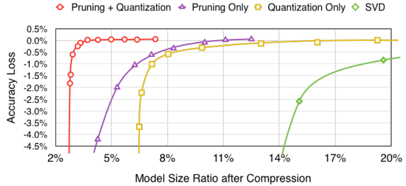

# 第8章 项目实践

&emsp;&emsp;在前面的章节里，我们分别学习了剪枝、量化、神经网络架构搜索、知识蒸馏与低秩分解等模型压缩技术，那么你能融合两种以上的技术对模型进行压缩吗？
> 任务：基于前面已学知识，选择一种实际应用场景，不限框架和方法，使用两种及以上技术对模型进行压缩并对比前后效果~

## 总结

&emsp;&emsp;本教程中提到的模型压缩算法，剪枝、量化、蒸馏、神经网络架构搜索，在实际应用中相互垂直，各有自己适用的场景和取舍。然而我们可以将多种模型压缩算法进行结合，以达到更好的效果。

&emsp;&emsp;目前，模型压缩算法的结合运用包括但不限于：
- 剪枝与量化结合
- 知识蒸馏与量化结合
- 剪枝与知识蒸馏结合
- 神经架构搜索与知识蒸馏结合
- 知识蒸馏与剪枝，量化结合
- 神经网络架构搜索与剪枝，量化结合
- 剪枝与低秩分解结合
- 量化与低秩分解结合

&emsp;&emsp;本教程将结合实际中的应用，对于常见的图像分类任务，通过对ResNet-18模型应用不同的压缩方法，并从硬件效率提升，模型能力保留(考虑实现难度，主要基于CIFAR-10数据集)，与算法实现难度的角度进行对比。

&emsp;&emsp;剪枝和量化都可以很好地减少模型权重和激活值中的冗余，从而减少模型的大小和计算量。因为二者都可以在后训练阶段进行，并且相对来说需要的计算资源可以较少，是模型压缩结合的热门方向。Song Han et.al (2016)在论文[Deep Compression: Compressing Deep Neural Networks with Pruning, Trained Quantization and Huffman Coding](https://arxiv.org/abs/1510.00149)中的实验中表明，比起单独的剪枝或量化，将剪枝与量化结合，可以高压缩率时更好地保持模型的准确度。



&emsp;&emsp;前面的章节提到：

>剪枝（从时机上）可以分为：
> - 训练后剪枝 （静态稀疏性）
> - 训练时剪枝 （动态稀疏性）
> - 训练前剪枝

>而量化主要分为：
> - 训练后量化 PTQ
> - 量化感知训练 QAT

&emsp;&emsp;对于部署和压缩加速已有的预训练模型，在时间和计算资源相对有限时，常用的解决方案是将训练后剪枝和训练后量化结合。具体例子可参考[剪枝和量化结合实践](https://github.com/datawhalechina/awesome-compression/blob/main/docs/notebook/ch07/1.prune_quant.ipynb)。

## NNI

## NNI简介
NNI（Neural Network Intelligence）是一个开源的自动机器学习（AutoML）工具，由微软亚洲研究院推出。它可以帮助用户自动化地进行超参数调优、神经网络架构搜索、模型压缩和特征工程等任务。NNI 支持多种深度学习框架，如PyTorch、TensorFlow等，并且可以在多种训练平台上运行，包括本地机器、远程服务器、Kubernetes等。NNI主要有以下功能：

- 剪枝
    - `Level Pruner`:根据权重元素的绝对值对每个权重元素进行指定比例的剪枝。
    - `L1 Norm Pruner`:使用最小 L1 权重范数修剪输出通道。
    - `L2 Norm Pruner`:使用最小 L2 权重范数修剪输出通道。
    - `FPGM Pruner`:通过几何中值进行滤波器剪枝的深度卷积神经网络加速。
    - `Slim Pruner`:通过修剪 BN 层中的缩放因子来修剪输出通道。
    - `Taylor FO Weight Pruner`:基于权重一阶泰勒展开式的剪枝滤波器。
    - `Linear Pruner`:稀疏率在每一轮剪枝期间线性增加，在每一轮中，使用基本剪枝器来剪枝模型。
    - `AGP Pruner`:自动渐进剪枝。
    - `Movement Pruner`:运动剪枝：通过微调实现自适应稀疏性。
- 量化
    - `QAT Quantizer`：用于高效整数算术推理的神经网络的量化和训练。
    - `DoReFa Quantizer`：DoReFa-Net：训练具有低位宽梯度的低位宽卷积神经网络。
    - `BNN Quantizer`：二值化神经网络：训练权重和激活限制为 +1 或 -1 的深度神经网络。
    - `LSQ Quantizer`：学习步长量化。
    - `PTQ Quantizer`：训练后量化。
- 神经网络架构搜索
    - 搜索空间设计：定义一组要探索的模型的模型搜索空间。
    - 搜索策略选择：用于探索模型搜索空间的算法。
    - 性能评估：负责训练模型并评估其性能。
- 知识蒸馏
    - `DynamicLayerwiseDistiller`：每个学生模型蒸馏目标（即学生模型中层的输出）将链接到该蒸馏器中的教师模型蒸馏目标列表。在蒸馏过程中，学生目标将计算与其链接的每个教师目标的蒸馏损失列表，然后选择损失列表中的最小损失作为当前学生目标蒸馏损失。最终蒸馏损失是每个学生目标蒸馏损失乘以 lambda 的总和。最终的训练损失是原始损失乘以 origin_loss_lambda 加上最终的蒸馏损失。
    - `Adaptive1dLayerwiseDistiller`：该蒸馏器将通过在学生蒸馏目标和教师蒸馏目标之间添加可训练的torch.nn.Linear来自适应地调整学生蒸馏目标和教师蒸馏目标之间的最后一个维度。 （如果学生和教师之间的最后一个维度已经对齐，则不会添加新的线性图层。）

此外，NNI还支持超参数调优、特征工程和实验管理，更多内容请查看[NNI文档](https://nni.readthedocs.io/zh/stable/nas/overview.html)

### 安装

```python
pip install nni pytorch_lightning
```
### 实践

#### NNI剪枝实践

模型剪枝是一种通过减少模型权重大小或中间状态大小来减少模型大小和计算量的技术。修剪 DNN 模型有以下三种常见做法：
- 预训练模型 -> 修剪模型 -> 微调修剪后的模型
- 在训练期间修剪模型（即修剪感知训练）-> 微调修剪后的模型
- 修剪模型 -> 从头开始​​训练修剪后的模型

NNI支持上述所有的方式，本节以第一种方法为例来展示NNI的用法。完整代码见[NNI剪枝实践](https://github.com/datawhalechina/awesome-compression/blob/main/docs/notebook/ch08/nni/1.nni_pruning.ipynb)。

> 参考文档：https://nni.readthedocs.io/zh/stable/tutorials/pruning_quick_start.html


```python
import random
import numpy as np
import torch
from matplotlib import pyplot as plt
from torch import nn
from torch.optim import *
from torch.optim.lr_scheduler import *
from torch.utils.data import DataLoader
from torchvision.transforms import *
from tqdm.auto import tqdm
import torch.nn.functional as F
from torchvision import datasets

random.seed(0)
np.random.seed(0)
torch.manual_seed(0)

## 加载ch02中训练好的model

# 设置归一化
transform = transforms.Compose([transforms.ToTensor(), transforms.Normalize((0.1307,), (0.3081,))])

# 获取数据集
train_dataset = datasets.MNIST(root='../../ch02/data/mnist', train=True, download=True, transform=transform)  
test_dataset = datasets.MNIST(root='../../ch02/data/mnist', train=False, download=True, transform=transform)  # train=True训练集，=False测试集

# 设置DataLoader
batch_size = 64
train_loader = DataLoader(train_dataset, batch_size=batch_size, shuffle=True)
test_loader = DataLoader(test_dataset, batch_size=batch_size, shuffle=False)

# 定义一个LeNet网络
class LeNet(nn.Module):
    def __init__(self, num_classes=10):
        super(LeNet, self).__init__()
        self.conv1 = nn.Conv2d(in_channels=1, out_channels=6, kernel_size=5)
        self.conv2 = nn.Conv2d(in_channels=6, out_channels=16, kernel_size=5)
        self.maxpool = nn.MaxPool2d(kernel_size=2, stride=2)
        self.fc1 = nn.Linear(in_features=16 * 4 * 4, out_features=120)
        self.fc2 = nn.Linear(in_features=120, out_features=84)
        self.fc3 = nn.Linear(in_features=84, out_features=num_classes)

    def forward(self, x):
        x = self.maxpool(F.relu(self.conv1(x)))
        x = self.maxpool(F.relu(self.conv2(x)))

        x = x.view(x.size()[0], -1)
        x = F.relu(self.fc1(x))
        x = F.relu(self.fc2(x))
        x = self.fc3(x)

        return x

device = torch.device("cpu")
model = LeNet().to(device=device)

def train(
  model: nn.Module,
  dataloader: DataLoader,
  criterion: nn.Module,
  optimizer: Optimizer,
  callbacks = None
) -> None:
  model.train()

  for inputs, targets in tqdm(dataloader, desc='train', leave=False):
    inputs = inputs.to(device)
    targets = targets.to(device)

    # Reset the gradients (from the last iteration)
    optimizer.zero_grad()

    # Forward inference
    outputs = model(inputs).cpu()
    loss = criterion(outputs, targets)

    # Backward propagation
    loss.backward()

    # Update optimizer 
    optimizer.step()

    if callbacks is not None:
        for callback in callbacks:
            callback()

@torch.inference_mode()
def evaluate(
  model: nn.Module,
  dataloader: DataLoader,
  verbose=True,
) -> float:
  model.eval()

  num_samples = 0
  num_correct = 0

  for inputs, targets in tqdm(dataloader, desc="eval", leave=False,
                              disable=not verbose):
    inputs = inputs.to(device)
    targets = targets.to(device)
  
    # Inference
    outputs = model(inputs).cpu()

    # Convert logits to class indices
    outputs = outputs.argmax(dim=1)

    # Update metrics
    num_samples += targets.size(0)
    num_correct += (outputs == targets).sum()

  return (num_correct / num_samples * 100).item()

# 加载参数信息
checkpoint = torch.load('../../ch02/model.pt')
# 加载状态字典到模型
model.load_state_dict(checkpoint)
# 查看原始模型结构
print(model)
```

输出结果如下：
```
    LeNet(
      (conv1): Conv2d(1, 6, kernel_size=(5, 5), stride=(1, 1))
      (conv2): Conv2d(6, 16, kernel_size=(5, 5), stride=(1, 1))
      (maxpool): MaxPool2d(kernel_size=2, stride=2, padding=0, dilation=1, ceil_mode=False)
      (fc1): Linear(in_features=256, out_features=120, bias=True)
      (fc2): Linear(in_features=120, out_features=84, bias=True)
      (fc3): Linear(in_features=84, out_features=10, bias=True)
    )
```

查看原始模型参数量与原始模型准确率：
```python
print('Original model paramater number: ', sum([param.numel() for param in model.parameters()]))
model_accuracy = evaluate(model, test_loader)
print(f"Model has accuracy={model_accuracy:.2f}%")
```
输出结果如下：
```
    Original model paramater number:  44426
    Model has accuracy=97.99%
```

接下来使用L1NormPruner减掉80%的参数。

```python
from nni.compression.pruning import L1NormPruner

# 定义配置信息
config_list = [{
    'op_types': ['Linear', 'Conv2d'],
    'exclude_op_names': ['fc3'],
    'sparse_ratio': 0.8
}]

pruner = L1NormPruner(model, config_list)

# show the wrapped model structure, `PrunerModuleWrapper` have wrapped the layers that configured in the config_list.
print(model)
```
输出结果如下：
```
    LeNet(
      (conv1): Conv2d(
        1, 6, kernel_size=(5, 5), stride=(1, 1)
        (_nni_wrapper): ModuleWrapper(module=Conv2d(1, 6, kernel_size=(5, 5), stride=(1, 1)), module_name=conv1)
      )
      (conv2): Conv2d(
        6, 16, kernel_size=(5, 5), stride=(1, 1)
        (_nni_wrapper): ModuleWrapper(module=Conv2d(6, 16, kernel_size=(5, 5), stride=(1, 1)), module_name=conv2)
      )
      (maxpool): MaxPool2d(kernel_size=2, stride=2, padding=0, dilation=1, ceil_mode=False)
      (fc1): Linear(
        in_features=256, out_features=120, bias=True
        (_nni_wrapper): ModuleWrapper(module=Linear(in_features=256, out_features=120, bias=True), module_name=fc1)
      )
      (fc2): Linear(
        in_features=120, out_features=84, bias=True
        (_nni_wrapper): ModuleWrapper(module=Linear(in_features=120, out_features=84, bias=True), module_name=fc2)
      )
      (fc3): Linear(in_features=84, out_features=10, bias=True)
    )
```

查看剪枝后的模型稀疏率：

```python
# compress the model and generate the masks
_, masks = pruner.compress()
# show the masks sparsity
for name, mask in masks.items():
    print(name, ' sparsity : ', '{:.2}'.format(mask['weight'].sum() / mask['weight'].numel()))
```
输出结果如下：
```
    conv2  sparsity :  0.25
    conv1  sparsity :  0.33
    fc1  sparsity :  0.2
    fc2  sparsity :  0.2
```

剪枝算法通常使用权重掩模来模拟真实的剪枝。掩码可用于检查特定修剪（或稀疏性）的模型性能，但没有真正的加速。NNI提供了实际加速功能。为了加速模型，应该替换修剪后的层，或者用较小的层替换粗粒度掩模，或者用稀疏内核替换细粒度掩模。粗粒度掩模通常会改变权重或输入/输出张量的形状，因此，NNI利用形状推断来检查是否有其他未修剪的层也应该由于形状变化而被替换。因此，在设计中，主要有两个步骤：首先，进行形状推断，找出所有应该替换的模块；其次，更换模块。第一步需要模型的拓扑（即连接），NNI使用基于torch.fx的跟踪器来获取 PyTorch 的模型图。模块的新形状是由NNI自动推理的，前向输出和后向输入中未改变的部分准备减少。

```python
# need to unwrap the model, if the model is wrapped before speedup
pruner.unwrap_model()

# speedup the model, for more information about speedup, please refer :doc:`pruning_speedup`.
from nni.compression.speedup import ModelSpeedup

ModelSpeedup(model, torch.rand(3, 1, 28, 28).to(device), masks).speedup_model()
```

查看裁剪后的模型结构，对比裁剪前后的不同。
```python
print(model)
```
输出结果如下：
```
    LeNet(
      (conv1): Conv2d(1, 2, kernel_size=(5, 5), stride=(1, 1))
      (conv2): Conv2d(2, 4, kernel_size=(5, 5), stride=(1, 1))
      (maxpool): MaxPool2d(kernel_size=2, stride=2, padding=0, dilation=1, ceil_mode=False)
      (fc1): Linear(in_features=64, out_features=24, bias=True)
      (fc2): Linear(in_features=24, out_features=17, bias=True)
      (fc3): Linear(in_features=17, out_features=10, bias=True)
    )
```

查看裁剪后的模型参数。

```python
print('Pruned model paramater number: ', sum([param.numel() for param in model.parameters()]))
```
输出结果如下：
```
    Pruned model paramater number:  2421
```

查看裁剪后的模型准确率。
```python
model_accuracy = evaluate(model, test_loader)
print(f"Model has accuracy={model_accuracy:.2f}%")
```
输出结果如下：
```
    Model has accuracy=30.50%
```

接下来微调剪枝后的模型，以提升准确率。

```python
lr = 0.01
momentum = 0.5
num_epoch = 5

optimizer = torch.optim.SGD(model.parameters(),  lr=lr, momentum=momentum)  # lr学习率，momentum冲量
criterion = nn.CrossEntropyLoss()  # 交叉熵损失


best_accuracy = 0

for epoch in range(num_epoch):
    train(model, train_loader, criterion, optimizer)
    accuracy = evaluate(model, test_loader)
    is_best = accuracy > best_accuracy
    if is_best:
        best_accuracy = accuracy       
    print(f'Epoch{epoch+1:>2d} Accuracy {accuracy:.2f}% / Best Accuracy: {best_accuracy:.2f}%')
```
输出结果如下：
```
    Epoch 5 Accuracy 97.25% / Best Accuracy: 97.25%
```
查看微调后的模型参数。
```python
print('Fine-tuning  model paramater number: ', sum([param.numel() for param in model.parameters()]))
```
输出结果如下：
```
    Fine-tuning  model paramater number:  2421
```

#### NNI量化实践

我们使用NNI对模型进行量化。完整代码见[NNI量化实践](https://github.com/datawhalechina/awesome-compression/blob/main/docs/notebook/ch08/nni/2.nni_quantization.ipynb)。首先参考上一个小节的代码，定义一个模型，并加载数据集。我们将conv、fc、relu层量化为int8。


```python
import nni
from nni.compression.quantization import QATQuantizer
from nni.compression.utils import TorchEvaluator


optimizer = nni.trace(SGD)(model.parameters(), lr=0.01, momentum=0.9, weight_decay=5e-4)
evaluator = TorchEvaluator(training_model, optimizer, training_step) 

# 将conv、fc、relu层量化为int8
config_list = [{
    'op_names': ['conv1', 'conv2', 'fc1', 'fc2'],
    'target_names': ['_input_', 'weight', '_output_'],
    'quant_dtype': 'int8',
    'quant_scheme': 'affine',
    'granularity': 'default',
},{
    'op_names': ['relu1', 'relu2'],
    'target_names': ['_output_'],
    'quant_dtype': 'int8',
    'quant_scheme': 'affine',
    'granularity': 'default',
}]

quantizer = QATQuantizer(model, config_list, evaluator, len(train_loader))
real_input = next(iter(train_loader))[0].to(device)
quantizer.track_forward(real_input)

start = time.time()
_, calibration_config = quantizer.compress(None, max_epochs=5)
print(f'pure training 5 epochs: {time.time() - start}s')

print(calibration_config)
start = time.time()
acc = evaluating_model(model)
print(f'quantization evaluating: {time.time() - start}s    Acc.: {acc}')
```
输出结果如下：
```
    Epoch 0 start!
    Epoch 1 start!
    Epoch 2 start!
    Epoch 3 start!
    Epoch 4 start!
    pure training 5 epochs: 101.41740226745605s
    defaultdict(<class 'dict'>, {'fc1': {'weight': {'scale': tensor(0.0021), 'zero_point': tensor(22.), 'quant_dtype': 'int8', 'quant_scheme': 'affine', 'quant_bits': 8, 'tracked_max': tensor(0.2163), 'tracked_min': tensor(-0.3066)}, '_input_0': {'scale': tensor(0.0655), 'zero_point': tensor(-127.), 'quant_dtype': 'int8', 'quant_scheme': 'affine', 'quant_bits': 8, 'tracked_max': tensor(16.6477), 'tracked_min': tensor(0.)}, '_output_0': {'scale': tensor(0.1609), 'zero_point': tensor(7.), 'quant_dtype': 'int8', 'quant_scheme': 'affine', 'quant_bits': 8, 'tracked_max': tensor(19.3163), 'tracked_min': tensor(-21.5482)}}, 'conv2': {'weight': {'scale': tensor(0.0033), 'zero_point': tensor(-15.), 'quant_dtype': 'int8', 'quant_scheme': 'affine', 'quant_bits': 8, 'tracked_max': tensor(0.4663), 'tracked_min': tensor(-0.3678)}, '_input_0': {'scale': tensor(0.0432), 'zero_point': tensor(-127.), 'quant_dtype': 'int8', 'quant_scheme': 'affine', 'quant_bits': 8, 'tracked_max': tensor(10.9718), 'tracked_min': tensor(0.)}, '_output_0': {'scale': tensor(0.1722), 'zero_point': tensor(10.), 'quant_dtype': 'int8', 'quant_scheme': 'affine', 'quant_bits': 8, 'tracked_max': tensor(20.1352), 'tracked_min': tensor(-23.6116)}}, 'fc2': {'weight': {'scale': tensor(0.0018), 'zero_point': tensor(-16.), 'quant_dtype': 'int8', 'quant_scheme': 'affine', 'quant_bits': 8, 'tracked_max': tensor(0.2528), 'tracked_min': tensor(-0.1970)}, '_input_0': {'scale': tensor(0.0586), 'zero_point': tensor(-127.), 'quant_dtype': 'int8', 'quant_scheme': 'affine', 'quant_bits': 8, 'tracked_max': tensor(14.8847), 'tracked_min': tensor(0.)}, '_output_0': {'scale': tensor(0.0893), 'zero_point': tensor(-31.), 'quant_dtype': 'int8', 'quant_scheme': 'affine', 'quant_bits': 8, 'tracked_max': tensor(14.0773), 'tracked_min': tensor(-8.6157)}}, 'conv1': {'weight': {'scale': tensor(0.0047), 'zero_point': tensor(-20.), 'quant_dtype': 'int8', 'quant_scheme': 'affine', 'quant_bits': 8, 'tracked_max': tensor(0.6953), 'tracked_min': tensor(-0.5063)}, '_input_0': {'scale': tensor(0.0128), 'zero_point': tensor(-94.), 'quant_dtype': 'int8', 'quant_scheme': 'affine', 'quant_bits': 8, 'tracked_max': tensor(2.8215), 'tracked_min': tensor(-0.4242)}, '_output_0': {'scale': tensor(0.0797), 'zero_point': tensor(-12.), 'quant_dtype': 'int8', 'quant_scheme': 'affine', 'quant_bits': 8, 'tracked_max': tensor(11.0536), 'tracked_min': tensor(-9.1925)}}, 'relu1': {'_output_0': {'scale': tensor(0.0585), 'zero_point': tensor(-127.), 'quant_dtype': 'int8', 'quant_scheme': 'affine', 'quant_bits': 8, 'tracked_max': tensor(14.8716), 'tracked_min': tensor(0.)}}, 'relu2': {'_output_0': {'scale': tensor(0.0654), 'zero_point': tensor(-127.), 'quant_dtype': 'int8', 'quant_scheme': 'affine', 'quant_bits': 8, 'tracked_max': tensor(16.6008), 'tracked_min': tensor(0.)}}})

    quantization evaluating: 1.7575781345367432s    Acc.: 0.9851
```

> 量化后虽然训练需要的时间增加了，但推理的时间减少了


#### NNI神经网络架构搜索实践

本节我们将利用NNI进行NAS实践，完整代码见[NNI神经网络架构搜索实践](https://github.com/datawhalechina/awesome-compression/blob/main/docs/notebook/ch08/nni/3.nni_nas.ipynb)。

>参考文档：https://nni.readthedocs.io/en/latest/tutorials/hello_nas.html

```python
import torch
import torch.nn as nn
import torch.nn.functional as F
import nni
from nni.nas.nn.pytorch import LayerChoice, ModelSpace, MutableDropout, MutableLinear
```

假设基础模型定义如下：

```python
class Net(ModelSpace):  # should inherit ModelSpace rather than nn.Module
    def __init__(self):
        super().__init__()
        self.conv1 = nn.Conv2d(1, 32, 3, 1)
        self.conv2 = nn.Conv2d(32, 64, 3, 1)
        self.dropout1 = nn.Dropout(0.25)
        self.dropout2 = nn.Dropout(0.5)
        self.fc1 = nn.Linear(9216, 128)
        self.fc2 = nn.Linear(128, 10)

    def forward(self, x):
        x = F.relu(self.conv1(x))
        x = F.max_pool2d(self.conv2(x), 2)
        x = torch.flatten(self.dropout1(x), 1)
        x = self.fc2(self.dropout2(F.relu(self.fc1(x))))
        output = F.log_softmax(x, dim=1)
        return output
```

基础模型只是一个具体模型，而不是模型空间。NNI建立一个包含多个模型的模型空间。基于上述基本模型，可以定义如下的模型空间。

```python
class DepthwiseSeparableConv(nn.Module):
    def __init__(self, in_ch, out_ch):
        super().__init__()
        self.depthwise = nn.Conv2d(in_ch, in_ch, kernel_size=3, groups=in_ch)
        self.pointwise = nn.Conv2d(in_ch, out_ch, kernel_size=1)

    def forward(self, x):
        return self.pointwise(self.depthwise(x))


class MyModelSpace(ModelSpace):
    def __init__(self):
        super().__init__()
        self.conv1 = nn.Conv2d(1, 32, 3, 1)
        # LayerChoice is used to select a layer between Conv2d and DwConv.
        self.conv2 = LayerChoice([
            nn.Conv2d(32, 64, 3, 1),
            DepthwiseSeparableConv(32, 64)
        ], label='conv2')
        # nni.choice is used to select a dropout rate.
        # The result can be used as parameters of `MutableXXX`.
        self.dropout1 = MutableDropout(nni.choice('dropout', [0.25, 0.5, 0.75]))  # choose dropout rate from 0.25, 0.5 and 0.75
        self.dropout2 = nn.Dropout(0.5)
        feature = nni.choice('feature', [64, 128, 256])
        self.fc1 = MutableLinear(9216, feature)
        self.fc2 = MutableLinear(feature, 10)

    def forward(self, x):
        x = F.relu(self.conv1(x))
        x = F.max_pool2d(self.conv2(x), 2)
        x = torch.flatten(self.dropout1(x), 1)
        x = self.fc2(self.dropout2(F.relu(self.fc1(x))))
        output = F.log_softmax(x, dim=1)
        return output

model_space = MyModelSpace()
model_space
```
输出结果如下：
```
    MyModelSpace(
      (conv1): Conv2d(1, 32, kernel_size=(3, 3), stride=(1, 1))
      (conv2): LayerChoice(
        label='conv2'
        (0): Conv2d(32, 64, kernel_size=(3, 3), stride=(1, 1))
        (1): DepthwiseSeparableConv(
          (depthwise): Conv2d(32, 32, kernel_size=(3, 3), stride=(1, 1), groups=32)
          (pointwise): Conv2d(32, 64, kernel_size=(1, 1), stride=(1, 1))
        )
      )
      (dropout1): MutableDropout(p=Categorical([0.25, 0.5, 0.75], label='dropout'))
      (dropout2): Dropout(p=0.5, inplace=False)
      (fc1): MutableLinear(in_features=9216, out_features=Categorical([64, 128, 256], label='feature'))
      (fc2): MutableLinear(in_features=Categorical([64, 128, 256], label='feature'), out_features=10)
    )
```


nn.LayerChoice采用候选模块列表（本例中为两个），将为每个采样模型选择一个。它可以像普通 PyTorch 模块一样使用。 nni.choice()用作MutableDropout的参数，然后将结果作为 dropout 率。

```python
import nni.nas.strategy as strategy
import nni

from torchvision import transforms
from torchvision.datasets import MNIST
from torch.utils.data import DataLoader

# 选择探索策略
search_strategy = strategy.Random()  # dedup=False if deduplication is not wanted

def train_epoch(model, device, train_loader, optimizer, epoch):
    loss_fn = torch.nn.CrossEntropyLoss()
    model.train()
    for batch_idx, (data, target) in enumerate(train_loader):
        data, target = data.to(device), target.to(device)
        optimizer.zero_grad()
        output = model(data)
        loss = loss_fn(output, target)
        loss.backward()
        optimizer.step()
        if batch_idx % 10 == 0:
            print('Train Epoch: {} [{}/{} ({:.0f}%)]\tLoss: {:.6f}'.format(
                epoch, batch_idx * len(data), len(train_loader.dataset),
                100. * batch_idx / len(train_loader), loss.item()))


def test_epoch(model, device, test_loader):
    model.eval()
    test_loss = 0
    correct = 0
    with torch.no_grad():
        for data, target in test_loader:
            data, target = data.to(device), target.to(device)
            output = model(data)
            pred = output.argmax(dim=1, keepdim=True)
            correct += pred.eq(target.view_as(pred)).sum().item()

    test_loss /= len(test_loader.dataset)
    accuracy = 100. * correct / len(test_loader.dataset)

    print('\nTest set: Accuracy: {}/{} ({:.0f}%)\n'.format(
          correct, len(test_loader.dataset), accuracy))

    return accuracy


def evaluate_model(model):
    # By v3.0, the model will be instantiated by default.
    device = torch.device('cuda') if torch.cuda.is_available() else torch.device('cpu')
    model.to(device)

    optimizer = torch.optim.Adam(model.parameters(), lr=1e-3)
    transf = transforms.Compose([transforms.ToTensor(), transforms.Normalize((0.1307,), (0.3081,))])
    train_loader = DataLoader(MNIST('data/mnist', download=True, transform=transf), batch_size=64, shuffle=True)
    test_loader = DataLoader(MNIST('data/mnist', download=True, train=False, transform=transf), batch_size=64)

    for epoch in range(3):
        # train the model for one epoch
        train_epoch(model, device, train_loader, optimizer, epoch)
        # test the model for one epoch
        accuracy = test_epoch(model, device, test_loader)
        # call report intermediate result. Result can be float or dict
        nni.report_intermediate_result(accuracy)

    # report final test result
    nni.report_final_result(accuracy)

from nni.nas.evaluator import FunctionalEvaluator
evaluator = FunctionalEvaluator(evaluate_model)
```

启动实验，等待一段时间后，NNI将自动启动实验并导出结果。

```python
from nni.nas.experiment import NasExperiment
exp = NasExperiment(model_space, evaluator, search_strategy)

exp.config.max_trial_number = 3   # spawn 3 trials at most
exp.config.trial_concurrency = 1  # will run 1 trial concurrently
exp.config.trial_gpu_number = 0   # will not use GPU
# 以与可视化正常超参数调整实验相同的方式可视化实验。例如，在浏览器中打开localhost:8083，8083 是您在exp.run中设置的端口。
exp.run(port=8083) # 启动后需等待一会

## 导出顶级模型
for model_dict in exp.export_top_models(formatter='dict'):
    print(model_dict)
```
输出结果如下：
```
    {'conv2': 0, 'dropout': 0.75, 'feature': 256}
```


#### 使用NNI对模型进行剪枝、量化、蒸馏压缩

本节使用NNI框架对Resnet18模型进行融合压缩（剪枝、量化、蒸馏），数据集使用Cifar10。完整代码见[使用NNI对模型进行剪枝、量化、蒸馏压缩](https://github.com/datawhalechina/awesome-compression/blob/main/docs/notebook/ch08/nni/4.nni_pqd.ipynb)。

>参考链接：https://github.com/microsoft/nni/blob/master/examples/compression/fusion/pqd_fuse.py

首先，新建文件`models.py`，定义ResNet18和MobileNetV3模型，并准备数据加载器、优化器和训练函数。

```python
from pathlib import Path

import torch
import torch.nn.functional as F
from torch.optim import Adam
from torch.optim.lr_scheduler import _LRScheduler
from torch.utils.data import DataLoader

from torchvision import datasets, transforms
from torchvision.models.mobilenetv3 import mobilenet_v3_small
from torchvision.models.resnet import resnet18

import nni

device = torch.device("cuda" if torch.cuda.is_available() else "cpu")


def build_mobilenet_v3():
    model = mobilenet_v3_small(pretrained=True)
    model.classifier[-1] = torch.nn.Linear(1024, 10)
    return model.to(device)


def build_resnet18():
    model = resnet18(pretrained=True)
    model.fc = torch.nn.Linear(512, 10)
    return model.to(device)


def prepare_dataloader(batch_size: int = 128):
    normalize = transforms.Normalize((0.4914, 0.4822, 0.4465), (0.2023, 0.1994, 0.2010))
    train_loader = DataLoader(
        datasets.CIFAR10(Path(__file__).parent / 'data', train=True, transform=transforms.Compose([
            transforms.RandomHorizontalFlip(),
            transforms.RandomCrop(32, 4),
            transforms.ToTensor(),
            normalize,
        ]), download=True),
        batch_size=batch_size, shuffle=True, num_workers=8)

    test_loader = DataLoader(
        datasets.CIFAR10(Path(__file__).parent / 'data', train=False, transform=transforms.Compose([
            transforms.ToTensor(),
            normalize,
        ])),
        batch_size=batch_size, shuffle=False, num_workers=8)
    return train_loader, test_loader


def prepare_optimizer(model: torch.nn.Module):
    optimize_params = [param for param in model.parameters() if param.requires_grad == True]
    optimizer = nni.trace(Adam)(optimize_params, lr=0.001)
    return optimizer


def train(model: torch.nn.Module, optimizer: torch.optim.Optimizer, training_step,
          lr_scheduler: _LRScheduler, max_steps: int, max_epochs: int):
    assert max_epochs is not None or max_steps is not None
    train_loader, test_loader = prepare_dataloader()
    max_steps = max_steps if max_steps else max_epochs * len(train_loader)
    max_epochs = max_steps // len(train_loader) + (0 if max_steps % len(train_loader) == 0 else 1)
    count_steps = 0

    model.train()
    for epoch in range(max_epochs):
        for data, target in train_loader:
            data, target = data.to(device), target.to(device)
            optimizer.zero_grad()
            loss = training_step((data, target), model)
            loss.backward()
            optimizer.step()
            count_steps += 1
            if count_steps >= max_steps:
                acc = evaluate(model, test_loader)
                print(f'[Training Epoch {epoch} / Step {count_steps}] Final Acc: {acc}%')
                return
        acc = evaluate(model, test_loader)
        print(f'[Training Epoch {epoch} / Step {count_steps}] Final Acc: {acc}%')


def evaluate(model: torch.nn.Module, test_loader):
    model.eval()
    correct = 0.0
    with torch.no_grad():
        for data, target in test_loader:
            data, target = data.to(device), target.to(device)
            output = model(data)
            pred = output.argmax(dim=1, keepdim=True)
            correct += pred.eq(target.view_as(pred)).sum().item()
    return 100 * correct / len(test_loader.dataset)


def training_step(batch, model: torch.nn.Module):
    output = model(batch[0])
    loss = F.cross_entropy(output, batch[1])
    return loss

```
然后训练模型。

```python
import pickle

import torch

from models import (
    build_resnet18,
    prepare_dataloader,
    prepare_optimizer,
    train,
    training_step,
    evaluate,
    device
)

from nni.compression import TorchEvaluator
from nni.compression.base.compressor import Quantizer
from nni.compression.distillation import DynamicLayerwiseDistiller
from nni.compression.pruning import TaylorPruner, AGPPruner
from nni.compression.quantization import QATQuantizer
from nni.compression.utils import auto_set_denpendency_group_ids
from nni.compression.speedup import ModelSpeedup

## 使用Resnet18模型，数据集使用Cifar10
#  Resnet18 on Cifar10
model = build_resnet18()
_, test_loader = prepare_dataloader()
print('Original model paramater number: ', sum([param.numel() for param in model.parameters()]))
print('Original model acc: ', evaluate(model, test_loader), '%')
```
输出结果如下：
```
    Original model paramater number:  11181642
    Original model acc:  12.24 %
```

接下来微调Resnet18，以提高准确率。

```python
optimizer = prepare_optimizer(model)
train(model, optimizer, training_step, lr_scheduler=None, max_steps=None, max_epochs=30)
print('Original model paramater number: ', sum([param.numel() for param in model.parameters()]))
print('Original model after 30 epochs finetuning acc: ', evaluate(model, test_loader), '%')
```
输出结果如下：
```
    Original model paramater number:  11181642
    Original model after 10 epochs finetuning acc:  83.59 %
```

创建一个与学生模型相同的教师模型，并复制微调后的学生模型的权重。

```python
# build a teacher model
teacher_model = build_resnet18()
teacher_model.load_state_dict(pickle.loads(pickle.dumps(model.state_dict())))
```

**剪枝操作。** 为模型中所有 Conv2d 层设置剪枝，指定稀疏率为 0.5，并为 BatchNorm2d 层设置相应的目标对齐策略。


```python
# create pruner
bn_list = [module_name for module_name, module in model.named_modules() if isinstance(module, torch.nn.BatchNorm2d)]
p_config_list = [{
    'op_types': ['Conv2d'],
    'sparse_ratio': 0.5
}, *[{
    'op_names': [name],
    'target_names': ['_output_'],
    'target_settings': {
        '_output_': {
            'align': {
                'module_name': name.replace('bn', 'conv') if 'bn' in name else name.replace('downsample.1', 'downsample.0'),
                'target_name': 'weight',
                'dims': [0],
            },
            'granularity': 'per_channel'
        }
    }
} for name in bn_list]]
dummy_input = torch.rand(8, 3, 224, 224).to(device)
p_config_list = auto_set_denpendency_group_ids(model, p_config_list, dummy_input)
```

初始化优化器和评估器，并使用 TaylorPruner 和 AGPPruner 进行剪枝。TaylorPruner 使用泰勒展开法计算权重的重要性，AGPPruner 是一种渐进式剪枝方法。


```python
optimizer = prepare_optimizer(model)
evaluator = TorchEvaluator(train, optimizer, training_step)
sub_pruner = TaylorPruner(model, p_config_list, evaluator, training_steps=100)
scheduled_pruner = AGPPruner(sub_pruner, interval_steps=100, total_times=30)
```


**量化操作。** 使用 QATQuantizer 创建量化器，对 Conv2d 和 BatchNorm2d 层进行量化，采用 int8 精度。


```python
# create quantizer
q_config_list = [{
    'op_types': ['Conv2d'],
    'quant_dtype': 'int8',
    'target_names': ['_input_'],
    'granularity': 'per_channel'
}, {
    'op_types': ['Conv2d'],
    'quant_dtype': 'int8',
    'target_names': ['weight'],
    'granularity': 'out_channel'
}, {
    'op_types': ['BatchNorm2d'],
    'quant_dtype': 'int8',
    'target_names': ['_output_'],
    'granularity': 'per_channel'
}]

quantizer = QATQuantizer.from_compressor(scheduled_pruner, q_config_list, quant_start_step=100)
```

**蒸馏操作。** 定义 teacher_predict 函数用于从教师模型生成预测，并创建 DynamicLayerwiseDistiller 进行逐层蒸馏。

```python
# create distiller
def teacher_predict(batch, teacher_model):
    return teacher_model(batch[0])

d_config_list = [{
    'op_types': ['Conv2d'],
    'lambda': 0.1,
    'apply_method': 'mse',
}]
distiller = DynamicLayerwiseDistiller.from_compressor(quantizer, d_config_list, teacher_model, teacher_predict, 0.1)

# max_steps contains (30 iterations 100 steps agp taylor pruning, and 3000 steps finetuning)
distiller.compress(max_steps=100 * 60, max_epochs=None)
distiller.unwrap_model()
distiller.unwrap_teacher_model()
```

**模型加速。**

```python
# speed up model
masks = scheduled_pruner.get_masks()
speedup = ModelSpeedup(model, dummy_input, masks)
model = speedup.speedup_model()

print('Compressed model paramater number: ', sum([param.numel() for param in model.parameters()]))
print('Compressed model without finetuning & qsim acc: ', evaluate(model, test_loader), '%')
```
输出结果如下：
```
    Compressed model paramater number:  2801450
    Compressed model without finetuning & qsim acc:  80.37 %
```

获取量化的校准配置，并使用 trans 函数调整配置，仿真量化过程。

```python
# simulate quantization
calibration_config = quantizer.get_calibration_config()

def trans(calibration_config, speedup: ModelSpeedup):
    for node, node_info in speedup.node_infos.items():
        if node.op == 'call_module' and node.target in calibration_config:
            # assume the module only has one input and one output
            input_mask = speedup.node_infos[node.args[0]].output_masks
            param_mask = node_info.param_masks
            output_mask = node_info.output_masks

            module_cali_config = calibration_config[node.target]
            if '_input_0' in module_cali_config:
                reduce_dims = list(range(len(input_mask.shape)))
                reduce_dims.remove(1)
                idxs = torch.nonzero(input_mask.sum(reduce_dims), as_tuple=True)[0].cpu()
                module_cali_config['_input_0']['scale'] = module_cali_config['_input_0']['scale'].index_select(1, idxs)
                module_cali_config['_input_0']['zero_point'] = module_cali_config['_input_0']['zero_point'].index_select(1, idxs)
            if '_output_0' in module_cali_config:
                reduce_dims = list(range(len(output_mask.shape)))
                reduce_dims.remove(1)
                idxs = torch.nonzero(output_mask.sum(reduce_dims), as_tuple=True)[0].cpu()
                module_cali_config['_output_0']['scale'] = module_cali_config['_output_0']['scale'].index_select(1, idxs)
                module_cali_config['_output_0']['zero_point'] = module_cali_config['_output_0']['zero_point'].index_select(1, idxs)
            if 'weight' in module_cali_config:
                reduce_dims = list(range(len(param_mask['weight'].shape)))
                reduce_dims.remove(0)
                idxs = torch.nonzero(param_mask['weight'].sum(reduce_dims), as_tuple=True)[0].cpu()
                module_cali_config['weight']['scale'] = module_cali_config['weight']['scale'].index_select(0, idxs)
                module_cali_config['weight']['zero_point'] = module_cali_config['weight']['zero_point'].index_select(0, idxs)
            if 'bias' in module_cali_config:
                idxs = torch.nonzero(param_mask['bias'], as_tuple=True)[0].cpu()
                module_cali_config['bias']['scale'] = module_cali_config['bias']['scale'].index_select(0, idxs)
                module_cali_config['bias']['zero_point'] = module_cali_config['bias']['zero_point'].index_select(0, idxs)
    return calibration_config

calibration_config = trans(calibration_config, speedup)

sim_quantizer = Quantizer(model, q_config_list)
sim_quantizer.update_calibration_config(calibration_config)

print('Compressed model paramater number: ', sum([param.numel() for param in model.parameters()]))
print('Compressed model without finetuning acc: ', evaluate(model, test_loader), '%')
```
输出结果如下：
```
    Compressed model paramater number:  2801450
    Compressed model without finetuning acc:  80.44 %
```

## 引用资料
- [NNI](https://github.com/microsoft/nni/?tab=readme-ov-file)

