# 第8章 MCUNet: TinyML on Microcontrollers

## 8.1 什么是tinyML

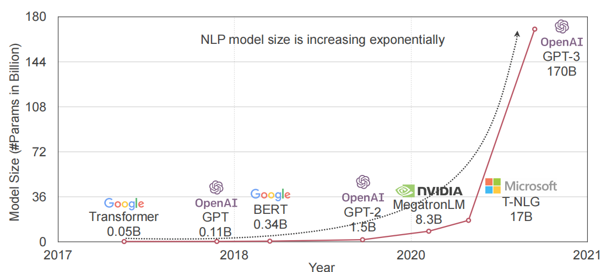

&emsp;&emsp;近年来，深度学习模型的大小呈指数级增长。例如，如上图所示，GPT-3 拥有1750亿个参数，训练需要355个GPUs，成本约为460万美元,AlphaGo 这样的模型需要1920个CPUs和280个GPUs，且能耗巨大。大型AI模型资源越来越密集，成本越来越高昂，这一趋势促使人们寻求更高效的替代方案，TinyML因此应运而生。

&emsp;&emsp;TinyML 是指将机器学习 (ML) 模型部署在资源非常有限的设备上，如微控制器、传感器、可穿戴设备和物联网设备。TinyML 主要用于在边缘设备上进行实时数据处理和推理，而无需依赖云端计算。其核心目的是在极低功耗、有限计算能力和存储空间的设备上运行机器学习算法。TinyML 的目标是在这些设备上直接运行机器学习模型，而无需依赖于外部服务器或云平台，从而减少延迟、节省能源并提高隐私性。TinyML 的关键特点包括：
- 模型大小：TinyML 模型通常非常小，以便在有限的存储和内存资源上运行。这通常涉及到模型压缩技术，如权重剪枝、量化和知识蒸馏。
- 计算效率：模型需要针对低功耗处理器优化，以最小化计算需求和能耗。
- 实时处理：许多TinyML应用需要实时或近实时的处理能力，例如语音识别、图像分类或传感器数据分析。
- 离线操作：由于不依赖于网络连接，TinyML 应用可以在没有互联网或不稳定网络连接的环境中工作。
- 隐私保护：通过在本地处理数据，TinyML 可以减少数据泄露的风险，增强用户隐私。

## 8.2 tinyML面临的挑战

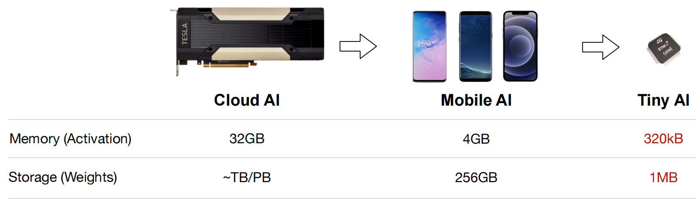

&emsp;&emsp;如上图所示，与手机相比，微控制器的内存和存储量减少了 3 个数量级，比云 GPU 减少了 5-6 个数量级。极其有限的内存使得深度学习部署变得困难。Tiny AI 与云 AI 和移动 AI 有着本质的区别。微控制器是裸机设备，没有操作系统，也没有 DRAM。因此，我们需要联合设计深度学习模型和推理库，以有效管理微小的资源并适应紧张的内存和存储预算。如果想将深度学习网络部署Tiny AI设备上，不仅需要减少权重的大小，还需要减少激活函数的计算量，同时还要保证模型性能。

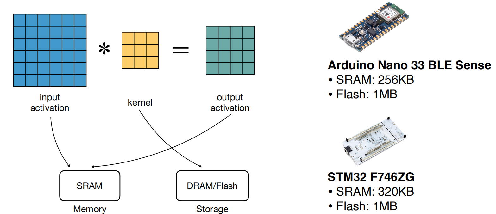

&emsp;&emsp;上图展示了在微控制器上运行卷积神经网络（CNNs）时的一种简化内存估算方法，主要涉及 存储（Flash） 和 内存（SRAM） 的使用：
- 存储（Flash）使用：
  - 等于模型的大小。
  - Flash内存是静态的，必须存储整个模型的权重和结构，因此需要足够的空间来保存模型。
- 内存（SRAM）使用：
  - 等于输入激活值 + 输出激活值。
  - SRAM是动态的，每一层的内存需求是不同的。
  - 关键在于关注峰值SRAM使用量，因为这是决定内存需求的最大因素。
  - 权重可以部分加载，因此它们不会完全占用SRAM。

&emsp;&emsp;在微控制器上运行CNN的挑战在于微控制器通常资源有限，尤其是内存和计算能力。因此，在这样的资源受限环境下，模型必须经过优化，减少内存占用和计算复杂度。

## 8.3 MCUNet

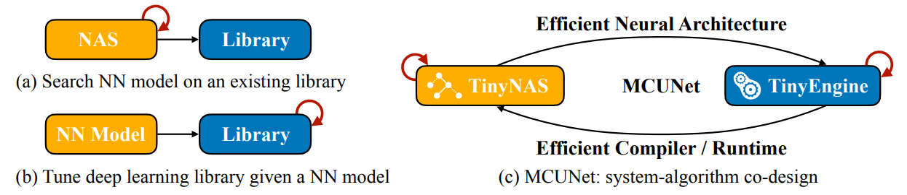

&emsp;&emsp;如上图所示，（a）使用基于给定深度学习库（例如TensorFlow、PyTorch）的神经架构搜索来优化神经网络。（b）调整库以最大化对于给定网络的推理速度。与传统方法a,b不同，MCUNet可以通过系统算法协同设计更好地利用资源。MCUNet是一种系统模型协同设计框架，可在现成的微控制器上实现 ImageNet 规模的深度学习。针对微控制器上片上内存稀缺的问题，联合优化深度学习模型设计（TinyNAS）和推理库（TinyEngine）以减少内存使用。 TinyNAS 是一种两阶段神经架构搜索 (NAS) 方法，可以处理各种微控制器上微小且多样化的内存限制。 TinyEngine通过基于代码生成器的编译方法改进了现有的推理库，以消除内存开销。它还支持模型自适应内存调度：TinyEngine不是逐层优化，而是根据整体网络拓扑来优化内存调度，以获得更好的策略。

### 8.3.1 TinyNAS
&emsp;&emsp;TinyNAS 是一种两阶段神经架构搜索方法，首先优化搜索空间以适应微小且多样化的资源约束，然后在优化的空间内执行神经架构搜索。通过优化的空间，它显着提高了最终模型的准确性。

&emsp;&emsp;**自动搜索空间优化：** 为了适应不同微控制器微小而多样的资源限制，缩放了移动搜索空间的输入分辨率和宽度乘数，目标是找到最佳的搜索空间配置，在满足资源限制的同时具有最高精度的模型。一种方法是对每个搜索空间执行神经架构搜索并比较最终结果，但该方式的计算成本太高。在同一模型系列中，准确性通常与计算量正相关，计算量越大的模型容量越大，就越有可能达到更高的精度。基于这一假设，通过评估Flops的累计分布函数（Cumulative Distribution Function，CDF），如下图所示，每条曲线代表一个设计空间。在内存限制下更有可能产生高 FLOPs 模型的设计空间提供了更高的模型容量，因此更有可能实现高精度。使用实心红色空间（平均 FLOPs 52.0M）比使用实心绿色空间（平均 FLOPs 46.9M）提高了 2.3% 的准确率。使用实心红色空间进行神经架构搜索，最终准确率达到 78.7%，比使用黑色空间高 4.5%。

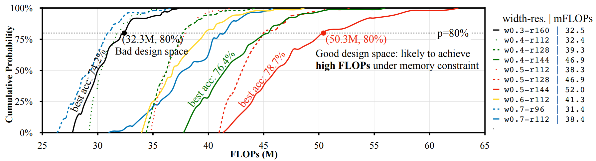

### 8.3.2 TinyEngine

&emsp;&emsp;一个好的推理框架会充分利用MCU中有限的资源，避免内存的浪费，并为架构搜索提供更大的搜索空间。凭借更大的设计自由度，TinyNAS 更有可能找到高精度模型。因此，TinyNAS 与内存高效推理库 TinyEngine 共同设计。

&emsp;&emsp;**从解释到代码生成。** 大多数现有的推理库（例如TF-Lite Micro、CMSIS-NN）都是基于解释器的。虽然它很容易支持跨平台开发，但它需要额外的运行时内存（MCU 中最昂贵的资源）来存储元信息（例如模型结构参数）。相反，TinyEngine 将这些操作从运行时卸载到编译时，并且仅生成将由 TinyNAS 模型执行的代码。得益于算法和系统协同设计，我们可以完全控制要运行的模型，并且生成的代码完全专门针对 TinyNAS 模型。它不仅避免了运行时解释的时间，而且还释放了内存使用量以允许更大的模型运行。TinyEngine 仅将给定模型使用的操作编译为二进制文件。

&emsp;&emsp;**模型自适应内存调度。** 现有的推理库仅根据层本身来调度每层的内存：一开始，指定一个大缓冲区来存储 im2col 之后的输入激活；执行每一层时，只有一列转换后的输入占用此缓冲区。这会导致输入激活重用不佳。相反，TinyEngine 智能地根据模型级统计数据调整内存调度：最大内存 需要在所有层上精确地拟合一列转换后的输入。对于每一层，TinyEngine 尝试平铺计算循环嵌套，以便尽可能多的列可以容纳在该内存中。

&emsp;&emsp;**计算内核专业化。** TinyEngine专门针对不同层进行内核优化：循环平铺基于内核大小和可用内存，每层都不同；并且内部循环展开也专门针对不同的内核大小消除分支指令的开销。对Conv+Padding+ReLU+BN层进行操作融合。这些对计算内核的专门优化进一步将推理效率提升了22%，

&emsp;&emsp;**In-place深度卷积** 如下图所示，TinyEngine使用In-place深度卷积来进一步减少峰值内存。图（a）传统的深度卷积需要 2N 内存占用来进行激活。与（a）不同，TinyEngine将深度卷积的内存减少到 N+1。具体地，将第一通道的输出激活存储在临时缓冲区中。然后，对于每个后续通道，输出激活会覆盖其前一个通道的输入激活。最后，将缓冲区中存储的第一个通道的输出激活写回最后一个通道的输入激活。因此，一旦一个通道的计算完成，该通道的输入激活就可以被覆盖并用于存储另一个通道的输出激活。

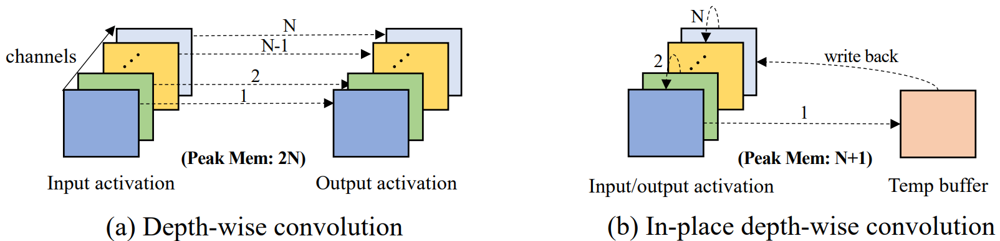

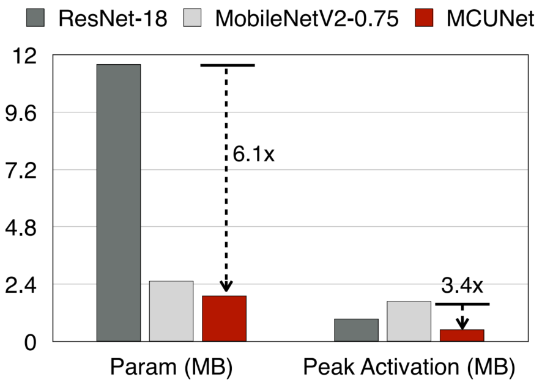

&emsp;&emsp;如上图所示，图表展示了ResNet-18与MobileNetV2和MCUNet的对比。MobileNetV2只减少了模型的参数量，但并未有效减少峰值激活的大小。因此，它虽然在参数量上做到了精简，但在资源受限的嵌入式设备上依然存在内存瓶颈。MCUNet不仅减少了模型的参数量，还减少了峰值激活大小。这意味着MCUNet可以在更小的嵌入式设备上有效运行，其设计更适合资源非常有限的环境。在参数大小方面，MCUNet相比ResNet-18减少了6.1倍，在峰值激活大小上也减少了3.4倍。这样的缩减使MCUNet在执行类似图像分类任务时，更加适合嵌入式平台。

## 8.4 MCUNetV2

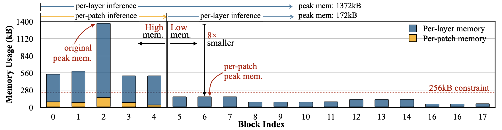

&emsp;&emsp;内存瓶颈是由于卷积神经网络（CNN）设计中内存分布不平衡造成的：如上图所示，前几个块的内存使用量比网络其余部分大一个数量级。只有前5个块具有高峰值内存（>450kB），成为整个网络的内存瓶颈。其余 13 个块的内存使用率较低，可以轻松容纳 256kB MCU。如果能找到一种方法来“绕过”内存密集型阶段，我们可以将整体峰值内存减少8倍。为了缓解这个问题，MCUNetV2提出了一种通用的逐块推理调度，它仅在特征图的一个小空间区域上运行，并显着减少峰值内存。然而，峰值内存的减少是以计算开销为代价的：为了计算不重叠的输出补丁，输入图像补丁需要重叠，导致重复计算。开销与初始阶段的感受野正相关：感受野越大，输入块越大，从而导致更多重叠。进一步提出感受野重新分配，将感受野和工作负载转移到网络的后期。这减少了补丁大小以及重叠引起的计算开销，而不会损害网络的性能。最后，基于补丁的推理为神经网络带来了更大的设计空间，可以更自由地权衡输入分辨率、模型大小等。还需要最小化基于补丁的执行下的计算开销。

### 8.4.1 通过基于补丁的推理打破内存瓶颈

&emsp;&emsp;MCUNetV2首先为 CNN 的初始内存密集阶段提出了逐个补丁（Patch）的执行顺序。如下图所示，研究两个卷积层（步幅 1 和 2）。在每层计算（a）下，第一个卷积具有较大的输入/输出激活大小，主导了峰值内存需求。通过按补丁计算 (b)，分配缓冲区来托管最终输出激活，并逐个补丁计算结果。只需要存储一个补丁的激活，而不是整个特征图，从而减少峰值内存（第一个输入是图像，可以从 JPEG 等压缩格式部分解码）。与传统的逐层执行不同，它一次对特征图的一个小空间区域进行操作，而不是对整个激活进行操作。由于只需要存储小块的特征，因此我们可以显着减少初始阶段的峰值内存（图8-8中的蓝色到黄色），从而使我们能够适应更大的输入分辨率。

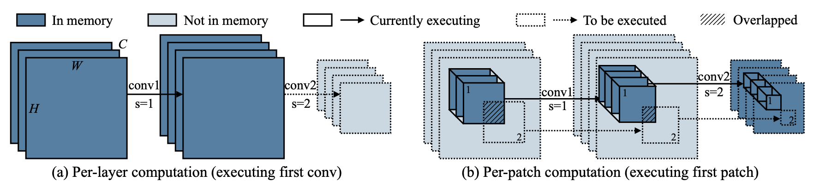

### 8.4.2 通过重新分配感受野来减少计算开销

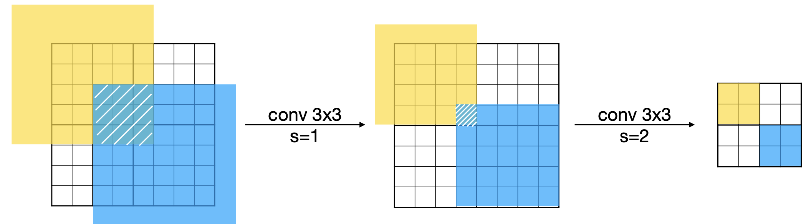

&emsp;&emsp;如上图所示，展示了在不同步幅（stride）下的卷积操作（conv 3x3，步幅分别为1和2）导致重复计算区域的增加，特别是在空间上有重叠的部分（黄色与蓝色区域重叠）。随着感受野（receptive field）的增大，空间重叠现象加剧，进而导致计算开销增加。考虑基于块的阶段的输出，它在输入图像上的感受野越大，每个块的分辨率就越大，导致重叠区域越大并重复计算，MCUNetV2重新分配CNN 的感受野（RF）以减少计算开销。基本思想是： （1）减小基于块的初始阶段的感受野； (2)增加后期的感受野。降低初始阶段的 RF 有助于减少每个输入补丁的大小和重复计算。然而，如果整体 RF 较小（例如，检测大物体），某些任务的性能可能会下降。因此，我们进一步加大后期的RF来弥补性能损失。如下图所示，MbV2-RD减少了每补丁推理阶段的感受野，并增加了每层阶段的感受野。两个网络具有相同水平的性能，但 MbV2-RD 在基于补丁的推理下具有更小的开销。该过程需要手动调整，并且根据具体情况而有所不同。

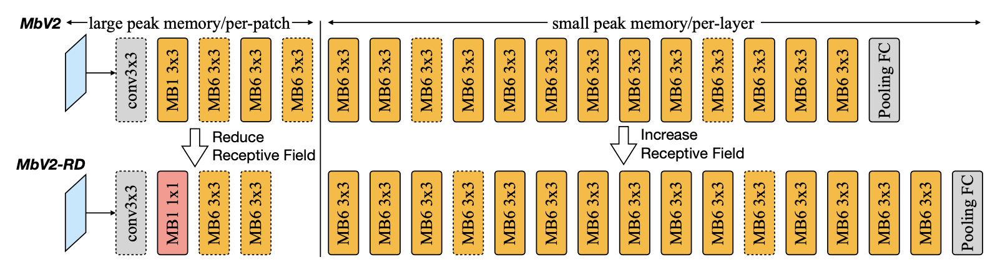

### 8.4.3 联合神经架构和推理调度搜索

&emsp;&emsp;重新分配感受野使我们能够以最小的计算/延迟开销享受内存减少的好处，但对于不同的backbones，策略会因情况而异。减少的峰值内存还允许在设计主干架构时有更大的自由度（例如，使用更大的输入分辨率）。为了探索如此大的设计空间，建议以自动化的方式联合优化神经架构和推理调度。给定一定的数据集和硬件约束（SRAM限制、闪存限制、延迟限制等），目标是在满足所有约束的同时实现最高的精度。
1. 定义搜索空间
- 神经架构搜索空间：包括不同的内核尺寸、扩展比率、每个阶段的块数、宽度乘数和输入分辨率等。这些参数决定了网络的基本结构和复杂度。
2. 推理调度的优化
- 块的选择：决定哪些卷积层或块将采用基于块的推理方法。这些块通常是内存使用量较高的层。
- 块的数量：确定在基于块的推理中要处理的输入图像块的数量和大小。这影响内存使用和计算开销。
3. 联合优化
- 进化算法：使用进化算法来探索定义的搜索空间。算法随机采样网络架构，并对每个采样的网络，枚举所有可能的推理调度配置。
- 性能评估：对于每一组架构和调度配置，评估其在给定数据集上的性能（如准确率）和硬件资源的使用情况（如SRAM使用量）。
- 选择最佳配置：基于性能和资源使用情况，选择最优的网络架构和推理调度配置。

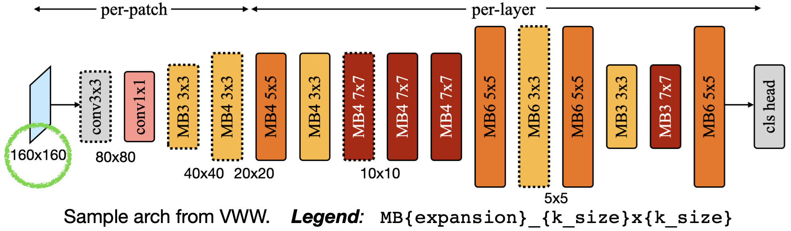

&emsp;&emsp;上图中展示了 MCUNetV2 的架构，输入为160x160大小的图片，通过卷积操作逐步减少图像的尺寸，最终变为5x5大小的特征图。前期的卷积核较小（例如3x3、5x5）来减少空间重叠。中期阶段的扩展比率（Expansion Ratio） 较小，以减少峰值内存的占用。后期阶段的扩展比率较大，以提升模型的性能。

## 8.5 应用场景

### 8.5.1 视觉

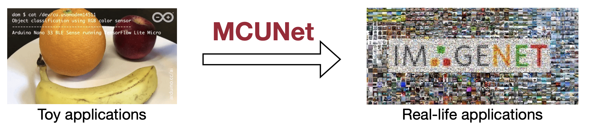

&emsp;&emsp;如上图所示，MCUNet可以实现 ImageNet级别的图像分类任务。下图展示了 Tiny Image Classification（微型图像分类）任务在 ImageNet 数据集上的表现。通过使用像 MCUNet 这样的技术，能够在微控制器上实现 ImageNet级别的图像分类，并使用 int4量化。MobileNetV2 + CMSIS-NN 的准确率为 53.8%，相比之下，MCUNet在STM32H743上提高了 17%，达到了 70.7%。这是首次在商用微控制器上实现超过70%的ImageNet分类准确率。

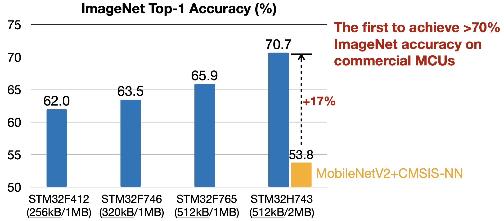

&emsp;&emsp;此外，MCUNet还可以用于目标检测任务。

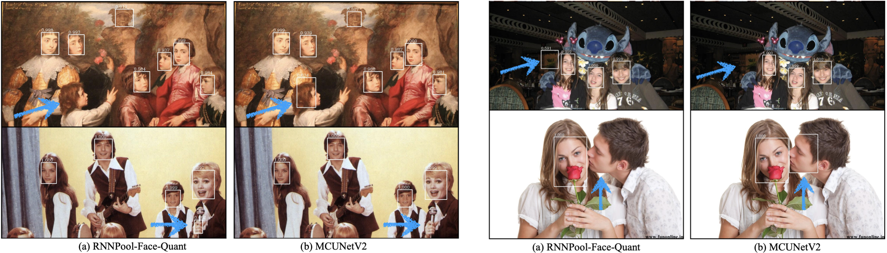

### 8.5.2 音频

&emsp;&emsp;如上图所示，MCUNet可以实现语音关键词识别。典型的关键词发现系统的流程如下图所示。输入使用帧长度为 $l$ 且步幅为 $s$ 的重叠帧，从而得到总帧数 $T=\frac{(L-l)}{s}+1$ 。输入的语音信号被分成多个帧；然后将时域信号转换为频域中的频谱系数特征，实现输入信号的维度压缩；最后将提取的语音特征矩阵输入分类器模块, 该模块生成输出类别的概率。例如，给出"是"、"否"、"开"、"关"等关键词的识别概率。

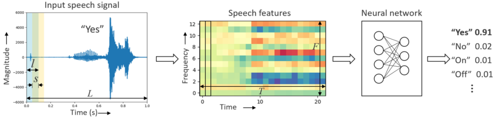

### 8.5.3 异常检测

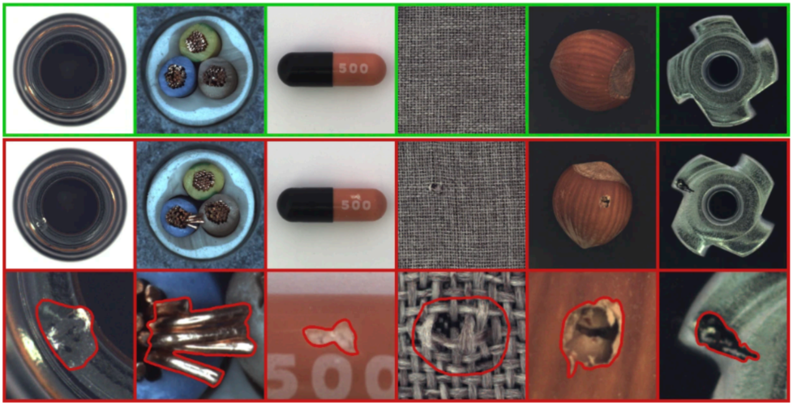

&emsp;&emsp;如上图所示，MCUNet可以实现工业路零件、医疗药物中的异常检测等等。