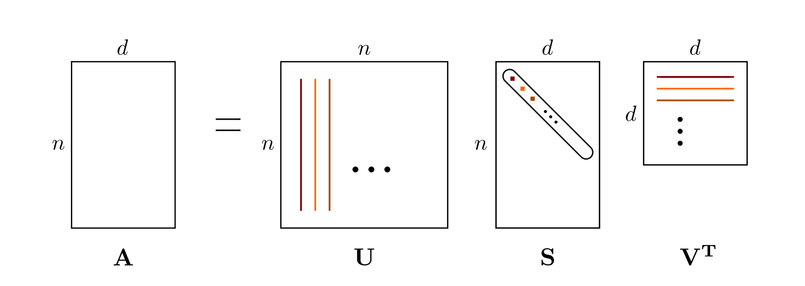
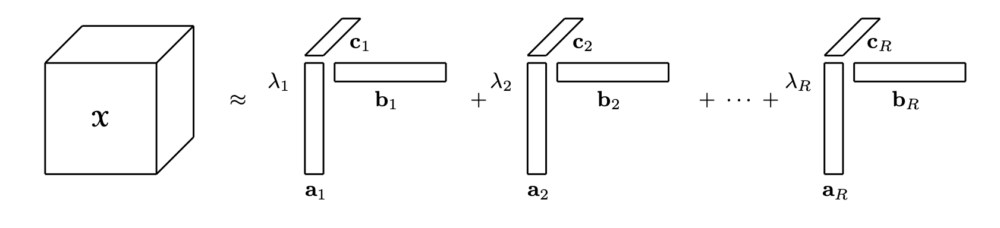

# 第9章 低秩分解

&emsp;&emsp;本章我们将逐步学习低秩分解的理论基础与实践应用。9.1节首先对低秩分解进行了总体介绍，9.2节深入阐释了矩阵的“秩”这一核心概念及其分解思想。9.3节详细讲解了多种主流的分解方法，包括作为理论基石的奇异值分解（SVD）、面向高维张量的Tucker分解和CP分解，以及强调可解释性的非负矩阵分解（NMF）。随后，9.4节系统性地回答了为何要进行低秩分解，分析了其在模型压缩、计算加速、特征提取和去噪等方面的价值。9.5节探讨了在分解中至关重要的“秩”的选择策略。9.6节指出了在深度学习模型中可以应用低秩分解的具体对象。最后，9.7节将通过实践案例来巩固所学知识。

- [第9章 低秩分解](#第9章-低秩分解)
  - [9.1 低秩分解介绍](#91-低秩分解介绍)
  - [9.2 何为低秩分解 (What is Low-Rank Decomposition?)](#92-何为低秩分解-what-is-low-rank-decomposition)
    - [9.2.1 矩阵的秩](#921-矩阵的秩)
    - [9.2.2 低秩分解的核心思想](#922-低秩分解的核心思想)
  - [9.3 低秩分解常见方法](#93-低秩分解常见方法)
    - [9.3.1 奇异值分解(SVD)](#931-奇异值分解svd)
    - [9.3.2 Tucker分解](#932-tucker分解)
    - [9.3.3 CP分解](#933-cp分解)
    - [9.3.4 非负矩阵分解(NMF)](#934-非负矩阵分解nmf)
  - [9.4 为何要进行低秩分解 (Why Low-Rank Decomposition?)](#94-为何要进行低秩分解-why-low-rank-decomposition)
    - [9.4.1 显著减少模型参数](#941-显著减少模型参数)
    - [9.4.2 大幅提升计算效率](#942-大幅提升计算效率)
    - [9.4.3 揭示数据潜在结构与特征提取](#943-揭示数据潜在结构与特征提取)
    - [9.4.4 实现数据去噪与鲁棒性提升](#944-实现数据去噪与鲁棒性提升)
  - [9.5 秩的选择之道](#95-秩的选择之道)
  - [9.6 模型低秩分解对象](#96-模型低秩分解对象)
  - [9.7 实践](#97-实践)

## 9.1 低秩分解介绍 

在数据科学和机器学习的广阔领域中，我们处理的数据形式常常是矩阵。无论是代表用户对电影评分的矩阵，还是深度神经网络中的权重矩阵，这些高维数据结构中往往蕴含着深刻的模式和信息。然而，这些矩阵的规模通常非常庞大，带来了巨大的计算和存储挑战。低秩分解（ Low-Rank Decomposition 或 Low-Rank Factorization ）技术应运而生，旨在揭示并利用这些大型矩阵中固有的低维结构。

低秩分解的核心思想源于一个关键的观察：深度神经网络中的权重矩阵往往是**过参数化**的，其中存在着大量的**冗余**。这意味着矩阵中的许多行或列向量之间存在着线性相关性，其所代表的变换并非真正需要那么多的参数来表达。低秩分解正是利用了权重矩阵的这种内在冗余性，将一个大的权重矩阵近似分解为两个或多个更小的“瘦”矩阵的乘积。

这种分解不仅是一种数据压缩技术，更是一种强大的数据分析手段。通过将数据投影到一个更低维度的“潜在因子”空间，我们不仅能够显著减少计算复杂度和存储需求，还能在一定程度上滤除数据中的噪声，并揭示出数据背后最本质的特征和结构。例如，在推荐系统中，这些潜在因子可能代表用户的某种偏好和物品的某种属性；在基因数据分析中，它们可能对应着特定的地理或族群信息等。

低秩分解涵盖了一系列具体的方法，其中最著名和最基础的是**奇异值分解（Singular Value Decomposition, SVD）**。此外，还包括**非负矩阵分解（Non-negative Matrix Factorization, NMF）**、**Tucker分解**和**CP分解**等。这些技术虽然在具体算法和应用场景上有所不同，但它们的根本目标是一致的：寻找数据最简洁、最核心的表达方式。在本章中，我们将深入探讨低秩分解的基本原理、核心思想及其在模型压缩等领域的关键作用。

## 9.2 何为低秩分解 (What is Low-Rank Decomposition?)

为了深刻理解低秩分解，我们首先需要明确两个核心概念：什么是矩阵的“秩”，以及分解的“核心思想”是什么。

### 9.2.1 矩阵的秩

矩阵的**秩（Rank）**是线性代数中的一个基本概念，它衡量了矩阵中所包含的“内在维度”或“信息量”。一个矩阵的秩，被严格定义为其**列向量（或行向量）中线性无关向量的最大数量**。换句话说，秩表示了能够构建出矩阵所有行或所有列的“基向量”的最少数量。

一个向量组是**线性无关**的，意味着其中任何一个向量都不能被其他向量的线性组合所表示。相反，如果一个向量可以被其他向量表示，那么它就是**线性相关**的，代表着信息上的冗余。

让我们用一个简单的例子来说明。考虑以下矩阵 $A$：

$$
A = \begin{bmatrix} 1 & 2 & 3 \\ 2 & 4 & 6 \\ 3 & 6 & 9 \end{bmatrix}
$$
我们可以观察到，第二行向量 $[2, 4, 6]$ 恰好是第一行向量 $[1, 2, 3]$ 的2倍。同样，第三行 $[3, 6, 9]$ 是第一行的3倍。这意味着，这个矩阵的所有行向量都可以由一个基础向量 $[1, 2, 3]$ 乘以不同的系数得到。因此，这个矩阵的行向量中只有一个是线性无关的。同样地，第二列是第一列的2倍，第三列是第一列的3倍。所以，矩阵 $A$ 的秩为1。

一个矩阵的秩 $r$ 满足 $0 \le r \le \min(m, n)$，其中 $m$ 和 $n$ 分别是矩阵的行数和列数。
* 当 $r = \min(m, n)$ 时，我们称该矩阵为**满秩（Full-Rank）**矩阵，表示其行或列向量是完全线性无关的，信息没有冗余。
* 当 $r < \min(m, n)$ 时，我们称该矩阵为**低秩（Low-Rank）**或**秩亏缺（Rank-Deficient）**矩阵。这意味着矩阵中存在冗余信息，其行或列向量可以由一个更小的向量集合线性表示。

在神经网络的权重矩阵或推荐系统的评分矩阵等实际应用中，许多大型矩阵虽然理论上可能是满秩的，但它们的“有效秩”或“近似秩”通常很低。这意味着矩阵的许多奇异值非常接近于零，其绝大部分信息和能量都集中在少数几个最大的奇异值所对应的方向上。这正是低秩分解能够发挥作用的根本原因。

### 9.2.2 低秩分解的核心思想

低秩分解的核心思想是利用矩阵的秩亏缺特性，将一个原始的大型矩阵 $A \in \mathbb{R}^{m \times n}$ 近似地分解为两个（或多个）尺寸更小的矩阵的乘积。最常见的形式是将其分解为两个矩阵 $B$ 和 $C$ 的乘积：

$$
A \approx B C^T
$$
其中，$B \in \mathbb{R}^{m \times k}$，$C \in \mathbb{R}^{n \times k}$（因此 $C^T \in \mathbb{R}^{k \times n}$）。这里的 $k$ 是我们选择的一个远小于 $m$ 和 $n$ 的正整数，它代表了近似矩阵的秩。

**这个分解过程的意义在于：**

1. **参数数量的显著减少**：
   * 存储原始矩阵 $A$ 需要的参数数量为 $m \times n$。
   * 存储分解后的矩阵 $B$ 和 $C^T$ 需要的参数数量为 $(m \times k) + (k \times n) = k \times (m+n)$。
   * 当 $k \ll \min(m, n)$ 时，参数量会得到极大的压缩。例如，一个 $1000 \times 1000$ 的矩阵有 $10^6$ 个参数。如果我们可以用 $k=50$ 的秩来近似它，那么分解后的参数数量仅为 $50 \times (1000+1000) = 100,000$，压缩了10倍。
2. **计算效率的提升**：
   * 对于一个输入向量 $x \in \mathbb{R}^n$，计算矩阵-向量乘积 $y = Ax$ 需要大约 $m \times n$ 次乘法和加法操作。
   * 使用分解后的矩阵，计算过程变为两步：首先计算 $z = C^T x$（需要 $k \times n$ 次操作），然后计算 $y = Bz$（需要 $m \times k$ 次操作）。总操作数约为 $k \times (m+n)$。
   * 这同样实现了计算复杂度的显著降低，从而加速了模型的推理过程。

这个分解过程可以被看作是寻找一个“潜在因子空间”（latent factor space），其维度为 $k$。矩阵 $B$ 的每一行可以被看作是原始矩阵 $A$ 的每一行在这个 $k$ 维潜在空间中的坐标表示。而矩阵 $C$ 的每一行（即 $C^T$ 的每一列）则可以被看作是构成这个潜在空间的 $k$ 个基向量。原始矩阵中的每个元素 $A_{ij}$ 就可以通过第 $i$ 行在潜在空间的坐标（$B$的第$i$行）与第 $j$ 列对应的基向量（$C$的第$j$行）的点积来近似重构。

## 9.3 低秩分解常见方法

### 9.3.1 奇异值分解(SVD)

奇异值分解（SVD）是低秩分解理论的基石，它不仅是一种具体的分解方法，更提供了低秩近似的**理论最优解**。

**1. 什么是SVD？**

任何一个秩为 $r$ 的矩阵 $W \in \mathbb{R}^{m \times n}$ 都可以被分解为三个矩阵的乘积：

$$
W = U \Sigma V^T
$$

其中：

* $U \in \mathbb{R}^{m \times m}$ 是一个**正交矩阵**（$U^T U = I$），其列向量 $u_i$ 被称为**左奇异向量**。
* $\Sigma \in \mathbb{R}^{m \times n}$ 是一个**对角矩阵**，其对角线上的元素 $\sigma_1, \sigma_2, \dots, \sigma_r$ 被称为**奇异值**。它们是非负的，并且按照从大到小的顺序排列：$\sigma_1 \ge \sigma_2 \ge \dots \ge \sigma_r > 0$。其余的对角线元素均为0。
* $V^T \in \mathbb{R}^{n \times n}$ 也是一个**正交矩阵**（$V^T V = I$），其行向量（即$V$的列向量 $v_i$）被称为**右奇异向量**。

这个分解也可以写成求和的形式：

$$
W = \sum_{i=1}^{r} \sigma_i u_i v_i^T
$$

这个表达式非常直观：它表明任何矩阵都可以表示为一系列秩为1的矩阵（$u_i v_i^T$）的加权和，权重就是对应的奇异值 $\sigma_i$。

**2. 如何通过SVD实现低秩近似？**

SVD的强大之处在于，奇异值 $\sigma_i$ 的大小直接反映了其对应的分量 $u_i v_i^T$ 对原始矩阵 $W$ 的“贡献度”。最大的奇异值 $\sigma_1$ 对应的分量捕捉了矩阵最主要的变化方向和信息，而较小的奇异值通常对应于数据中的细节或噪声。

因此，要获得一个秩为 $k$（$k<r$）的最佳近似矩阵 $W_k$，我们只需保留SVD分解中前 $k$ 个最大的奇异值及其对应的左右奇异向量，并舍弃其余的部分。具体操作如下：

1. 将对角矩阵 $\Sigma$ 中的第 $k+1$ 到第 $r$ 个奇异值置为零，得到一个新的对角矩阵 $\Sigma_k$。
2. 只取 $U$ 的前 $k$ 列，得到 $U_k \in \mathbb{R}^{m \times k}$。
3. 只取 $V^T$ 的前 $k$ 行，得到 $V_k^T \in \mathbb{R}^{k \times n}$。

这样，我们得到的秩为 $k$ 的近似矩阵 $W_k$ 为：

$$
W_k = U_k \Sigma_k V_k^T = \sum_{i=1}^{k} \sigma_i u_i v_i^T
$$

**3. 为什么SVD是最佳低秩逼近？—— Eckart-Young-Mirsky定理**

SVD之所以在低秩近似中如此核心，是因为它能找到在给定秩的情况下，与原始矩阵“最接近”的近似矩阵。这里的“最接近”通常用**弗罗贝尼乌斯范数（Frobenius Norm）**来度量。

一个矩阵 $A$ 的弗罗贝尼乌斯范数定义为：

$$
\|A\|_F = \sqrt{\sum_{i=1}^{m} \sum_{j=1}^{n} |a_{ij}|^2}
$$

它相当于将矩阵所有元素的平方和开根号，可以看作是欧几里得范数在矩阵上的推广。

**Eckart-Young-Mirsky定理（1936年）**指出：在所有秩不超过 $k$ 的矩阵 $B$ 中，由SVD截断得到的矩阵 $W_k$ 是使得弗罗贝尼乌斯范数 $\|W - B\|_F$ 最小化的矩阵。即：
$$
\min_{\text{rank}(B) \le k} \|W - B\|_F = \|W - W_k\|_F
$$

**为什么此结论成立？**

我们可以通过SVD的性质来理解这一点。首先，由于 $U$ 和 $V$ 都是正交矩阵，弗罗贝尼乌斯范数在正交变换下保持不变。原始矩阵 $W$ 的范数可以表示为奇异值的函数：

$$
\|W\|_F^2 = \left\|\sum_{i=1}^{r} \sigma_i u_i v_i^T\right\|_F^2 = \sum_{i=1}^{r} \sigma_i^2
$$

当我们计算 $W$ 和它的秩 - $k$ 近似 $W_k$ 之间的差时：

$$
W - W_k = \left(\sum_{i=1}^{r} \sigma_i u_i v_i^T\right) - \left(\sum_{i=1}^{k} \sigma_i u_i v_i^T\right) = \sum_{i=k+1}^{r} \sigma_i u_i v_i^T
$$

这个差的弗罗贝尼乌斯范数的平方就是被舍弃掉的奇异值的平方和：

$$
\|W - W_k\|_F^2 = \left\|\sum_{i=k+1}^{r} \sigma_i u_i v_i^T\right\|_F^2 = \sum_{i=k+1}^{r} \sigma_i^2
$$

该定理的证明表明，任何其他的秩 - $k$ 近似矩阵 $B$ 与 $W$ 的差的范数平方，都会大于或等于这个值。由于我们在SVD截断中保留了最大的 $k$ 个奇异值，也就是舍弃了最小的 $r-k$ 个奇异值，因此我们最小化了重构误差。SVD为我们提供了一个系统性的、最优的方法来“压缩”矩阵，同时最大程度地保留原始矩阵的信息。

在实际操作中，为了得到 $W \approx U'V'^T$ 的形式，我们可以让 $U' = U_k$ 和 $V'^T = \Sigma_k V_k^T$，或者 $U' = U_k \sqrt{\Sigma_k}$ 和 $V'^T = \sqrt{\Sigma_k} V_k^T$。这样就将三矩阵分解转化为了两矩阵分解，方便后续的计算。

**4. SVD的优点与局限**

优点：**普遍性** ：与某些分解方法（例如 LU 分解或 Cholesky 分解）要求矩阵具有特定属性（例如方阵或正定）不同，SVD 适用于任何形状的矩阵。**鲁棒性** ：SVD 在数值上是稳定的，这意味着它在计算中是可靠的，特别是在涉及噪声数据或近似解的场景中。**数据压缩和降维** ：SVD 的一个关键特性是它能够识别数据中最重要的部分，使其成为数据压缩和降维的理想工具。**理论优雅** ：SVD 具有深刻的理论含义，涉及许多重要的数学概念，如特征值、特征向量和欧几里得空间中的正交性。

局限性：**数据规模** ：对于极其庞大的数据集，SVD 的计算可能非常耗时且占用大量资源。尽管存在优化算法和近似方法，但大规模数据 SVD 计算仍然是一个挑战。**数据稀疏性** ：对于高度稀疏的数据集（例如，包含大量零元素的矩阵），标准 SVD 可能不是最有效的方法。需要一些特殊的技术来有效地处理数据的稀疏性。**对噪声的敏感性** ：SVD 对噪声敏感，尤其是在数据降维或特征提取等应用中。高水平的噪声会影响奇异值的计算，从而导致不准确的结果。**解释挑战** ：虽然 SVD 可以揭示数据的底层结构，但解释这些结构的含义并不总是那么简单。在某些应用中，例如社交网络分析或生物信息学，解释 SVD 的结果可能需要额外的领域知识。

**5. 数值稳定性和计算效率**

在计算 SVD 时，数值稳定性和计算效率是两个关键考虑因素：**数值稳定性** ：稳定性在计算特征值和特征向量时至关重要，因为微小的数值误差可能会导致结果出现显著偏差。通常采用以稳定性著称的雅可比方法或 QR 算法等算法来实现这一目的。**计算效率** ：大型矩阵的奇异值分解 (SVD) 计算可能极其耗时。为了提高效率，人们会利用各种优化技术（例如随机算法或分块算法）来加快计算过程。

在实际应用中，通常使用专门的数值线性代数库来执行 SVD。这些库针对稳定性和效率进行了优化。MATLAB、NumPy 和 SciPy 等工具提供了高效稳定的 SVD 实现。使用这些库可以确保结果的准确性，并在处理实际问题时保持较高的计算效率。

### 9.3.2 Tucker分解

在7.4.1节中，我们探讨了奇异值分解（SVD）如何为二维数据（矩阵）提供最佳的低秩近似。然而，现实世界中的许多数据本质上是多维的，例如一张彩色图片（`高度` x `宽度` x `颜色通道`）、一段视频（`高度` x `宽度` x `颜色通道` x `时间`），或是推荐系统中的用户-商品-情境数据。将这些高维数据强行“压平”成矩阵（例如，将图片的所有像素拉成一个长向量）会破坏其固有的多维结构，丢失维度间的交互信息。

为了解决这个问题，我们需要将低秩分解的思想从二维矩阵推广到高维数据结构——**张量（Tensor）**。**Tucker分解**正是这一推广中最重要的方法之一，可以被看作是SVD在高维空间的一种自然延伸。

**1. 什么是Tucker分解？**

Tucker分解（Tucker Decomposition），也称为高阶SVD，是一种将高维张量分解为一个**核心张量**与一系列**因子矩阵**乘积的方法。

对于一个N阶张量 $\mathcal{X} \in \mathbb{R}^{I_1 \times I_2 \times \dots \times I_N}$，其Tucker分解可以表示为：
$$
\mathcal{X} \approx \mathcal{G} \times_1 U^{(1)} \times_2 U^{(2)} \times_3 \dots \times_N U^{(N)}
$$
这个公式可以进一步写成元素求和的形式：

$$
x_{i_1 i_2 \dots i_N} \approx \sum_{r_1=1}^{R_1} \sum_{r_2=1}^{R_2} \dots \sum_{r_N=1}^{R_N} g_{r_1 r_2 \dots r_N} u_{i_1 r_1}^{(1)} u_{i_2 r_2}^{(2)} \dots u_{i_N r_N}^{(N)}
$$

让我们来解析这个核心公式的每个组成部分：

- **$\mathcal{X}$ (原始张量)**：这是我们要分解的高维数据，例如一个 $512 \times 512 \times 3$ 的彩色图像张量。
- **$\mathcal{G}$ (核心张量)**：这是一个尺寸为 $R_1 \times R_2 \times \dots \times R_N$ 的小张量，其中 $R_n \le I_n$。核心张量 $\mathcal{G}$ 捕捉了不同因子矩阵之间交互的“权重”或“强度”。它本身是稠密的，描述了从原始数据中提取出的潜在特征（主成分）之间的相互关系。如果说因子矩阵是各个维度的“基”，那么核心张量就是这些“基”如何组合起来重构原始数据的“系数”。
- **$U^{(n)}$ (因子矩阵)**：对于张量的第 $n$ 个维度（或称为**模(mode)**），都有一个对应的因子矩阵 $U^{(n)} \in \mathbb{R}^{I_n \times R_n}$。这个矩阵的列向量构成了第 $n$ 维的一个低维正交基。你可以将其理解为该维度上的**主成分**。通常，我们要求这些因子矩阵是**列正交**的，即 $(U^{(n)})^T U^{(n)} = I$。
- **$\times_n$ (n-模乘积)**：这是一个张量与矩阵的特殊乘法运算。张量 $\mathcal{A}$ 与矩阵 $B$ 的n-模乘积，记作 $\mathcal{A} \times_n B$，是在张量 $\mathcal{A}$ 的第 $n$ 个维度上，将其每个**模-n纤维（mode-n fiber）**与矩阵 $B$ 进行相乘。

**2. 理解Tucker分解的内在逻辑：模态展开与SVD**

Tucker分解的精髓在于，它对张量的每一个维度（模态）都独立地进行降维。这个过程可以通过一个叫做**模态展开（Unfolding / Matricization）**的操作来理解。

**模态-n展开**是将一个N阶张量 $\mathcal{X}$ 重新排列成一个矩阵 $X_{(n)}$ 的过程。在这个矩阵中，张量的第 $n$ 维的索引作为行索引，而所有其他 $N-1$ 个维度的索引被“拉平”后作为列索引。因此，矩阵 $X_{(n)}$ 的尺寸为 $I_n \times (I_1 \dots I_{n-1} I_{n+1} \dots I_N)$。

有了模态展开的概念后，Tucker分解的内在逻辑变得清晰： **因子矩阵 $U^{(n)}$ 的列向量，正是模态-n展开矩阵 $X_{(n)}$ 的前 $R_n$ 个左奇异向量。**

换句话说，为了找到第 $n$ 个维度上最重要的$R_n$个基向量，Tucker分解将张量沿该维度“摊平”成一个大矩阵，然后对这个矩阵进行SVD，取其最重要的左奇异向量。这个过程对每一个维度都执行一遍，从而得到了所有的因子矩阵 $U^{(1)}, U^{(2)}, \dots, U^{(N)}$。

这种方法保证了每个因子矩阵 $U^{(n)}$ 都最优地捕捉了其对应维度上的变化和信息。

**3. 如何计算Tucker分解？—— 高阶正交迭代 (HOOI)**

与SVD可以通过直接的代数方法求解不同，找到最优的Tucker分解通常是一个非凸优化问题。最常用的算法是**高阶正交迭代（Higher-Order Orthogonal Iteration, HOOI）**，它是一种**交替最小二乘法（Alternating Least Squares, ALS）**的变体。

HOOI算法的目标是最小化原始张量与重构张量之间的误差，通常用弗罗贝尼乌斯范数的平方来衡量：

$$
\min_{\mathcal{G}, U^{(1)}, \dots, U^{(N)}} \|\mathcal{X} - \mathcal{G} \times_1 U^{(1)} \times_2 \dots \times_N U^{(N)}\|_F^2
$$

由于因子矩阵 $U^{(n)}$ 是列正交的，这个优化问题可以等价地表示为：

$$
\max_{U^{(1)}, \dots, U^{(N)}} \|\mathcal{X} \times_1 (U^{(1)})^T \times_2 (U^{(2)})^T \dots \times_N (U^{(N)})^T\|_F^2 = \|\mathcal{G}\|_F^2
$$

这意味着，我们希望通过投影找到能量（范数）最大的核心张量。

HOOI算法的迭代过程如下：

1. **初始化**：为除 $U^{(1)}$ 之外的所有因子矩阵 $U^{(2)}, \dots, U^{(N)}$ 赋予随机的列正交初始值。

2. **交替更新**：循环迭代更新每一个因子矩阵，直到收敛。在更新第 $n$ 个因子矩阵 $U^{(n)}$ 时，我们固定所有其他的因子矩阵 $U^{(j)} (j \ne n)$。

   - 构建一个中间张量 $\mathcal{Y} = \mathcal{X} \times_1 (U^{(1)})^T \dots \times_{n-1} (U^{(n-1)})^T \times_{n+1} (U^{(n+1)})^T \dots \times_N (U^{(N)})^T$。
   - 对 $\mathcal{Y}$ 进行模态-n展开，得到矩阵 $Y_{(n)}$。
   - 计算 $Y_{(n)}$ 的SVD。
   - 将新的 $U^{(n)}$ 更新为 $Y_{(n)}$ 的前 $R_n$ 个左奇异向量。

3. **收敛判断**：当所有因子矩阵的变化都非常小，或者重构误差不再显著下降时，算法收敛。

4. **计算核心张量**：算法收敛后，使用最终得到的因子矩阵计算核心张量：
   $$
   G=X×1(U(1))T×2(U(2))T⋯×N(U(N))T\mathcal{G} = \mathcal{X} \times_1 (U^{(1)})^T \times_2 (U^{(2)})^T \dots \times_N (U^{(N)})^T
   $$

这个算法虽然不能保证找到全局最优解，但在实践中通常能得到非常好的结果。

**4. SVD是Tucker分解的特例**

Tucker分解与SVD之间的关系非常深刻。实际上，**矩阵的SVD是二阶张量Tucker分解的一个特殊情况**。

考虑一个矩阵 $W \in \mathbb{R}^{m \times n}$，它是一个二阶张量。其Tucker分解为：

$$
W \approx \mathcal{G} \times_1 U^{(1)} \times_2 U^{(2)}
$$

其中 $U^{(1)} \in \mathbb{R}^{m \times R_1}$，$U^{(2)} \in \mathbb{R}^{n \times R_2}$，核心张量 $\mathcal{G} \in \mathbb{R}^{R_1 \times R_2}$。

如果我们在没有任何截断的情况下（即 $R_1=m, R_2=n$）进行分解，HOOI算法找到的因子矩阵 $U^{(1)}$ 和 $U^{(2)}$ 分别是 $W$ 的左奇异向量矩阵 $U$ 和右奇异向量矩阵 $V$。此时，核心张量 $\mathcal{G}$ 会变成一个对角矩阵，其对角线上的元素就是奇异值 $\sigma_i$。

$$
\mathcal{G} = W \times_1 U^T \times_2 V^T = U^T W V = \Sigma
$$

于是，Tucker分解的形式 $W = \mathcal{G} \times_1 U \times_2 V$ 就变成了 $W = \Sigma \times_1 U \times_2 V = U \Sigma V^T$，这正是SVD的定义。

因此，SVD可以看作是这样一个Tucker分解：它的核心张量是**对角化的**。而一般张量的Tucker分解，其核心张量通常是**稠密**的，这反映了高维数据中维度间更复杂的交互关系。

**5. 优点与局限**

优点：**结构保持**：Tucker分解能够保持数据的高维结构，从而捕捉到矩阵分解方法会丢失的维度间交互信息。**高度灵活性**：它允许每个维度有不同的降维秩（$R_1, R_2, \dots, R_N$），可以根据不同维度的重要性进行灵活的压缩。**可解释性**：因子矩阵 $U^{(n)}$ 提供了对每个维度主要模式的洞察，而核心张量 $\mathcal{G}$ 揭示了这些模式之间的相互作用强度。

局限：**计算成本高**：HOOI算法涉及对大型中间矩阵进行多次SVD，计算成本可能非常高，尤其是在张量维度和阶数增加时，会面临“**维度灾难**”问题。**秩的选择困难**：如何为每个维度确定最优的秩 $(R_1, R_2, \dots, R_N)$ 是一个核心挑战。与SVD中可以通过观察奇异值衰减来选择秩 $k$ 不同，Tucker分解的秩选择没有统一的、简单的方法。**非唯一性与局部最优**：由于HOOI是迭代算法，其结果可能收敛到局部最优解，而非全局最优。分解的结果也并非严格唯一（可以通过旋转等操作得到不同的但等价的分解）。**核心张量的解释**：虽然因子矩阵相对容易解释，但理解稠密的核心张量 $\mathcal{G}$ 中所有元素的具体含义可能非常复杂。

### 9.3.3 CP分解

CP分解的历史可以追溯到1970年，由两位研究者在不同领域独立提出：Carroll和Chang在心理计量学领域将其命名为**CANDECOMP**（Canonical Decomposition），如今，CP分解已成为张量分解的代名词之一。

如果说Tucker分解是SVD在保留“交互核心”下的高维推广，那么CP分解则是SVD的**外积求和形式**在更高维度上最直接、最纯粹的延伸。它的目标是将一个高维张量表示为一系列**秩1张量**的加权和。

**1. 什么是CP分解？**

CP分解的核心思想极其直观和优雅：它假设一个复杂的高维数据体，可以由几个潜在的、基础的“因子组合”线性叠加而成。

对于一个N阶张量 $\mathcal{X} \in \mathbb{R}^{I_1 \times I_2 \times \dots \times I_N}$，其秩为 $R$ 的CP分解被定义为：

$$
\mathcal{X} \approx \sum_{r=1}^{R} \lambda_r (\mathbf{a}_r^{(1)} \circ \mathbf{a}_r^{(2)} \circ \dots \circ \mathbf{a}_r^{(N)})
$$

其中：

- **$R$** 是分解的秩，代表了我们用来近似原始张量的秩1张量的数量。
- **$\lambda_r$** 是一个标量权重，表示第 $r$ 个秩1分量的重要性。通常，这些权重被吸收到因子向量中，使得分解形式更加简洁。
- **$\mathbf{a}_r^{(n)} \in \mathbb{R}^{I_n}$** 是一个向量，代表第 $r$ 个分量在第 $n$ 个维度上的“特征”或“签名”。
- **$\circ$** 表示向量的**外积**。$N$个向量的外积会生成一个N阶的秩1张量。

为了便于表示，我们通常将每个维度的所有 $R$ 个因子向量组合成**因子矩阵**：

- $A^{(1)} = [\mathbf{a}_1^{(1)}, \mathbf{a}_2^{(1)}, \dots, \mathbf{a}_R^{(1)}] \in \mathbb{R}^{I_1 \times R}$
- $A^{(2)} = [\mathbf{a}_1^{(2)}, \mathbf{a}_2^{(2)}, \dots, \mathbf{a}_R^{(2)}] \in \mathbb{R}^{I_2 \times R}$
- ...
- $A^{(N)} = [\mathbf{a}_1^{(N)}, \mathbf{a}_2^{(N)}, \dots, \mathbf{a}_R^{(N)}] \in \mathbb{R}^{I_N \times R}$

吸收权重 $\lambda_r$ 后（通常将 $\lambda_r$ 的值均分或全部归于其中一个因子矩阵的列范数），CP分解可以用一个非常紧凑的“双括号”表示法来写：

$$
\mathcal{X} \approx [\![ A^{(1)}, A^{(2)}, \dots, A^{(N)} ]\!]
$$

以一个三阶张量（例如 `用户-电影-时间`）为例，其CP分解可以写成：

$$
\mathcal{X} \approx \sum_{r=1}^{R} \mathbf{a}_r \circ \mathbf{b}_r \circ \mathbf{c}_r
$$

其中 $A = [\mathbf{a}_1, \dots, \mathbf{a}_R]$, $B = [\mathbf{b}_1, \dots, \mathbf{b}_R]$, $C = [\mathbf{c}_1, \dots, \mathbf{c}_R]$ 分别是用户、电影和时间维度的因子矩阵。

从元素层面看，这个分解意味着张量中的每一个元素都可以被近似为：

$$
x_{i_1 i_2 \dots i_N} \approx \sum_{r=1}^{R} a_{i_1 r}^{(1)} a_{i_2 r}^{(2)} \dots a_{i_N r}^{(N)}
$$

这个公式清晰地揭示了CP分解的“平行因子”特性：第 $r$ 个分量完全由每个因子矩阵的第 $r$ 列向量（$\mathbf{a}_r^{(1)}, \mathbf{a}_r^{(2)}, \dots, \mathbf{a}_r^{(N)}$）共同决定，不同分量之间没有像Tucker分解那样的交互核心。

**2. 张量秩（CP秩）**

在矩阵的世界里，“秩”的概念清晰明了。然而，对于张量，**CP秩**的定义和计算要复杂得多，这也是张量分解区别于矩阵分解的核心特征之一。

**张量的CP秩被定义为能够精确表示该张量所需的最少的秩1张量的数量。**

$$
\text{rank}(\mathcal{X}) = \min \{ R \mid \mathcal{X} = \sum_{r=1}^{R} \mathbf{a}_r^{(1)} \circ \dots \circ \mathbf{a}_r^{(N)} \}
$$

这个定义引出了几个关键的、有时甚至是反直觉的特性：

1. **计算的困难性**：确定一个给定张量的CP秩是一个**NP-hard**问题。在实践中，我们通常不是去计算精确的秩，而是为低秩近似选择一个合适的秩 $R$。
2. **秩可能大于维度**：与矩阵的秩绝不会超过其行数或列数不同，张量的CP秩可能远大于其任何一个维度的尺寸。例如，一个 $2 \times 2 \times 2$ 的张量，其最大CP秩可以是3。
3. **最佳低秩近似可能不存在**：这是与SVD的Eckart-Young-Mirsky定理最显著的区别。对于某些张量和秩 $R$，可能不存在一个“最佳”的秩-R近似。近似解可能会无限趋近于一个秩大于R的张量。这使得张量低秩近似问题在理论上比矩阵要复杂得多。

**3. CP分解的独特魅力：唯一性**

CP分解最引人注目的优点之一是其**唯一性**。与SVD（存在符号模糊）和Tucker分解（核心张量和因子矩阵之间存在旋转模糊）不同，在非常宽松的条件下，CP分解的结果是**本质上唯一**的，不存在旋转模糊。

这意味着，如果一个张量确实可以由一组秩1分量生成，那么CP分解能够恢复出这些原始的分量，唯一的模糊性在于：**列的置换**：可以任意调换秩1分量的顺序。**尺度的缩放**：可以将一个因子向量乘以一个常数 $\alpha$，同时将另一个因子向量除以 $\alpha$，其外积结果不变。

这种唯一性使得CP分解在需要解释潜在因子或进行盲源分离的应用中极为强大。例如，在化学计量学中，如果混合物光谱是一个张量，CP分解可以唯一地分离出纯净物的光谱（因子向量）及其浓度（另一个因子向量），这是Tucker分解无法直接做到的。

### 9.3.4 非负矩阵分解(NMF)：

在前面的章节中，我们探讨了SVD、Tucker分解和CP分解等强大的低秩方法。这些方法在数学上优雅且高效，但它们有一个共同的特点：分解出的因子矩阵中通常包含负值。虽然SVD在最小化重构误差方面是**数学上最优**的，但其包含负值的“特征”（即奇异向量）往往缺乏直观的物理解释。例如，用SVD分解一个人脸图像数据库，得到的“特征脸”是一些明暗交错、正负值混合的“幽灵脸”，我们很难将其理解为真实人脸的组成部分。

在许多现实世界的应用场景中，数据本身就是非负的（如图像像素强度、文档词频、基因表达水平），我们更希望找到一种“**基于部件**”的表示。我们直觉地认为，一个整体是由其各个部分**相加**构成的，而不是通过部件的加减组合。例如，一张人脸是由眼睛、鼻子、嘴巴等部件组合而成，而不是“一张标准脸”加上“半个鼻子”再减去“四分之一只眼睛”。

为了实现这种更具解释性的、纯粹相加的分解，**非负矩阵分解**应运而生。它是一种带约束的低秩矩阵分解方法，其核心思想是：在分解过程中，强制要求所有因子矩阵的元素都为非负数。

**1. 什么是NMF？**

非负矩阵分解（NMF）的目标是将一个非负矩阵 $V \in \mathbb{R}^{m \times n}$ 近似分解为两个非负矩阵 $W \in \mathbb{R}^{m \times k}$ 和 $H \in \mathbb{R}^{k \times n}$ 的乘积：

$$
V \approx WH
$$

其中，关键的约束条件是：

$$
W_{ij} \ge 0, \quad H_{ij} \ge 0 \quad \text{for all } i, j
$$

这里的 $k$ 是我们预先设定的一个正整数，代表了分解的“秩”或“主题数”，通常选择 $k$ 使得 $k \ll \min(m, n)$。

三个矩阵的含义如下：

- **$V$ (原始数据矩阵)**：每一列可以代表一个数据样本（例如一张人脸图像拉成的向量，一篇文档的词频向量），每一行代表一个特征（例如一个像素点，一个单词）。
- **$W$ (基/特征矩阵)**：$W$ 的每一列可以被看作是一个“基向量”或“原型特征”。由于非负性约束，这些基向量往往对应着数据中可被直观理解的“部件”。例如，在人脸数据中，$W$ 的列可能分别代表了眼睛、鼻子、嘴巴等局部特征。
- **$H$ (系数/激活矩阵)**：$H$ 的每一列给出了如何用 $W$ 中的基向量来线性组合（重构）出 $V$ 中对应的原始数据样本。由于非负性，$H$ 中的系数只能是正的权重，这实现了“纯粹相加”的重构过程。$H$ 矩阵也因此常被视为对原始数据的降维表示。

这个分解可以看作：

$$
\mathbf{v}_j \approx W \mathbf{h}_j = \sum_{i=1}^{k} \mathbf{w}_i h_{ij}
$$

其中 $\mathbf{v}_j$ 是 $V$ 的第 $j$ 列，$\mathbf{w}_i$ 是 $W$ 的第 $i$ 列，$\mathbf{h}_j$ 是 $H$ 的第 $j$ 列。这个公式清晰地表明，每个数据样本 $\mathbf{v}_j$ 都是由基向量 $\mathbf{w}_i$ 的加权和来表示的，权重就是 $H$ 中的系数。

**3. 如何求解NMF？一个非凸优化问题**

与SVD可以通过直接的代数运算得到唯一解不同，NMF的求解是一个**非凸优化问题**。这意味着：

1. 通常不存在闭式解。
2. 求解过程需要依赖迭代算法。
3. 算法可能会陷入局部最优解，而非全局最优解。
4. 最终结果依赖于算法的初始值。

NMF最核心的优化目标是最小化原始矩阵 $V$ 与重构矩阵 $WH$ 之间的差异。衡量这种差异的目标函数通常有两种：

1. **欧几里得距离（弗罗贝尼乌斯范数）**：

$$
   min⁡W,H∥V−WH∥F2=min⁡W,H∑i,j(Vij−(WH)ij)2s.t.W,H≥0\min_{W, H} \|V - WH\|_F^2 = \min_{W, H} \sum_{i,j} (V_{ij} - (WH)_{ij})^2 \quad \text{s.t.} \quad W, H \ge 0
$$

2. **广义Kullback-Leibler (KL)散度**：

$$
min⁡W,HDKL(V∣∣WH)=min⁡W,H∑i,j(Vijlog⁡Vij(WH)ij−Vij+(WH)ij)s.t.W,H≥0\min_{W, H} D_{KL}(V || WH) = \min_{W, H} \sum_{i,j} \left(V_{ij} \log\frac{V_{ij}}{(WH)_{ij}} - V_{ij} + (WH)_{ij}\right) \quad \text{s.t.} \quad W, H \ge 0
$$

   KL散度在处理基于计数的稀疏数据（如文本词频）时往往能取得更好的效果。

最著名且广泛使用的求解算法是Lee和Seung提出的**乘法更新法则**。该算法也是一种交替优化的思想，即固定一个矩阵，更新另一个。针对最小化欧氏距离的目标，其更新规则非常简洁：

首先随机初始化非负的 $W$ 和 $H$，然后反复迭代以下两步直至收敛：

1. **更新 $H$（固定 $W$）**:

$$
Haj←Haj(WTV)aj(WTWH)ajH_{aj} \leftarrow H_{aj} \frac{(W^T V)_{aj}}{(W^T W H)_{aj}}
$$

2. **更新 $W$（固定 $H$）**:

$$
Wia←Wia(VHT)ia(WHHT)iaW_{ia} \leftarrow W_{ia} \frac{(V H^T)_{ia}}{(W H H^T)_{ia}}
$$

这些更新规则的巧妙之处在于，它们保证了如果 $W$ 和 $H$ 的初始值是非负的，那么在每次迭代之后它们将**保持非负**。从直观上看，更新的乘法因子是一个分数：分子 $(W^T V)$ 代表了当前基与原始数据的“期望关联”，而分母 $(W^T W H)$ 代表了当前基与重构数据的“实际关联”。通过这个比例来调整系数，使得重构结果不断逼近原始数据。

**4. 优势与局限性 **

优点：**强大的可解释性**：这是NMF最核心的优点，分解出的因子直观、易于理解，符合人类对“整体由部分构成”的认知。**天然的稀疏性**：非负约束常常会引导出稀疏的系数矩阵H，这意味着每个样本仅由少数几个基来表示，这符合许多现实场景的假设。**易于实现的算法**：乘法更新法则简单直观，容易实现。

局限性：**非凸性**：结果依赖于初始化，可能收敛到局部最优，需要多次运行以寻找一个较好的解。**秩k的选择**：如何确定最佳的分解秩 $k$ 是一个难题，通常需要领域知识或交叉验证等方法来辅助判断。**非唯一性**：对于同一个矩阵，可能存在多个不同的NMF分解结果，这给结果的稳定性带来挑战。

## 9.4 为何要进行低秩分解 (Why Low-Rank Decomposition?)

在理解了低秩分解是什么以及如何实现之后，一个自然的问题是：我们为什么要使用它？低秩分解带来的好处是多方面的，它不仅是理论上优雅的数学工具，更在实际应用中，尤其是在大规模模型优化中，展现出巨大的价值。主要优势可以概括为以下几点：

### 9.4.1 显著减少模型参数

这是低秩分解最直接、最显而易见的好处。在深度学习中，全连接层和卷积层的权重通常以矩阵形式存储。这些权重矩阵，特别是在大型模型中，占据了大量的存储空间。

通过将权重矩阵 $W \in \mathbb{R}^{m \times n}$ 分解为 $U \in \mathbb{R}^{m \times k}$ 和 $V^T \in \mathbb{R}^{k \times n}$，我们将参数存储从 $m \times n$ 减少到了 $k(m+n)$。当 $k$ 远小于 $m$ 和 $n$ 时，这种减少是巨大的。

**示例**：考虑一个大型语言模型中的一个全连接层，输入维度 $n_{in}=4096$，输出维度 $n_{out}=4096$。

* 原始参数量：$4096 \times 4096 \approx 16.8$ 百万。
* 假设该权重矩阵可以被一个秩 $k=256$ 的矩阵很好地近似。
* 分解后参数量：$256 \times (4096 + 4096) = 256 \times 8192 \approx 2.1$ 百万。
* 仅通过对这一层进行低秩分解，就实现了大约 **8倍** 的参数压缩。

这种参数量的减少使得在资源受限的设备（如手机、边缘计算设备）上部署大型模型成为可能。

### 9.4.2 大幅提升计算效率

模型的计算量，尤其是推理速度，是衡量其可用性的关键指标。低秩分解通过将一次昂贵的大矩阵乘法替换为两次廉价的小矩阵乘法，显著降低了计算复杂度。

对于输入 $x \in \mathbb{R}^n$，原始计算 $y = Wx$ 的浮点运算次数（FLOPs）约为 $2 \times m \times n$。使用分解后的矩阵 $W \approx UV^T$，计算变为 $y = U(V^T x)$：

1. 计算 $z = V^T x$：FLOPs 约为 $2 \times k \times n$。
2. 计算 $y = Uz$：FLOPs 约为 $2 \times k \times m$。
3. 总 FLOPs 约为 $2k(m+n)$。

计算复杂度的加速比约为：

$$
\text{Speed-up} \approx \frac{2mn}{2k(m+n)} = \frac{mn}{k(m+n)}
$$

当 $m=n=1000, k=50$ 时，加速比约为 $\frac{1000^2}{50(2000)} = 10$ 倍。

这种计算效率的提升对于需要实时响应的应用（如实时视频分析、在线推荐）至关重要。

### 9.4.3 揭示数据潜在结构与特征提取

低秩分解不仅仅是一种压缩技巧，它还是一种强大的分析工具，能够帮助我们理解数据背后的潜在结构。

分解后的矩阵 $U$ 和 $V$ 可以被解释为：
* $V$ 的行向量（$V^T$的列向量）构成了描述数据的一个 $k$ 维“潜在特征空间”的基。
* $U$ 的行向量是原始数据点在这些潜在特征上的“坐标”或“嵌入”。

**经典案例：潜在语义分析 (Latent Semantic Analysis, LSA)**

在自然语言处理中，我们可以构建一个“词语-文档”矩阵 $W$，其中 $W_{ij}$ 表示词语 $i$ 在文档 $j$ 中出现的频率。这个矩阵通常非常巨大且稀疏。对其进行低秩分解，得到的潜在特征可以被解释为“主题”或“概念”。例如，一个特征向量可能对“船”、“水”、“海洋”等词语有高权重，而对“汽车”、“道路”、“轮胎”等词语有低权重，从而捕捉到了“航海”这一主题。通过将词语和文档都投影到这个低维的“主题空间”，我们可以更好地衡量它们之间的语义相似度，即使它们没有共享完全相同的词语。

### 9.4.4 实现数据去噪与鲁棒性提升

SVD低秩近似的另一个重要作用是**去噪**。通常认为，数据中的主要结构和信号由大的奇异值所承载，而小的奇异值往往与测量噪声、随机波动等不稳定因素相关。

通过在SVD分解后舍弃这些小的奇异值（即 $i > k$ 的 $\sigma_i$），我们相当于在数据中做了一次滤波，保留了最重要、最稳定的主成分，而滤除了大部分噪声。这使得分解后的模型表示更加鲁棒，对输入数据的微小扰动不那么敏感，有时甚至可以提升模型的泛化能力。

比如这里，当我们把一幅图用扫描仪扫进电脑中时，会在图像中引入一些瑕疵点（通常称为噪声）（左）。我们将数据用15×25的矩阵来表示，并进行奇异值分解，我们假设其他的部分都是图像中的噪声引起的，只保留前三项奇异值做近似，这样就可以改善图像质量。

综上所述，低秩分解通过利用数据内在的冗余性，提供了一套强大的工具集，以实现模型压缩、计算加速、特征提取和数据去噪等多重目标。它之所以成为模型优化领域不可或缺的技术，正是因为它在理论的深刻性和实践的有效性之间取得了完美的平衡。

## 9.5 秩的选择之道

在前面几节中，我们深入探讨了SVD、Tucker分解、CP分解和NMF等核心的低秩分解方法。在所有这些方法中，我们都遇到了一个共同的、至关重要参数：**秩 $k$**（或对于Tucker分解的多线性秩 $(R_1, \dots, R_N)$）。这个参数决定了我们用多少个“成分”或“主题”来近似原始数据。

秩 $k$ 的选择是一个典型的模型选择问题，它直接影响到分解结果的质量和可解释性。这是一个微妙的平衡艺术：

- **如果 $k$ 太小**，模型将过于简化，无法捕捉到数据中重要的结构和信息，导致**欠拟合**。重构误差会很大，我们可能会丢失宝贵的信号。
- **如果 $k$ 太大**，模型将过于复杂。它不仅会捕捉数据中的信号，还会开始对噪声进行建模，导致**过拟合**。这会降低模型的泛化能力，分解出的因子也会变得冗余、不稳定，甚至难以解释。对于CP分解，过高的秩还可能引发模型退化问题。

那么，我们该如何在这个“信号”与“噪声”的十字路口，做出明智的选择呢？遗憾的是，**不存在一个放之四海而皆准的“万能公式”**。但在长期的实践中，研究者们发展出了一系列行之有效的方法和策略，可以从不同角度为我们提供指引。这些方法大致可以分为三类：启发式方法、量化指标评估法、以及基于任务和稳定性的方法。

**1. 启发式：寻找“拐点”**

这类方法直观、易于实施，通常是我们选择秩的第一步，帮助我们快速缩小备选范围。对于像NMF这样以可解释性为目标的方法，直接观察分解出的因子是一种非常有效的方法。我们可以尝试一系列的 $k$ 值，然后将每个 $k$ 值对应的基矩阵 $W$（或因子矩阵 $A^{(n)}$）的列向量可视化。

- 当 $k$ 较小时，因子通常是清晰、可辨认、有意义的“部件”或“主题”。
- 随着 $k$ 的增加，新的因子可能依然有意义。
- 但当 $k$ 变得过大时，新分解出的因子可能会变得模糊、充满噪声，或者与已有的因子高度相似（冗余）。当你发现分解结果开始出现这些“坏”的因子时，说明当前的 $k$ 可能已经过高了。

**2. 量化指标评估法：让数字说话**

这类方法试图通过更客观的数值指标来评估不同秩 $k$ 的优劣。

**a) 重构误差曲线**

我们可以绘制重构误差随 $k$ 变化的曲线。对于给定的 $k$，我们计算出近似矩阵 $V_k$，然后计算其与原始矩阵 $V$ 的误差，例如相对弗罗贝尼乌斯范数：

$$
\text{Error}(k) = \frac{\|V - V_k\|_F}{\|V\|_F}
$$

这条误差曲线必然是单调递减的。我们可以寻找曲线斜率变化最显著的“肘部”。当增加 $k$ 不再能显著降低误差时，说明再增加的成分主要是在拟合噪声，此时的 $k$ 就是一个不错的选择。

**b) 残差分析**

检查**残差矩阵 $E = V - V_k$** 也是一个好方法。

- 如果 $k$ 合适，残差矩阵 $E$ 应该看起来像随机噪声，不包含任何明显的结构或模式。
- 如果 $k$ 过小，残差矩阵 $E$ 中仍然会残留原始数据中的结构化信息。你可以通过可视化残差矩阵或对其进行统计分析来判断。

**3. 基于任务和稳定性的方法**

对于NMF和CP分解这类解不唯一的迭代算法，结果的**稳定性**是衡量模型好坏的一个关键标准，也为秩选择提供了有力的依据。其核心思想是：**一个好的、非过拟合的模型，对于数据的微小扰动应该是鲁棒的。**

**a) 模型一致性/稳定性评估**

对于一个给定的秩 $k$：

1. 多次运行分解算法（例如，使用不同的随机初始值）。
2. 比较每次运行得到的因子矩阵。例如，对于NMF得到的多个 $W$ 和 $H$，我们可以计算它们之间的一致性（如使用聚类指标或相关性分析）。
3. 如果对于某个 $k$，每次运行都得到高度相似、稳定的结果，说明这个 $k$ 是一个鲁棒的选择。
4. 如果对于某个 $k$，每次运行结果都大相径庭，说明模型不稳定，很可能已经过拟合或者 $k$ 的选择不合适。

研究者们已经提出了具体的指标来量化这种稳定性，例如**共识矩阵**。通过对不同的 $k$ 值绘制其稳定性得分，我们可以找到最稳定的秩。

**b) 预测性能/下游任务表现**

在许多机器学习应用中，低秩分解是作为特征提取或降维的预处理步骤。在这种情况下，最佳的秩 $k$ 是那个能在**下游任务（如分类、回归、聚类）中取得最好性能**的 $k$。

我们可以使用**交叉验证**来确定最优的 $k$：

1. 将数据划分为训练集和验证集。
2. 对于一系列候选的 $k$ 值，在训练集上进行低秩分解。
3. 利用分解得到的低维表示，在下游任务上训练模型，并在验证集上评估其性能。
4. 选择在验证集上性能最好的那个 $k$ 值。

这种方法将秩的选择与最终的应用目标直接挂钩，是最具实用主义的策略，但计算成本也相对较高。

## 9.6 模型低秩分解对象

**1. 权重矩阵**

这是最经典、最直接的应用目标，主要用于**减小模型的静态存储体积**。现代神经网络中，大量的参数集中在全连接层和卷积层。

- **全连接层**：其权重本身就是一个巨大的矩阵 $W \in \mathbb{R}^{m \times n}$。通过低秩分解，我们可以将其替换为两个更小的矩阵 $A \in \mathbb{R}^{m \times k}$ 和 $B \in \mathbb{R}^{k \times n}$ 的乘积 ($W \approx AB$)。
- **卷积层**：其四维权重张量 $(C_{out}, C_{in}, K_h, K_w)$ 也可以通过张量分解（如Tucker分解或CP分解）进行低秩近似，从而实现参数的有效压缩。

**2. 键值缓存**

在Transformer架构（如GPT系列模型）的自回归生成任务中，为了避免重复计算，系统需要缓存并重用过去所有token的“键（Key）”和“值（Value）”，这构成了所谓的**KV-Cache**。通过对庞大的KV-Cache矩阵进行在线的低秩近似（例如，仅存储其最重要的奇异值分量），可以用极小的代价保留其核心信息。这种方法被称为**缓存压缩**，它能大幅降低推理时的峰值显存占用，从而支持更长序列的生成或在同等硬件上实现更高的吞吐量。

**3. 其他目标**

- **词嵌入层 **：对于拥有巨大词汇表的模型，词嵌入层本质上是一个大型的查找表（矩阵），同样是低秩分解的绝佳对象，可以有效压缩模型大小。
- **梯度矩阵 ：在分布式训练场景中，各计算节点间需要频繁交换梯度信息。通过对梯度矩阵进行低秩分解，可以显著降低通信带宽的需求，从而加速整体训练过程。

## 9.7 实践

-  [不同低秩分解方法实践](xxx)
-  [模型低秩分解压缩实战](xxx)
